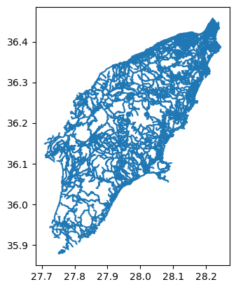

:::questions
- How can I read, inspect, and process spatial objects, such as points, lines, and polygons?
:::

:::objectives
- Load spatial objects.
- Select the spatial objects within a bounding box.
- Perform a CRS conversion of spatial objects.
- Select features of spatial objects.
- Match objects in two datasets based on their spatial relationships.
:::

## Introduction

In the preceding episodes, we have prepared, selected and downloaded raster data from before and after the wildfire event in the summer of 2023 on the Greek island of Rhodes. To evaluate the impact of this wildfire on the vital infrastructure and built-up areas we are going to create a subset of vector data representing these assets. In this episode you will learn how to extract vector data with specific characteristics like the type of attributes or their locations. The dataset that we will generate in this episode can lateron be confronted with scorched areas which we determine by analyzing the satellite images [Episode 9: Raster Calculations in Python](09-raster-calculations.md).

We'll be examining vector datasets that represent the valuable assests of Rhodes. As mentioned in [Episode 2: Introduction to Vector Data](02-intro-vector-data.md), vector data uses points, lines, and polygons to depict specific features on the Earth's surface. These geographic elements can have one or more attributes, like 'name' and 'population' for a city. In this episode we'll be using two open data sources: the Database of Global Administrative Areas (GADM) dataset to generate a polygon for the island of Rhodes and and Open Street Map data for the vital infrastructure and valuable assets.

To handle the vector data in python we use the package [`geopandas`](https://geopandas.org/en/stable/). This package allows us to open, manipulate, and write vector dataset through python.

{alt="Pandas and Geopandas"}

`geopandas` enhances the widely-used `pandas` library for data analysis by extending its functionality to geospatial applications. The primary `pandas` objects (`Series` and `DataFrame`) are extended to `geopandas` objects (`GeoSeries` and `GeoDataFrame`). This extension is achieved by incorporating geometric types, represented in Python using the `shapely` library, and by offering dedicated methods for spatial operations like `union`, `spatial joins` and `intersect`. In order to understand how geopandas works, it is good to provide a brief explanation of the relationship between `Series`, a `DataFrame`, `GeoSeries`, and a `GeoDataFrame`:

- A `Series` is a one-dimensional array with an axis that can hold any data type (integers, strings, floating-point numbers, Python objects, etc.)
- A `DataFrame` is a two-dimensional labeled data structure with columns that can potentially hold different types of data.
- A `GeoSeries` is a `Series` object designed to store shapely geometry objects.
- A `GeoDataFrame` is an extended `pandas.DataFrame` that includes a column with geometry objects, which is a `GeoSeries`.

:::callout
## Introduce the Vector Data

In this episode, we will use the downloaded vector data from the `data` directory. Please refer to the [setup page](../learners/setup.md) on where to download the data. Note that we manipulated that data a little for the purposes of
this workshop. The link to the original source can be found on the [setup page](../learners/setup.md).
:::

## Get the administration boundary of study area

The first thing we want to do is to extract a polygon containing the boundary of the island of Rhodes from Greece. For this we will use the [GADM dataset](https://gadm.org/download_country.html) layer `ADM_ADM_3.gpkg` for Greece. For your convenience we saved a copy at: `data/data/gadm/ADM_ADM_3.gpkg`
We will use the `geopandas` package to load the file and use the `read_file` function [see](https://geopandas.org/en/stable/docs/user_guide/io.html). Note that geopandas is often abbreviated as gpd.


```python
import geopandas as gpd
gdf_greece = gpd.read_file('../data/gadm/ADM_ADM_3.gpkg')
```

We can print out the `gdf_greece`variable:

```python
gdf_greece
```

```output
GID_3 GID_0 COUNTRY    GID_1                       NAME_1  \
0     GRC.1.1.1_1   GRC  Greece  GRC.1_1                       Aegean
1     GRC.1.1.2_1   GRC  Greece  GRC.1_1                       Aegean
2     GRC.1.1.3_1   GRC  Greece  GRC.1_1                       Aegean
..            ...   ...     ...      ...                          ...
324  GRC.8.2.24_1   GRC  Greece  GRC.8_1  Thessaly and Central Greece
325  GRC.8.2.25_1   GRC  Greece  GRC.8_1  Thessaly and Central Greece

                      NL_NAME_1      GID_2        NAME_2      NL_NAME_2  \
0                        Αιγαίο  GRC.1.1_1  North Aegean  Βόρειο Αιγαίο
1                        Αιγαίο  GRC.1.1_1  North Aegean  Βόρειο Αιγαίο
2                        Αιγαίο  GRC.1.1_1  North Aegean  Βόρειο Αιγαίο
..                          ...        ...           ...            ...
324  Θεσσαλία και Στερεά Ελλάδα  GRC.8.2_1      Thessaly       Θεσσαλία
325  Θεσσαλία και Στερεά Ελλάδα  GRC.8.2_1      Thessaly       Θεσσαλία
...
324  POLYGON ((22.81903 39.27344, 22.81884 39.27332...
325  POLYGON ((23.21375 39.36514, 23.21272 39.36469...

[326 rows x 17 columns]
```

The data are read into the variable fields as a `GeoDataFrame`. This is an extened data format of `pandas.DataFrame`, with an extra column `geometry`. To explore the dataframe you can call this variable just like a `pandas dataframe` by using functions like `.shape`, `.head` and `.tail` etc.

To visualize the polygons we can use the [`plot()`](https://geopandas.org/en/stable/docs/user_guide/mapping.html) function to the `GeoDataFrame` we have loaded `gdf_greece`:

```python
gdf_greece.plot()
```

{alt="greece_administrations"}


If you want to interactively explore your data you can use the [`.explore`](https://geopandas.org/en/stable/docs/user_guide/interactive_mapping.html) function in geopandas:

```python
gdf_greece.explore()
```
In this interactive map you can easily zoom in and out and hover over the polygons to see which attributes, stored in the rows of your GeoDataFrame, are related to each polygon.

Next, we'll focus on isolating the administrative area of Rhodes Island. Once you hover over the polygon of Rhodos (the relatively big island to the east) you will find out that the label `Rhodos` is stored in the `NAME_3` column of `gdf_greece`, where Rhodes Island is listed as `Rhodos`. Since our goal is to have a boundary of Rhodes, we'll now create a new variable that exclusively represents Rhodes Island.

To select an item in our GeoDataFrame with a specific value is done the same way in which this is done in a pandas `DataFrame` using [`.loc`](https://pandas.pydata.org/docs/reference/api/pandas.DataFrame.loc.html).

```python
gdf_rhodes = gdf_greece.loc[gdf_greece['NAME_3']=='Rhodos']
```

And we can plot the overview by (or show it interactively using `.explore`):
```python
gdf_rhodes.plot()
```

{alt="rhodes_administrations"}

Now that we have the administrative area of Rhodes Island. We can use the `to_file()` function save this file for future use.

```python
# Save the rhodes_boundary to gpkg
gdf_rhodes.to_file('rhodes.gpkg')
```

## Get the vital infrastructure and built-up areas

### Road data from Open Street Map (OSM)

Now that we have the boundary of our study area, we will make use this to select the main roads in our study area. We will make the following processing steps:

1. Select roads of study area
2. Select key infrastruture: 'primary', 'secondary', 'tertiary'
3. Create a 100m buffer around the rounds. This buffer will be regarded as the infrastructure region. (note that this buffer is arbitrary and can be changed afterwards if you want!)

#### Step 1: Select roads of study area

For this workshop, in particular to not have everyone downloading too much data, we created a subset of the [Openstreetmap](https://www.openstreetmap.org/) data we downloaded for Greece from [the Geofabrik](https://download.geofabrik.de/europe.html). This data comes in the form of a shapefile (see [episode 2](02-intro-vector-data.md)) from which we extracted all the roads for `Rhodes` and some surrounding islands. The data is stored in the osm folder as `osm_roads.gpkg`, but contains *all* the roads on the island (so also hiking paths, private roads etc.), whereas we in particular are interested in the key infrastructure which we consider to be roads classified as primary, secondary or tertiary roads.

Let's load the file and plot it:

```python
gdf_roads = gpd.read_file('../data/osm/osm_roads.gpkg')
```

We can explore it using the same commands as above:

```python
gdf_roads.plot()
```

{alt="greece_highways"}

As you may have noticed, loading and plotting `osm_roads.gpkg` takes a bit long. This is because the file contains all the roads of Rhodos and some surrounding islands as well. Since we are only interested in the roads on Rhodes Island. We will use the [`mask`](https://geopandas.org/en/stable/docs/user_guide/io.html) parameter of the `read_file()` function to load only the roads on Rhodes Island.

Now let us overwrite the GeoDataframe `gdf_roads` using the mask with the GeoDataFrame `gdf_rhodes` we created above.

```python
gdf_roads = gpd.read_file('../data/osm/osm_roads.gpkg', mask=gdf_rhodes)
```

Now let us explore these roads using `.explore` (or `.plot`):

```python
gdf_roads.explore()
```

{alt="rhodes_highways"}

#### Step 2: Select key infrastruture

As you will find out while exploring the roads dataset, information about the type of roads is stored in the `fclass` column. To get an overview of the different values that are present in the collumn `fclass` , we can use the [`unique()`](https://pandas.pydata.org/docs/reference/api/pandas.unique.html) function from pandas:

```python
gdf_roads['fclass'].unique()
```

```output
array(['residential', 'service', 'unclassified', 'footway',
       'track_grade4', 'primary', 'track', 'tertiary', 'track_grade3',
       'path', 'track_grade5', 'steps', 'secondary', 'primary_link',
       'track_grade2', 'track_grade1', 'pedestrian', 'tertiary_link',
       'secondary_link', 'living_street', 'cycleway'], dtype=object)
```

It seems the variable `gdf_roads` contains all kind of hiking paths and footpaths as well. Since we are only interested in vital infrastructure, classified as "primary", "secondary" and "tertiary" roads, we need to make a subselection.

Let us first create a list with the labels we want to select.

```python
key_infra_labels = ['primary', 'secondary', 'tertiary']
```

Now we are using this list make a subselection of the key infrastructure using pandas´ [`.isin` function](https://pandas.pydata.org/pandas-docs/stable/reference/api/pandas.DataFrame.isin.html).

```python
key_infra = gdf_roads.loc[gdf_roads['fclass'].isin(key_infra_labels)]
```

We can plot the key infrastructure :

```python
key_infra.plot()
```

{alt="rhodes_infra_highways"}

#### Step 3: Create a 100m buffer around the key infrastructure

Now that we selected the key infrastructure, we want to create a 100m buffer around them. This buffer will be regarded as the infrastructure region.

As you might have notice, the numbers on the x and y axis of our plots represent Lon Lat coordinates, meaning that the data is not yet projected. The current data has a geographic coordinate system with measures in degrees but not meter. Creating a buffer of 100 meters is not possible. Therfore, in order to create a 100m buffer, we first need to project our data. In our case we decided to project the data as
WGS 84 / UTM zone 31N, with EPSG code 32631 ([see chapter 03 for more information about the CRS and EPSG codes](/episodes/03-crs.md).

To project our data we use [.to_crs](https://geopandas.org/en/stable/docs/reference/api/geopandas.GeoDataFrame.to_crs.html). We first define a variable with the EPSG value (in our case 32631), which we then us in the to_crs function.

```python
epsg_code = 32631
key_infra_meters = key_infra.to_crs(epsg_code)
```
Now that our data is projected, we can create a buffer. For this we make use of [geopandas´ .buffer function](https://geopandas.org/en/stable/docs/user_guide/geometric_manipulations.html#GeoSeries.buffer) :

```python
key_infra_meters_buffer = key_infra_meters.buffer(100)
key_infra_meters_buffer
```

```output
53       POLYGON ((2779295.383 4319805.295, 2779317.029...
54       POLYGON ((2779270.962 4319974.441, 2779272.393...
55       POLYGON ((2779172.341 4319578.062, 2779165.312...
84       POLYGON ((2779615.109 4319862.058, 2779665.519...
140      POLYGON ((2781330.698 4320046.538, 2781330.749...
                               ...
19020    POLYGON ((2780193.230 4337691.133, 2780184.279...
19021    POLYGON ((2780330.823 4337772.262, 2780324.966...
19022    POLYGON ((2780179.850 4337917.135, 2780188.871...
19024    POLYGON ((2780516.550 4339028.863, 2780519.340...
19032    POLYGON ((2780272.050 4338213.937, 2780274.519...
Length: 1386, dtype: geometry
```

Note that the type of the `key_infra_meters_buffer` is a `GeoSeries` and not a `GeoDataFrame`. This is because the `buffer()` function returns a `GeoSeries` object. You can check that by calling the type of the variable.

```python
type(key_infra_meters_buffer)
```

```output
geopandas.geoseries.GeoSeries
```

Now that we have a buffer, we can convert it back to the geographic coordinate system to keep the data consistent. Note that we are now using the crs information from the `key_infra`, instead of using the EPSG code directly (EPSG:4326):


```python
key_infra_buffer = key_infra_meters_buffer.to_crs(key_infra.crs)
key_infra_buffer
```

```output
45       POLYGON ((27.72826 36.12409, 27.72839 36.12426...
58       POLYGON ((27.71666 36.11678, 27.71665 36.11678...
99       POLYGON ((27.75485 35.95242, 27.75493 35.95248...
100      POLYGON ((27.76737 35.95086, 27.76733 35.95086...
108      POLYGON ((27.76706 35.95199, 27.76702 35.95201...
                               ...
18876    POLYGON ((28.22855 36.41890, 28.22861 36.41899...
18877    POLYGON ((28.22819 36.41838, 28.22825 36.41845...
18878    POLYGON ((28.22865 36.41904, 28.22871 36.41912...
18879    POLYGON ((28.23026 36.41927, 28.23034 36.41921...
18880    POLYGON ((28.23020 36.41779, 28.23007 36.41745...
Length: 1369, dtype: geometry
```

As you can see, the buffers created in `key_infra_buffer` have the `Polygon` geometry type.

To double check the EPSG code of key_infra:

```python
print(key_infra.crs)

```

```output
EPSG:4326
```

Reprojecting and buffering our data is something that we are going to do multiple times during this episode. To avoid have to call the same functions multiple times it would make sense to create a function. Therefore, let us create a function in which we can add the buffer as a variable.

```python
def buffer_crs(gdf, size, meter_crs=32631, target_crs=4326):
    return gdf.to_crs(meter_crs).buffer(size).to_crs(target_crs)
```

For example, we can use this function to create a 200m buffer around the infrastructure the key infrastructure by doing:

```python
key_infra_buffer_200 = buffer_crs(key_infra, 200)
```

### Get built-up regions from Open Street Map (OSM)

Now that we have a buffered dataset for the key infrastructure of Rhodes, our next step is to create a dataset with all the built-up areas. To do so we will use the land use data from OSM, which we prepared for you in the file `data/osm_landuse.gpkg`. This file includes the land use data for the entire Greece. We assume the built-up regions to be the union of three types of land use: "commercial", "industrial", and "residential".

Note that for the simplicity of this course, we limit the built-up regions to these three types of land use. In reality, the built-up regions can be more complex also there is definately more high quality (e.g. local government).

Now it will be up to you to create a dataset with valueable assets. You should be able to complete this task by yourself with the knowledge you have gained from the previous steps and links to the documentation we provided.

:::challenge
## Exercise: Get the built-up regions

Create a `builtup_buffer` from the file `data/osm/osm_landuse.gpkg` by the following steps:

1. Load the land use data from `data/osm/osm_landuse.gpkg` and mask it with the administrative boundary of Rhodes Island (`gdf_rhodes`).
2. Select the land use data for "commercial", "industrial", and "residential".
3. Create a 10m buffer around the land use data.
4. Visualize the results.

After completing the exercise, answer the following questions:

1. How many unique land use types are there in `osm_landuse.gpkg`?
2. After selecting the three types of land use, how many entries (rows) are there in the results?

Hints:

- `data/osm_landuse.gpkg` contains the land use data for the entire Greece. Use the administrative boundary of Rhodes Island (`gdf_rhodes`) to select the land use data for Rhodes Island.
- The land use attribute is stored in the `fclass` column.
- Reuse `buffer_crs` function to create the buffer.

::::solution
```python
# Read data with a mask of Rhodes
gdf_landuse = gpd.read_file('./data_workshop/osm/osm_landuse.gpkg', mask=gdf_rhodes)

# Find number of unique landuse types
print(len(gdf_landuse['fclass'].unique()))

# Extract built-up regions
builtup_labels = ['commercial', 'industrial', 'residential']
builtup = gdf_landuse.loc[gdf_landuse['fclass'].isin(builtup_labels)]

# Create 10m buffer around the built-up regions
builtup_buffer = buffer_crs(builtup, 10)

# Get the number of entries
print(len(builtup_buffer))

# Visualize the buffer
builtup_buffer.plot()
```

```output
19
1336
```

{alt="rhodes_builtup_buffer"}

::::
:::

## Merge the infrastructure regions and built-up regions

Now that we have the infrastructure regions and built-up regions, we can merge them into a single region. We would like to keep track of the type after merging, so we will add two new columns: `type` and `code` by converting the `GeoSeries` to `GeoDataFrame`.

First we convert the buffer around key infrastructure:

```python
data = {'geometry': key_infra_buffer, 'type': 'infrastructure', 'code': 1}
gdf_infra = gpd.GeoDataFrame(data)
```

Then we convert the built-up buffer:

```python
data = {'geometry': builtup_buffer, 'type': 'builtup', 'code': 2}
gdf_builtup = gpd.GeoDataFrame(data)
```

After that, we can merge the two `GeoDataFrame` into one:

```python
import pandas as pd
gdf_assets = pd.concat([gdf_infra, gdf_builtup]).reset_index(drop=True)
```

In `gdf_assets`, we can distinguish the infrastructure regions and built-up regions by the `type` and `code` columns. We can plot the `gdf_assets` to visualize the merged regions. See the [geopandas documentation](https://geopandas.org/en/stable/docs/user_guide/mapping.html) on how to do this:

```python
gdf_assets.plot(column='type', legend=True)
```

{alt="rhodes_assets"}


Finally, we can save the `gdf_assets` to a file for future use:

```python
gdf_assets.to_file('assets.gpkg')
```


:::keypoints
- Load spatial objects into Python with `geopandas.read_file()` function.
- Spatial objects can be plotted directly with `GeoDataFrame`'s `.plot()` method.
- Convert CRS of spatial objects with `.to_crs()`. Note that this generates a `GeoSeries` object.
- Create a buffer of spatial objects with `.buffer()`.
- Merge spatial objects with `pd.concat()`.
:::
