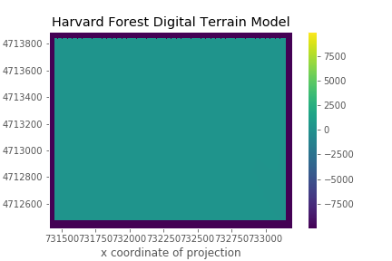
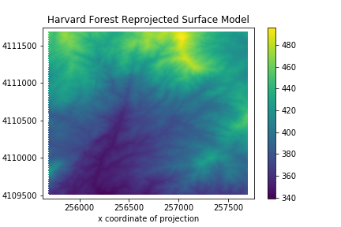
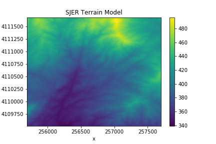

> ## Things You’ll Need To Complete This Episode
> See the [lesson homepage]({{ site.baseurl }}) for detailed information about the software,
> data, and other prerequisites you will need to work through the examples in this episode.
{: .prereq}

Sometimes we encounter raster datasets that do not "line up" when plotted or
analyzed. Rasters that don't line up are most often in different Coordinate
Reference Systems (CRS), otherwise known as "projections". This episode explains how to deal with rasters in different, known CRSs. It
will first walk though the traditional method for reprojecting rasters in Python using the `reproject()`
function in the `rasterio.warp` submodule. It will then show how to accomplish this with less lines using the `rioxarray` library.

## Raster Projection in R

If you loaded two rasters with different projections in QGIS 3 or ArcMap/ArcPro, you'd see that they would align since these software reproject "on-the-fly". But with R or Python, you'll need to reproject your data yourself with the `reproject()` function in order to plot or use these rasters together in calculations.

For this episode, we will be working with the Harvard Forest Digital Terrain
Model (DTM). This differs from the surface model data we've been working with so
far in that the digital terrain model (DTM) includes the tops of trees, while
the digital surface model (DSM) shows the ground level beneath the tree canopy. 
Our goal is to get these data into the same projection with `reproject()` so that
we can use both rasters to calculate tree canopy height, also called a Canopy Height Model (CHM).

First, we need to read in the DSM and DTM rasters.

```python
import rasterio

surface_model_HARV = rasterio.open("data/NEON-DS-Airborne-Remote-Sensing/HARV/DSM/HARV_dsmCrop.tif")

terrain_model_HARV_WGS84 = rasterio.open("data/NEON-DS-Airborne-Remote-Sensing/HARV/DTM/HARV_dtmCrop_WGS84.tif")
```

Then, we inspect the CRS of each file to confirm that they are not the same. This is always a good first check to make when you load in a new dataset, since it determines if you can start doing any other operations between two geospatial datasets.

```python
surface_model_HARV.crs
```
```
CRS.from_epsg(32618)
```

```python
terrain_model_HARV_WGS84.crs
```
```
CRS.from_epsg(4326)
```

Recall that the number within the output `CRS.from_epsg` is the EPSG code, which refers to a known projection. Using these CRS objects that are encoded in each raster file's metadata, we have all the information needed to reproject one raster onto the coordinate reference system of another. But which projection should we reproject to?

Often it is useful to reproject your data into units that suit a particular task. If you want your map axis to communicate location on the globe, latitude and longitude can be most informative. In this case you would reproject your rasters to EPSG code 4326. If you want to measure distances and areas, it's better to choose a coordinate reference system that is in units of meters. EPSG code 32618 represents UTM zone 18N, which you can discover by entering the EPSG code into the website https://epsg.io or by using the `earthpy.epsg` dictionary to look up the proj4 string.

```python
import earthpy
earthpy.epsg["32618"]
```

```
'+proj=utm +zone=18 +datum=WGS84 +units=m +no_defs'
```

We will reproject our DTM to meters using the CRS object that we can access from our DSM's `crs` attribute. If we use rasterio, this requires defining the metadata of our reprojected raster as well as saving the output to a new file before reading it back.

Since we are reprojecting, the `transform` of our metadata will change. The transform converts pixel coordinates (row, column) into geospatial coordinates (latitude, longitude), for example. We can create the new transform, crs, width, and height in our reprojected  output's metadata with `calculate_default_transform`.

```python
from rasterio.warp import calculate_default_transform, reproject

transform, width, height = calculate_default_transform(
    terrain_model_HARV_WGS84.crs, surface_model_HARV.crs, terrain_model_HARV_WGS84.width, terrain_model_HARV_WGS84.height, *terrain_model_HARV_WGS84.bounds)

destination_crs = surface_model_HARV.crs
reprojected_meta = terrain_model_HARV_WGS84.meta.copy()
reprojected_meta.update({
        'crs': destination_crs,
        'transform': transform,
        'width': width,
        'height': height
})

```
This copy the metadata from our DTM and then updates it with the new transform and other metadata info that the reprojected output will have.

Then use the metadata `dict` to save our reprojected raster with the correct attributes:

```python
reprojected_path = "data/NEON-DS-Airborne-Remote-Sensing/HARV/DTM/HARV_dtmCrop_UTM18_rasterio.tif"
with rasterio.open(reprojected_path, "w", **reprojected_meta) as reprojected_data:
    reproject(
        source = rasterio.band(terrain_model_HARV_WGS84, 1), 
        destination = rasterio.band(reprojected_data, 1), 
        src_crs=terrain_model_HARV_WGS84.crs, 
        dst_crs=surface_model_HARV.crs)

```

There's a lot of lines in the above example so let's break it down piece by piece. The python `with` statement allows us to create a rasterio object in write mode. You can think of this object, `reprojected_data` as a pointer to a file location that will store the result of `reproject`. When we call `reproject()` and use the `destination` argument to specify that the destination is at `reprojected_data`, we are specifying that the output of the function should be stored at the file path and with the file metadata corresponding to `reprojected_data`. The `source` and `destination` arguments must be numpy arrays or rasterio `Band` objects and here we choose to define them as single band objects.

> ## Data Tip
> When we reproject a raster, we
> move it from one "grid" to another. Thus, we are modifying the data! Keep this
> in mind as we work with raster data. You can choose different resampling methods that affect how the data are transferred from one grid to another. For example, you could specify an argument in `reproject` to choose nearest neighbor resampling like so: `resampling=Resampling.nearest`. See the function [documentation](https://rasterio.readthedocs.io/en/latest/api/rasterio.warp.html#rasterio.warp.reproject) for more details.
{: .callout}

We can read the file back in if we would like to use it for calculations or plotting. When we open the file, we need to call the `read()` function to get a numpy array. 

```python
reprojected_tif = rasterio.open(reprojected_path)
terrain_model_HARV_arr_UTM18_rasterio = reprojected_tif.read()
```

This is a lot of code just for a single reprojection right? In some cases, you may want to use the functions shown above to reproject, since rasterio gives you fine grained control over the metadata that is written to the file, and plus there are many helpful examples online of rasterio use cases to draw from. 

However, there is a much simpler way to accomplish this same reprojection. With `xarray`, a library for loading and calculating with labeled N-dimensional arrays, and `rioxarray`, an extension that wraps `rasterio` to provide geospatial operations for xarray objects, we can accomplish the reprojection in 1 line of code.

Reading in the data with xarray looks similar to using `rasterio` directly, but the output is a xarray object called a `DataArray`. You can use a `xarray.DataArray` in calculations just like a numpy array. Calling the variable name of the `DataArray` also prints out all of its metadata information. Geospatial information is not read in if you don't import rioxarray before calling the `open_rasterio` function.

```python
import rioxarray

surface_model_HARV_xarr = rioxarray.open_rasterio("data/NEON-DS-Airborne-Remote-Sensing/HARV/DSM/HARV_dsmCrop.tif")
terrain_model_HARV_xarr = rioxarray.open_rasterio("data/NEON-DS-Airborne-Remote-Sensing/HARV/DTM/HARV_dtmCrop_WGS84.tif")

surface_model_HARV_xarr
```

```
<xarray.DataArray (band: 1, y: 1367, x: 1697)>
[2319799 values with dtype=float64]
Coordinates:
  * band     (band) int64 1
  * y        (y) float64 4.714e+06 4.714e+06 4.714e+06 ... 4.712e+06 4.712e+06
  * x        (x) float64 7.315e+05 7.315e+05 7.315e+05 ... 7.331e+05 7.331e+05
Attributes:
    transform:      (1.0, 0.0, 731453.0, 0.0, -1.0, 4713838.0)
    crs:            +init=epsg:32618
    res:            (1.0, 1.0)
    is_tiled:       0
    nodatavals:     (-3.4e+38,)
    scales:         (1.0,)
    offsets:        (0.0,)
    AREA_OR_POINT:  Area
```

The metadata of the raster is also included within attributes of the `rio` attribute.

```python
surface_model_HARV_xarr.rio.crs
```
```
CRS.from_epsg(32618)
```

And then, it is one line to reproject the DTM to the DSM projection if we use `xarray` and `rioxarray`. `dst_crs` stands for the CRS of the destination, or the result fo the reproject operation.

```python
terrain_model_HARV_xarr_UTM18 = terrain_model_HARV_xarr.rio.reproject(dst_crs=surface_model_HARV_xarr.rio.crs)

terrain_model_HARV_xarr_UTM18
```

```
<xarray.DataArray (band: 1, y: 1493, x: 1796)>
array([[[-9999., -9999., -9999., ..., -9999., -9999., -9999.],
        [-9999., -9999., -9999., ..., -9999., -9999., -9999.],
        [-9999., -9999., -9999., ..., -9999., -9999., -9999.],
        ...,
        [-9999., -9999., -9999., ..., -9999., -9999., -9999.],
        [-9999., -9999., -9999., ..., -9999., -9999., -9999.],
        [-9999., -9999., -9999., ..., -9999., -9999., -9999.]]])
Coordinates:
  * x            (x) float64 7.314e+05 7.314e+05 ... 7.332e+05 7.332e+05
  * y            (y) float64 4.714e+06 4.714e+06 ... 4.712e+06 4.712e+06
  * band         (band) int64 1
    spatial_ref  int64 0
Attributes:
    transform:      (1.001061424448915, 0.0, 731402.3156760389, 0.0, -1.00106...
    scales:         (1.0,)
    offsets:        (0.0,)
    AREA_OR_POINT:  Area
    _FillValue:     -9999.0
    grid_mapping:   spatial_ref

```

> ## Data Tip
> You might wonder why the result of `terrain_model_HARV_xarr.rio.reproject()` shows `-9999` at the edges whereas when we read in the data, 
`surface_model_HARV_xarr` did not show the `-9999` values. This is because xarray by default will wait until the last necessary moment before actually running the computations on an xarray DataArray. This form of evaluation is called lazy, as opposed to eager, where functions are always computed when they are called. If you ever want a lazy DataArray to reveal it's underlying values, you can use the `.compute()` function. `xarray` will only show the values in the corners of the array.
> > ## Show code
> > 
> > ```python
> > surface_model_HARV_xarr.compute()
> > ```
    <xarray.DataArray (band: 1, y: 1367, x: 1697)>
    array([[[408.76998901, 408.22998047, 406.52999878, ..., 345.05999756,
      345.13998413, 344.97000122],
    [407.04998779, 406.61999512, 404.97998047, ..., 345.20999146,
      344.97000122, 345.13998413],
    [407.05999756, 406.02999878, 403.54998779, ..., 345.07000732,
      345.08999634, 345.17999268],
    ...,
    [367.91000366, 370.19000244, 370.58999634, ..., 311.38998413,
      310.44998169, 309.38998413],
    [370.75997925, 371.50997925, 363.41000366, ..., 314.70999146,
      309.25      , 312.01998901],
    [369.95999146, 372.6000061 , 372.42999268, ..., 316.38998413,
      309.86999512, 311.20999146]]])
    Coordinates:
    * band     (band) int64 1
    * y        (y) float64 4.714e+06 4.714e+06 4.714e+06 ... 4.712e+06 4.712e+06
    * x        (x) float64 7.315e+05 7.315e+05 7.315e+05 ... 7.331e+05 7.331e+05
    Attributes:
        transform:      (1.0, 0.0, 731453.0, 0.0, -1.0, 4713838.0)
        crs:            +init=epsg:32618
        res:            (1.0, 1.0)
        is_tiled:       0
        nodatavals:     (-3.4e+38,)
        scales:         (1.0,)
        offsets:        (0.0,)
        AREA_OR_POINT:  Area
> {: .solution}
{: .callout}


 We can compare the results with the `rasterio.warp.reproject` method to make sure they are the same.

```python
(terrain_model_HARV_xarr_UTM18 == terrain_model_HARV_arr_UTM18_rasterio).all()
```
```
<xarray.DataArray ()>
array(True)
Coordinates:
    spatial_ref  int64 0
```

And we can also save our DataArray that we created with `rioxarray` to a file.

```python
reprojected_path = "data/NEON-DS-Airborne-Remote-Sensing/HARV/DTM/HARV_dtmCrop_UTM18_rioxarray.tif"
terrain_model_HARV_xarr_UTM18.rio.to_raster(reprojected_path)
```

> ## Exercise
> Inspect the metadata for `terrain_model_HARV_xarr_UTM18` and 
> `surface_model_HARV_xarr`. Are the projections the same? What 
> metadata attributes are different? How might this affect 
> calculations we make between arrays?
> > ## Solution
> >
> > ```python
> > # view crs for DTM
> > print(terrain_model_HARV_xarr_UTM18.rio.crs)
> >
> > # view crs for DSM
> > print(surface_model_HARV_xarr.rio.crs)
> > ```
> > ```
> > EPSG:32618
> > EPSG:32618
> > ```
> > Good, the CRSs are the same. But ...
> > 
> > ```python
> > # view noddata value for DTM
> > print(terrain_model_HARV_xarr_UTM18.rio.nodata)
> >
> > # view nodata value for DSM
> > print(surface_model_HARV_xarr.rio.nodata)
> > ```
> > ```
> > -9999.0
> > -3.4e+38
> > ```
> > The nodata values are different. Before we plot or calculate 
> > both of these DataArrays together, we should make sure they 
> > have the same nodata value. Furthermore ...
> > 
> > ```python
> > # view shape for DTM
> > print(terrain_model_HARV_xarr_UTM18.shape)
> >
> > # view shape for DSM
> > print(surface_model_HARV_xarr.shape)
> > ```
> > ```
> > (1, 1492, 1801)
> > (1, 1367, 1697)
> > ```
> > The shapes are not the same which means these data cover 
> > slightly different extents and locations. In the next episode 
> > we will need to align these DataArrays before running any 
> > calculations. `rioxarray` provides functionality to align 
> > multiple geospatial DataArrays.
> {: .solution}
{: .challenge}

Let's plot our handiwork so far! We can use the `xarray.DataArray.plot` function to show the DTM. But if we run the following code, something doesn't look right ...

```python
import matplotlib.pyplot as plt
terrain_model_HARV_xarr_UTM18.plot(cmap="viridis")
plt.title("Harvard Forest Digital Terrain Model")
```


> ## Challenge
> Whoops! What did we forget to do to the DTM DataArray before plotting?
>
> > ## Answers
> > Our array has a `nodata` value, `-9999.0`, which causes the color
> > of our plot to be stretched over too wide a range. We'd like to
> > only display valid values, so before plotting we can filter out
> > the nodata values using the `where()` function and the 
> > `.rio.nodata` attribute of our DataArray.
> > ```python
import matplotlib.pyplot as plt
terrain_model_HARV_xarr_UTM18_valid = terrain_model_HARV_xarr_UTM18.where(
    terrain_model_HARV_xarr_UTM18 != terrain_model_HARV_xarr_UTM18.rio.nodata)
terrain_model_HARV_xarr_UTM18_valid.plot(cmap="viridis")
plt.title("Harvard Forest Digital Terrain Model")
> > ```
> > 
> > If we had saved `terrain_model_HARV_xarr_UTM18` to a file and then read it in with `open_rasterio`'s `masked=True` argument the raster's `nodata` value would be masked and we would not need to use the `where()` function to do the masking before plotting.
> {: .solution}
{: .challenge}


> ## Challenge: Reproject, then Plot a Digital Terrain Model
> Create 2 maps in a UTM projection of the [San Joaquin Experimental Range](https://www.neonscience.org/field-sites/field-sites-map/SJER) field site, using the`SJER_dtmCrop.tif` and `SJER_dsmCrop_WGS84.tif` files. Use `rioxarray` and `matplotlib.pyplot` (to add a title). Reproject the data as necessary to make sure each map is in the same UTM projection and save the reprojected file with the file name "data/NEON-DS-Airborne-Remote-Sensing/SJER/DSM/SJER_dsmCrop_WGS84.tif".
>
> > ## Answers
> > If we read in these files with the argument `masked=True`, then the nodata values will be masked automatically and set to `numpy.nan`, or Not a Number. This can make plotting easier since only valid raster values will be shown. However, it's important to remember that `numpy.nan` values still take up space in our raster just like `nodata values`, and thus they still affect the shape of the raster. In the next lesson, we will examine how to prepare rasters of different shapes for calculations.
> > ```python
import rioxarray
import matplotlib.pyplot as plt
terrain_model_HARV_SJER = rioxarray.open_rasterio("data/NEON-DS-Airborne-Remote-Sensing/SJER/DTM/SJER_dtmCrop.tif", masked=True)
surface_model_HARV_SJER = rioxarray.open_rasterio("data/NEON-DS-Airborne-Remote-Sensing/SJER/DSM/SJER_dsmCrop_WGS84.tif", masked=True)
reprojected_surface_model = surface_model_HARV_SJER.rio.reproject(dst_crs=terrain_model_HARV_SJER.rio.crs)
plt.figure()
reprojected_surface_model.plot()
plt.title("SJER Reprojected Surface Model")
reprojected_surface_model.rio.to_raster("data/NEON-DS-Airborne-Remote-Sensing/SJER/DSM/SJER_dsmCrop_WGS84.tif")
plt.figure()
terrain_model_HARV_SJER.plot()
plt.title("Terrain Model")
> > ```
> > 
> > 
> {: .solution}
{: .challenge}



