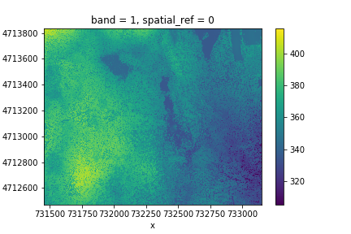
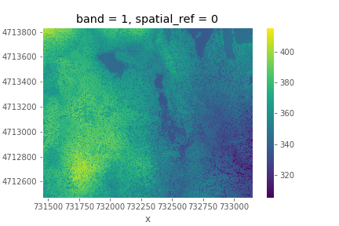
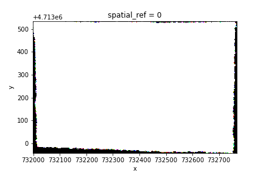
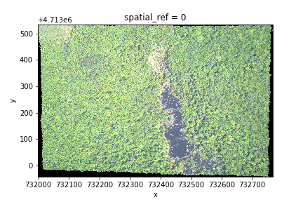

> ## Things You'll Need To Complete This Episode
>
> See the [lesson homepage]({{ site.baseurl }}) for detailed information about the software,
> data, and other prerequisites you will need to work through the examples in this episode.
{: .prereq}

In this episode, we will introduce the fundamental principles, packages and
metadata/raster attributes that are needed to work with raster data in Python. We will
discuss some of the core metadata elements that we need to understand to work with
rasters, including Coordinate Reference Systems, no data values, and resolution. We will also explore missing and bad
data values as stored in a raster and how Python handles these elements.

We will use 1 package in this episode to work with raster data -
`rioxarray`, which is based on the popular `rasterio` package for working with rasters and `xarray` for working with multi-dimensional arrays.  Make sure that you have `rioxarray` installed and imported.

~~~
import rioxarray
~~~
{: .language-python}

> ## Introduce the Data
>
> A brief introduction to the datasets can be found on the 
> [Geospatial workshop setup page](https://rbavery.github.io/geospatial-python/setup.html).
> 
> For more detailed information about the datasets, check
out the [Geospatial workshop data
page](https://rbavery.github.io/geospatial-python/).
{: .callout}

## Open a Raster and View Raster File Attributes

We will be working with a series of GeoTIFF files in this lesson. The
GeoTIFF format contains a set of embedded tags with metadata about the raster
data. We can use the function `rioxarray.open_rasterio()` to read the geotiff file and 
then inspect this metadata. By calling the variable name in the jupyter notebook
we can get a quick look at the shape and attributes of the data.


~~~
surface_HARV = rioxarray.open_rasterio("data/NEON-DS-Airborne-Remote-Sensing/HARV/DSM/HARV_dsmCrop.tif")
surface_HARV
~~~
{: .language-python}

~~~
<xarray.DataArray (band: 1, y: 1367, x: 1697)>
[2319799 values with dtype=float64]
Coordinates:
  * band         (band) int64 1
  * y            (y) float64 4.714e+06 4.714e+06 ... 4.712e+06 4.712e+06
  * x            (x) float64 7.315e+05 7.315e+05 ... 7.331e+05 7.331e+05
    spatial_ref  int64 0
Attributes:
    transform:     (1.0, 0.0, 731453.0, 0.0, -1.0, 4713838.0)
    _FillValue:    -9999.0
    scales:        (1.0,)
    offsets:       (0.0,)
    grid_mapping:  spatial_ref
~~~
{: .output}

The first call to `rioxarray.open_rasterio()` opens the file and returns an object that we store in a variable, `surface_HARV`.

The output tells us that we are looking at an `xarray.DataArray`, with `1` band, `1367` columns, and `1697` rows. We can also see the number of pixel values in the `DataArray`, and the type of those pixel values, which is floating point, or (`float64`). The `DataArray` also stores different values for the coordinates of the `DataArray`. When using `rioxarray`, the term coordinates refers to spatial coordinates like `x` and `y` but also the `band` coordinate. Each of these sequences of values has its own data type, like `float64` for the spatial coordinates
 and `int64` for the `band` coordinate. The `transform` represents the conversion between array coordinates (non-spatial) and spatial coordinates.

This `DataArray` object also has a couple attributes that are accessed like `.rio.crs`, `.rio.nodata`, and `.rio.bounds()`, which contain the metadata for the file we opened. Note that many of the metadata are accessed as attributes without `()`, but `bounds()` is a function and needs parentheses. 

```python
print(surface_HARV.rio.crs)
print(surface_HARV.rio.nodata)
print(surface_HARV.rio.bounds())
print(surface_HARV.rio.width)
print(surface_HARV.rio.height)
```

```
EPSG:32618
-9999.0
(731453.0, 4712471.0, 733150.0, 4713838.0)
1697
1367
```

The Coordinate Reference System, or `surface_HARV.rio.crs`, is reported as the string `EPSG:32618`. The `nodata` value is encoded as -9999.0 and the bounding box corners of our raster are represented by the output of `.bounds()` as a `tuple` (like a list but you can't edit it). The height and width match what we saw when we printed the `DataArray`, but by using `.rio.width` we can access these values if we need them in calculations.

 We will be exploring this data throughout this episode. By the end of this episode, you will be able to understand and explain the metadata output.

> ## Data Tip - Object names
> To improve code
> readability, file and object names should be used that make it clear what is in
> the file. The data for this episode were collected from Harvard Forest so
> we'll use a naming convention of `datatype_HARV`.
{: .callout}

After viewing the attributes of our raster, we can examine the raw value sof the array with `.values`:

~~~
surface_HARV.values
~~~
{: .language-python}

~~~
array([[[408.76998901, 408.22998047, 406.52999878, ..., 345.05999756,
         345.13998413, 344.97000122],
        [407.04998779, 406.61999512, 404.97998047, ..., 345.20999146,
         344.97000122, 345.13998413],
        [407.05999756, 406.02999878, 403.54998779, ..., 345.07000732,
         345.08999634, 345.17999268],
        ...,
        [367.91000366, 370.19000244, 370.58999634, ..., 311.38998413,
         310.44998169, 309.38998413],
        [370.75997925, 371.50997925, 363.41000366, ..., 314.70999146,
         309.25      , 312.01998901],
        [369.95999146, 372.6000061 , 372.42999268, ..., 316.38998413,
         309.86999512, 311.20999146]]])
~~~
{: .output}

This can give us a quick view of the values of our array, but only at the corners. Since our raster is loaded in python as a `DataArray` type, we can plot this in one line similar to a pandas `DataFrame` with `DataArray.plot()`.

```python
surface_HARV.plot()
```



Nice plot! Notice that `rioxarray` helpfully allows us to plot this raster with spatial coordinates on the x and y axis (this is not the default in many cases with other functions or libraries).

> ## Plotting Tip
> For more aesthetic looking plots, matplotlib allows you to customize the style with `plt.style.use`. However, if you want more control of the look of your plot, matplotlib has many more functions to change the position and appearnce of plot elements.
> > ## Show plot
> >  Here is the result of using a ggplot like style for our surface model plot.
> > 
> > ~~~
> > import matplotlib.pyplot as plt
> > plt.style.use("ggplot")
> > surface_HARV.plot()
> > ~~~
> > {: .language-python}
> > 
> > 
> {: .solution}
{: .callout}

This map shows the elevation of our study site in Harvard Forest. From the
legend, we can see that the maximum elevation is ~400, but we can't tell whether
this is 400 feet or 400 meters because the legend doesn't show us the units. We
can look at the metadata of our object to see what the units are. Much of the
metadata that we're interested in is part of the CRS, and it can be accessed with `.rio.crs`. We introduced the concept of a CRS in [an earlier
lesson]() (TODO replace link).

Now we will see how features of the CRS appear in our data file and what
meanings they have.

### View Raster Coordinate Reference System (CRS) in Python
We can view the CRS string associated with our Python object using the`crs`
attribute.


~~~
print(surface_HARV.rio.crs)
~~~
{: .language-python}


~~~
EPSG:32618
~~~
{: .output}

You can convert the EPSG code to a PROJ4 string with `earthpy.epsg`, another python `dict` which maps epsg codes (keys) to
PROJ4 strings (values)

~~~
import earthpy
earthpy.epsg['32618']
~~~
{: .language-python}

~~~
'+proj=utm +zone=18 +datum=WGS84 +units=m +no_defs'
~~~
{: .output}

> ## Challenge
> What units are our data in?
>
> > ## Answers
> > `+units=m` tells us that our data is in meters.
> > We could also get this information from the attribute `surface_HARV.crs.linear_units`.
> {: .solution}
{: .challenge}

## Understanding CRS in Proj4 Format
Let's break down the pieces of `proj4` string. The string contains all of the individual CRS
elements that Python or another GIS might need. Each element is specified with a
`+` sign, similar to how a `.csv` file is delimited or broken up by a `,`. After
each `+` we see the CRS element being defined. For example projection (`proj=`)
and datum (`datum=`).

### UTM Proj4 String
Our projection string for `surface_HARV` specifies the UTM projection as follows:

`'+proj=utm +zone=18 +datum=WGS84 +units=m +no_defs'`

* **proj=utm:** the projection is UTM, UTM has several zones.
* **zone=18:** the zone is 18
* **datum=WGS84:** the datum is WGS84 (the datum refers to the  0,0 reference for
the coordinate system used in the projection)
* **units=m:** the units for the coordinates are in meters
* **ellps=WGS84:** the ellipsoid (how the earth's  roundness is calculated) for
the data is WGS84. This isn't reported here since this is often the same as the datum. TODO does this merit a better explanation?

Note that the zone is unique to the UTM projection. Not all CRSs will have a
zone. Image source: Chrismurf at English Wikipedia, via [Wikimedia Commons](https://en.wikipedia.org/wiki/Universal_Transverse_Mercator_coordinate_system#/media/File:Utm-zones-USA.svg) (CC-BY).


## Calculate Raster Min and Max Values

It is useful to know the minimum or maximum values of a raster dataset. In this
case, given we are working with elevation data, these values represent the
min/max elevation range at our site.

We can compute these and other descriptive statistics with `min` and `max`

~~~
print(surface_HARV.min())
print(surface_HARV.max())
~~~
```
<xarray.DataArray ()>
array(305.07000732)
Coordinates:
    spatial_ref  int64 0
<xarray.DataArray ()>
array(416.06997681)
Coordinates:
    spatial_ref  int64 0

```

The information above includes a report of the number of observations, min and max values, mean, and variance. We specified the `axis=None` 
argument so that statistics were computed for the whole array, rather than for each row in the array.

You could also get each of these values one by one using `numpy`. What if we wanted to calculate 25% and 75% quartiles?

~~~
import numpy
print(numpy.percentile(surface_HARV, 25))
print(numpy.percentile(surface_HARV, 75))
~~~
{: .language-python}

~~~
345.5899963378906
374.2799987792969
~~~
{: .output}


> ## Data Tip - Set min and max values
> You may notice that `numpy.percentile` didn't require an `axis=None` argument. This is because `axis=None` is the default for most numpy 
> functions. It's always good to check out the docs on a function to see what the default arguments are, particularly when working with 
> multi-dimensional image data. To do so, we can use`help(numpy.percentile)` or `?numpy.percentile` if you are using jupyter notebook or 
> jupyter lab.
> 
{: .callout}

We can see that the elevation at our site ranges from 305.0700073m to
416.0699768m.

## Raster Bands
The Digital Surface Model that we've been working with is a
single band raster. This means that there is only one dataset stored in the
raster: surface elevation in meters for one time period. However, a raster dataset can contain one or more bands.


We can view the number of bands in a raster by looking at the `.shape` attribute of the `DataArray`. The band number comes first when geotiffs are red with the `.open_rasterio()` function.

~~~
rgb_HARV = rioxarray.open_rasterio("data/NEON-DS-Airborne-Remote-Sensing/HARV/RGB_Imagery/HARV_RGB_Ortho.tif")
rgb_HARV.shape
~~~
{: .language-python}
~~~
(3, 2317, 3073)
~~~
{: .output}

It's always a good idea to examine the shape of the raster array you are working with and make sure it's what you expect. Many functions, especially ones that plot images, expect a raster array to have a particular shape.

Jump to a later episode in
this series for information on working with multi-band rasters:
[Work with Multi-band Rasters in Python]({{ site.baseurl }}/08-raster-multi-band/).

## Dealing with Missing Data

Raster data often has a "no data value" associated with it and for raster datasets 
read in by `rioxarray` this value is referred to as `nodata`. This is a value assigned 
to pixels where data is missing or no data were collected. However, there can be 
different cases that cause missing data, and it's common for other values in a raster 
to represent different cases. The most common example is missing data at the edges of rasters.

By default the shape of a raster is always rectangular. So if we have a dataset
that has a shape that isn't rectangular, some pixels at the edge of the raster
will have no data values. This often happens when the data were collected by an
sensor which only flew over some part of a defined region.

In the RGB image below, the pixels that are black have no data values. The sensor
did not collect data in these areas. `rioxarray` assigns a specific number as missing data to the `.rio.nodata` attribute when the dataset is read, based on the file's own metadata. the GeoTiff's `nodata` attribute is assigned to the value `-1.7e+308`and in order to run calculations on this image that ignore these edge values or plot the image without the nodata values being displayed on the color scale, `rioxarray` masks them out. 

```python
rgb_HARV.plot.imshow()
```



From this plot we see something interesting, while our no data values were masked along the edges, the color channel's no data values don't all line up. The colored pixels at the edges between white black result from there being no data in one or two channels at a given pixel. `0` could conceivably represent a valid value for reflectance (the units of our pixel values) so it's good to make sure we are masking values at the edges and not valid data values within the image.

While this plot tells us where we have no data values, the color scale look strange, because our plotting function expects image values to be normalized between a certain range (0-1 or 0-255). By using `surface_HARV.plot.imshow` with the `robust=True` argument, we can normalize our data by the maximum and minimum to fit our data between the correct range for plotting purposes.
~~~
rgb_HARV.plot.imshow(robust=True)
~~~
{: .language-python}



The value that is conventionally used to take note of missing data (the
no data value) varies by the raster data type. For floating-point rasters,
the figure `-3.4e+38` is a common default, and for integers, `-9999` is
common. Some disciplines have specific conventions that vary from these
common values.

In some cases, other `nodata` values may be more appropriate. An `nodata` value should
be a) outside the range of valid values, and b) a value that fits the data type
in use. For instance, if your data ranges continuously from -20 to 100, 0 is
not an acceptable `nodata` value! Or, for categories that number 1-15, 0 might be
fine for `nodata`, but using -.000003 will force you to save the GeoTIFF on disk
as a floating point raster, resulting in a bigger file. 

