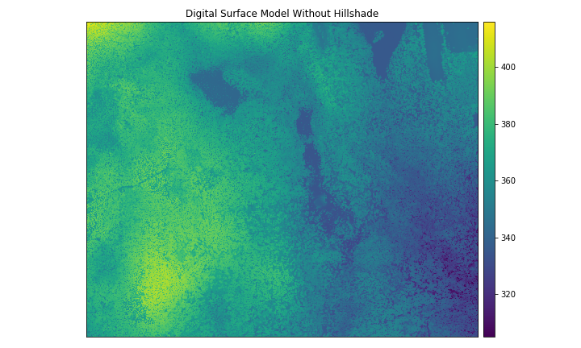
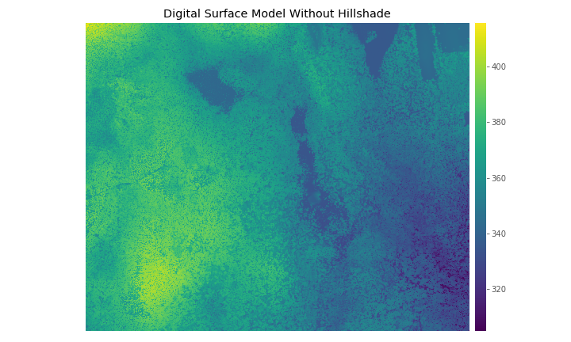
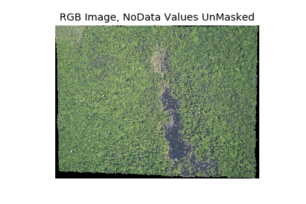
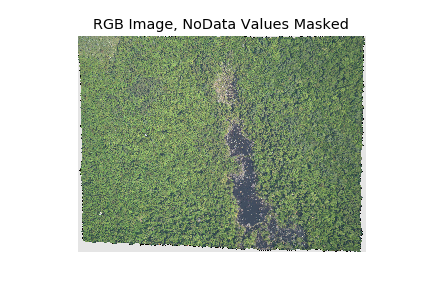
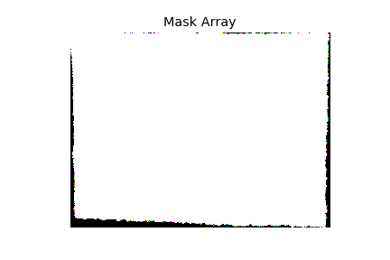

> ## Things You'll Need To Complete This Episode
>
> See the [lesson homepage]({{ site.baseurl }}) for detailed information about the software,
> data, and other prerequisites you will need to work through the examples in this episode.
{: .prereq}

In this episode, we will introduce the fundamental principles, packages and
metadata/raster attributes that are needed to work with raster data in Python. We will
discuss some of the core metadata elements that we need to understand to work with
rasters, including Coordinate Reference Systems, no data values, and resolution. We will also explore missing and bad
data values as stored in a raster and how Python handles these elements.

We will use four packages in this episode to work with raster data -
`rasterio` for reading and writing rasters, `scipy` for descriptive statistics, `numpy` for masking raster data and `earthpy.plot` for plotting. We will also use `matplotlib` to improve the aesthetics of our plot. Make sure that you have these packages installed and imported.


~~~
import rasterio
import scipy.stats
import numpy
import earthpy.plot
import matplotlib.pyplot as plt
~~~
{: .language-python}

> ## Introduce the Data
>
> A brief introduction to the datasets can be found on the 
> [Geospatial workshop homepage](https://rbavery.github.io/geospatial-python/setup.html).
> 
> For more detailed information about the datasets, check
out the [Geospatial workshop data
page](https://rbavery.github.io/geospatial-python/).
{: .callout}

## View Raster File Attributes

We will be working with a series of GeoTIFF files in this lesson. The
GeoTIFF format contains a set of embedded tags with metadata about the raster
data. We can use the function `rasterio.open()` to get metadata about our raster
data before we read the whole file into Python. This let's you get a quick look at
the shape and attributes of your data.


~~~
surface_model_HARV = rasterio.open("data/NEON-DS-Airborne-Remote-Sensing/HARV/DSM/HARV_dsmCrop.tif")
surface_model_HARV.meta
~~~
{: .language-python}

~~~
{'driver': 'GTiff',
 'dtype': 'float64',
 'nodata': -9999.0,
 'width': 1697,
 'height': 1367,
 'count': 1,
 'crs': CRS.from_epsg(32618),
 'transform': Affine(1.0, 0.0, 731453.0,
        0.0, -1.0, 4713838.0)}
~~~
{: .output}

The first call to `rasterio.open()` opens the file and returns an object that we store in a variable, `surface_model_HARV`.
This object has an attribute, `.meta`, which contains the metadata for the file we opened.

This metadata is stored in the form of a python `dict`. The `driver` shows that we read in a GeoTIFF file, where the values are encoded as floating point numbers (`'dtype': 'float64'`), and the `nodata` value encoded as -9999.0. `'width': 1697` represents the 1697 columns in the raster and `'height': 1367` represents the number of rows. `'count': 1` represents the number of bands in the dataset, indicating that we're working with a single-band raster. The Coordinate Reference System, or `crs`, is reported by EPSG code as the `32618` in `CRS.from_epsg(32618)`. The `transform` represents the conversion between pixel coordinates and spatial coordinates.


A python `dict` stores key, value pairs. If we wanted to access the width of the file we opened, we can use the key 
`'width'` to select that value from the dictionary.

~~~
surface_model_HARV.meta['width']
~~~
{: .language-python}
~~~
1697
~~~
{: .output}

The width value in this raster's meta is of type `int`, whereas the value for the key `nodata` is of type `float`. 
Other keys, `crs` and `transform`, use custom objects defined by the `rasterio` to represent the coordinate reference 
system, location, and resolution. We will be exploring this data throughout this episode. By the end of this episode, you will be able to understand and explain the metadata output.

## Open a Raster in Python

Now that we've previewed the metadata for our GeoTIFF, let's load this
raster dataset into Python as an array and explore its metadata more closely. We can use the `.read()` 
function to read the first, and only, band of our raster.

> ## Data Tip - Object names
> To improve code
> readability, file and object names should be used that make it clear what is in
> the file. The data for this episode were collected from Harvard Forest so
> we'll use a naming convention of `datatype_HARV_arr`.
> We'll add the 'arr' suffix to indicate this is an array.
{: .callout}

~~~
surface_model_HARV_arr = surface_model_HARV.read(1)
surface_model_HARV.read(1)
~~~
{: .language-python}


~~~
array([[408.76998901, 408.22998047, 406.52999878, ..., 345.05999756,
        345.13998413, 344.97000122],
       [407.04998779, 406.61999512, 404.97998047, ..., 345.20999146,
        344.97000122, 345.13998413],
       [407.05999756, 406.02999878, 403.54998779, ..., 345.07000732,
        345.08999634, 345.17999268],
       ...,
       [367.91000366, 370.19000244, 370.58999634, ..., 311.38998413,
        310.44998169, 309.38998413],
       [370.75997925, 371.50997925, 363.41000366, ..., 314.70999146,
        309.25      , 312.01998901],
       [369.95999146, 372.6000061 , 372.42999268, ..., 316.38998413,
        309.86999512, 311.20999146]])
~~~
{: .output}

The output of `.read()` is a numpy array, which is abbreviated with `...` since the array is too large for the output console.

To visualise this data in Python using `earthpy.plot`, all we need is our data in a numpy array and some options to control
the color of our plot and plot labels.

```python
earthpy.plot.plot_bands(
    surface_model_HARV_arr,
    scale=False,
    cmap="viridis",
    title="Digital Surface Model Without Hillshade",
    figsize=(10, 6)
)
```

Nice plot! We set the color scale to `viridis` which is a color-blindness friendly color scale.



> ## Plotting Tip
> For more aesthetic looking plots, matplotlib allows you to customize the style with `plt.style.use`. However, if you want more control of the look of your plot, matplotlib has many more functions to change the position and appearnce of plot elements.
> > ## Show plot
> >  Here is the result of using a ggplot like style for our surface model plot.
> > 
> > ~~~
> > plt.style.use("ggplot")
> > earthpy.plot.plot_bands(
> >     surface_model_HARV_arr,
> >     scale=False,
> >     cmap="viridis",
> >     title="Digital Surface Model Without Hillshade",
> >     figsize=(10, 6)
> > )
> > ~~~
> > {: .language-python}
> > 
> > 
> {: .solution}
{: .callout}

This map shows the elevation of our study site in Harvard Forest. From the
legend, we can see that the maximum elevation is ~400, but we can't tell whether
this is 400 feet or 400 meters because the legend doesn't show us the units. We
can look at the metadata of our object to see what the units are. Much of the
metadata that we're interested in is part of the CRS, and it can also be accessed 
by calling other attributes besides `meta`. We introduced the concept of a CRS in [an earlier
lesson](https://datacarpentry.org/organization-geospatial/03-crs) (TODO replace link).

Now we will see how features of the CRS appear in our data file and what
meanings they have.

### View Raster Coordinate Reference System (CRS) in Python
We can view the CRS string associated with our Python object using the`crs`
attribute.


~~~
surface_model_HARV.crs
~~~
{: .language-python}


~~~
CRS.from_epsg(32618)
~~~
{: .output}

You can convert the EPSG code to a PROJ4 string with `earthpy.epsg`, another python `dict` which maps epsg codes (keys) to
PROJ4 strings (values)

~~~
earthpy.epsg['32618']
~~~
{: .language-python}


~~~
'+proj=utm +zone=18 +datum=WGS84 +units=m +no_defs'
~~~
{: .output}


> ## Challenge
> What units are our data in?
>
> > ## Answers
> > `+units=m` tells us that our data is in meters.
> > We could also get this information from the attribute `surface_model_HARV.crs.linear_units`.
> {: .solution}
{: .challenge}

## Understanding CRS in Proj4 Format
Let's break down the pieces of `proj4` string. The string contains all of the individual CRS
elements that Python or another GIS might need. Each element is specified with a
`+` sign, similar to how a `.csv` file is delimited or broken up by a `,`. After
each `+` we see the CRS element being defined. For example projection (`proj=`)
and datum (`datum=`).

### UTM Proj4 String
Our projection string for `surface_model_HARV` specifies the UTM projection as follows:

`'+proj=utm +zone=18 +datum=WGS84 +units=m +no_defs'`

* **proj=utm:** the projection is UTM, UTM has several zones.
* **zone=18:** the zone is 18
* **datum=WGS84:** the datum is WGS84 (the datum refers to the  0,0 reference for
the coordinate system used in the projection)
* **units=m:** the units for the coordinates are in meters
* **ellps=WGS84:** the ellipsoid (how the earth's  roundness is calculated) for
the data is WGS84. This isn't reported here since this is often the same as the datum. TODO does this merit a better explanation?

Note that the zone is unique to the UTM projection. Not all CRSs will have a
zone. Image source: Chrismurf at English Wikipedia, via [Wikimedia Commons](https://en.wikipedia.org/wiki/Universal_Transverse_Mercator_coordinate_system#/media/File:Utm-zones-USA.svg) (CC-BY).


## Calculate Raster Min and Max Values

It is useful to know the minimum or maximum values of a raster dataset. In this
case, given we are working with elevation data, these values represent the
min/max elevation range at our site.

We can compute these and other descriptive statistics with `scipy.stats.describe()`.

~~~
scipy.stats.describe(surface_model_HARV_arr, axis=None)
~~~
{: .language-python}


~~~
DescribeResult(nobs=2319799, minmax=(305.07000732421875, 416.0699768066406), mean=359.8531180291444, variance=317.96928806118814, skewness=-0.04227854491703972, kurtosis=-0.7242596053501216)
~~~

The information above includes a report of the number of observations, min and max values, mean, and variance. We specified the `axis=None` 
argument so that statistics were computed for the whole array, rather than for each row in the array.

You could also get each of these values one by one using `numpy`. What if we wanted to calculate 25% and 75% quartiles?

~~~
print(numpy.percentile(surface_model_HARV_arr, 25))
print(numpy.percentile(surface_model_HARV_arr, 75))
~~~
{: .language-python}


~~~
345.5899963378906
374.2799987792969
~~~
{: .output}


> ## Data Tip - Set min and max values
> You may notice that `numpy.percentile` didn't require an `axis=None` argument. This is because `axis=None` is the default for most numpy 
> functions. It's always good to check out the docs on a function to see what the default argumetns are, particularly when working with 
> multi-dimensional image data. To do so, we can use`help(numpy.percentile)` or `?numpy.percentile` if you are using jupyter notebook or 
> jupyter lab.
> 
{: .callout}

We can see that the elevation at our site ranges from 305.0700073m to
416.0699768m.

## Raster Bands
The Digital Surface Model that we've been working with is a
single band raster. This means that there is only one dataset stored in the
raster: surface elevation in meters for one time period. However, a raster dataset can contain one or more bands.


We can use the `.read()` function to load one single band from a single or multi-band raster. We can
view the number of bands in a raster by looking at the `count` key of the `meta` python `dict`.


~~~
surface_model_HARV.meta['count']
~~~
{: .language-python}


~~~
1
~~~
{: .output}

However, raster data can also be multi-band, meaning that one raster file
contains data for more than one variable or time period for each cell. By
default the `.read()` function loads all bands in a raster
regardless of whether it has one or more bands and places each in a third 
axis of a numpy array in `[bands, rows, columns]` order. For example, even if 
there is only 1 band in a raster, it will be placed in it's own band axis.

~~~
surface_model_HARV_arr_3D = surface_model_HARV.read()
surface_model_HARV_arr_3D.shape
~~~
{: .language-python}


~~~
(1, 1367, 1697)
~~~
{: .output}

Earlier, we read our raster in as a 2D array instead

~~~
surface_model_HARV_arr_2D = surface_model_HARV.read(1)
surface_model_HARV_arr_2D.shape
~~~
{: .language-python}


~~~
(1367, 1697)
~~~
{: .output}

It's always a good idea to examine the shape of the raster array you are working with and make sure it's what you expect. Many functions, especially ones that plot images, expect a raster array to have a particular shape.

Jump to a later episode in
this series for information on working with multi-band rasters:
[Work with Multi-band Rasters in Python]({{ site.baseurl }}/05-raster-multi-band/).

## Dealing with Missing Data

Raster data often has a "no data value" associated with it and for raster datasets 
read in by `rasterio` this value is referred to as `nodata`. This is a value assigned 
to pixels where data is missing or no data were collected. However, there can be 
different cases that cause missing data, and it's common for other values in a raster 
to represent different cases. The most common example is missing data at the edges of rasters.

By default the shape of a raster is always rectangular. So if we have a dataset
that has a shape that isn't rectangular, some pixels at the edge of the raster
will have no data values. This often happens when the data were collected by an
sensor which only flew over some part of a defined region.

In the RGB image below, the pixels that are black have no data values. The sensor
did not collect data in these areas.

~~~
rgb_HARV = rasterio.open("NEON-DS-Airborne-Remote-Sensing/HARV/RGB_Imagery/HARV_RGB_Ortho.tif", "r")
rgb_HARV_arr = rgb_HARV.read()
earthpy.plot.plot_rgb(
    rgb_HARV_arr,
    title="RGB Image, NoData Values UnMasked",
    figsize=(10, 6)
)
~~~
{: .language-python}




`rasterio` assigns a specific number as missing data to the `meta` attribute when the dataset is read, based on the file's own metadata. While the GeoTiff's `nodata` attribute is assigned to the value `-1.7e+308`, it turns out the missing data at the edges are represented by the value `0`. In order to run calculations on this image that ignore these edge values or plot he image without the nodata values being displayed on the color scale, we can mask out `0` values in our numpy array. 

In the next image, the black edges have been masked using `numpy.ma.masked_where()`, a function that assigns no data values where a condition is true.

~~~
rgb_HARV_masked_arr = numpy.ma.masked_where(rgb_HARV_arr==0, rgb_HARV_arr) #1st argument is the condition, second is the array to mask
earthpy.plot.plot_rgb(
    rgb_HARV_masked_arr,
    title="RGB Image, NoData Values Masked",
    figsize=(10, 6)
)
~~~
{: .language-python}



The difference here shows up as ragged edges on the plot, rather than black
spaces where there is no data.

If your raster already has `nodata` values set correctly but you aren't sure where they are, you can deliberately plot them in a particular colour. This can be useful when checking a dataset's coverage. For instance, sometimes data can be missing where a sensor could not 'see' its target data, and you may wish to locate that missing data and fill it in. With Python, we can plot a boolean array of `True/False` values from our masked array's `.mask` attribute. Since the mask array represents no data values as `True` and data values as `False`, we need to reverse our boolean array so that we can more clearly see where no data values have been masked in each of our color channels.

~~~
earthpy.plot.plot_rgb(
    rgb_HARV_masked_arr.mask*-1, # mutliplying a boolean array by -1 reverses True and False values
    title="Mask Array",
    figsize=(10, 6)
)
~~~
{: .language-python}



From this plot we see something interesting, while our no data values were masked along the edges, the color channel's no data values don't all line up. The colored pixels at the edges between white black result from there being no data in one or two channels at a given pixel. `0` could conceivably
represent a valid value for reflectance (the units of our pixel values) so it's good to make sure we are masking values at the edges and not valid data values within the image.

Check out [the documentation](https://docs.scipy.org/doc/numpy/reference/maskedarray.generic.html) on the `numpy.ma` masked array module for more details. Regular numpy functions work with masked arrays like they do for regular numpy arrays, but ignore masked no data values.

The value that is conventionally used to take note of missing data (the
no data value) varies by the raster data type. For floating-point rasters,
the figure `-3.4e+38` is a common default, and for integers, `-9999` is
common. Some disciplines have specific conventions that vary from these
common values.

In some cases, other `nodata` values may be more appropriate. An `nodata` value should
be a) outside the range of valid values, and b) a value that fits the data type
in use. For instance, if your data ranges continuously from -20 to 100, 0 is
not an acceptable `nodata` value! Or, for categories that number 1-15, 0 might be
fine for `nodata`, but using -.000003 will force you to save the GeoTIFF on disk
as a floating point raster, resulting in a bigger file. 

> ## Challenge
> How can we find the assigned `nodata` value for our dataset when it is read in? How can we assign it to something else?
>
> > ## Answers
> >
> > 
> > ~~~
> > print(surface_model_HARV.nodata)
> > changed_meta_copy = surface_model_HARV.meta.copy()
> > changed_meta_copy['nodata'] = -3.4e+38
> > print(changed_meta_copy)
> > ~~~
> > {: .language-python}
> > 
> > 
> > 
> > ~~~
> > -9999.0
> > -3.4e+38
> > ~~~
> > {: .output}
> >
> > No data values are encoded as -9999. If we didn't make a copy of the meta and instead a) opened the file with both read and write permissions and b) changed the original, we would have changed the original file's no data value even after restarting the python kernel.
> {: .solution}
{: .callout}

