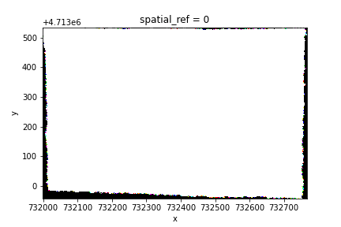
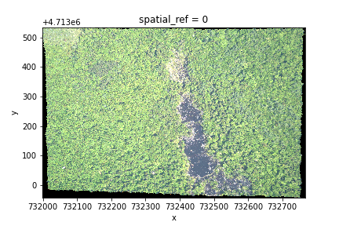

> ## Things You'll Need To Complete This Episode
>
> See the [lesson homepage]({{ site.baseurl }}) for detailed information about the software,
> data, and other prerequisites you will need to work through the examples in this episode.
{: .prereq}

In this episode, we will introduce the fundamental principles, packages and
metadata/raster attributes that are needed to work with raster data in Python. We will discuss some of the core metadata elements that we need to understand to work with rasters, including Coordinate Reference Systems, no data values, and resolution. We will also explore missing and bad data values as stored in a raster and how Python handles these elements.

We will use a Python package in this episode to work with raster data -
[`rioxarray`](https://corteva.github.io/rioxarray/stable/),
which is based on the popular [`rasterio`](https://rasterio.readthedocs.io/en/latest/) package for working with rasters and [`xarray`](http://xarray.pydata.org/en/stable/) for working with multi-dimensional arrays.

We will also use the [`pystac`](https://github.com/stac-utils/pystac) package to load raster from the searching results from the the exercise of the previous episode. This would not be necessary if you skipped it.

Make sure that you have `rioxarray` and `pystac` (optional) installed and imported.

~~~
import rioxarray
import pystac # Not required if you skipped the previous episode 
~~~
{: .language-python}


> ## Introduce the Data
>
> In this episode, we will continue from the `search.json` file, which we saved in an exercise from the previous episode. We will use one scene in the searching results as an example, and demontrate the data loading and visualization.
>
> If you have skipped the previous episode on data accessing, you can download the same raster data from the [data repository](ToDo: add link) of this lesson.
{: .callout}

## Load a Raster and View Attributes

In the previous episode, we did an excercise searching Sentinel-2 images, and then saved the searching results to `search.json`. This file contains the information on where and how to access the target images from a remote repository. We can use the function `pystac.ItemCollection.from_file()` to load the searching results as an `Item` list.


~~~
items = pystac.ItemCollection.from_file("search.json")
[item for item in items]
~~~
{: .language-python}
~~~
[<Item id=S2A_31UFU_20200328_0_L2A>,
 <Item id=S2B_31UFU_20200326_0_L2A>,
 <Item id=S2B_31UFU_20200323_0_L2A>,
 <Item id=S2A_31UFU_20200321_0_L2A>]
~~~
{: .output}

In the searching results, we have 4 `Item`, corresponding to 4 Sentinel-2 scenes from March 21 to 28 in 2020. We will focus on the first scene: `S2A_31UFU_20200328_0_L2A`, and load one band: `B09` from it. We can load this band using fuction `rioxarray.open_rasterio()`, via the Hypertext Reference `href`:
~~~
raster_ams = rioxarray.open_rasterio(items[0].assets["B09"].href)
~~~
{: .language-python}

If the dat accessing episode is skipped, you can also directly load the raster from the downloaded image:
~~~
raster_ams = rioxarray.open_rasterio('ToDo:path/to/the/downloaded/raster')
~~~
{: .language-python}

By calling the variable name in the jupyter notebook we can get a quick look at the shape and attributes of the data.
~~~
raster_ams
~~~
{: .language-python}
~~~
<xarray.DataArray (band: 1, y: 1830, x: 1830)>
[3348900 values with dtype=uint16]
Coordinates:
  * band         (band) int64 1
  * x            (x) float64 6e+05 6.001e+05 6.002e+05 ... 7.097e+05 7.098e+05
  * y            (y) float64 5.9e+06 5.9e+06 5.9e+06 ... 5.79e+06 5.79e+06
    spatial_ref  int64 0
Attributes:
    _FillValue:    0.0
    scale_factor:  1.0
    add_offset:    0.0
~~~
{: .output}

The first call to `rioxarray.open_rasterio()` opens the file from a remote or local storage, and then returns a `xarray.DataArray` object. The object is stored in a variable, i.e. `raster_ams`. Reading in the data with `xarray` instead of `rioxarray` also returns a `xarray.DataArray`, but the output will not contain the geospatial metadata (such as projection information). You can use a `xarray.DataArray` in calculations just like a numpy array. Calling the variable name of the `DataArray` also prints out all of its metadata information.

The output tells us that we are looking at an `xarray.DataArray`, with `1` band, `1830` rows, and `1830` columns. We can also see the number of pixel values in the `DataArray`, and the type of those pixel values, which is floating point, or (`float64`). The `DataArray` also stores different values for the coordinates of the `DataArray`. When using `rioxarray`, the term coordinates refers to spatial coordinates like `x` and `y` but also the `band` coordinate. Each of these sequences of values has its own data type, like `float64` for the spatial coordinates and `int64` for the `band` coordinate.

This `DataArray` object also has a couple attributes that are accessed like `.rio.crs`, `.rio.nodata`, and `.rio.bounds()`, which contain the metadata for the file we opened. Note that many of the metadata are accessed as attributes without `()`, but `bounds()` is a function and needs parentheses. 

~~~
print(raster_ams.rio.crs)
print(raster_ams.rio.nodata)
print(raster_ams.rio.bounds())
print(raster_ams.rio.width)
print(raster_ams.rio.height)
~~~
{: .language-python}
~~~
EPSG:32631
0
(600000.0, 5790240.0, 709800.0, 5900040.0)
1830
1830
~~~
{: .output}

The Coordinate Reference System, or `raster_ams.rio.crs`, is reported as the string `EPSG:32631`. The `nodata` value is encoded as 0 and the bounding box corners of our raster are represented by the output of `.bounds()` as a `tuple` (like a list but you can't edit it). The height and width match what we saw when we printed the `DataArray`, but by using `.rio.width` and `.rio.height` we can access these values if we need them in calculations.

We will be exploring this data throughout this episode. By the end of this episode, you will be able to understand and explain the metadata output.

> ## Data Tip - Object names
> To improve code readability, file and object names should be used that make it clear what is in the file. The data for this episode were collected covering Amsterdam, so we'll use a naming convention of `raster_ams`.
{: .callout}

## Visualize a Raster

After viewing the attributes of our raster, we can examine the raw values of the array with `.values`:

~~~
raster_ams.values
~~~
{: .language-python}
~~~
array([[[    0,     0,     0, ...,  8888,  9075,  8139],
        [    0,     0,     0, ..., 10444, 10358,  8669],
        [    0,     0,     0, ..., 10346, 10659,  9168],
        ...,
        [    0,     0,     0, ...,  4295,  4289,  4320],
        [    0,     0,     0, ...,  4291,  4269,  4179],
        [    0,     0,     0, ...,  3944,  3503,  3862]]], dtype=uint16)
~~~
{: .output}

This can give us a quick view of the values of our array, but only at the corners. Since our raster is loaded in python as a `DataArray` type, we can plot this in one line similar to a pandas `DataFrame` with `DataArray.plot()`.

~~~
raster_ams.plot()
~~~
{: .language-python}


Nice plot! Notice that `rioxarray` helpfully allows us to plot this raster with spatial coordinates on the x and y axis (this is not the default in many cases with other functions or libraries). 

This map shows the measurement from the spectral band `B09`. According to the [documentaion](https://custom-scripts.sentinel-hub.com/custom-scripts/sentinel-2/bands/), this is a band with the central wavelength of 945nm, which is sensitive to the water vapor. It has a spatial resolition of 60m.

In a quick view of the image, we can find that half of the image is blank, we can see that the pixels with high values are the cloud coverage on the top, and the contrast of everything else is quite low. This is within expectation because `B09` is by definition sensitive to the water vapors. However if one would like to have more detailed view of the ground pixels, one can also make the plot with the option `robust=True`:

~~~
raster_ams.plot(robust=True)
~~~
{: .language-python}


Now the color limits is set in the way fitting most of the values in the image. We have a better view on the ground pixels.

Another information that we're interested in is the CRS, and it can be accessed with `.rio.crs`. We introduced the concept of a CRS in [an earlier
episode](https://carpentries-incubator.github.io/geospatial-python/03-crs/index.html).

Now we will see how features of the CRS appear in our data file and what
meanings they have.

## View Raster Coordinate Reference System (CRS) in Python
We can view the CRS string associated with our Python object using the `crs`
attribute.

~~~
print(raster_ams.rio.crs)
~~~
{: .language-python}
~~~
EPSG:32631
~~~
{: .output}

To just print the EPSG code number as an `int`, we use the `.to_epsg()` method:

~~~
raster_ams.rio.crs.to_epsg()
~~~
{: .language-python}
~~~
32631
~~~
{: .output}

EPSG codes are great for succinctly representing a particular coordinate reference system. But what if we want to see information about the CRS? For that, we can use `pyproj`, a library for representing and working with coordinate reference systems.

~~~
from pyproj import CRS
epsg = raster_ams.rio.crs.to_epsg()
crs = CRS(epsg)
crs
~~~
{: .language-python}
~~~
<Derived Projected CRS: EPSG:32631>
Name: WGS 84 / UTM zone 31N
Axis Info [cartesian]:
- E[east]: Easting (metre)
- N[north]: Northing (metre)
Area of Use:
- name: Between 0°E and 6°E, northern hemisphere between equator and 84°N, onshore and offshore. Algeria. Andorra. Belgium. Benin. Burkina Faso. Denmark - North Sea. France. Germany - North Sea. Ghana. Luxembourg. Mali. Netherlands. Niger. Nigeria. Norway. Spain. Togo. United Kingdom (UK) - North Sea.
- bounds: (0.0, 0.0, 6.0, 84.0)
Coordinate Operation:
- name: UTM zone 31N
- method: Transverse Mercator
Datum: World Geodetic System 1984 ensemble
- Ellipsoid: WGS 84
- Prime Meridian: Greenwich
~~~
{: .output}

The `CRS` class from the `pyproj` library allows us to create a `CRS` object with methods and attributes for accessing specific information about a CRS, or the detailed summary shown above.

A particularly useful attribute is `area_of_use`, which shows the geographic bounds that the CRS is intended to be used.

~~~
crs.area_of_use
~~~
{: .language-python}
~~~
AreaOfUse(west=0.0, south=0.0, east=6.0, north=84.0, name='Between 0°E and 6°E, northern hemisphere between equator and 84°N, onshore and offshore. Algeria. Andorra. Belgium. Benin. Burkina Faso. Denmark - North Sea. France. Germany - North Sea. Ghana. Luxembourg. Mali. Netherlands. Niger. Nigeria. Norway. Spain. Togo. United Kingdom (UK) - North Sea.')
~~~
{: .output}

> ## Challenge
> What units are our data in? See if you can find a method to examine this information using `help(crs)` or `dir(crs)`
>
> > ## Answers
> > `crs.axis_info` tells us that our CRS for our raster has two axis and both are in meters.
> > We could also get this information from the attribute `raster_ams.rio.crs.linear_units`.
> {: .solution}
{: .challenge}

### Understanding pyproj CRS Summary
Let's break down the pieces of the `pyproj` CRS summary. The string contains all of the individual CRS elements that Python or another GIS might need, separated into distinct sections, and datum.

~~~
<Derived Projected CRS: EPSG:32631>
Name: WGS 84 / UTM zone 31N
Axis Info [cartesian]:
- E[east]: Easting (metre)
- N[north]: Northing (metre)
Area of Use:
- name: Between 0°E and 6°E, northern hemisphere between equator and 84°N, onshore and offshore. Algeria. Andorra. Belgium. Benin. Burkina Faso. Denmark - North Sea. France. Germany - North Sea. Ghana. Luxembourg. Mali. Netherlands. Niger. Nigeria. Norway. Spain. Togo. United Kingdom (UK) - North Sea.
- bounds: (0.0, 0.0, 6.0, 84.0)
Coordinate Operation:
- name: UTM zone 31N
- method: Transverse Mercator
Datum: World Geodetic System 1984 ensemble
- Ellipsoid: WGS 84
- Prime Meridian: Greenwich
~~~
{: .output}

* **Name** of the projection is UTM zone 31N (UTM has 60 zones, each 6-degrees of longitude in width). The underlying datum is WGS84.
* **Axis Info**: the CRS shows a Cartesian system with two axis, an easting and northing, in meter units.
* **Area of Use**: the projection is used for a particular range of longitudes `0°E to 6°E` in the northern hemisphere (`0.0°N to 84.0°N`)
* **Coordinate Operation**: the operation to project the coordinates (if it is projected) on to a cartesian (x, y) plane. Transverse mercator is accurate for areas with longitudinal widths of a few degrees, hence the distinct UTM zones.
* **Datum**: Details about the datum, or the reference point for coordinates. `WGS 84` and `NAD 1983` are common datums. `NAD 1983` is [set to be replaced in 2022](https://en.wikipedia.org/wiki/Datum_of_2022).

Note that the zone is unique to the UTM projection. Not all CRSs will have a
zone. Below is a simplified view of US UTM zones. Image source: Chrismurf at English Wikipedia, via [Wikimedia Commons](https://en.wikipedia.org/wiki/Universal_Transverse_Mercator_coordinate_system#/media/File:Utm-zones-USA.svg) (CC-BY).


## Calculate Raster Min and Max Values

It is useful to know the minimum or maximum values of a raster dataset. In this
case, given we are working with elevation data, these values represent the
min/max elevation range at our site.

We can compute these and other descriptive statistics with `min`, `max`, `mean`, and `std`.

~~~
print(surface_HARV.min())
print(surface_HARV.max())
print(surface_HARV.mean())
print(surface_HARV.std())
~~~
{: .language-python}

~~~
<xarray.DataArray ()>
array(305.07000732)
Coordinates:
    spatial_ref  int64 0
<xarray.DataArray ()>
array(416.06997681)
Coordinates:
    spatial_ref  int64 0
<xarray.DataArray ()>
array(359.85311803)
Coordinates:
    spatial_ref  int64 0
<xarray.DataArray ()>
array(17.83168952)
Coordinates:
    spatial_ref  int64 0
~~~
{: .output}


The information above includes a report of the min, max, mean, and standard deviation values, along with the data type.

If we want to see specific quantiles, we can use xarray's `.quantile()` method. For example for the 25% and 75% quartiles:

```python
print(surface_HARV.quantile([0.25, 0.75]))
```

```
<xarray.DataArray (quantile: 2)>
array([345.58999634, 374.27999878])
Coordinates:
  * quantile  (quantile) float64 0.25 0.75
```
{: .output}

> ## Data Tip - NumPy methods
> You could also get each of these values one by one using `numpy`.
> 
> ~~~
> import numpy
> print(numpy.percentile(surface_HARV, 25))
> print(numpy.percentile(surface_HARV, 75))
> ~~~
> {: .language-python}
> 
> ~~~
> 345.5899963378906
> 374.2799987792969
> ~~~
> {: .output}
> You may notice that `surface_HARV.quantile` and `numpy.percentile` didn't require an argument specifying the axis or dimension along which to compute the quantile. This is because `axis=None` is the default for most numpy 
> functions, and therefore `dim=None` is the default for most xarray methods. It's always good to check out the docs on a function to see what the default arguments are, particularly when working with 
> multi-dimensional image data. To do so, we can use`help(surface_HARV.quantile)` or `?surface_HARV.percentile` if you are using jupyter notebook or 
> jupyter lab.
> 
{: .callout}

We can see that the elevation at our site ranges from 305.0700073m to
416.0699768m.

## Raster Bands
The Digital Surface Model that we've been working with is a
single band raster. This means that there is only one dataset stored in the
raster--surface elevation in meters for one time period. However, a raster dataset can contain one or more bands.


We can view the number of bands in a raster by looking at the `.shape` attribute of the `DataArray`. The band number comes first when GeoTiffs are read with the `.open_rasterio()` function.

~~~
rgb_HARV = rioxarray.open_rasterio("data/NEON-DS-Airborne-Remote-Sensing/HARV/RGB_Imagery/HARV_RGB_Ortho.tif")
rgb_HARV.shape
~~~
{: .language-python}
~~~
(3, 2317, 3073)
~~~
{: .output}

It's always a good idea to examine the shape of the raster array you are working with and make sure it's what you expect. Many functions, especially ones that plot images, expect a raster array to have a particular shape.

Jump to a later episode in
this series for information on working with multi-band rasters:
[Work with Multi-Band Rasters in Python]({{ site.baseurl }}/08-raster-multi-band/).

## Dealing with Missing Data

Raster data often has a "no data value" associated with it and for raster datasets 
read in by `rioxarray` this value is referred to as `nodata`. This is a value assigned 
to pixels where data is missing or no data were collected. However, there can be 
different cases that cause missing data, and it's common for other values in a raster 
to represent different cases. The most common example is missing data at the edges of rasters.

By default the shape of a raster is always rectangular. So if we have a dataset
that has a shape that isn't rectangular, some pixels at the edge of the raster
will have no data values. This often happens when the data were collected by a
sensor which only flew over some part of a defined region.

In the RGB image below, the pixels that are black have no data values. The sensor
did not collect data in these areas. `rioxarray` assigns a specific number as missing data to the `.rio.nodata` attribute when the dataset is read, based on the file's own metadata. The GeoTiff's `nodata` attribute is assigned to the value `-1.7e+308` and in order to run calculations on this image that ignore these edge values or plot the image without the nodata values being displayed on the color scale, `rioxarray` masks them out. 

```python
# The imshow() function in the pyplot module of the matplotlib library is used to display data as an image.
rgb_HARV.plot.imshow()
```



From this plot we see something interesting, while our no data values were masked along the edges, the color channel's no data values don't all line up. The colored pixels at the edges between white and black result from there being no data in one or two bands at a given pixel. `0` could conceivably represent a valid value for reflectance (the units of our pixel values) so it's good to make sure we are masking values at the edges and not valid data values within the image.

While this plot tells us where we have no data values, the color scale looks strange, because our plotting function expects image values to be normalized between a certain range (0-1 or 0-255). By using `surface_HARV.plot.imshow` with the `robust=True` argument, we can display values between the 2nd and 98th percentile, providing better color contrast.
~~~
rgb_HARV.plot.imshow(robust=True)
~~~
{: .language-python}



The value that is conventionally used to take note of missing data (the
no data value) varies by the raster data type. For floating-point rasters,
the value `-3.4e+38` is a common default, and for integers, `-9999` is
common. Some disciplines have specific conventions that vary from these
common values.

In some cases, other `nodata` values may be more appropriate. A `nodata` value should
be, a) outside the range of valid values, and b) a value that fits the data type
in use. For instance, if your data ranges continuously from -20 to 100, 0 is
not an acceptable `nodata` value! Or, for categories that number 1-15, 0 might be
fine for `nodata`, but using -.000003 will force you to save the GeoTIFF on disk
as a floating point raster, resulting in a bigger file. 


