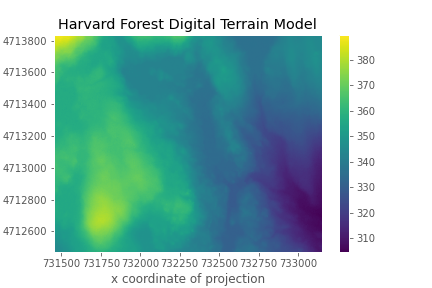

> ## Things You’ll Need To Complete This Episode
> See the [lesson homepage]({{ site.baseurl }}) for detailed information about the software,
> data, and other prerequisites you will need to work through the examples in this episode.
{: .prereq}

Sometimes we encounter raster datasets that do not "line up" when plotted or
analyzed. Rasters that don't line up are most often in different Coordinate
Reference Systems (CRS), otherwise known as "projections". This episode explains how to line up rasters in different, known CRSs.

## Raster Projection in Python

If you loaded two rasters with different projections in QGIS or ArcGIS, you'd see that they would align since these software reproject "on-the-fly". But with R or Python, you'll need to reproject your data yourself in order to plot or use these rasters together in calculations.

For this episode, we will be working with the Harvard Forest Digital Terrain
Model (DTM). This differs from the surface model data we've been working with so
far in that the digital surface model (DSM) includes the tops of trees, while
the digital terrain model (DTM) shows the ground level beneath the tree canopy. 

Our goal is to get these data into the same projection with the `rioxarray.reproject_match()` function so that
we can use both rasters to calculate tree canopy height, also called a Canopy Height Model (CHM).

First, we need to read in the DSM and DTM rasters.

~~~
import rioxarray

surface_HARV = rioxarray.open_rasterio("data/NEON-DS-Airborne-Remote-Sensing/HARV/DSM/HARV_dsmCrop.tif")
terrain_HARV = rioxarray.open_rasterio("data/NEON-DS-Airborne-Remote-Sensing/HARV/DTM/HARV_dtmCrop_WGS84.tif")

surface_HARV
~~~
{: .language-python}

~~~
xarray.DataArray band: 1, y: 1367, x: 1697
[2319799 values with dtype=float64]
Coordinates:
band       (band)   int64    1
 y          (y)    float64   4.714e+06 4.714e+06 ... 4.712e+06
 x          (x)    float64   7.315e+05 7.315e+05 ... 7.331e+05
spatial_ref ()      int64    0
Attributes:
STATISTICS_MAXIMUM: 416.06997680664
STATISTICS_MEAN: 359.85311802914
STATISTICS_MINIMUM: 305.07000732422
STATISTICS_STDDEV: 17.83169335933
_FillValue: -9999.0
scale_factor: 1.0
add_offset: 0.0
grid_mapping: spatial_ref
~~~
{: .output}

To read the spatial reference in the output you click on the icon “Show/Hide attributes” on the right side of the `spatial_ref` row. You can also print the Well-known Text projection string.

~~~
surface_HARV.rio.crs.wkt
~~~
{: .language-python}

~~~
'PROJCS["WGS 84 / UTM zone 18N",GEOGCS["WGS 84",DATUM["WGS_1984",SPHEROID["WGS 84",6378137,298.257223563,AUTHORITY["EPSG","7030"]],AUTHORITY["EPSG","6326"]],PRIMEM["Greenwich",0,AUTHORITY["EPSG","8901"]],UNIT["degree",0.0174532925199433,AUTHORITY["EPSG","9122"]],AUTHORITY["EPSG","4326"]],PROJECTION["Transverse_Mercator"],PARAMETER["latitude_of_origin",0],PARAMETER["central_meridian",-75],PARAMETER["scale_factor",0.9996],PARAMETER["false_easting",500000],PARAMETER["false_northing",0],UNIT["metre",1,AUTHORITY["EPSG","9001"]],AXIS["Easting",EAST],AXIS["Northing",NORTH],AUTHORITY["EPSG","32618"]]'
~~~
{: .output}

We can see the datum and projection are UTM zone 18N and WGS 84 respectively. UTM zone 18N is a regional projection with an associated coordinate system to more accurately capture distance, shape and/or area around the Harvard Forest.

~~~
terrain_HARV.rio.crs.wkt
~~~
{: .language-python}

~~~
'GEOGCS["WGS 84",DATUM["WGS_1984",SPHEROID["WGS 84",6378137,298.257223563,AUTHORITY["EPSG","7030"]],AUTHORITY["EPSG","6326"]],PRIMEM["Greenwich",0],UNIT["degree",0.0174532925199433,AUTHORITY["EPSG","9122"]],AXIS["Latitude",NORTH],AXIS["Longitude",EAST],AUTHORITY["EPSG","4326"]]'
~~~
{: .output}

We see the DTM is in an unprojected geographic coordinate system, using WGS84 as the datum and a coordinate system that spans the entire planet (i.e. latitude and longitude). This means that every location on the planet is defined using the SAME coordinate system and the same units. Geographic coordinate reference systems are best for global analysis but not for capturing distance, shape and/or area on a local scale.

We can use the CRS attribute from one of our datasets to reproject the other dataset so that they are both in the same projection. The only argument that is required is the `reproject_match` argument, which takes the CRS of the result of the reprojection.

~~~
terrain_HARV_UTM18 = terrain_HARV.rio.reproject_match(surface_HARV)

terrain_HARV_UTM18 
~~~
{: .language-python}

~~~
xarray.DataArray band: 1, y: 1492, x: 1801
array([[[-9999., -9999., -9999., ..., -9999., -9999., -9999.],
        [-9999., -9999., -9999., ..., -9999., -9999., -9999.],
        [-9999., -9999., -9999., ..., -9999., -9999., -9999.],
        ...,
        [-9999., -9999., -9999., ..., -9999., -9999., -9999.],
        [-9999., -9999., -9999., ..., -9999., -9999., -9999.],
        [-9999., -9999., -9999., ..., -9999., -9999., -9999.]]])
Coordinates:
x            (x)       float64       7.314e+05 7.314e+05 ... 7.332e+05
y            (y)       float64       4.714e+06 4.714e+06 ... 4.712e+06
band       (band)       int64        1
spatial_ref  ()         int64        0
Attributes:
scale_factor: 1.0
add_offset: 0.0
grid_mapping: spatial_ref
_FillValue: -9999.0
~~~
{: .output}


In one line `reproject_match` does a lot of helpful things:
1. It reprojects `terrain_HARV` from WGS 84 to UTM Zone 18.
2. Where `terrain_HARV` has data values and `surface_HARV` does not, the result `terrain_HARV_UTM18` is clipped. Where surface_HARV has data values and `terrain_HARV` does not, the result `terrain_HARV_UTM18` is padded with no data values to match the extent.
3. It sets the no data value of `terrain_HARV` to the no data value for `surface_HARV`

> ## Code Tip
> There also exists a method called `reproject()`, which only reprojects one raster to another projection. If you want more control over how rasters are resampled, clipped, and/or reprojected, you can use the `reproject()` method and other `rioxarray` methods individually.
{: .callout}

We can also save our DataArray that we created with `rioxarray` to a file.

```python
reprojected_path = "data/NEON-DS-Airborne-Remote-Sensing/HARV/DTM/HARV_dtmCrop_UTM18.tif"
terrain_HARV_UTM18.rio.to_raster(reprojected_path)
```

> ## Exercise
> Inspect the metadata for `terrain_HARV_UTM18 ` and 
> `surface_HARV`. Are the projections the same? Are the extents the same? Are the no data values the same?
> How might projections, extents, and no data values effect calculations we make between arrays?
> > ## Solution
> >
> > ```python
> > # view crs for DTM
> > print(terrain_HARV_UTM18.rio.crs)
> >
> > # view crs for DSM
> > print(surface_HARV.rio.crs)
> > ```
> > ```
> > EPSG:32618
> > EPSG:32618
> > ```
> > {: .output}
> > Good, the CRSs are the same. But, before we plot or calculate 
> > both of these DataArrays together, we should make sure they 
> > have the same nodata value.
> > 
> > ```python
> > # view noddata value for DTM
> > print(terrain_HARV_UTM18.rio.nodata)
> >
> > # view nodata value for DSM
> > print(surface_HARV.rio.nodata)
> > ```
> > ```
> > -9999.0
> > -9999.0
> > ```
> > {: .output}
> > Furthermore, let's make sure both of these DataArrays have the same shape (i.e. extent).
> > 
> > ```python
> > # view shape for DTM
> > print(terrain_HARV_UTM18.shape)
> >
> > # view shape for DSM
> > print(surface_HARV.shape)
> > ```
> > ```
> > (1, 1367, 1697)
> > (1, 1367, 1697)
> > ```
> > {: .output}
> > The shapes and projections are the same which means these data cover 
> > the same locations. The no data values are also the same. This means 
> > we can run calculations on these two DataArrays.
> {: .solution}
{: .challenge}

Let's plot our handiwork so far! We can use the `xarray.DataArray.plot` function to show the DTM. But if we run the following code, something doesn't look right ...

```python
terrain_HARV_UTM18.plot(cmap="viridis")
```


> ## Challenge
> Whoops! What did we forget to do to the DTM DataArray before plotting?
>
> > ## Answers
> > Our array has a `nodata` value, `-9999.0`, which causes the color
> > of our plot to be stretched over too wide a range. We'd like to
> > only display valid values, so before plotting we can filter out
> > the nodata values using the `where()` function and the 
> > `.rio.nodata` attribute of our DataArray.
> > ```python
terrain_HARV_UTM18_valid = terrain_HARV_UTM18.where(
    terrain_HARV_UTM18  != terrain_HARV_UTM18.rio.nodata)
terrain_HARV_UTM18_valid.plot(cmap="viridis")
> > ```
> > 
> > If we had saved `terrain_HARV_UTM18` to a file and then read it in with `open_rasterio`'s `masked=True` argument, the raster's `nodata` value would be masked and we would not need to use the `where()` function to do the masking before plotting.
> {: .solution}
{: .challenge}

<!-- Add callout block here -->

> ## Plotting Tip
> There are many ways to improve this plot. Matplotlib offers lots of different functions to change the position and
> appearance of plot elements. To plot with Matplotlib, you need to import the `pyplot` module. 
> Something that would really improve our figure is adding a title. This can be done with the `plt.title()` function.
> 
> Try importing Matplotlib and adding a title to the figure.
> > ## Importing `pyplot` and adding a title
> > Here's how we can use `pyplot` functions to modify elements in our graph.
> > 
> > ~~~
> > import matplotlib.pyplot as plt
> > terrain_HARV_UTM18_valid.plot()
> > plt.title("Harvard Forest Digital Terrain Model")
> > ~~~
> > {: .language-python}
> >
> > 
> >
> > Because `xarray` has Matplotlib under the hood, we don't need to modify our original plotting method.
> {: .solution}
{: .callout}

> ## Customizing plots with Matplotlib
> 
> Now that you've added a title to your plot, look for other ways to customize your plot with Matplotlib. One possible way
> to quickly customize a plot is with the `plt.style.use()` function. You can check available styles with `plt.style.available`.
> 
> Another useful function for the plots we are making is `plt.ticklabel_format(style="plain")`. This will ensure that our
> ticks are not truncated, making our plot nicer.
> 
> Try customizing your plot with the functions above or any other `pyplot` parameter.
> 
> > ## Styles and formatting
> >  Here is the result of using a ggplot like style for our digital terrain plot.
> > 
> > ~~~
> > plt.style.use("ggplot")
> > terrain_HARV_UTM18_valid.plot()
> > plt.title("Harvard Forest Digital Terrain Model")
> > plt.ticklabel_format(style="plain")
> > ~~~
> > {: .language-python}
> > 
> > 
> >
> > Notice that `plt.style.use()` comes before and both `plt.title()` and `plt.ticklabel_format` come after the `.plot()`
> > function. This is because `plt.style.use()` is a `pyplot` wide setting, while the latter two functions apply only to our
> > current figure.
> >
> > Quick tip: for all following plots in our lesson, use the `plt.title` and `plt.ticklabel_format` functions.
> {: .solution}
{: .callout}

> ## Challenge: Reproject, then Plot a Digital Terrain Model
> Create 2 maps in a UTM projection of the [San Joaquin Experimental Range](https://www.neonscience.org/field-sites/field-sites-map/SJER) field site, using the`SJER_dtmCrop.tif` and `SJER_dsmCrop_WGS84.tif` files. Use `rioxarray` and `matplotlib.pyplot` (to add a title). Reproject the data as necessary to make sure each map is in the same UTM projection and save the reprojected file with the file name "data/NEON-DS-Airborne-Remote-Sensing/SJER/DSM/SJER_dsmCrop_WGS84.tif".
>
> > ## Answers
> > If we read in these files with the argument `masked=True`, then the nodata values will be masked automatically and set to `numpy.nan`, or Not a Number. This can make plotting easier since only valid raster values will be shown. However, it's important to remember that `numpy.nan` values still take up space in our raster just like `nodata` values, and thus they still affect the shape of the raster. Rasters need to be the same shape for raster math to work in Python. In the next lesson, we will examine how to prepare rasters of different shapes for calculations.
> > ```python
terrain_SJER = rioxarray.open_rasterio("data/NEON-DS-Airborne-Remote-Sensing/SJER/DTM/SJER_dtmCrop.tif", masked=True)
surface_SJER = rioxarray.open_rasterio("data/NEON-DS-Airborne-Remote-Sensing/SJER/DSM/SJER_dsmCrop_WGS84.tif", masked=True)
reprojected_surface_model = surface_SJER.rio.reproject(dst_crs=terrain_SJER.rio.crs)
plt.figure()
reprojected_surface_model.plot()
plt.title("SJER Reprojected Surface Model")
reprojected_surface_model.rio.to_raster("data/NEON-DS-Airborne-Remote-Sensing/SJER/DSM/SJER_dsmCrop_WGS84.tif")
plt.figure()
terrain_HARV_SJER.plot()
plt.title("SJER Terrain Model")
> > ```
> > 
> > 
> {: .solution}
{: .challenge}



