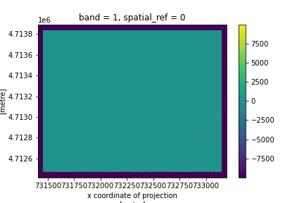
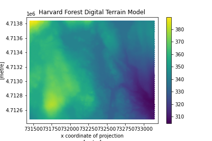
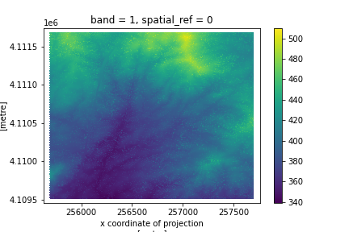
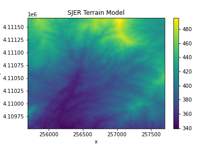

> ## Things You’ll Need To Complete This Episode
> See the [lesson homepage]({{ site.baseurl }}) for detailed information about the software,
> data, and other prerequisites you will need to work through the examples in this episode.
{: .prereq}

Sometimes we encounter raster datasets that do not "line up" when plotted or
analyzed. Rasters that don't line up are most often in different Coordinate
Reference Systems (CRS), otherwise known as "projections". This episode explains how to line up rasters in different, known CRSs.

## Raster Projection in Python

If you loaded two rasters with different projections in QGIS or ArcGIS, you'd see that they would align since these software reproject "on-the-fly". But with R or Python, you'll need to reproject your data yourself in order to plot or use these rasters together in calculations.

For this episode, we will be working with the Harvard Forest Digital Terrain
Model (DTM). This differs from the surface model data we've been working with so
far in that the digital terrain model (DTM) includes the tops of trees, while
the digital surface model (DSM) shows the ground level beneath the tree canopy. 

Our goal is to get these data into the same projection with the `rioxarray.reproject()` function so that
we can use both rasters to calculate tree canopy height, also called a Canopy Height Model (CHM).

First, we need to read in the DSM and DTM rasters.

Reading in the data with xarray looks similar to using `rasterio` directly, but the output is a xarray object called a `DataArray`. You can use a `xarray.DataArray` in calculations just like a numpy array. Calling the variable name of the `DataArray` also prints out all of its metadata information. Geospatial information is not read in if you don't import rioxarray before calling the `open_rasterio` function.

~~~
import rioxarray

surface_HARV = rioxarray.open_rasterio("data/NEON-DS-Airborne-Remote-Sensing/HARV/DSM/HARV_dsmCrop.tif")
terrain_HARV = rioxarray.open_rasterio("data/NEON-DS-Airborne-Remote-Sensing/HARV/DTM/HARV_dtmCrop_WGS84.tif")

surface_HARV
~~~
{: .language-python}

~~~
xarray.DataArray band: 1, y: 1367, x: 1697
[2319799 values with dtype=float64]
Coordinates:
band       (band)   int64    1
 y          (y)    float64   4.714e+06 4.714e+06 ... 4.712e+06
 x          (x)    float64   7.315e+05 7.315e+05 ... 7.331e+05
spatial_ref ()      int64    0
Attributes:
STATISTICS_MAXIMUM: 416.06997680664
STATISTICS_MEAN: 359.85311802914
STATISTICS_MINIMUM: 305.07000732422
STATISTICS_STDDEV: 17.83169335933
_FillValue: -9999.0
scale_factor: 1.0
add_offset: 0.0
grid_mapping: spatial_ref
~~~
{: .output}

To read the spatial reference in the output you may have to click on the icon “Show/Hide attributes” on the right side of the row of spatial_ref. After showing all attributes for spatial_ref we can see the datum and projection are WGS 84 / UTM zone 18N respectively. UTM zone 18N is a regional projection with associated coordinate system to more accurately capture distance, shape and/or area around the Harvard Forest.

Now let’s print out the metadata information for Harvard Forest’s DTM to compare the two CRSs.

~~~
terrain_HARV
~~~
{: .language-python}

~~~
xarray.DataArray band: 1, y: 1172, x: 1939
[2272508 values with dtype=float64]
Coordinates:
band       (band)       int64       1
 y          (y)        float64      42.54 42.54 42.54 ... 42.53 42.53
 x          (x)        float64      -72.18 -72.18 ... -72.16 -72.16
spatial_ref ()          int64       0
Attributes:
_FillValue: -9999.0
scale_factor: 1.0
add_offset: 0.0
grid_mapping: spatial_ref
~~~
{: .output}

We see the DTM is in an unprojected geographic coordinate system, using WGS84 as the datum and a coordinate system that spans the entire planet (i.e. latitude and longitude). This means that every location on the planet is defined using the SAME coordinate system and the same units. Geographic coordinate reference systems are best for global analysis but not for capturing distance, shape and/or area on a local scale.

We can use the CRS attribute from one of our datasets to reproject the other dataset so that they are both in the same projection. The only argument that is required is the `dst_crs` argument (standing for destination coordinate reference system), which takes the CRS of the result of the reprojection.

~~~
terrain_HARV_UTM18 = terrain_HARV.rio.reproject(dst_crs=surface_HARV.rio.crs)

terrain_HARV_UTM18 
~~~
{: .language-python}

~~~
xarray.DataArray band: 1, y: 1492, x: 1801
array([[[-9999., -9999., -9999., ..., -9999., -9999., -9999.],
        [-9999., -9999., -9999., ..., -9999., -9999., -9999.],
        [-9999., -9999., -9999., ..., -9999., -9999., -9999.],
        ...,
        [-9999., -9999., -9999., ..., -9999., -9999., -9999.],
        [-9999., -9999., -9999., ..., -9999., -9999., -9999.],
        [-9999., -9999., -9999., ..., -9999., -9999., -9999.]]])
Coordinates:
x            (x)       float64       7.314e+05 7.314e+05 ... 7.332e+05
y            (y)       float64       4.714e+06 4.714e+06 ... 4.712e+06
band       (band)       int64        1
spatial_ref  ()         int64        0
Attributes:
scale_factor: 1.0
add_offset: 0.0
grid_mapping: spatial_ref
_FillValue: -9999.0
~~~
{: .output}

> ## Data Tip
> You might wonder why the result of `terrain_HARV.rio.reproject()` shows `-9999` at the edges whereas when we read in the data, 
`surface_HARV` did not show the `-9999` values. This is because xarray by default will wait until the last necessary moment before actually running the computations on an xarray DataArray. This form of evaluation is called lazy, as opposed to eager, where functions are always computed when they are called. If you ever want a lazy DataArray to reveal it's underlying values, you can use the `.compute()` function. `rioxarray` will only show the values in the corners of the array.
> > ## Show code
> > 
> > ```python
> > surface_HARV.compute()
> > ```
> > ```
> >    <xarray.DataArray (band: 1, y: 1367, x: 1697)>
> >    array([[[408.76998901, 408.22998047, 406.52999878, ..., 345.05999756,
> >      345.13998413, 344.97000122],
> >    [407.04998779, 406.61999512, 404.97998047, ..., 345.20999146,
> >      344.97000122, 345.13998413],
> >    [407.05999756, 406.02999878, 403.54998779, ..., 345.07000732,
> >      345.08999634, 345.17999268],
> >    ...,
> >    [367.91000366, 370.19000244, 370.58999634, ..., 311.38998413,
> >      310.44998169, 309.38998413],
> >    [370.75997925, 371.50997925, 363.41000366, ..., 314.70999146,
> >      309.25      , 312.01998901],
> >    [369.95999146, 372.6000061 , 372.42999268, ..., 316.38998413,
> >      309.86999512, 311.20999146]]])
> >    Coordinates:
> >    * band     (band) int64 1
> >    * y        (y) float64 4.714e+06 4.714e+06 4.714e+06 ... 4.712e+06 4.712e+06
> >    * x        (x) float64 7.315e+05 7.315e+05 7.315e+05 ... 7.331e+05 7.331e+05
> >    Attributes:
> >        transform:      (1.0, 0.0, 731453.0, 0.0, -1.0, 4713838.0)
> >        crs:            +init=epsg:32618
> >        res:            (1.0, 1.0)
> >        is_tiled:       0
> >        nodatavals:     (-3.4e+38,)
> >        scales:         (1.0,)
> >        offsets:        (0.0,)
> >        AREA_OR_POINT:  Area
> > ```
> > {: .output}
> {: .solution}
{: .callout}

And we can also save our DataArray that we created with `rioxarray` to a file.

```python
reprojected_path = "data/NEON-DS-Airborne-Remote-Sensing/HARV/DTM/HARV_dtmCrop_UTM18.tif"
terrain_HARV_UTM18.rio.to_raster(reprojected_path)
```

> ## Exercise
> Inspect the metadata for `terrain_HARV_UTM18 ` and 
> `surface_HARV`. Are the projections the same? What 
> metadata attributes are different? How might this affect 
> calculations we make between arrays?
> > ## Solution
> >
> > ```python
> > # view crs for DTM
> > print(terrain_HARV_UTM18.rio.crs)
> >
> > # view crs for DSM
> > print(surface_HARV.rio.crs)
> > ```
> > ```
> > EPSG:32618
> > EPSG:32618
> > ```
> > {: .output}
> > Good, the CRSs are the same. But ...
> > 
> > ```python
> > # view noddata value for DTM
> > print(terrain_HARV_UTM18.rio.nodata)
> >
> > # view nodata value for DSM
> > print(surface_HARV.rio.nodata)
> > ```
> > ```
> > -9999.0
> > -3.4e+38
> > ```
> > {: .output}
> > The nodata values are different. Before we plot or calculate 
> > both of these DataArrays together, we should make sure they 
> > have the same nodata value. Furthermore ...
> > 
> > ```python
> > # view shape for DTM
> > print(terrain_HARV_UTM18.shape)
> >
> > # view shape for DSM
> > print(surface_HARV.shape)
> > ```
> > ```
> > (1, 1492, 1801)
> > (1, 1367, 1697)
> > ```
> > {: .output}
> > The shapes are not the same which means these data cover 
> > slightly different extents and locations. In the next episode 
> > we will need to align these DataArrays before running any 
> > calculations. `rioxarray` provides functionality to align 
> > multiple geospatial DataArrays.
> {: .solution}
{: .challenge}

Let's plot our handiwork so far! We can use the `xarray.DataArray.plot` function to show the DTM. But if we run the following code, something doesn't look right ...

```python
import matplotlib.pyplot as plt
plt.figure()
terrain_HARV_UTM18.plot(cmap="viridis")
plt.title("Harvard Forest Digital Terrain Model")
```


> ## Challenge
> Whoops! What did we forget to do to the DTM DataArray before plotting?
>
> > ## Answers
> > Our array has a `nodata` value, `-9999.0`, which causes the color
> > of our plot to be stretched over too wide a range. We'd like to
> > only display valid values, so before plotting we can filter out
> > the nodata values using the `where()` function and the 
> > `.rio.nodata` attribute of our DataArray.
> > ```python
terrain_HARV_UTM18_valid = terrain_HARV_UTM18.where(
    terrain_HARV_UTM18  != terrain_HARV_UTM18.rio.nodata)
plt.figure()
terrain_HARV_UTM18_valid.plot(cmap="viridis")
plt.title("Harvard Forest Digital Terrain Model")
> > ```
> > 
> > If we had saved `terrain_HARV_UTM18` to a file and then read it in with `open_rasterio`'s `masked=True` argument, the raster's `nodata` value would be masked and we would not need to use the `where()` function to do the masking before plotting.
> {: .solution}
{: .challenge}


> ## Challenge: Reproject, then Plot a Digital Terrain Model
> Create 2 maps in a UTM projection of the [San Joaquin Experimental Range](https://www.neonscience.org/field-sites/field-sites-map/SJER) field site, using the`SJER_dtmCrop.tif` and `SJER_dsmCrop_WGS84.tif` files. Use `rioxarray` and `matplotlib.pyplot` (to add a title). Reproject the data as necessary to make sure each map is in the same UTM projection and save the reprojected file with the file name "data/NEON-DS-Airborne-Remote-Sensing/SJER/DSM/SJER_dsmCrop_WGS84.tif".
>
> > ## Answers
> > If we read in these files with the argument `masked=True`, then the nodata values will be masked automatically and set to `numpy.nan`, or Not a Number. This can make plotting easier since only valid raster values will be shown. However, it's important to remember that `numpy.nan` values still take up space in our raster just like `nodata` values, and thus they still affect the shape of the raster. Rasters need to be the same shape for raster math to work in Python. In the next lesson, we will examine how to prepare rasters of different shapes for calculations.
> > ```python
terrain_HARV_SJER = rioxarray.open_rasterio("data/NEON-DS-Airborne-Remote-Sensing/SJER/DTM/SJER_dtmCrop.tif", masked=True)
surface_HARV_SJER = rioxarray.open_rasterio("data/NEON-DS-Airborne-Remote-Sensing/SJER/DSM/SJER_dsmCrop_WGS84.tif", masked=True)
reprojected_surface_model = surface_HARV_SJER.rio.reproject(dst_crs=terrain_HARV_SJER.rio.crs)
plt.figure()
reprojected_surface_model.plot()
plt.title("SJER Reprojected Surface Model")
reprojected_surface_model.rio.to_raster("data/NEON-DS-Airborne-Remote-Sensing/SJER/DSM/SJER_dsmCrop_WGS84.tif")
plt.figure()
terrain_HARV_SJER.plot()
plt.title("SJER Terrain Model")
> > ```
> > 
> > 
> {: .solution}
{: .challenge}



