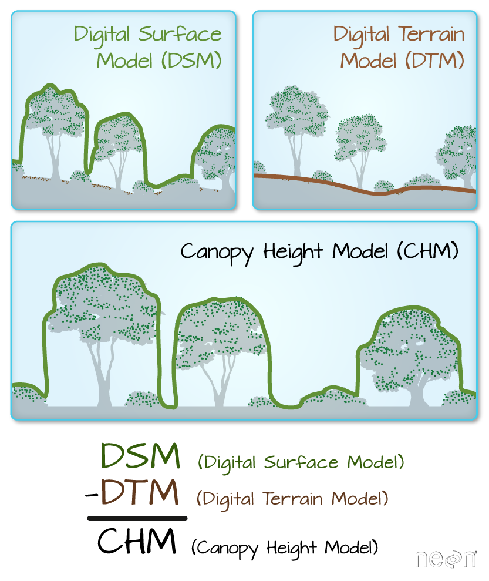
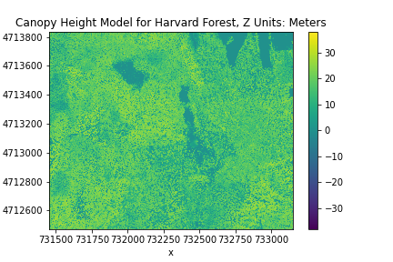
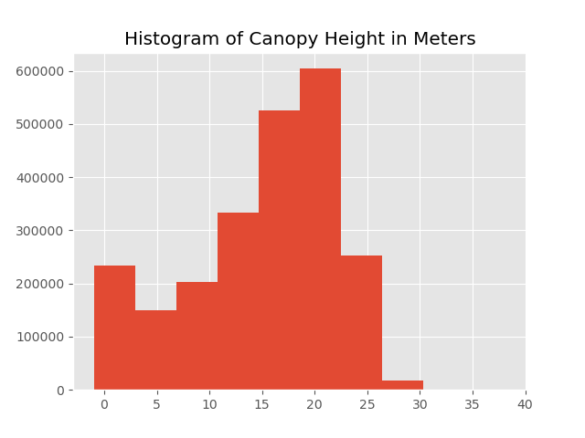
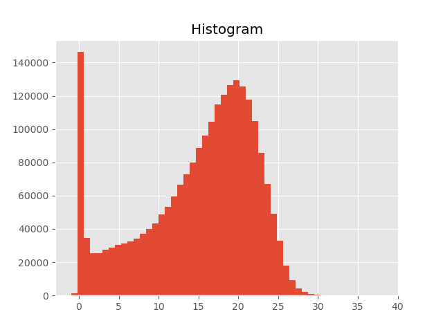
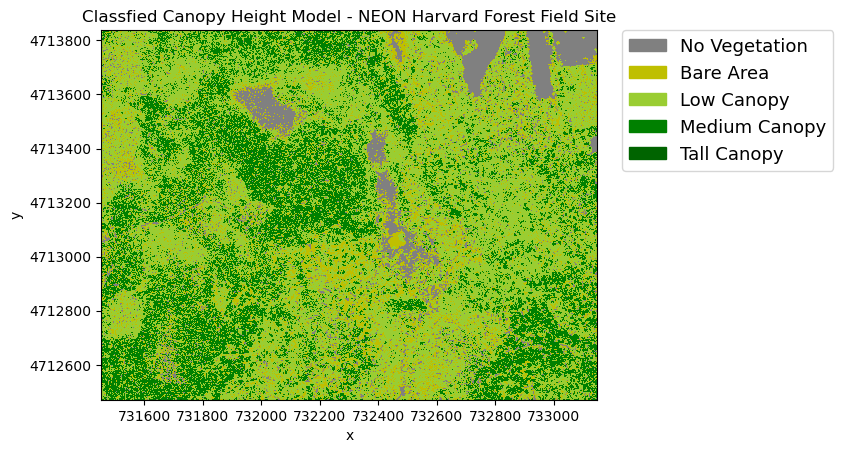

> ## Things You’ll Need To Complete This Episode
> See the [lesson homepage]({{ site.baseurl }}) for detailed information about the software,
> data, and other prerequisites you will need to work through the examples in this episode.
{: .prereq}

We often want to combine values of and perform calculations on rasters to create
a new output raster. This episode covers how to subtract one raster from
another using basic raster math. It also covers how to extract pixel values from a 
set of locations - for example a buffer region around locations at a field site.

## Raster Calculations in Python & Canopy Height Models
We often want to perform calculations on two or more rasters to create a new
output raster. For example, if we are interested in mapping the heights of trees
across an entire field site, we might want to calculate the difference between
the Digital Surface Model (DSM, tops of trees) and the
Digital Terrain Model (DTM, ground level). The resulting dataset is referred to
as a Canopy Height Model (CHM) and represents the actual height of trees,
buildings, etc. with the influence of ground elevation removed.

 

> ## More Resources
> * Check out more on LiDAR CHM, DTM and DSM in this NEON Data Skills overview tutorial:
> [What is a CHM, DSM and DTM? About Gridded, Raster LiDAR Data](https://www.neonscience.org/chm-dsm-dtm-gridded-lidar-data).
{: .callout}

### Load the Data
For this episode, we will use the DTM and DSM from the
NEON Harvard Forest Field site and San Joaquin Experimental
Range, which we already have loaded from previous episodes. 
Let's load them again with `open_rasterio` using the argument `masked=True`.

```python
import rioxarray

surface_HARV = rioxarray.open_rasterio("data/NEON-DS-Airborne-Remote-Sensing/HARV/DSM/HARV_dsmCrop.tif", masked=True)
terrain_HARV_UTM18 = rioxarray.open_rasterio("data/NEON-DS-Airborne-Remote-Sensing/HARV/DTM/HARV_dtmCrop_UTM18.tif", masked=True)
```

## Raster Math
We can perform raster calculations by subtracting (or adding,
multiplying, etc) two rasters. In the geospatial world, we call this
"raster math", and typically it refers to operations on rasters that 
have the same width and height (including `nodata` pixels). We saw from 
the last episode's challenge that this is not the case with out DTM and DSM. Even though the `reproject` function gets our rasters into the same CRS, they have slighlty different extents.
We can now use the `reproject_match` function, which both reprojects and clips
a raster to the CRS and extent of another raster.

```python
terrain_HARV_matched = terrain_HARV_UTM18.rio.reproject_match(surface_HARV)
```

In fact, we could have used reproject_match on the original DTM model, "HARV_dtmCrop_WGS84.tif". If we had, this would mean one less time our DTM 
was interpolated with reprojection, though this has a negligible impact on 
the data for our purposes.

Let's subtract the DTM from the DSM to create a Canopy Height Model. 
We'll use `rioxarray` so that we can easily plot our result and keep 
track of the metadata for our CHM.

```python
canopy_HARV = surface_HARV - terrain_HARV_matched
canopy_HARV.compute()
```

We can now plot the output CHM. If we use the argument `robust=True`, our plot's color values
are stretched between the 2nd and 98th percentiles of the data, which results in clearer distinctions between forested and non-forested areas.

```python
import matplotlib.pyplot as plt # in case it has not been imported recently
canopy_HARV.plot(cmap="viridis")
plt.title("Canopy Height Model for Harvard Forest, Z Units: Meters")
plt.ticklabel_format(style="plain") # use this if the title overlaps the scientific notation of the y axis
```



Notice that the range of values for the output CHM is between 0 and 30 
meters. Does this make sense for trees in Harvard Forest?

Maps are great but it can also be informative to plot histograms of values to better understand the distribution. We can accomplish this using a built-in xarray method we have been already been using, `plot`

```python
plt.figure()
plt.style.use('ggplot') # adds a style to improve the aesthetics
canopy_HARV.plot.hist()
plt.title("Histogram of Canopy Height in Meters")
```
 

> ## Challenge: Explore CHM Raster Values
> 
> It's often a good idea to explore the range of values in a raster dataset just like we might explore a dataset that we collected in the field. The histogram we just made is a good start but there's more we can do to improve our understanding of the data.
> 
> 1. What is the min and maximum value for the Harvard Forest Canopy Height Model (`canopy_HARV`) that we just created?
> 2. Plot a histogram with 100 bins instead of 8. What do you notice that wasn't clear before?
> 3. Plot the `canopy_HARV` raster using breaks that make sense for the data. Include an appropriate color palette for the data, plot title and no axes ticks / labels.
> 
> > ## Answers
> > 
> > 1) Recall, if there were nodata values in our raster like `-9999.0`, 
> > we would need to filter them out with `.where()`.
> > ```python
> > canopy_HARV.min().values
> > canopy_HARV.max().values
> > ```
> > ```
> > array(-1.)
> > array(38.16998291)
> > ```
> > 2) Increasing the number of bins gives us a much clearer view of the distribution.
> > ```python
canopy_HARV.plot.hist(bins=50)
> > ```
> >  
> {: .solution}
{: .challenge}

## Classifying Continuous Rasters in Python

Now that we have a sense of the distribution of our canopy height raster, we 
can reduce the complexity of our map by classifying it. Classification involves sorting raster values into unique classes, and in python, we can accomplish this using the `numpy.digitize` function. 

```python
import numpy as np

# Defines the bins for pixel values
class_bins = [canopy_HARV.min().values, 2, 10, 20, np.inf]

# Classifies the original canopy height model array
canopy_height_classes = np.digitize(canopy_HARV, class_bins)
type(canopy_height_classes)
```
```
<class 'numpy.ndarray'>
```

The result is a `numpy.ndarray`, but we can put this into a DataArray along with the spatial metadata from our `canopy_HARV`, so that our resulting plot shows the spatial coordinates.

```python
import xarray
from matplotlib.colors import ListedColormap
import earthpy.plot as ep

# Define color map of the map legend
height_colors = ["gray", "y", "yellowgreen", "g", "darkgreen"]
height_cmap = ListedColormap(height_colors)

# Define class names for the legend
category_names = [
    "No Vegetation",
    "Bare Area",
    "Low Canopy",
    "Medium Canopy",
    "Tall Canopy",
]

# we need to know in what order the legend items should be arranged
category_indices = list(range(len(category_names)))

# we put the numpy array in and xarray DataArray so that the plot is made with coordinates
canopy_height_classified = xarray.DataArray(canopy_height_classes, coords = canopy_HARV.coords)

#Making the plot
plt.style.use("default")
plt.figure()
im = canopy_height_classified.plot(cmap=height_cmap, add_colorbar=False)
ep.draw_legend(im_ax=im, classes = category_indices, titles=category_names) # earthpy helps us by drawing a legend given an existing image plot and legend items, plus indices
plt.title("Classfied Canopy Height Model - NEON Harvard Forest Field Site")
plt.ticklabel_format(style="plain")
```
 

## Reassigning Geospatial Metadata and Exporting a GeoTIFF
When we computed the CHM, the output no longer contains reference to a nodata value, like `-9999.0`, which was associated with the DTM and DSM. Some calculations, like `numpy.digitize` can remove all geospatial metadata. Of what can be lost, the CRS and nodata value are particularly important to keep track of. Before we export the product of our calculation to a Geotiff with the `to_raster` function, we need to reassign this metadata.

```python
canopy_HARV.rio.write_crs(surface_HARV.rio.crs, inplace=True)
canopy_HARV.rio.set_nodata(-9999.0, inplace=True)
```

When we write this raster object to a GeoTIFF file we'll name it
`CHM_HARV.tiff`. This name allows us to quickly remember both what the data
contains (CHM data) and for where (HARVard Forest). The `to_raster()` function
by default writes the output file to your working directory unless you specify a
full file path.

```python
import os
os.makedirs("./data/outputs/", exist_ok=True)
canopy_HARV.rio.to_raster("./data/outputs/CHM_HARV.tif")
```

> ## Challenge: Explore the NEON San Joaquin Experimental Range Field Site
> 
> Data are often more interesting and powerful when we compare them across various
> locations. Let's compare some data collected over Harvard Forest to data
> collected in Southern California. The
> [NEON San Joaquin Experimental Range (SJER) field site](https://www.neonscience.org/field-sites/field-sites-map/SJER)
> located in Southern California has a very different ecosystem and climate than
> the
> [NEON Harvard Forest Field Site](https://www.neonscience.org/field-sites/field-sites-map/HARV)
in Massachusetts.
> 
> Import the SJER DSM and DTM raster files and create a Canopy Height Model.
> Then compare the two sites. Be sure to name your Python objects and outputs
> carefully, as follows: objectType_SJER (e.g. `surface_SJER`). This will help you
> keep track of data from different sites!
> 
> 0. You should have the DSM and DTM data for the SJER site already
> loaded from the 
> [Reproject Raster Data with Rioxarray]({{ site.baseurl }}/06-raster-reproject/)
episode.) Don't forget to check the CRSs and units of the data. 
> 1. Create a CHM from the two raster layers and check to make sure the data
are what you expect.
> 2. Plot the CHM from SJER.
> 3. Export the SJER CHM as a GeoTIFF.
> 4. Compare the vegetation structure of the Harvard Forest and San Joaquin
> Experimental Range.
> 
> > ## Answers
> > 1) Read in the data again if you haven't already with `masked=True`.
> >
> > ```python
surface_SJER = rioxarray.open_rasterio("data/NEON-DS-Airborne-Remote-Sensing/SJER/DSM/SJER_dsmCrop.tif", masked=True)
terrain_SJER_UTM18 = rioxarray.open_rasterio("data/NEON-DS-Airborne-Remote-Sensing/SJER/DTM/SJER_dtmCrop_WGS84.tif", masked=True)
print(terrain_SJER_UTM18.shape)
print(surface_SJER.shape)
> > ```
> >
> > 2) Reproject and clip one raster to the extent of the smaller raster using `reproject_match`. Your output raster, may have nodata values at the border, these are fine and can be removed for later calculations if needed. Then,calculate the CHM.
> >
> > ```python
terrain_SJER_UTM18_matched = terrain_SJER_UTM18.rio.reproject_match(surface_SJER)
canopy_SJER = surface_SJER - terrain_SJER_UTM18_matched
> > ```
> > 
> > 3) Plot the CHM with the same color map as HARV and save the CHM to the `outputs` folder.
> >
> > ```python
plt.figure()
canopy_SJER.plot(robust=True, cmap="viridis")
plt.title("Canopy Height Model for San Joaquin Experimental Range, Z Units: Meters")
os.makedirs("fig", exist_ok=True)
canopy_SJER.rio.to_raster("./data/outputs/CHM_SJER.tif")
> > ```
> > 
> >  
> > 
> > 4) Compare the SJER and HARV CHMs. 
> > Tree heights are much shorter in SJER. You can confirm this by 
> > looking at the histograms of the two CHMs. 
> >
> > ```python
fig, ax = plt.subplots(figsize=(9,6))
canopy_HARV.plot.hist(ax = ax, bins=50, color = "green")
canopy_SJER.plot.hist(ax = ax, bins=50, color = "blue")
> > ```
> {: .solution}
{: .challenge}





