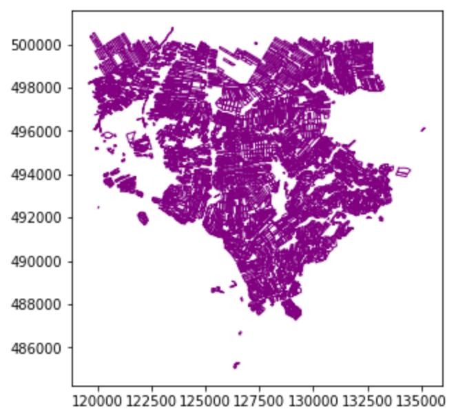

## Introduction

As discussed in [Episode 2: Introduction to Vector Data]({{site.baseurl}}/02-intro-vector-data.md/), vector data represents specific features on the Earth's surface using points, lines and polygons. These geographic elements can then have one or more attributes assigned to them, such as 'name' and 'population' for a city, or crop type for a field. Vector data can be much smaller in (file) size than raster data, while being very rich in terms of the information captured.

From this episode onwards, we will be moving from working with raster data to working with vector data. In this episode, we will use python to open and plot point, line and polygon vector data. The data we will use comes from the Dutch government's open geodata sets, obtained from the [PDOK platform](https://www.pdok.nl/). It provides open data for various applications, e.g. cadaster, infrastructure, agriculture, etc. In this episode we will use three data sets:

- [Crop fields](https://www.pdok.nl/introductie/-/article/basisregistratie-gewaspercelen-brp-) (polygons)
- [Water ways](https://www.pdok.nl/introductie/-/article/nationaal-wegen-bestand-nwb-) (lines):
- [Ground water monitoring wells](https://www.pdok.nl/downloads/-/article/basisregistratie-ondergrond-bro-) (points):

In later episodes, we will learn how to work with raster and vector data together and combine them into a single plot.


## Import Vector Datasets

~~~
import geopandas as gpd
~~~
{: .language-python}

First let us download and read the crop field dataset, with the following:

~~~
# Load all crop field boundaries (brpgewaspercelen)
cropfield = gpd.read_file("https://service.pdok.nl/rvo/brpgewaspercelen/atom/v1_0/downloads/brpgewaspercelen_definitief_2020.gpkg")
~~~
{: .language-python}

This may take a couple of minutes to complete, as the dataset is somewhat large. It contains all the crop field data for the entirety of the European portion of the Netherlands.


## Vector Metadata & Attributes

When we import the vector dataset to Python (as our `cropfield` object) it comes in as a `DataFrame`, specifically a `GeoDataFrame`. `read_file()` also automatically stores
geospatial information about the data. We are particularly interested in describing the format, CRS, extent, and other components of
the vector data, and the attributes which describe properties associated
with each individual vector object.

> ## Data Tip
> The [Explore and Plot by Shapefile Attributes]({{site.baseurl}}/10-vector-shapefile-attributes/)
> episode provides more information on both metadata and attributes
> and using attributes to subset and plot data.
{: .callout}

## Spatial Metadata
Key metadata includes:

1. **Object Type:** the class of the imported object.
2. **Coordinate Reference System (CRS):** the projection of the data.
3. **Extent:** the spatial extent (i.e. geographic area that the data covers). Note that the spatial extent for a vector dataset represents the combined
extent for all spatial objects in the dataset.

Each `GeoDataFrame` has a `"geometry"` column that contains geometries. In the case of our `cropfield`  object, this geometry is represented by a `shapely.geometry.Polygon` object. `geopandas` uses the `shapely` library to represent polygons, lines, and points, so the types are inherited from `shapely`.

We can view the metadata using the `.crs`, `.bounds` and `.type` attributes. First, let's view the
geometry type for our crop field dataset. To view the geometry type, we use the `pandas` method `.type` on the `GeoDataFrame` object, `cropfield`.

~~~
cropfield.type
~~~
{: .language-python}
~~~
0         Polygon
1         Polygon
2         Polygon
3         Polygon
4         Polygon
           ...   
773134    Polygon
773135    Polygon
773136    Polygon
773137    Polygon
773138    Polygon
Length: 773139, dtype: object
~~~
{: .output}

To view the CRS metadata:


~~~
cropfield.crs
~~~
{: .language-python}

~~~
<Derived Projected CRS: EPSG:28992>
Name: Amersfoort / RD New
Axis Info [cartesian]:
- X[east]: Easting (metre)
- Y[north]: Northing (metre)
Area of Use:
- name: Netherlands - onshore, including Waddenzee, Dutch Wadden Islands and 12-mile offshore coastal zone.
- bounds: (3.2, 50.75, 7.22, 53.7)
Coordinate Operation:
- name: RD New
- method: Oblique Stereographic
Datum: Amersfoort
- Ellipsoid: Bessel 1841
- Prime Meridian: Greenwich
~~~
{: .output}

Our data is in the CRS **RD New**. The CRS is critical to 
interpreting the object's extent values as it specifies units. To find
the extent of our dataset in the projected coordinates, we can use the `.total_bounds` attribute: 

~~~
cropfield.total_bounds
~~~
{: .language-python}

~~~
array([ 13653.6128, 306851.867 , 277555.288 , 612620.9868])
~~~
{: .output}

This array contains, in order, the values for minx, miny, maxx and maxy, for the overall dataset. The spatial extent of a GeoDataFrame represents the geographic "edge" or location that is the furthest north, south, east, and west. Thus, it is represents the overall geographic coverage of the spatial object. Image Source: National Ecological Observatory Network (NEON).


We can convert these coordinates to a bounding box or acquire the index of the dataframe to access the geometry. Either of these polygons can be used to clip rasters (more on that later). 

## Selecting spatial features
Our `cropfield` dataset is rather large, containing data for the entirety of the European portion of the Netherlands. Before plotting it we will first select a specific section to be our area of interest.

We can create a cropped version of our dataset as follows:

~~~
# Define a Boundingbox in RD
xmin, xmax = (120000, 135000)
ymin, ymax = (485000, 500000)
cropfield_crop = cropfield.cx[xmin:xmax, ymin:ymax]
~~~
{: .language-python}


This will cut out a smaller area, defined by a box in units of the projection, discarding the rest of the data. The resultant GeoDataframe, which includes all the features intersecting the box, is found in the `cropfield_crop` object. Note that the edge elements are not 'cropped' themselves. We can check the total bounds of this new data as before:

~~~
cropfield_crop.total_bounds
~~~
{: .language-python}

~~~
array([119594.384 , 485036.2543, 135169.9266, 500782.531 ])
~~~
{: .output}

We can then save this cropped dataset for use in future, using the `to_file()` method of our GeoDataFrame object:

~~~
cropfield_crop.to_file('data/cropped_field.shp')
~~~
{: .language-python}

This will write it to disk (in this case, in 'shapefile' format), containing only the data from our cropped area. It can be read in again at a later time using the `read_file()` method we have been using above. Note that this actually writes multiple files to disk (`cropped_field.cpg`, `cropped_field.dbf`, `cropped_field.prj`, `cropped_field.shp`, `cropped_field.shx`). All these files should ideally be present in order to re-read the dataset later, although only the `.shp`, `.shx`, and `.dbf` files are mandatory (see the [Introduction to Vector Data]({{site.baseurl}}/02-intro-to-vector-data) lesson for more information.

## Plotting a vector dataset

We can now plot this data. Any `GeoDataFrame` can be plotted in CRS units to view the shape of the object with `.plot()`.

~~~
cropfield_crop.plot()
~~~
{: .language-python}

We can customize our boundary plot by setting the 
`figsize`, `edgecolor`, and `color`. Making some polygons transparent will come in handy when we need to add multiple spatial datasets to a single plot.

~~~
cropfield_crop.plot(figsize=(5,5), edgecolor="purple", facecolor="None")
~~~
{: .language-python}


{: .output}


Under the hood, `geopandas` is using `matplotlib` to generate this plot. In the next episode we will see how we can add `DataArrays` and other vector datasets to this plot to start building an informative map of our area of interest.

## Spatial Data Attributes
We introduced the idea of spatial data attributes in [an earlier lesson]({{site.baseurl}}/02-intro-to-vector-data). Now we will explore
how to use spatial data attributes stored in our data to plot
different features.


> ## Challenge: Import Line and Point Vector Datasets
> 
> Using the steps above, import the waterways and groundwater well layers into
> Python using `geopandas`.
> The waterways data can be fetched from the URL: <https://geo.rijkswaterstaat.nl/services/ogc/gdr/vaarweginformatie/ows?service=WFS&version=2.0.0&request=GetFeature&typeName=status_vaarweg&outputFormat=SHAPE-ZIP>
> The groundwater motioring wells can be fetched from the URL: <https://service.pdok.nl/bzk/brogmwvolledigeset/atom/v2_1/downloads/brogmwvolledigeset.zip>
> Name your variables `waterways_nl` and `wells_nl` respectively.
> 
> Answer the following questions:
> 
> 1. What type of Python spatial object is created when you import each layer? 
> 
> 2. What is the CRS and extent (bounds) for each object?
> 
> 3. Do the files contain points, lines, or polygons?
> 
> 4. How many spatial objects are in each file?
> 
> > ## Answers
> > 
> > First we import the data: 
> > ```python
> > waterways_nl = gpd.read_file("https://geo.rijkswaterstaat.nl/services/ogc/gdr/vaarweginformatie/ows?service=WFS&version=2.0.0&request=GetFeature&typeName=status_vaarweg&outputFormat=SHAPE-ZIP")
> > wells_nl = gpd.read_file("https://service.pdok.nl/bzk/brogmwvolledigeset/atom/v2_1/downloads/brogmwvolledigeset.zip")
> > ```
> > 
> > Then we check the types: 
> > ```python
> > waterways_nl.type
> > ```
> >
> > ```python
> > wells_nl.type
> > ```
> > We also check the CRS and extent of each object: 
> > ```python
> > print(waterways_nl.crs)
> > print(waterways_nl.total_bounds)
> > print(wells_nl.crs)
> > print(wells_nl.total_bounds)
> > ```
> > To see the number of objects in each file, we can look at the output from when we print the results in a Jupyter notebook of call `len()` on a `GeoDataFrame`. 
> > `waterways_nl` contains 91 features (all lines) and `wells_nl` contains 51664 points.
> {: .solution}
{: .challenge}

> ## Challenge: Investigate the waterway lines
> Now we will take a deeper look in the Dutch waterway lines: `waterways_nl`. Let's visualize it with the `plot` function. Can you tell what is wrong with this vector file?
> > ## Answers
> > By plotting out the vector file, we can tell that the latitude and longitude of the file are flipped.
> > ~~~
> > waterways_nl.plot()
> > ~~~
> > {: .language-python}
> > 
> {: .solution}
{: .challenge}
> ## Axis ordering 
> According to the standards, the axis ordering for a CRS should follow the definition provided by the competent authority. For the commonly used EPSG:4326 geographic coordinate system, the EPSG defines the ordering as first latitude then longitude.    
> However, in the GIS world, it is custom to work with coordinate tuples where the first component is aligned with the east/west direction and the second component is aligned with the north/south direction.
> Multiple software packages thus implement this convention also when dealing with EPSG:4326. 
> As a result, one can encounter vector files that implement either convention - keep this in mind and always check your datasets!   
{: .callout}
## Modify the geometry of a GeoDataFrame

Sometimes we need to modify the `geometry` of a `GeoDataFrame`. For example, as we have seen in the previous exercise **Investigate the waterway lines**, the latitude and longitude are flipped in the vector data `waterways_nl`. This error needs to be fixed before performing further analysis.

Let's first take a look on what makes up the `geometry` column of `waterways_nl`:

~~~
waterways_nl['geometry']
~~~
{: .language-python}
~~~
0     LINESTRING (52.41810 4.84060, 52.42070 4.84090...
1     LINESTRING (52.11910 4.67450, 52.11930 4.67340...
2     LINESTRING (52.10090 4.25730, 52.10390 4.25530...
3     LINESTRING (53.47250 6.84550, 53.47740 6.83840...
4     LINESTRING (52.32270 5.14300, 52.32100 5.14640...
                            ...                        
86    LINESTRING (51.49270 5.39100, 51.48050 5.39160...
87    LINESTRING (52.15900 5.38510, 52.16010 5.38340...
88    LINESTRING (51.97340 4.12420, 51.97110 4.12220...
89    LINESTRING (52.11910 4.67450, 52.11850 4.67430...
90    LINESTRING (51.88940 4.61900, 51.89040 4.61350...
Name: geometry, Length: 91, dtype: geometry
~~~
{: .output}

Each row is a `LINESTRING` object. We can further zoom into one of the rows, for example, the third row:

~~~
print(waterways_nl['geometry'][2])
print(type(waterways_nl['geometry'][2]))
~~~
{: .language-python}
~~~
LINESTRING (52.100900002 4.25730000099998, 52.1039 4.25529999999998, 52.111299999 4.24929999900002, 52.1274 4.23449999799999)
<class 'shapely.geometry.linestring.LineString'>
~~~
{: .output}

As we can see in the output, the `LINESTRING` object contains a list of coordinates of the vertices. In our situation, we would like to find a way to flip the x and y of every coordinates set. A good way to look for the solution is to use the [documentation](https://shapely.readthedocs.io/en/stable/manual.html) of the `shapely` package, since we are seeking to modify the `LINESTRING` object. Here we are going to use the [`shapely.ops.transform`](https://shapely.readthedocs.io/en/stable/manual.html?highlight=shapely.ops.transform#shapely.ops.transform) function, which applies a self-defined function to all coordinates of a geometry.

~~~
import shapely

# Define a function flipping the x and y coordinate values
def flip(x, y):
    return y, x

# Apply this function to all coordinates and all lines
geom_corrected = [shapely.ops.transform(flip, line) for line in waterways.geometry[:]]
~~~
{: .language-python}

Then we can upate the `geometry` column with the corrected geometry `geom_corrected`, and visualize it to check:
~~~
# Update geometry
waterways_nl.geometry = geom_corrected

# Visualization
waterways_nl.plot()
~~~
{: .language-python}


Now the waterways looks good! We can save it for later usage:
~~~
# Update geometry
waterways_nl.to_file('waterways_nl_corrected.shp')
~~~
{: .language-python}
