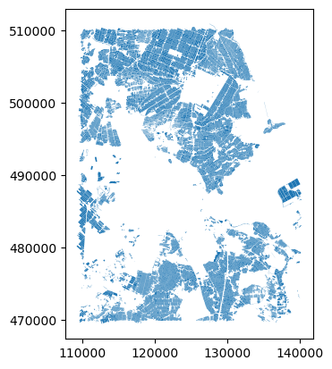

## Introduction

As discussed in [Episode 2: Introduction to Vector Data]({{site.baseurl}}/02-intro-vector-data.md/), vector data represents specific features on the Earth's surface using points, lines and polygons. These geographic elements can then have one or more attributes assigned to them, such as 'name' and 'population' for a city, or crop type for a field. Vector data can be much smaller in (file) size than raster data, while being very rich in terms of the information captured.

In this episode, we will be moving from working with raster data to working with vector data. We will use Python to open
and plot point, line and polygon vector data. In particular, we will make use of the [`geopandas`](https://geopandas.org/en/stable/)
package to open, manipulate and write vector datasets. `geopandas` extends the popular `pandas` library for data
analysis to geospatial applications. The main `pandas` objects (the `Series` and the `DataFrame`) are expanded by
including geometric types, represented in Python using the `shapely` library, and by providing dedicated methods for
spatial operations (union, intersection, etc.).

In later episodes, we will learn how to work with raster and vector data together and combine them into a single plot.

> ## Introduce the Vector Data
>
> In this episode, we will use the downloaded vector data in the `data` directory. Please refer to the [setup page](../setup.md) on how to download the data.
{: .callout}

## Import Vector Datasets

~~~
import geopandas as gpd
~~~
{: .language-python}

We will use the `geopandas` module to load the crop field vector data we downloaded at: `data/brpgewaspercelen_definitief_2020_small.gpkg`. 

~~~
fields = gpd.read_file("data/brpgewaspercelen_definitief_2020_small.gpkg", bbox=bbox)
fields
~~~
{: .language-python}

This file contains a relatively large number of crop field parcels. Directly loading the a large file to memory can be slow. If the Area of Interest (AoI) is small, we cam define a bounding box of the AoI, and  only read the data within the extent of the bounding box.
~~~
# Define bounding box
xmin, xmax = (110_000, 140_000)
ymin, ymax = (470_000, 510_000)
bbox = (xmin, ymin, xmax, ymax)
~~~
{: .language-python}

Using the `bbox` input argument, we can load only the spatial features intersecting the provided bounding box.

~~~
# Partially load data within the bounding box
fields = gpd.read_file("data/brpgewaspercelen_definitief_2020_small.gpkg", bbox=bbox)
~~~
{: .language-python}

> ## How should I define my bounding box?
> For simplicity, here we assume the **Coordinate Reference System (CRS)** and **extent** of the vector file are known (for instance they are provided in the dataset documentation). 
> 
> You can also define your bouding box with online coordinates visualization tools. For example, in our case, we can use the [RD-viewer](https://openstate.github.io/rdnewviewer/).
> 
> Some Python tools, e.g. [`fiona`](https://fiona.readthedocs.io/en/latest/)(which is also the backend of `geopandas`), provides the file inspection functionality without actually the need to read the full data set into memory. An example can be found in [the documentation of fiona](https://fiona.readthedocs.io/en/latest/manual.html#format-drivers-crs-bounds-and-schema).
{: .callout}

And we can plot the overview by:
~~~
fields.plot()
~~~
{: .language-python}

{: .output}
## Vector Metadata & Attributes
When we import the vector dataset to Python (as our `fields` object) it comes in as a`GeoDataFrame`. The `read_file()` function also automatically stores geospatial information about the data. We are particularly interested in describing the format, CRS, extent, and other components of the vector data, and the attributes which describe properties associated
with each individual vector object. 

For example, we will explore

1. **Object Type:** the class of the imported object.
2. **Coordinate Reference System (CRS):** the projection of the data.
3. **Extent:** the spatial extent (i.e. geographic area that the data covers). Note that the spatial extent for a vector dataset represents the combined extent for all spatial objects in the dataset.

Each `GeoDataFrame` has a `"geometry"` column that contains geometries. In the case of our `fields` object, this geometry is represented by a `shapely.geometry.Polygon` object. `geopandas` uses the `shapely` library to represent polygons, lines, and points, so the types are inherited from `shapely`.

We can view the metadata using the `.crs`, `.bounds` and `.type` attributes. First, let's view the
geometry type for our crop field dataset. To view the geometry type, we use the `pandas` method `.type` on the `GeoDataFrame` object, `fields`.

~~~
fields.type
~~~
{: .language-python}
~~~
0        Polygon
1        Polygon
2        Polygon
3        Polygon
4        Polygon
          ...
22026    Polygon
22027    Polygon
22028    Polygon
22029    Polygon
22030    Polygon
Length: 22031, dtype: object
~~~
{: .output}

To view the CRS metadata:

~~~
fields.crs
~~~
{: .language-python}

~~~
<Derived Projected CRS: EPSG:28992>
Name: Amersfoort / RD New
Axis Info [cartesian]:
- X[east]: Easting (metre)
- Y[north]: Northing (metre)
Area of Use:
- name: Netherlands - onshore, including Waddenzee, Dutch Wadden Islands and 12-mile offshore coastal zone.
- bounds: (3.2, 50.75, 7.22, 53.7)
Coordinate Operation:
- name: RD New
- method: Oblique Stereographic
Datum: Amersfoort
- Ellipsoid: Bessel 1841
- Prime Meridian: Greenwich
~~~
{: .output}

Our data is in the CRS **RD New**. The CRS is critical to
interpreting the object's extent values as it specifies units. To find
the extent of our dataset in the projected coordinates, we can use the `.total_bounds` attribute:

~~~
fields.total_bounds
~~~
{: .language-python}

~~~
array([109222.03325 , 469461.512625, 140295.122125, 510939.997875])
~~~
{: .output}

This array contains, in order, the values for minx, miny, maxx and maxy, for the overall dataset. The spatial extent of a GeoDataFrame represents the geographic "edge" or location that is the furthest north, south, east, and west. Thus, it is represents the overall geographic coverage of the spatial object. 

We can convert these coordinates to a bounding box or acquire the index of the dataframe to access the geometry. Either of these polygons can be used to clip rasters (more on that later).

> ## Challenge: Further crop the dataset
> Sometimes, the loaded data can still be too large. We can cut it is to a even smaller extent. There are two potential ways to do this:
> 
> - [`cx`](https://geopandas.org/en/stable/docs/reference/api/geopandas.GeoDataFrame.cx.html) indexer
> - [`clip_by_rect`](https://geopandas.org/en/stable/docs/reference/api/geopandas.GeoSeries.clip_by_rect.html) function
> 
> In this exercise, please:
> 
> 1. Read the documentation of both function
> 2. Try both methods to crop `fields` to the following extent:
> ~~~
> # A smaller bounding box in RD
> xmin, xmax = (120_000, 135_000)
> ymin, ymax = (485_000, 500_000)
> ~~~
> 3. Think of: what are the differences of the two methods? In what circumstances will you use `cx`? When will you use `clip_by_rect`?
> {: .language-python}
> > ## Answers
> > 
> > ~~~
> > fields_cx = fields.cx[xmin:xmax, ymin:ymax]
> > fields_rect = fields.clip_by_rect(xmin, ymin, xmax, ymax)
> > fields_rect = fields_rect[~fields_rect.is_empty] # drop rows with empty geometries
> > ~~~
> > {: .language-python}
> > 
> > The method `cx` is an indexer, using square brackets, while `clip_by_rect` is a function using round brackets. The `cx` produces another `GeoDataFrame` with the attribute columns, while `clip_by_rect` produces a `GeoSeries`, with only the geometry information. `clip_by_rect` keep all entries, the entries outside the bounding box will be empty.
> > 
> > If attribute columns are needed, one should use `cx`. Otherwise if only the gemetries are needed, `clip_by_rect` can be used.
> {: .solution}
{: .challenge}

## Export data to file

From now on, we will continue with the cropped fields data `fields_cx`. It can be written to a shapefile (`.shp`) using the `to_file` function:

~~~
fields_cx.to_file('data/fields_cropped.shp')
~~~
{: .language-python}

This will write it to disk (in this case, in 'shapefile' format), containing only the data from our cropped area. It can be read in again at a later time using the `read_file()` method we have been using above. Note that this actually writes multiple files to disk (`fields_cropped.cpg`, `fields_cropped.dbf`, `fields_cropped.prj`, `fields_cropped.shp`, `fields_cropped.shx`). All these files should ideally be present in order to re-read the dataset later, although only the `.shp`, `.shx`, and `.dbf` files are mandatory (see the [Introduction to Vector Data]({{site.baseurl}}/02-intro-to-vector-data) lesson for more information.)

## Vector data processing

~~~
fields_cropped =  gpd.read_file("data/fields_cropped.shp")
wells = gpd.read_file("data/brogmwvolledigeset.zip")
~~~
{: .language-python}

## (optional) Modify the geometry of a GeoDataFrame

> ## Challenge: Investigate the waterway lines
> Now we will take a deeper look in the Dutch waterway lines: `waterways_nl`. Let's visualize it with the `plot` function. Can you tell what is wrong with this vector file?
> > ## Answers
> > By plotting out the vector file, we can tell that the latitude and longitude of the file are flipped.
> > ~~~
> > waterways_nl.plot()
> > ~~~
> > {: .language-python}
> > 
> {: .solution}
{: .challenge}

> ## Axis ordering
> According to the standards, the axis ordering for a CRS should follow the definition provided by the competent authority. For the commonly used EPSG:4326 geographic coordinate system, the EPSG defines the ordering as first latitude then longitude.
> However, in the GIS world, it is custom to work with coordinate tuples where the first component is aligned with the east/west direction and the second component is aligned with the north/south direction.
> Multiple software packages thus implement this convention also when dealing with EPSG:4326.
> As a result, one can encounter vector files that implement either convention - keep this in mind and always check your datasets!
{: .callout}

Sometimes we need to modify the `geometry` of a `GeoDataFrame`. For example, as we have seen in the previous exercise **Investigate the waterway lines**, the latitude and longitude are flipped in the vector data `waterways_nl`. This error needs to be fixed before performing further analysis.

Let's first take a look on what makes up the `geometry` column of `waterways_nl`:

~~~
waterways_nl['geometry']
~~~
{: .language-python}
~~~
0     LINESTRING (52.41810 4.84060, 52.42070 4.84090...
1     LINESTRING (52.11910 4.67450, 52.11930 4.67340...
2     LINESTRING (52.10090 4.25730, 52.10390 4.25530...
3     LINESTRING (53.47250 6.84550, 53.47740 6.83840...
4     LINESTRING (52.32270 5.14300, 52.32100 5.14640...
                            ...
86    LINESTRING (51.49270 5.39100, 51.48050 5.39160...
87    LINESTRING (52.15900 5.38510, 52.16010 5.38340...
88    LINESTRING (51.97340 4.12420, 51.97110 4.12220...
89    LINESTRING (52.11910 4.67450, 52.11850 4.67430...
90    LINESTRING (51.88940 4.61900, 51.89040 4.61350...
Name: geometry, Length: 91, dtype: geometry
~~~
{: .output}

Each row is a `LINESTRING` object. We can further zoom into one of the rows, for example, the third row:

~~~
print(waterways_nl['geometry'][2])
print(type(waterways_nl['geometry'][2]))
~~~
{: .language-python}
~~~
LINESTRING (52.100900002 4.25730000099998, 52.1039 4.25529999999998, 52.111299999 4.24929999900002, 52.1274 4.23449999799999)
<class 'shapely.geometry.linestring.LineString'>
~~~
{: .output}

As we can see in the output, the `LINESTRING` object contains a list of coordinates of the vertices. In our situation, we would like to find a way to flip the x and y of every coordinates set. A good way to look for the solution is to use the [documentation](https://shapely.readthedocs.io/en/stable/manual.html) of the `shapely` package, since we are seeking to modify the `LINESTRING` object. Here we are going to use the [`shapely.ops.transform`](https://shapely.readthedocs.io/en/stable/manual.html?highlight=shapely.ops.transform#shapely.ops.transform) function, which applies a self-defined function to all coordinates of a geometry.

~~~
import shapely

# Define a function flipping the x and y coordinate values
def flip(geometry):
    return shapely.ops.transform(lambda x, y: (y, x), geometry)

# Apply this function to all coordinates and all lines
geom_corrected = waterways_nl['geometry'].apply(flip)
~~~
{: .language-python}

Then we can update the `geometry` column with the corrected geometry `geom_corrected`, and visualize it to check:
~~~
# Update geometry
waterways_nl['geometry'] = geom_corrected

# Visualization
waterways_nl.plot()
~~~
{: .language-python}

Now the waterways look good! We can save the vector data for later usage:
~~~
# Update geometry
waterways_nl.to_file('waterways_nl_corrected.shp')
~~~
{: .language-python}
