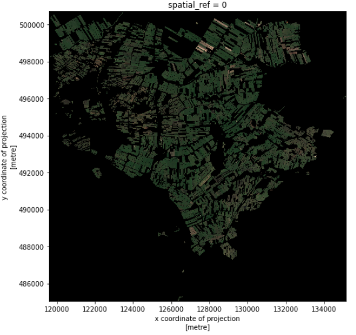
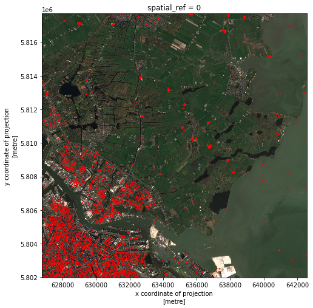
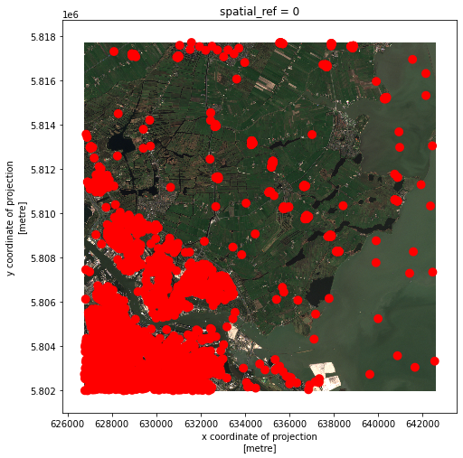
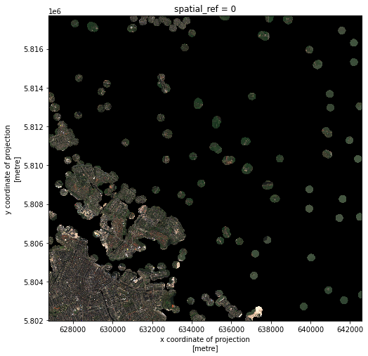
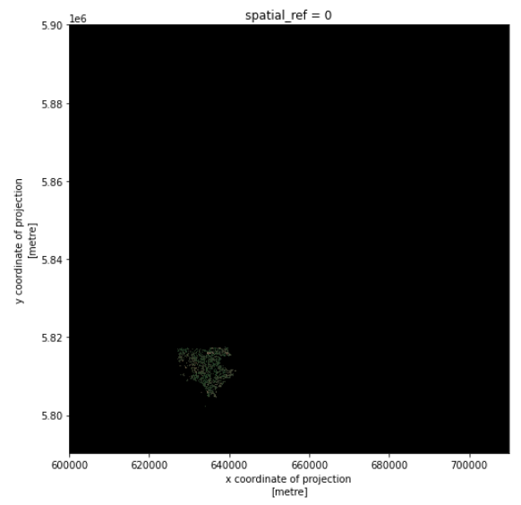

It is quite common that the raster data you have in hand is too large to process, or not all the pixels are relevant to your area of interest (AoI). In both situations, you should consider cropping your raster data before performing data analysis.

In this episode, we will introduce how to crop raster data into the desired area. We will use one Sentinel-2 image over Amsterdam as the example raster data, and introduce how to crop your data to different types of AoIs.

> ## Introduce the Data
>
> In this episode, we will use the same dataset as the one introduced in episode
> [Introduction to Raster Data in Python]({{ page.root }}).
> Therefore, we continue from the
> `search.json` file, that is already saved in your working directory. We also
> use the PDOK vector data that is already introduced in episode [Introduction
> to Vector Data]({{ page.root }}).
{: .callout}

## Crop raster data with a bounding box

We load a true color image using `pystac` and `rioxarray` and check the shape of the raster:

~~~
import pystac
import rioxarray

# Load image and inspect the shape
items = pystac.ItemCollection.from_file("search.json")
true_color_image = rioxarray.open_rasterio(items[1].assets["visual"].href) # Select a true color image
print(true_color_image.shape)
~~~
{: .language-python}

~~~
(3, 10980, 10980)
~~~
{: .output}

The large size of the raster data makes it time and memory consuming to visualise in its entirety.  Instead, we can plot the "overview" asset, to investigate the coverage of the image.

~~~
# Get the overview asset
overview_image = rioxarray.open_rasterio(items[1].assets["overview"].href)
print(overview_image.shape)

# Visualize it
overview_image.plot.imshow(figsize=(8,8))
~~~
{: .language-python}

As we can see, the overview image is much smaller compared to the original true color image. Therefore the visualization is much faster. If we are interested in the crop fields, then we would like to know where these are located in the image. To compare its coverage with the raster data, we first check the coordinate systems of both raster and vector data. For raster data, we use `pyproj.CRS`:

~~~
from pyproj import CRS

# Check the coordinate system
CRS(true_color_image.rio.crs)
~~~
{: .language-python}

~~~
<Derived Projected CRS: EPSG:32631>
Name: WGS 84 / UTM zone 31N
Axis Info [cartesian]:
- [east]: Easting (metre)
- [north]: Northing (metre)
Area of Use:
- undefined
Coordinate Operation:
- name: UTM zone 31N
- method: Transverse Mercator
Datum: World Geodetic System 1984
- Ellipsoid: WGS 84
- Prime Meridian: Greenwich
~~~
{: .output}

To open and check the coordinate system of vector data, we use `geopandas`:

~~~
import geopandas as gpd

# Load the polygons of the crop fields
cf_boundary_crop = gpd.read_file("data/cropped_field.shp")

# Check the coordinate system
cf_boundary_crop.crs
~~~
{: .language-python}

~~~
<Derived Projected CRS: EPSG:28992>
Name: Amersfoort / RD New
Axis Info [cartesian]:
- X[east]: Easting (metre)
- Y[north]: Northing (metre)
Area of Use:
- name: Netherlands - onshore, including Waddenzee, Dutch Wadden Islands and 12-mile offshore coastal zone.
- bounds: (3.2, 50.75, 7.22, 53.7)
Coordinate Operation:
- name: RD New
- method: Oblique Stereographic
Datum: Amersfoort
- Ellipsoid: Bessel 1841
- Prime Meridian: Greenwich
~~~
{: .output}

As seen, the coordinate systems differ. To crop the raster using the shapefile,
we first convert the coordinate system of `cf_boundary_crop` to the coordinate
system of `true_color_image`, and then check the coverage:

~~~
from matplotlib import pyplot as plt

# Convert the coordinate system
cf_boundary_crop = cf_boundary_crop.to_crs(true_color_image.rio.crs)

# Plot
fig, ax = plt.subplots()
fig.set_size_inches((8,8))

# Plot image
overview_image.plot.imshow(ax=ax)

# Plot crop fields
cf_boundary_crop.plot(
    ax=ax,
    edgecolor="red",
)
~~~
{: .language-python}

Seeing from the location of the polygons, the crop fields (red) only takes a small part of
the raster. Therefore before actual processing, we can first crop the raster to
our area of interest. The `clip_box` function allows one to crop a raster by the
min/max of the x and y coordinates. Note that we are cropping the original image `true_color_image` now, and not the overview image `overview_image`.

~~~
# Crop the raster with the bounding box
raster_clip = true_color_image.rio.clip_box(*cf_boundary_crop.total_bounds)
print(raster_clip.shape)
~~~
{: .language-python}
~~~
(3, 1565, 1565)
~~~
{: .output}

We successfully cropped the raster to a much smaller piece. We can visualize it now:

~~~
raster_clip.plot.imshow(figsize=(8,8))
~~~
{: .language-python}

This cropped image can be saved for later usage:
~~~
raster_clip.rio.to_raster("raster_clip.tif")
~~~
{: .language-python}

## Crop raster data with polygons

We have a cropped image around the fields. To further analysis the fields, one may want to crop the image to the exact field boundaries.
This can be done with the `clip` function:

~~~
raster_clip_fields = raster_clip.rio.clip(cf_boundary_crop['geometry'])
~~~
{: .language-python}

And we can visualize the results:
~~~
raster_clip_fields.plot.imshow(figsize=(8,8))
~~~
{: .language-python}

We can save this image for later usage:
~~~
raster_clip_fields.rio.to_raster("crop_fields.tif")
~~~

## Crop raster data with a geometry buffer

It is not always the case that the AoI comes in the format of polygon. Sometimes one would like to perform analysis around a (set of) point(s), or polyline(s). For example, in our AoI, there are also some groundwater monitoring wells available as point vector data. One may also want to perform analysis around these wells. The location of the wells is stored in `data/groundwater_monitoring_well`.

We can first load the wells vector data, and select wells within the coverage of the image:

~~~
# Load wells
wells = gpd.read_file("https://service.pdok.nl/bzk/brogmwvolledigeset/atom/v2_1/downloads/brogmwvolledigeset.zip")
wells = wells.to_crs(raster_clip.rio.crs)

# Crop the wells to the image extent
xmin, ymin, xmax, ymax = raster_clip.rio.bounds()
wells = wells.cx[xmin:xmax, ymin:ymax]
~~~
{: .language-python}

Then we can check the location of the wells:
~~~
# Plot the wells over raster
fig, ax = plt.subplots()
fig.set_size_inches((8,8))
raster_clip.plot.imshow(ax=ax)
wells.plot(ax=ax, color='red', markersize=2)
~~~
{: .language-python}

To select pixels around the geometries, one needs to first define a region including the geometries. This region is called a "buffer" and it is defined in the units of the projection. The size of the buffer depends on the analysis in your research. A buffer is also a polygon, which can be used to crop the raster data. `geopandas`' objects have a `buffer` method to generate buffer polygons.

~~~
# Create 200m buffer around the wells
wells_buffer = wells.buffer(200)
~~~
{: .language-python}

Now let's see what do the buffers look like in the image:
~~~
# Visualize buffer on raster
fig, ax = plt.subplots()
fig.set_size_inches((8,8))
raster_clip.plot.imshow(ax=ax)
wells_buffer.plot(ax=ax, color='red')
~~~
{: .language-python}

The red dots have grown larger indicating the conversion from points to buffer polygons.

> ## Exercise: Select the raster data around the wells
> Now we have the buffer polygons around the groudwater monitoring wells, i.e. `wells_buffer`. Can you crop the image `raster_clip` to the buffer polygons? Can you visualize the results of cropping?
> > ## Solution
> > ~~~
> > # Crop
> > raster_clip_wells = raster_clip.rio.clip(wells_buffer)
> >
> > # Visualize cropped buffer
> > raster_clip_wells.plot.imshow()
> > ~~~
> > {: .language-python}
> > 
> {: .solution}
{: .challenge}

> ## Exercise: Select the raster data around the waterways
> In the previous episode we have corrected the waterway vector data and saved it in `waterways_nl_corrected.shp`. Can you select out all the raster data within 100m around the waterways, and visualize the results?
>
> > ## Solution
> > ~~~
> > # Load waterways polyline and convert CRS
> > waterways_nl = gpd.read_file("waterways_nl_corrected.shp")
> > waterways_nl = waterways_nl.to_crs(raster_clip.rio.crs)
> >
> > # Crop the waterways to the image extent
> > waterways_nl = waterways_nl.cx[xmin:xmax, ymin:ymax]
> >
> > # waterways buffer
> > waterways_nl_buffer = waterways_nl.buffer(100)
> >
> > # Crop
> > raster_clip_waterways = raster_clip.rio.clip(waterways_nl_buffer)
> >
> > # Visualize
> > raster_clip_waterways.plot.imshow(figsize=(8,8))
> > ~~~
> > {: .language-python}
> > 
> {: .solution}
{: .challenge}

## Crop raster data using another raster data

So far we have learnt how to crop raster image with vector data. We can also crop a raster with another raster data. In this section, we will demonstrate how to crop the `true_color_image` image using the
`crop_fields` image.

> ## Using `crop_fields` raster image
>
> For this section, we will use the `crop_fields.tif` image that was produced in the section "**Crop raster data with polygon**".
{: .callout}

We read in the `crop_fields.tif` image. For the demonstration purpose, we will reproject it to the RD CRS system, so it will be in a different CRS from the `true_color_image`:
~~~
# Read crop_fields
crop_fields = rioxarray.open_rasterio("crop_fields.tif")

# Reproject to RD to make the CRS different from the "true_color_image"
crop_fields = crop_fields.rio.reproject("EPSG:28992")
CRS(crop_fields.rio.crs)
~~~
{: .language-python}

~~~
<Derived Projected CRS: EPSG:28992>
Name: Amersfoort / RD New
Axis Info [cartesian]:
- [east]: Easting (metre)
- [north]: Northing (metre)
Area of Use:
- undefined
Coordinate Operation:
- name: unnamed
- method: Oblique Stereographic
Datum: Amersfoort
- Ellipsoid: Bessel 1841
- Prime Meridian: Greenwich
~~~
{: .output}

And let's check again the CRS of `true_color_image`:

~~~
# Get CRS of true_color_image
CRS(true_color_image.rio.crs)
~~~
{: .language-python}

~~~
<Derived Projected CRS: EPSG:32631>
Name: WGS 84 / UTM zone 31N
Axis Info [cartesian]:
- [east]: Easting (metre)
- [north]: Northing (metre)
Area of Use:
- undefined
Coordinate Operation:
- name: UTM zone 31N
- method: Transverse Mercator
Datum: World Geodetic System 1984
- Ellipsoid: WGS 84
- Prime Meridian: Greenwich
~~~
{: .output}

Now the two images are in different coordinate systems. We can
use `rioxarray.reproject_match()` function to crop `true_color_image` image.
It will perform both the reprojection and the cropping operation.
This might take a few minutes, because the `true_color_image` image is large.

~~~
# Crop and reproject
cropped_raster = true_color_image.rio.reproject_match(crop_fields)

# Visualize
cropped_raster.plot.imshow(figsize=(8,8))
~~~
{: .language-python}

In this way, we accomplish the reproject and cropping in one go.
> ## Exercise
>
> This time let's do it the other way around by cropping the `crop_fields` image using the `true_color_image` image. Discuss the results.
>
> > ## Solution
> >
> > ~~~
> > # Crop
> > cropped_raster = crop_fields.rio.reproject_match(true_color_image)
> >
> > # Visualize
> > cropped_raster.plot.imshow(figsize=(8,8))
> > ~~~
> > {: .language-python}
> > 
> {: .solution}
{: .challenge}

In one line `reproject_match` does a lot of helpful things:

1. It reprojects.
2. It matches the extent using `nodata` values or by clipping the data.
3. It sets `nodata` values. This means we can run calculations on those two images.

> ## Code Tip
>
> As we saw before, there also exists a method called `reproject()`, which only reprojects one raster to another projection. If you want more control over how rasters are resampled, clipped, and/or reprojected, you can use the `reproject()` method and other `rioxarray` methods individually.
{: .callout}
