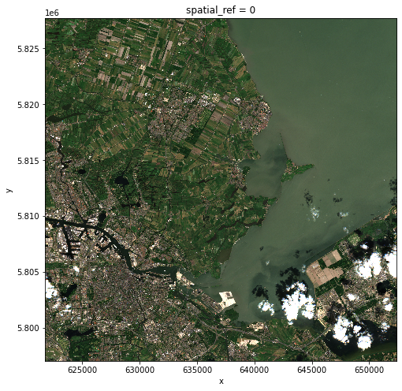
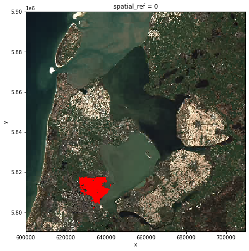
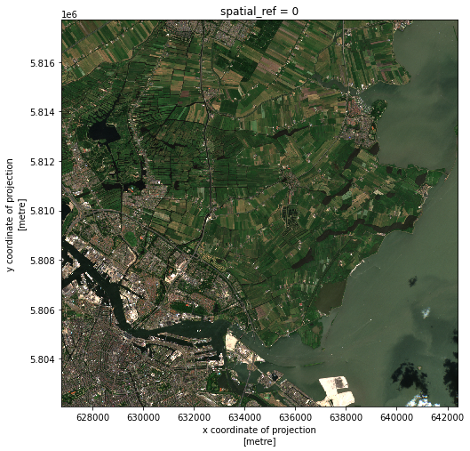
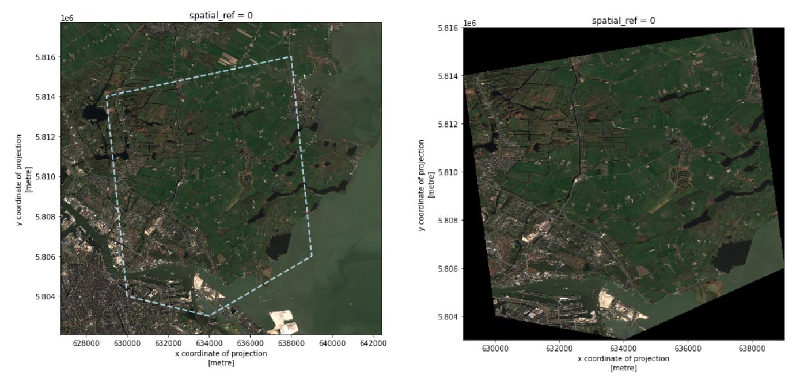
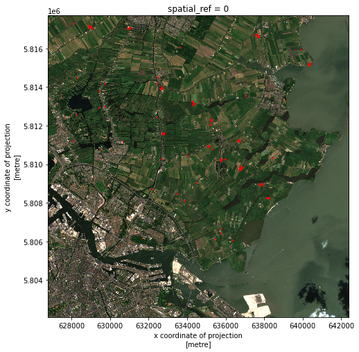

It is quite common that the raster data you have in hand is too large to process, or not all the pixels are relevant to your area of interest (AoI). In both situations, you should consider cropping your raster data before performing data analysis.

In this episode, we will introduce how to crop raster data into the desired area. We will use one Sentinel-2 image over Amsterdam as the example raster data, and introduce how to crop your data to different types of AoIs.

> ## Introduce the Data
>
> In this episode, we will use the same dataset as the one introduced in episode
> [Introduction to Raster Data in Python]({{ page.root }}).
> Therefore, we continue from the
> `search.json` file, that is already saved in your working directory. We also
> use the PDOK vector data that is already introduced in episode [Introduction
> to Vector Data]({{ page.root }}).
{: .callout}

## Crop raster data with a bounding box

We load a true color image using `pystac` and `rioxarray` and check the shape of the raster:

~~~
import pystac
import rioxarray

# Load image and inspect the shape
items = pystac.ItemCollection.from_file("search.json")
true_color_image = rioxarray.open_rasterio(items[1].assets["visual"].href) # Select a true color image
print(true_color_image.shape)
~~~
{: .language-python}

~~~
(3, 10980, 10980)
~~~
{: .output}

The raster data is quite big. If we want to visualize it, it takes several minutes:

~~~
# Visualize it
true_color_image.plot.imshow(figsize=(8,8))
~~~
{: .language-python}

But do we need the entire raster? Suppose we are interested in the crop fields. To compare its coverage with the raster data, we first check the coordinate systems of both raster and vector data. For raster data, we use `pyproj.CRS`:

~~~
from pyproj import CRS

# Check the coordinate system
CRS(true_color_image.rio.crs)
~~~
{: .language-python}

~~~
<Derived Projected CRS: EPSG:32631>
Name: WGS 84 / UTM zone 31N
Axis Info [cartesian]:
- [east]: Easting (metre)
- [north]: Northing (metre)
Area of Use:
- undefined
Coordinate Operation:
- name: UTM zone 31N
- method: Transverse Mercator
Datum: World Geodetic System 1984
- Ellipsoid: WGS 84
- Prime Meridian: Greenwich
~~~
{: .output}

To open and check the coordinate system of vector data, we use `geopandas`:

~~~
import geopandas as gpd

# Load the polygons of the crop fields
cf_boundary_crop = gpd.read_file("data/cropped_field.shp")

# Check the coordinate system
cf_boundary_crop.crs
~~~
{: .language-python}

~~~
<Derived Projected CRS: EPSG:28992>
Name: Amersfoort / RD New
Axis Info [cartesian]:
- X[east]: Easting (metre)
- Y[north]: Northing (metre)
Area of Use:
- name: Netherlands - onshore, including Waddenzee, Dutch Wadden Islands and 12-mile offshore coastal zone.
- bounds: (3.2, 50.75, 7.22, 53.7)
Coordinate Operation:
- name: RD New
- method: Oblique Stereographic
Datum: Amersfoort
- Ellipsoid: Bessel 1841
- Prime Meridian: Greenwich
~~~
{: .output}

As seen, the coordinate systems differ. To crop the raster using the shapefile,
we first convert the coordinate system of `cf_boundary_crop` to the coordinate
system of `true_color_image`, and then check the coverage:

~~~
from shapely.geometry import box
from matplotlib import pyplot as plt

# Convert the coordinate system
cf_boundary_crop = cf_boundary_crop.to_crs(true_color_image.rio.crs)

# Create a bounding box
bb_cropfields = box(*cf_boundary_crop.total_bounds)

# Plot
fig, ax = plt.subplots()
fig.set_size_inches((8,8))

# Plot image
true_color_image.plot.imshow(ax=ax)

# Plot crop fields
cf_boundary_crop.geometry.boundary.plot(
    ax=ax,
    facecolor="white",
    edgecolor="red",
    linewidth = 0.5,

)

# Plot bounding box
plt.plot(*bb_cropfields.exterior.xy,
         color="black",
         linewidth = 2,
         linestyle = '--',
        )
~~~
{: .language-python}

Seeing from the bounding boxes, the crop fields (red) only takes a small part of
the raster. Therefore before actual processing, we can first crop the raster to
our area of interest. The `clip_box` function allows one to crop a raster by the
min/max of the x and y coordinates.

~~~
# Crop the raster with the bounding box
raster_clip = true_color_image.rio.clip_box(*cf_boundary_crop.total_bounds)
print(raster_clip.shape)
~~~
{: .language-python}
~~~
(3, 1565, 1565)
~~~
{: .output}

We successfully cropped the raster to a much smaller piece. We can visualize it now:

~~~
raster_clip.plot.imshow(figsize=(8,8))
~~~
{: .language-python}

## Crop raster data with a polygon

It is common that the AoI is given by a polygon, which can be also used to crop the raster. For the example, we make a simple polygon within the raster clip we just made, and select the raster pixels within the polygon. This can be done with the `clip` function:

~~~
from shapely.geometry import Polygon
from matplotlib import pyplot as plt

# Create a polygon
xlist= [630000, 629000, 638000, 639000, 634000, 630000]
ylist = [5.804e6, 5.814e6, 5.816e6, 5.806e6, 5.803e6, 5.804e6]
polygon_geom = Polygon(zip(xlist, ylist))

# Plot the polygon over raster
fig, ax = plt.subplots()
fig.set_size_inches((8,8))
raster_clip.plot.imshow(ax=ax)
plt.plot(*polygon_geom.exterior.xy,
         color="lightblue",
         linewidth = 2,
         linestyle = '--',
        )

# Crop and visualize
raster_clip_polygon = raster_clip.rio.clip([polygon_geom], raster_clip.rio.crs)
raster_clip_polygon.plot.imshow(figsize=(8,8))
~~~
{: .language-python}

> ## Exercise: Compare two ways of bounding box cropping
> So far, we have learned two ways of cropping a raster: by a bounding box (using `clip_box`) and by a polygon (using `clip`). Technically, a bounding box is also a polygon. So what if we crop the original image directly with the polygon? For example:
> ~~~
> raster_clip_polygon2 = true_color_image.rio.clip([polygon_geom], true_color_image.rio.crs)
> raster_clip_polygon2.plot.imshow()
> ~~~
> {: .language-python}
> And try to compare the two methods:
> - Do you have the same results?
> - Do you have the same execution time?
> - How would you choose the two methods in your daily work?
>
> > ## Solution
> >
> > The two methods give the same results, but cropping directly with a polygon is much slower.
> >
> > Therefore, if the AoI is much smaller than the original raster, it would be more efficient to first crop the raster with a bounding box, then crop with the actual AoI polygon.
> {: .solution}
{: .challenge}

> ## Exercise: Select the raster data within crop fields
> Imagine that we want to select out all the crop fields from the raster data,
> using the `.shp` file in `data/crop_fields`.
>
> 1. Convert the coordinate system of `raster_clip` to the coordinate
system of `cf_boundary_crop`. Tip: we can use `rio.reproject()` function.
> 2. Crop the `raster_clip`.
> 3. Visualize the cropped data.
> 4. Store the raster as a GeoTIFF file (`crop_fields.tif`). Tip: we learned how to do this in the first episode.
>
> > ## Solution
> >
> > ~~~
> > # Load the crop fields polygons
> > cf_boundary_crop = gpd.read_file("data/crop_fields/cf_boundary_crop.shp")
> >
> > # Convert the coordinate system
> > raster_clip = raster_clip.rio.reproject(cf_boundary_crop.crs)
> >
> > # Crop
> > raster_clip_fields = raster_clip.rio.clip(cf_boundary_crop['geometry'], cf_boundary_crop.crs)
> >
> > # Visualize
> > raster_clip_fields.plot.imshow(figsize=(8,8))
> >
> > # Save
> > raster_clip_fields.rio.to_raster("crop_fields.tif", driver="COG")
> > ~~~
> > {: .language-python}
> > 
> {: .solution}
{: .challenge}

## Crop raster data with a geometry buffer

It is not always the case that the AoI comes in the format of a polygon. Sometimes one would like to perform analysis around a (set of) point(s), or polyline(s). For example, in our AoI, there are also some groundwater monitoring wells coming as point vector data. One may also want to perform analysis around these wells. The location of the wells is stored in `data/groundwater_monitoring_well`.

~~~
# Load wells
wells = gpd.read_file("https://service.pdok.nl/bzk/brogmwvolledigeset/atom/v2_1/downloads/brogmwvolledigeset.zip")
wells = wells.to_crs(raster_clip.rio.crs)

# Crop the wells to the image extent
xmin, xmax = raster_clip.x[[0, -1]]
ymin, ymax = raster_clip.y[[0, -1]]
wells = wells.cx[xmin:xmax, ymin:ymax]

# Plot the wells over raster
fig, ax = plt.subplots()
fig.set_size_inches((8,8))
raster_clip.plot.imshow(ax=ax)
wells.plot(ax=ax, color='red', markersize=2)
~~~
{: .language-python}

To select pixels around the geometries, one needs to first define a region including the geometries. This region is called a "buffer" and it is defined in the units of the projection. The size of the buffer depends on the analysis in your research. A buffer is also a polygon, which can be used to crop the raster data.  The package `geopandas` has a `buffer` function to make buffer polygons.

~~~
# Create 200m buffer around the wells
wells_buffer = wells.buffer(200)

# Crop
raster_clip_wells = raster_clip.rio.clip(wells_buffer, wells_buffer.crs)

# Visualize buffer on raster
fig, (ax1, ax2) = plt.subplots(1, 2)
fig.set_size_inches((16,8))
raster_clip.plot.imshow(ax=ax1)
wells_buffer.plot(ax=ax1, color='red')
ax1.set_xlim([xmin, xmax])
ax1.set_ylim([ymin, ymax])

# Visualize cropped buffer
raster_clip_wells.plot.imshow(ax=ax2)
~~~
{: .language-python}

> ## Exercise: Select the raster data around the dike
> The dikes are stored as polylines in `.shp` file in `data/dikes`. Let's select out all the raster data within 100m around the dikes and visualize the results.
>
> > ## Solution
> > ~~~
> > # Load dikes polyline
> > dikes = gpd.read_file("data/dikes/dikes.shp")
> > dikes = dikes.to_crs(true_color_image.rio.crs)
> > # Dike buffer
> > dikes_buffer = dikes.buffer(100)
> > # Crop
> > raster_clip_dikes = raster_clip.rio.clip(dikes_buffer, dikes_buffer.crs)
> > # Visualize
> > raster_clip_dikes.plot.imshow(figsize=(8,8))
> > ~~~
> > {: .language-python}
> > 
> {: .solution}
{: .challenge}

## Crop raster data using another raster data

Imagine that we have two raster datasets, let's say the `true_color_image` and `crop_fields` in
different coordinate systems. Our goal is to crop the `true_color_image` image using the
`crop_fields` image.

> ## Using `crop_fields` raster image
>
> For this section, we will use the `crop_fields.tif` image that was produced in
> the exercise "**Select the raster data within crop fields**".
{: .callout}

We read in both images and check their coordinate system:
~~~
# Read crop_fields
crop_fields = rioxarray.open_rasterio("crop_fields.tif")
CRS(crop_fields.rio.crs)
~~~
{: .language-python}

~~~
<Derived Projected CRS: EPSG:28992>
Name: Amersfoort / RD New
Axis Info [cartesian]:
- [east]: Easting (metre)
- [north]: Northing (metre)
Area of Use:
- undefined
Coordinate Operation:
- name: unnamed
- method: Oblique Stereographic
Datum: Amersfoort
- Ellipsoid: Bessel 1841
- Prime Meridian: Greenwich
~~~
{: .output}

~~~
# Get CRS of true_color_image
CRS(true_color_image.rio.crs)
~~~
{: .language-python}

~~~
<Derived Projected CRS: EPSG:32631>
Name: WGS 84 / UTM zone 31N
Axis Info [cartesian]:
- [east]: Easting (metre)
- [north]: Northing (metre)
Area of Use:
- undefined
Coordinate Operation:
- name: UTM zone 31N
- method: Transverse Mercator
Datum: World Geodetic System 1984
- Ellipsoid: WGS 84
- Prime Meridian: Greenwich
~~~
{: .output}

We can see that these images are in different coordinate systems. Now, we can
use `rioxarray.reproject_match()` function to crop `true_color_image` image. This might
take a few minutes, because the `true_color_image` image is large.

~~~
# Crop and reproject
cropped_raster = true_color_image.rio.reproject_match(crop_fields)

# Visualize
cropped_raster.plot.imshow(figsize=(8,8))
~~~
{: .language-python}

> ## Exercise
>
> This time, let's crop the `crop_fields` image using the `true_color_image` image. Discuss
> the results.
>
> > ## Solution
> >
> > ~~~
> > # Crop
> > cropped_raster = crop_fields.rio.reproject_match(true_color_image)
> >
> > # Visualize
> > cropped_raster.plot.imshow(figsize=(8,8))
> > ~~~
> > {: .language-python}
> > 
> {: .solution}
{: .challenge}

In one line `reproject_match` does a lot of helpful things:

1. It reprojects.
2. It matches the extent using `nodata` values or by clipping the data.
3. It sets `nodata` values. This means we can run calculations on those two images.

> ## Code Tip
>
> As we saw before, there also exists a method called `reproject()`, which only reprojects one raster to another projection. If you want more control over how rasters are resampled, clipped, and/or reprojected, you can use the `reproject()` method and other `rioxarray` methods individually.
{: .callout}
