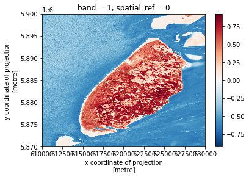

## Introduction

We often want to combine values of and perform calculations on rasters to create a new output raster. This episode
covers how to perform basic math operations using raster datasets. It also illustrates how to match rasters with
different resolutions so that they can be used in the same calculation. As an example, we will calculate a vegetation
index over one of the satellite scenes.

### Normalized Difference Vegetation Index (NDVI)
Suppose we are interested in monitoring vegetation fluctuations using satellite remote sensors. Scientists have defined
a vegetation index to quantify the amount of green leaf vegetation using the light reflected in different wavelengths.
This index, named Normalized Difference Vegetation Index (NDVI), exploits the fact that healthy green leaves strongly
absorb red visible light while they mostly reflect light in the near infrared (NIR). The NDVI is computed as:

$$ NDVI = \frac{NIR - red}{NIR + red} $$

where $NIR$ and $red$ label the reflectance values of the corresponding wavelengths. NDVI values range from -1 to +1.
Values close to one indicate high density of green leaves. Poorly vegetated areas typically have NDVI values close to
zero. Negative NDVI values often indicate cloud and water bodies.

Source: Wu C-D, McNeely E, Cedeño-Laurent JG, Pan W-C, Adamkiewicz G, Dominici F, et al. (2014) Linking Student Performance in Massachusetts Elementary Schools with the “Greenness” of School Surroundings Using Remote Sensing. PLoS ONE 9(10): e108548. https://doi.org/10.1371/journal.pone.0108548
{: .text-center}

> ## More Resources
> Check out more on NDVI in the NASA Earth Observatory portal:
> [Measuring Vegetation](https://earthobservatory.nasa.gov/features/MeasuringVegetation/measuring_vegetation_2.php).
{: .callout}

### Load and crop the Data
For this episode, we will use one of the Sentinel-2 scenes that we have already employed in the previous episodes.

> ## Introduce the Data
>
> We'll continue from the results of the satellite image search that we have carried out in an exercise from
> [a previous episode]({{site.baseurl}}/05-access-data). We will load data starting from the `search.json` file.
>
> If you would like to work with the data for this lesson without downloading data on-the-fly, you can download the
> raster data using this [link](https://figshare.com/ndownloader/files/36028100). Save the `geospatial-python-raster-dataset.tar.gz`
> file in your current working directory, and extract the archive file by double-clicking on it or by running the
> following command in your terminal `tar -zxvf geospatial-python-raster-dataset.tar.gz`. Use the file `geospatial-python-raster-dataset/search.json`
> (instead of `search.json`) to get started with this lesson.
{: .callout}

Let's load the results of our initial imagery search using `pystac`:

~~~
import pystac
items = pystac.ItemCollection.from_file("search.json")
~~~
{: .language-python}

We then select the second item, and extract the URIs of the red and NIR bands ("red" and "nir08", respectively):

~~~
red_uri = items[1].assets["red"].href
nir_uri = items[1].assets["nir08"].href
~~~
{: .language-python}

Let's load the rasters with `open_rasterio` using the argument `masked=True`.

~~~
import rioxarray
red = rioxarray.open_rasterio(red_uri, masked=True)
nir = rioxarray.open_rasterio(nir_uri, masked=True)
~~~
{: .language-python}

Let's also restrict our analysis to the same crop field area defined in the previous episode by clipping the rasters
using a bounding box:

~~~
bbox = (629_000, 5_804_000, 639_000, 5_814_000)
red_clip = red.rio.clip_box(*bbox)
nir_clip = nir.rio.clip_box(*bbox)
~~~
{: .language-python}

We can now plot the two rasters. Using `robust=True` color values are stretched between the 2nd and 98th percentiles of
the data, which results in clearer distinctions between high and low reflectances:

~~~
red_clip.plot(robust=True)
~~~
{: .language-python}

~~~
nir_clip.plot(robust=True)
~~~
{: .language-python}

It is immediately evident how crop fields (rectangular shapes in the central part of the two figures) appear as dark and
bright spots in the red-visible and NIR wavelengths, respectively, suggesting the presence of leafy crop at the time of
observation (end of March). The same fields would instead appear as dark spots in the off season.

## Raster Math
We can perform raster calculations by subtracting (or adding,
multiplying, etc.) two rasters. In the geospatial world, we call this
"raster math", and typically it refers to operations on rasters that
have the same width and height (including `nodata` pixels).
We can check the shapes of the two rasters in the following way:
~~~
print(red_clip.shape, nir_clip.shape)
~~~
{: .language-python}

~~~
(1, 1000, 1000) (1, 500, 500)
~~~
{: .output}

Both rasters include a single band, but their width and height do not match.
We can now use the `reproject_match` function, which both reprojects and clips
a raster to the CRS and extent of another raster.

~~~
red_clip_matched = red_clip.rio.reproject_match(nir_clip)
print(red_clip_matched.shape)
~~~
{: .language-python}

~~~
(1, 500, 500)
~~~
{: .output}

Let's now compute the NDVI as a new raster using the formula presented above.
We'll use `rioxarray` objects so that we can easily plot our result and keep
track of the metadata.

~~~
ndvi = (nir_clip - red_clip_matched)/ (nir_clip + red_clip_matched)
print(ndvi)
~~~
{: .language-python}

~~~
<xarray.DataArray (band: 1, y: 500, x: 500)>
array([[[ 0.7379576 ,  0.77153456,  0.54531944, ...,  0.39254385,
          0.49227372,  0.4465174 ],
        [ 0.7024894 ,  0.7074668 ,  0.3903298 , ...,  0.423283  ,
          0.4706971 ,  0.45964912],
        [ 0.6557818 ,  0.5610572 ,  0.46742022, ...,  0.4510345 ,
          0.43815723,  0.6005133 ],
        ...,
        [ 0.02391171,  0.21843003,  0.02479339, ..., -0.50923485,
         -0.53367877, -0.4955414 ],
        [ 0.11376493,  0.17681159, -0.1673566 , ..., -0.5221932 ,
         -0.5271318 , -0.4852753 ],
        [ 0.45398772, -0.00518135,  0.03346133, ..., -0.5019455 ,
         -0.4987013 , -0.49081364]]], dtype=float32)
Coordinates:
  * band         (band) int64 1
  * x            (x) float64 6.29e+05 6.29e+05 6.29e+05 ... 6.39e+05 6.39e+05
  * y            (y) float64 5.814e+06 5.814e+06 ... 5.804e+06 5.804e+06
    spatial_ref  int64 0
~~~
{: .output}

We can now plot the output NDVI:

~~~
ndvi.plot()
~~~

Notice that the range of values for the output NDVI is between -1 and 1.
Does this make sense for the selected region?

Maps are great, but it can also be informative to plot histograms of values to better understand the distribution. We can accomplish this using a built-in xarray method we have already been using: `plot`

~~~
ndvi.plot.hist()
~~~

> ## Exercise: Explore NDVI Raster Values
>
> It's often a good idea to explore the range of values in a raster dataset just like we might explore a dataset that we collected in the field. The histogram we just made is a good start but there's more we can do to improve our understanding of the data.
>
> 1. What is the min and maximum value for the NDVI raster (`ndvi`) that we just created? Are there missing values?
> 2. Plot a histogram with 50 bins instead of 8. What do you notice that wasn't clear before?
> 3. Plot the `ndvi` raster using breaks that make sense for the data.
>
> > ## Answers
> >
> > 1) Recall, if there were nodata values in our raster,
> > we would need to filter them out with `.where()`. Since we have loaded the rasters with `masked=True`, missing
> > values are already encoded as `np.nan`'s. The `ndvi` array actually includes a single missing value.
> > ~~~
> > print(ndvi.min().values)
> > print(ndvi.max().values)
> > print(ndvi.isnull().sum().values)
> > ~~~
> > {: .language-python}
> > ~~~
> > -0.99864775
> > 0.9995788
> > 1
> > ~~~
> > {: .output}
> > 2) Increasing the number of bins gives us a much clearer view of the distribution. Also, there seem to be very few
> > NDVI values larger than ~0.9.
> > ~~~
> > ndvi.plot.hist(bins=50)
> > ~~~
> > {: .language-python}
> > 
> > 3) We can discretize the color bar by specifying the intervals via the `levels` argument to `plot()`.
> > Suppose we want to bin our data in the following intervals:
> > * $-1 \le NDVI \lt 0$ for water;
> > * $0 \le NDVI \lt 0.2$ for no vegetation;
> > * $0.2 \le NDVI \lt 0.7$ for sparse vegetation;
> > * $0.7 \le NDVI \lt 1$ for dense vegetation.
> >
> > ~~~
> > class_bins = (-1, 0., 0.2, 0.7, 1)
> > ndvi.plot(levels=class_bins)
> > ~~~
> > {: .language-python}
> > 
> {: .solution}
{: .challenge}

Missing values can be interpolated from the values of neighbouring grid cells using the `.interpolate_na` method. We
then save `ndvi` as a GeoTiff file:
~~~
ndvi_nonan = ndvi.interpolate_na(dim="x")
ndvi_nonan.rio.to_raster("NDVI.tif")
~~~
{: .language-python}

## Classifying Continuous Rasters in Python

Now that we have a sense of the distribution of our NDVI raster, we
can reduce the complexity of our map by classifying it. Classification involves
assigning each pixel in the raster to a class based on its value. In Python, we
can accomplish this using the `numpy.digitize` function.

First, we define NDVI classes based on a list of values, as defined in the last exercise:
`[-1, 0., 0.2, 0.7, 1]`. When bins are ordered from
low to high, as here, `numpy.digitize` assigns classes like so:

Source: Image created for this lesson ([license]({{ page.root }}))
{: .text-center}

Note that, by default, each class includes the left but not the right bound. This is not an issue here, since the
computed range of NDVI values is fully contained in the open interval (-1; 1) (see exercise above).

~~~
import numpy as np
import xarray

# Defines the bins for pixel values
class_bins = (-1, 0., 0.2, 0.7, 1)

# The numpy.digitize function returns an unlabeled array, in this case, a
# classified array without any metadata. That doesn't work--we need the
# coordinates and other spatial metadata. We can get around this using
# xarray.apply_ufunc, which can run the function across the data array while
# preserving metadata.
ndvi_classified = xarray.apply_ufunc(
    np.digitize,
    ndvi_nonan,
    class_bins
)
~~~
{: .language-python}

Let's now visualize the classified NDVI, customizing the plot with proper title and legend. We then export the
figure in PNG format:

~~~
import earthpy.plot as ep
import matplotlib.pyplot as plt

from matplotlib.colors import ListedColormap

# Define color map of the map legend
ndvi_colors = ["blue", "gray", "green", "darkgreen"]
ndvi_cmap = ListedColormap(ndvi_colors)

# Define class names for the legend
category_names = [
    "Water",
    "No Vegetation",
    "Sparse Vegetation",
    "Dense Vegetation"
]

# We need to know in what order the legend items should be arranged
category_indices = list(range(len(category_names)))

# Make the plot
im = ndvi_classified.plot(cmap=ndvi_cmap, add_colorbar=False)
plt.title("Classified NDVI")
# earthpy helps us by drawing a legend given an existing image plot and legend items, plus indices
ep.draw_legend(im_ax=im, classes=category_indices, titles=category_names)

# Save the figure
plt.savefig("NDVI_classified.png", bbox_inches="tight", dpi=300)
~~~
{: .language-python}

We can finally export the classified NDVI raster object to a GeoTiff file. The `to_raster()` function
by default writes the output file to your working directory unless you specify a
full file path.

~~~
ndvi_classified.rio.to_raster("NDVI_classified.tif", dtype="int32")
~~~
{: .language-python}

> ## Exercise: Compute the NDVI for the Texel island
>
> Data are often more interesting and powerful when we compare them across various
> locations. Let's compare the computed NDVI map with the one of another region in the same Sentinel-2 scene:
> the [Texel island](https://en.wikipedia.org/wiki/Texel), located in the North Sea.
>
> 0. You should have the red- and the NIR-band rasters already loaded (`red` and `nir` variables, respectively).
> 1. Crop the two rasters using the following bounding box: `(610000, 5870000, 630000, 5900000)`. Don't forget to check the shape of the data, and make sure the cropped areas have the same CRSs, heights and widths.
> 2. Compute the NDVI from the two raster layers and check the max/min values to make sure the data
> is what you expect.
> 3. Plot the NDVI map and export the NDVI as a GeoTiff.
> 4. Compare the distributions of NDVI values for the two regions investigated.
>
> > ## Answers
> > 1) We crop the area of interest using `clip_box`:
> > ~~~
> > bbox_texel = (610000, 5870000, 630000, 5900000)
> > nir_texel = nir.rio.clip_box(*bbox_texel)
> > red_texel = red.rio.clip_box(*bbox_texel)
> > ~~~
> > {: .language-python}
> >
> > 2) Reproject and clip one raster to the extent of the smaller raster using `reproject_match`. The lines of code below
> > assign a variable to the reprojected raster and calculate the NDVI.
> >
> > ~~~
> > red_texel_matched = red_texel.rio.reproject_match(nir_texel)
> > ndvi_texel = (nir_texel - red_texel_matched)/ (nir_texel + red_texel_matched)
> > ~~~
> > {: .language-python}
> >
> > 3) Plot the NDVI and save the raster data as a GeoTIFF file.
> >
> > ~~~
> > ndvi_texel.plot()
> > ndvi_texel.rio.to_raster("NDVI_Texel.tif")
> > ~~~
> > {: .language-python}
> > 
> >
> > 4) Compute the NDVI histogram and compare it with the region that we have previously investigated. Many more grid
> > cells have negative NDVI values, since the area of interest includes much more water. Also, NDVI values close to
> > zero are more abundant, indicating the presence of bare ground (sand) regions.
> > ~~~
> > ndvi_texel.plot.hist(bins=50)
> > ~~~
> > {: .language-python}
> > 
> {: .solution}
{: .challenge}



