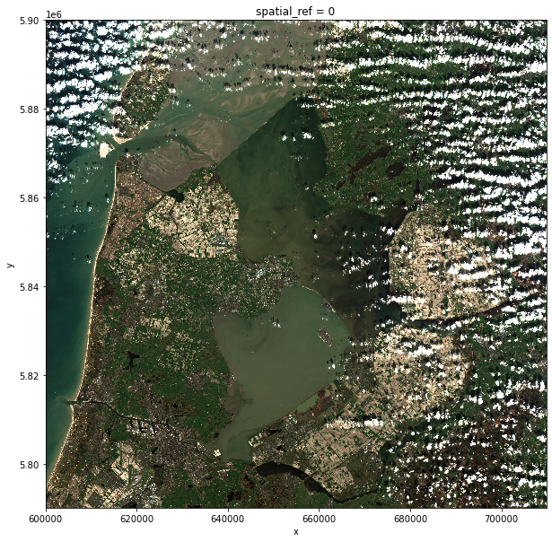
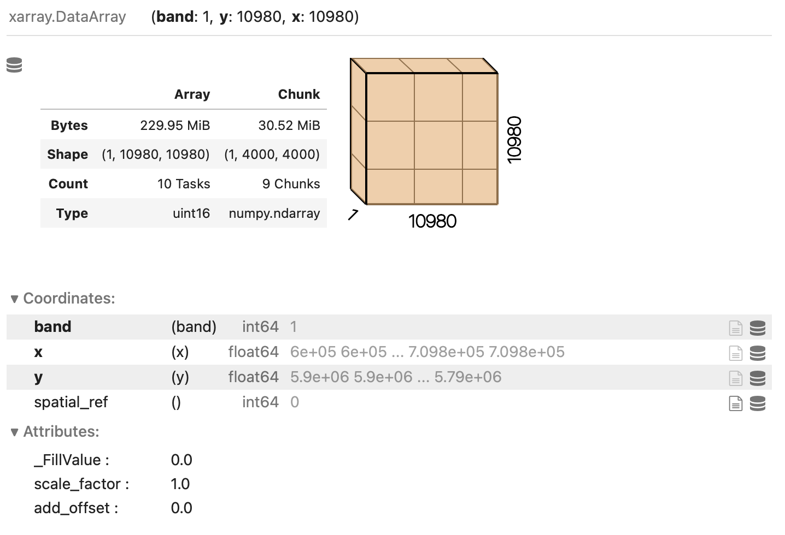

# Introduction
Very often raster computations involve applying the same operation to different pieces of data. Think, for instance, to
the "pixel"-wise sum of two raster datasets, where the same sum operation is applied to all the matching grid-cells of
the two rasters. This class of tasks can benefit from chunking the input raster(s) into smaller pieces: operations on
different pieces can be run in parallel using multiple computing units (e.g., multi-core CPUs), thus potentially
speeding up calculations. In addition, working on chunked data can lead to smaller memory footprints, since one
may bypass the need to store the full dataset in memory by processing it chunk by chunk.

In this episode, we will introduce the use of Dask in the context of raster calculations. Dask is a Python library for
parallel and distributed computing. It provides a framework to work with different data structures, including chunked
arrays (Dask Arrays). Dask is well integrated with (`rio`)`xarray`, which can use Dask arrays as underlying
data structures.

> ## Dask
>
> This episode shows how Dask can be used to parallelize operations on local CPUs. However, the same library can be
> configured to run tasks on large compute clusters.
>
> More resources on Dask:
> * [Dask](https://dask.org) and [Dask Array](https://docs.dask.org/en/stable/array.html).
> * [Xarray with Dask](https://xarray.pydata.org/en/stable/user-guide/dask.html).
{: .callout}

It is important to realize, however, that many details determine the extent to which using Dask's chunked arrays instead
of regular Numpy arrays leads to faster calculations (and lower memory requirements). The actual operations to carry
out, the size of the dataset, and parameters such as the chunks' shape and size, all affects the performance of our
computations. Depending on the specifics of the calculations, serial calculations might actually turn out to be faster!
Being able to profile the computational time is thus essential, and we will see how to do that in a Jupyter environment
in the next section.

The example that we consider here is the application of a median filter to a satellite image.
[Median filtering](https://en.wikipedia.org/wiki/Median_filter) is a common noise removal technique, and it consists in
replacing a pixel intensity with the value computed from the median of the surrounding pixels.

# Time profiling in Jupyter

> ## Introduce the Data
>
> We'll continue from the results of the satellite image search that we have carried out in an exercise from
> [a previous episode]({{site.baseurl}}/05-access-data). We will load data starting from the `search.json` file.
>
> If you would like to work with the data for this lesson without downloading data on-the-fly, you can download the
> raster data using this [link](https://figshare.com/ndownloader/files/36028100). Save the `geospatial-python-raster-dataset.tar.gz`
> file in your current working directory, and extract the archive file by double-clicking on it or by running the
> following command in your terminal `tar -zxvf geospatial-python-raster-dataset.tar.gz`. Use the file `geospatial-python-raster-dataset/search.json`
> (instead of `search.json`) to get started with this lesson.
{: .callout}

Let's set up a raster calculation using assets from our previous search of satellite scenes. We first load the item
collection using the `pystac` library:

~~~
import pystac
items = pystac.ItemCollection.from_file("search.json")
~~~
{: .language-python}

We select the last scene, and extract the URL of the true-color image ("visual"):

~~~
assets = items[-1].assets  # last item's assets
visual_href = assets["visual"].href  # true color image
~~~
{: .language-python}

The true-color image is available as a raster file with 10 m resolution and 3 bands (you can verify this by opening the
file with `rioxarray`), which makes it a relatively large file (few hundreds MBs). In order to keep calculations
"manageable" (reasonable execution time and memory usage) we select here a lower resolution version of the image, taking
advantage of the so-called "pyramidal" structure of cloud-optimized GeoTIFFs (COGs). COGs, in fact, typically include
multiple lower-resolution versions of the original image, called "overviews", in the same file. This allows to avoid
downloading high-resolution images when only quick previews are required.

Overviews are often computed using powers of 2 as down-sampling (or zoom) factors. So, typically, the first level
overview (index 0) corresponds to a zoom factor of 2, the second level overview (index 1) corresponds to a zoom factor
of 4, and so on. Here, we open the third level overview (zoom factor 8) and check that the resolution is about 80 m:

~~~
import rioxarray
visual = rioxarray.open_rasterio(visual_href, overview_level=2)
print(visual.rio.resolution())
~~~
{: .language-python}

~~~
(79.97086671522214, -79.97086671522214)
~~~
{: .output}

Let's make sure the data has been loaded into memory before proceeding to time profile our raster calculation. Calling
the `.load()` method of a DataArray object triggers data loading:

~~~
visual = visual.load()
~~~
{: .language-python}

Note that by default data is loaded using Numpy arrays as underlying data structure. We can visualize the raster:

~~~
visual.plot.imshow(figsize=(10,10))
~~~
{: .language-python}

Let's now apply a median filter to the image while keeping track of the execution time of this task. The filter is
carried out in two steps: first, we define the size and centering of the region around each pixel that will be
considered for the median calculation (the so-called "windows"), using the `.rolling()` method. We chose here windows
that are 7 pixel wide in both x and y dimensions, and, for each window, consider the central pixel as the window target.
We then call the `.median()` method, which initiates the construction of the windows and the actual calculation.

For the time profiling, we make use of the Jupyter magic `%%time`, which returns the time required to run the content
of a cell (note that commands starting with `%%` needs to be on the first line of the cell!):

~~~
%%time
median = visual.rolling(x=7, y=7, center=True).median()
~~~
{: .language-python}

~~~
CPU times: user 15.6 s, sys: 3.2 s, total: 18.8 s
Wall time: 19.6 s
~~~
{: .output}

Let's note down the calculation's "Wall time" (actual time to perform the task). We can inspect the image resulting
after the application of median filtering:

~~~
median.plot.imshow(robust=True, figsize=(10,10))
~~~
{: .language-python}

> ## Handling edges
>
> By looking closely, you might notice a tiny white edge at the plot boundaries. These are the pixels that are less than
> 3 pixels away from the border of the image. These pixels cannot be surrounded by a 7 pixel wide window. The default
> behaviour is to assign these with nodata values.
{: .callout}

Finally, let's write the data to disk:

~~~
median.rio.to_raster("visual_median-filter.tif")
~~~
{: .language-python}

In the following section we will see how to parallelize this raster calculation, and we will compare timings to the
serial calculation that we have just run.

# Dask-powered rasters

## Chunked arrays

As we have mentioned, `rioxarray` supports the use of Dask's chunked arrays as underlying data structure. When opening
a raster file with `open_rasterio` and providing the `chunks` argument, Dask arrays are employed instead of regular
Numpy arrays. `chunks` describes the shape of the blocks which the data will be split in. As an example, we
open the blue band raster ("B02") using a chunk shape of `(1, 4000, 4000)` (block size of `1` in the first dimension and
of `4000` in the second and third dimensions):

~~~
blue_band_href = assets["B02"].href
blue_band = rioxarray.open_rasterio(blue_band_href, chunks=(1, 4000, 4000))
~~~
{: .language-python}

Xarray and Dask also provide a graphical representation of the raster data array and of its blocked structure.

> ## Exercise: Chunk sizes matter
> We have already seen how COGs are regular GeoTIFF files with a special internal structure. Another feature of COGs is
> that data is organized in "blocks" that can be accessed remotely via independent HTTP requests, enabling partial file
> readings. This is useful if you want to access only a portion of your raster file, but it also allows for efficient
> parallel reading. You can check the blocksize employed in a COG file with the following code snippet:
>
> ~~~
> import rasterio
> with rasterio.open(visual_href) as r:
>     if r.is_tiled:
>         print(f"Chunk size: {r.block_shapes}")
> ~~~
> {: .language-python}
>
> In order to optimally access COGs it is best to align the blocksize of the file with the chunks employed when loading
> the file. Open the blue-band asset ("B02") of a Sentinel-2 scene as a chunked `DataArray` object using a suitable
> chunk size. Which elements do you think should be considered when choosing the chunk size?
>
> > ## Solution
> > ~~~
> > import rasterio
> > with rasterio.open(blue_band_href) as r:
> >     if r.is_tiled:
> >         print(f"Chunk size: {r.block_shapes}")
> > ~~~
> > {: .language-python}
> >
> > ~~~
> > Chunk size: [(1024, 1024)]
> > ~~~
> > {: .output}
> >
> > Ideal chunk size values for this raster are thus multiples of 1024. An element to consider is the number of
> > resulting chunks and size. While the optimal chunk size strongly depends on the specific application, chunks
> > should in general not be too big nor too small (i.e. too many). As a rule of thumb, chunk sizes of 100 MB typically
> > work well with Dask (see, e.g., this [blog post](https://blog.dask.org/2021/11/02/choosing-dask-chunk-sizes)). Also,
> > the shape might be relevant, depending on the application! Here, we might select a chunks shape of
> > `(1, 6144, 6144)`:
> >
> > ~~~
> > band = rioxarray.open_rasterio(blue_band_href, chunks=(1, 6144, 6144))
> > ~~~
> > {: .language-python}
> >
> > which leads to chunks 72 MB large: ((1 x 6144 x 6144) x 2 bytes / 2^20 = 72 MB). Also, we can let `rioxarray` and Dask
> > figure out appropriate chunk shapes by setting `chunks="auto"`:
> >
> > ~~~
> > band = rioxarray.open_rasterio(blue_band_href, chunks="auto")
> > ~~~
> > {: .language-python}
> >
> > which leads to `(1, 8192, 8192)` chunks (128 MB).
> {: .solution}
{: .challenge}

## Parallel computations

Operations performed on a `DataArray` that has been opened as a chunked Dask array are executed using Dask. Dask
coordinates how the operations should be executed on the individual chunks of data, and runs these tasks in parallel as
much as possible.

Let's now repeat the raster calculations that we have carried out in the previous section, but running calculations in
parallel over a multi-core CPU. We first open the relevant rasters as chunked arrays:

~~~
visual_dask = rioxarray.open_rasterio(visual_href, overview_level=2, lock=False, chunks=(3, 500, 500))
~~~
{: .language-python}

Setting `lock=False` tells `rioxarray` that the individual data chunks can be loaded simultaneously from the source by
the Dask workers.

As the next step, we trigger the download of the data using the `.persist()` method, see below. This makes sure that
the downloaded chunks are stored in the form of a chunked Dask array (calling `.load()` would instead merge the chunks
in a single Numpy array).

We explicitly tell Dask to parallelize the required workload over 4 threads:

~~~
visual_dask = visual_dask.persist(scheduler="threads", num_workers=4)
~~~
{: .language-python}

Let's now continue to the actual calculation. Note how the same syntax as for its serial version is employed for
applying the median filter. Don't forget to add the Jupyter magic to record the timing!

~~~
%%time
median_dask = visual_dask.rolling(x=7, y=7, center=True).median()
~~~
{: .language-python}

~~~
CPU times: user 20.6 ms, sys: 3.71 ms, total: 24.3 ms
Wall time: 25.2 ms
~~~
{: .output}

Did we just observe a 700x speed-up when comparing to the serial calculation (19.6 s vs 25.2 ms)? Actually, no
calculation has run yet. This is because operations performed on Dask arrays are executed "lazily", i.e. they are not
immediately run.

> ## Dask graph
>
> The sequence of operations to carry out is stored in a task graph, which can be visualized with:
>
> ~~~
> import dask
> dask.visualize(median_dask)
> ~~~
> {: .language-python}
>
> 
>
> The task graph gives Dask the complete "overview" of the calculation, thus enabling a better management of tasks and
> resources when dispatching calculations to be run in parallel.
{: .callout}

Most methods of `DataArray`'s run operations lazily when Dask arrays are employed. In order to trigger calculations, we
can use either `.persist()` or `.compute()`. The former keeps data in the form of chunked Dask arrays, and it should
thus be used to run intermediate steps that will be followed by additional calculations. The latter merges instead the
chunks in a single Numpy array, and it should be used at the very end of a sequence of calculations. Both methods
accept the same parameters (here, we again explicitly tell Dask to run tasks on 4 threads). Let's again time the cell
execution:

~~~
%%time
median_dask = median_dask.persist(scheduler="threads", num_workers=4)
~~~
{: .language-python}

~~~
CPU times: user 19.1 s, sys: 3.2 s, total: 22.3 s
Wall time: 6.61 s
~~~
{: .output}

The timing that we have recorded makes much more sense now. When running the task on a 4-core CPU laptop, we observe a
x3 speed-up when comparing to the analogous serial calculation (19.6 s vs 6.61 s).

Once again, we stress that one does not always obtain similar performance gains by exploiting the Dask-based
parallelization. Even if the algorithm employed is well suited for parallelization, Dask introduces some overhead time
to manage the tasks in the Dask graph. This overhead, which is typically of the order of few milliseconds per task, can
be larger than the parallelization gain. This is the typical situation with calculations with many small chunks.

Finally, let's have a look at how Dask can be used to save raster files. When calling `.to_raster()`, we provide the
following additional arguments:
* `tiled=True`: write raster as a chunked GeoTIFF.
* `lock=threading.Lock()`: the threads which are splitting the workload must "synchronise" when writing to the same file
  (they might otherwise overwrite each other's output).

~~~
from threading import Lock
median_dask.rio.to_raster("visual_median-filter_dask.tif", tiled=True, lock=Lock())
~~~
{: .language-python}

Note that `.to_raster()` is among the methods that trigger immediate calculations (one can change this behaviour by
specifying `compute=False`)
