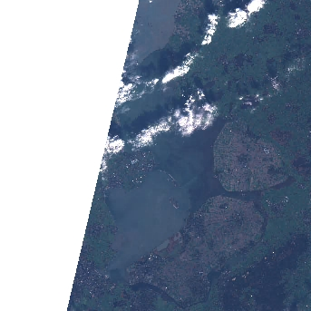

A number of satellites take snapshots of the Earth's surface from space. The images recorded by these remote sensors
represent a very precious data source for any activity that involves monitoring changes on Earth. Satellite imagery is
typically provided in the form of geospatial raster data, with the measurements in each grid cell ("pixel") being
associated to accurate geographic coordinate information.

In this episode we will explore how to access open satellite data using Python. In particular,  we will
consider [the Sentinel-2 data collection that is hosted on AWS](https://registry.opendata.aws/sentinel-2-l2a-cogs).
This dataset consists of multi-band optical images acquired by the two satellites of
[the Sentinel-2 mission](https://sentinel.esa.int/web/sentinel/missions/sentinel-2) and it is continuously updated with
new images.

# Search for satellite imagery

## The SpatioTemporal Asset Catalog (STAC) specification

Current sensor resolutions and satellite revisit periods are such that terabytes of data products are added daily to the
corresponding collections. Such datasets cannot be made accessible to users via full-catalog download. Space agencies
and other data providers often offer access to their data catalogs through interactive Graphical User Interfaces (GUIs),
see for instance the [Copernicus Open Access Hub portal](https://scihub.copernicus.eu/dhus/#/home) for the Sentinel
missions. Accessing data via a GUI is a nice way to explore a catalog and get familiar with its content, but it
represents a heavy and error-prone task that should be avoided if carried out systematically to retrieve data.

A service that offers programmatic access to the data enables users to reach the desired data in a more reliable,
scalable and reproducible manner. An important element in the software interface exposed to the users generally called
the Application Programming Interface (API) is the use of standards. Standards, in fact, can significantly facilitate
the reusability of tools and scripts across datasets and applications.

The SpatioTemporal Asset Catalog (STAC) specification is an emerging standard for describing geospatial data. By
organizing metadata in a form that adheres to the STAC specifications, data providers make it possible for users to
access data from different missions, instruments and collections using the same set of tools.

> ## More Resources on STAC
>
> * [STAC specification](https://github.com/radiantearth/stac-spec)
> * [Tools based on STAC](https://stacindex.org/ecosystem)
> * [STAC catalogs](https://stacindex.org/catalogs)
{: .callout}

## Search a STAC catalog

The Sentinel-2 collection hosted on AWS is indexed in a STAC catalog that is accessible at the following link:

~~~
api_url = "https://earth-search.aws.element84.com/v0"
~~~
{: .language-python}

> ## Exercise: Discover a STAC catalog
> Let's take a moment to explore the Earth Search STAC catalog, which is a catalog listing few satellite image datasets
> that are hosted on AWS. The catalog is accessible via the STAC API at the following URL:
> [https://earth-search.aws.element84.com/v0](https://earth-search.aws.element84.com/v0).
> We can interactively browse a STAC catalog using the following tool:
> [https://radiantearth.github.io/stac-browser](https://radiantearth.github.io/stac-browser).
> Open the link in your web browser, paste the STAC API URL in the navigation bar, and click on "Load".
> Which collections are available? Open the Sentinel-2 L2A COGs collection, and select one of the items (i.e. a
> satellite "scene"). Have a look at the metadata fields and browse through the available assets. What type of data can
> you access for this item?
{: .challenge}

You can query a STAC API endpoint from Python using the `pystac_client` library:

~~~
from pystac_client import Client

client = Client.open(api_url)
~~~
{: .language-python}

In the following, we ask for scenes belonging to the `sentinel-s2-l2a-cogs` collection. This dataset includes Sentinel-2
data products pre-processed at level 2A (bottom-of-atmosphere reflectance) and saved in Cloud Optimized GeoTIFF (COG)
format:

~~~
collection = "sentinel-s2-l2a-cogs"  # Sentinel-2, Level 2A, COGs
~~~
{: .language-python}

We also ask for scenes intersecting a geometry defined using the `shapely` library (in this case, a point):

~~~
from shapely.geometry import Point
point = Point(4.89, 52.37)  # AMS coordinates
~~~
{: .language-python}

Note: at this stage, we are only dealing with metadata, so no image is going to be downloaded yet. But even metadata can
be quite bulky if a large number of scenes match our search! For this reason, we limit the search result to 10 items:

~~~
search = client.search(
    collections=[collection],
    intersects=point,
    max_items=10,
)
~~~
{: .language-python}

We submit the query and find out how many scenes match our search criteria:

~~~
print(search.matched())
~~~
{: .language-python}

~~~
630
~~~
{: .output}

Finally, we retrieve the metadata of the search results:
~~~
items = search.get_all_items()
~~~
{: .language-python}

We can check how many items are included in the returned `ItemCollection`:
~~~
print(len(items))
~~~
{: .language-python}

~~~
10
~~~
{: .output}

which is consistent with the maximum number of items that we have set in the search criteria. We can iterate over
the returned items and print these to show their IDs:

~~~
for item in items:
    print(item)
~~~
{: .language-python}

~~~
<Item id=S2B_31UFU_20220313_0_L2A>
<Item id=S2A_31UFU_20220311_0_L2A>
<Item id=S2A_31UFU_20220308_0_L2A>
<Item id=S2B_31UFU_20220306_0_L2A>
<Item id=S2B_31UFU_20220303_0_L2A>
<Item id=S2A_31UFU_20220301_0_L2A>
<Item id=S2A_31UFU_20220226_0_L2A>
<Item id=S2B_31UFU_20220224_0_L2A>
<Item id=S2B_31UFU_20220221_0_L2A>
<Item id=S2A_31UFU_20220219_0_L2A>
~~~
{: .output}

Each of the items contains information about the scene geometry, its acquisition time, and other metadata that can be
accessed as a dictionary from the `properties` attribute.
To inspect the metadata associated with the first item of the search results:
~~~
item = items[0]
print(item.datetime)
print(item.geometry)
print(item.properties)
~~~
{: .language-python}

~~~
2022-03-13 10:46:26+00:00
{'type': 'Polygon', 'coordinates': [[[6.071664488869862, 52.22257539160586], [4.81543624496389, 52.24859574950519], [5.134718264192548, 52.98684040773408], [6.115758198408397, 52.84931817668945], [6.071664488869862, 52.22257539160586]]]}
{'datetime': '2022-03-13T10:46:26Z', 'platform': 'sentinel-2b', 'constellation': 'sentinel-2', 'instruments': ['msi'], 'gsd': 10, 'view:off_nadir': 0, 'proj:epsg': 32631, 'sentinel:utm_zone': 31, 'sentinel:latitude_band': 'U', 'sentinel:grid_square': 'FU', 'sentinel:sequence': '0', 'sentinel:product_id': 'S2B_MSIL2A_20220313T103729_N0400_R008_T31UFU_20220313T140234', 'sentinel:data_coverage': 48.71, 'eo:cloud_cover': 99.95, 'sentinel:valid_cloud_cover': True, 'sentinel:processing_baseline': '04.00', 'sentinel:boa_offset_applied': True, 'created': '2022-03-13T17:43:18.861Z', 'updated': '2022-03-13T17:43:18.861Z'}
~~~
{: .output}

> ## Exercise: Search satellite scenes using metadata filters
> Search for all the available Sentinel-2 scenes in the `sentinel-s2-l2a-cogs` collection that satisfy the following
> criteria:
> - intersect a provided bounding box (use ±0.01 deg in lat/lon from the previously defined point);
> - have been recorded between 20 March 2020 and 30 March 2020;
> - have a cloud coverage smaller than 10%.
>
> How many scenes are available? Save the search results in GeoJSON format.
>
> >## Solution
> >
> > ~~~
> > bbox = point.buffer(0.01).bounds
> > ~~~
> > {: .language-python}
> >
> > ~~~
> > search = client.search(
> >     collections=[collection],
> >     bbox=bbox,
> >     datetime="2020-03-20/2020-03-30",
> >     query=["eo:cloud_cover<10"]
> > )
> > print(search.matched())
> > ~~~
> > {: .language-python}
> >
> > ~~~
> > 4
> > ~~~
> > {: .output}
> >
> > ~~~
> > items = search.get_all_items()
> > items.save_object("search.json")
> > ~~~
> > {: .language-python}
> {: .solution}
{: .challenge}

# Access the assets

So far we have only discussed metadata - but how can one get to the actual images of a satellite scene (the "assets" in
the STAC nomenclature)? These can be reached via links that are made available through the item's attribute `assets`.

~~~
assets = items[0].assets  # first item's asset dictionary
print(assets.keys())
~~~
{: .language-python}

~~~
dict_keys(['thumbnail', 'overview', 'info', 'metadata', 'visual', 'B01', 'B02', 'B03', 'B04', 'B05', 'B06', 'B07', 'B08', 'B8A', 'B09', 'B11', 'B12', 'AOT', 'WVP', 'SCL'])
~~~
{: .output}

We can print a minimal description of the available assets:

~~~
for key, asset in assets.items():
    print(f"{key}: {asset.title}")
~~~
{: .language-python}

~~~
thumbnail: Thumbnail
overview: True color image
info: Original JSON metadata
metadata: Original XML metadata
visual: True color image
B01: Band 1 (coastal)
B02: Band 2 (blue)
B03: Band 3 (green)
B04: Band 4 (red)
B05: Band 5
B06: Band 6
B07: Band 7
B08: Band 8 (nir)
B8A: Band 8A
B09: Band 9
B11: Band 11 (swir16)
B12: Band 12 (swir22)
AOT: Aerosol Optical Thickness (AOT)
WVP: Water Vapour (WVP)
SCL: Scene Classification Map (SCL)
~~~
{: .output}

Among the others, assets include multiple raster data files (one per optical band, as acquired by the multi-spectral
instrument), a thumbnail, a true-color image ("visual"), instrument metadata and scene-classification information
("SCL"). A URL links to the actual asset:

~~~
print(assets["thumbnail"].href)
~~~
{: .language-python}

~~~
https://roda.sentinel-hub.com/sentinel-s2-l1c/tiles/31/U/FU/2020/3/28/0/preview.jpg
~~~
{: .output}

This can be used to download the corresponding file:

As we will see in the following episode, remote raster data can also be directly opened via the `rioxarray` library.
~~~
import rioxarray
b01_href = assets["B01"].href
b01 = rioxarray.open_rasterio(b01_href)
print(b01)
~~~
{: .language-python}

~~~
<xarray.DataArray (band: 1, y: 1830, x: 1830)>
[3348900 values with dtype=uint16]
Coordinates:
  * band         (band) int64 1
  * x            (x) float64 6e+05 6.001e+05 6.002e+05 ... 7.097e+05 7.098e+05
  * y            (y) float64 5.9e+06 5.9e+06 5.9e+06 ... 5.79e+06 5.79e+06
    spatial_ref  int64 0
Attributes:
    _FillValue:    0.0
    scale_factor:  1.0
    add_offset:    0.0
~~~
{: .output}

We can then save data to disk:

~~~
# save image to disk
b01.rio.to_raster("B01.tif")
~~~
{: .language-python}

> ## Exercise: Downloading Landsat 8 Assets
> In this exercise we put in practice all the skills we have learned in this episode to retrieve images from a different
> mission: [Landsat 8](https://www.usgs.gov/landsat-missions/landsat-8). Scenes from this satellite are also indexed in
> the Earth Search STAC catalog, so you can use the same endpoints used for Sentinel-2 for the following queries.
>
> - Using `pystac_client`, search for all assets of the Landsat 8 collection (`landsat-8-l1-c1`) from February to March
>   2021, intersecting the point (40.78, -73.97).
> - Select the scene with the lowest cloud cover, and open the coastal aerosol band (band 1, `B1`) using `rioxarray`.
> - Save the raster as a GeoTIFF file.
>
> >## Solution
> >
> > ~~~
> > collection = "landsat-8-l1-c1"
> >
> > # define point geometry
> > point = Point(-73.97, 40.78)
> >
> > datetime="2021-02-01/2021-03-30"
> >
> > # setup search
> > search = client.search(
> >     collections=[collection],
> >     intersects=point,
> >     datetime=datetime,
> > )
> >
> > # retrieve search results
> > items = search.get_all_items()
> > print(len(items))
> > ~~~
> > {: .language-python}
> >
> > ~~~
> > 7
> > ~~~
> > {: .output}
> >
> > ~~~
> > items_sorted = sorted(items, key=lambda x: x.properties["eo:cloud_cover"])
> > item = items_sorted[0]
> > print(item)
> > ~~~
> > {: .language-python}
> >
> > ~~~
> > <Item id=LC08_L1TP_013032_20210208_20210305_01_T1>
> > ~~~
> > {: .output}
> >
> > ~~~
> > band1_href = item.assets["B1"].href
> > band1 = rioxarray.open_rasterio(band1_href)
> > print(band1)
> > ~~~
> > {: .language-python}
> >
> > ~~~
> > <xarray.DataArray (band: 1, y: 7781, x: 7661)>
> > [59610241 values with dtype=uint16]
> > Coordinates:
> >   * band         (band) int64 1
> >   * x            (x) float64 5.271e+05 5.271e+05 ... 7.569e+05 7.569e+05
> >   * y            (y) float64 4.582e+06 4.582e+06 ... 4.349e+06 4.349e+06
> >     spatial_ref  int64 0
> > Attributes:
> >     scale_factor:  1.0
> >     add_offset:    0.0
> > ~~~
> > {: .output}
> >
> > ~~~
> > band1.rio.to_raster("B1.tif")
> > ~~~
> > {: .language-python}
> {: .solution}
{: .challenge}

