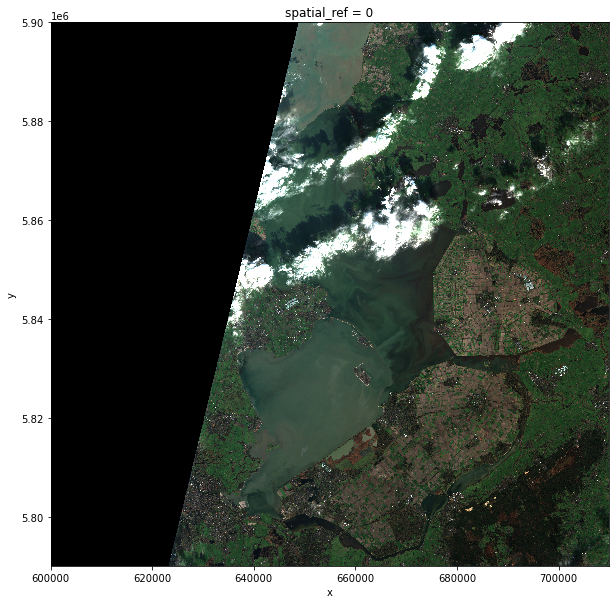
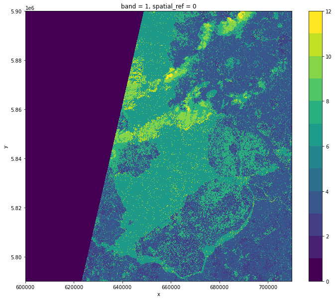
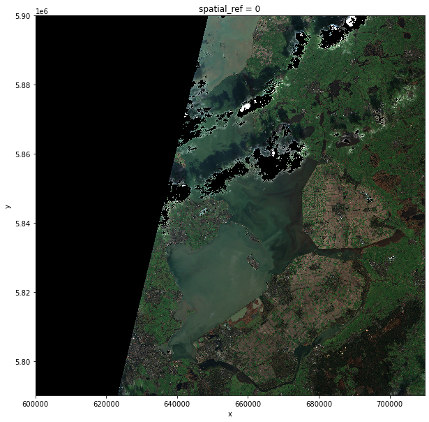

# Introduction
Very often raster computations involve applying the same operation to different pieces of data. Think, for instance, to
the "pixel"-wise sum of two raster datasets, where the same sum operation is applied to all the matching grid-cells of
the two rasters. This class of tasks can benefit from chunking the input raster(s) into smaller pieces: operations on
different data blocks can be run in parallel using multiple computing units (e.g., multi-core CPUs), thus potentially
speeding up calculations. In addition, working on chunked data can also lead to smaller memory footprints, since one
may bypass the need to store the full dataset in memory by processing it chunk by chunk.

In this episode, we will introduce the use of Dask in the context of raster calculations. Dask is a Python library for
parallel and distributed computing that provides a framework to work with different data structures, including chunked
arrays (Dask Arrays). Dask is well integrated with (`rio`)`xarray` objects, which can use Dask arrays as underlying
data structures.

> ## More Resources on Dask
>
> * [Dask Array](https://docs.dask.org/en/stable/array.html).
> * [Xarray with Dask](https://xarray.pydata.org/en/stable/user-guide/dask.html).
>
{: .callout}

It is important to realize, however, that many details determine the extent to which using Dask's chunked arrays instead
of regular Numpy arrays leads to faster calculations (and lower memory requirements). The actual operations to carry
out, the size of the dataset, and parameters such as the chunks' shape and size, all affects the performance of our
computations. Depending on the specifics of the calculations, serial calculations might actually turn out to be faster!
Being able to time profile your calculations is thus essential, and we will see how to do that in a Jupyter environment
in the next section.

# Time profiling calculations in Jupyter

Let's set up a raster calculation using assets from the search of satellite scenes that we have carried out in the
previous episode. The search result, which consisted of a collection of STAC items (an `ItemCollection`), has been saved
in GeoJSON format. We can load the collection using the `pystac` library:

~~~
import pystac
items = pystac.ItemCollection.from_file("mysearch.json")
~~~
{: .language-python}

We select the last scene, and extract the URLs of two assets: the true-color image ("visual") and the scene
classification layer ("SCL"). The latter is a mask where each grid cell is assigned a label that represents a specific
class e.g. "4" for vegetation, "6" for water, etc. (all classes and labels are reported in the
[Sentinel-2 documentation](https://sentinels.copernicus.eu/web/sentinel/technical-guides/sentinel-2-msi/level-2a/algorithm),
see Figure 3):

~~~
assets = items[-1].assets  # last item's assets
visual_href = assets["visual"].href  # true color image
scl_href = assets["SCL"].href  # scene classification layer
~~~
{: .language-python}

Opening the two assets with `rioxarray` shows that the true-color image is available as a raster file with 10 m
resolution, while the scene classification layer has a lower resolution (20 m):

~~~
import rioxarray
scl = rioxarray.open_rasterio(scl_href)
visual = rioxarray.open_rasterio(visual_href)
scl.rio.resolution(), visual.rio.resolution()
~~~
{: .language-python}

~~~
((20.0, -20.0), (10.0, -10.0))
~~~
{: .output}

In order to match the image and the mask pixels, one could load both rasters and resample the finer raster to the
coarser resolution (e.g. with `reproject_match`). Instead, here we take advantage of a feature of the cloud-optimized
GeoTIFF (COG) format, which is used to store these raster files. COGs typically include multiple lower-resolution
versions of the original image, called "overviews", in the same file. This allows to avoid downloading high-resolution
images when only quick previews are required.

Overviews are often computed using powers of 2 as down-sampling (or zoom) factors (e.g. 2, 4, 8, 16). For the true-color
image we thus open the first level overview (zoom factor 2) and check that the resolution is now also 20 m:

~~~
visual = rioxarray.open_rasterio(visual_href, overview_level=0)
visual.rio.resolution()
~~~
{: .language-python}

~~~
(20.0, -20.0)
~~~
{: .output}

We can now time profile the first step of our raster calculation: the (down)loading of the rasters' content. We do it by
using the Jupyter magic `%%time`, which returns the time required to run the content of a cell:

~~~
%%time
scl = scl.load()
visual = visual.load()
~~~
{: .language-python}

~~~
CPU times: user 729 ms, sys: 852 ms, total: 1.58 s
Wall time: 40.5 s
~~~
{: .output}

~~~
visual.plot.imshow(figsize=(10,10))
scl.squeeze().plot.imshow(levels=range(13), figsize=(12,10))
~~~
{: .language-python}

After having loaded the raster files into memory, we run the following steps:
* We create a mask of the grid cells that are labeled as "cloud" in the scene classification layer (values "8" and "9",
  standing for medium- and high-cloud probability, respectively).
* We use this mask to set the corresponding grid cells in the true-color image to null values.
* We save the masked image to disk as in COG format.

Again, we measure the cell execution time using `%%time`:

~~~
%%time
mask = scl.squeeze().isin([8, 9])
visual_masked = visual.where(~mask, other=visual.rio.nodata)
visual_masked.rio.to_raster("band_masked.tif")
~~~
{: .language-python}

~~~
CPU times: user 270 ms, sys: 366 ms, total: 636 ms
Wall time: 647 ms
~~~
{: .output}

We can inspect the masked image as:

~~~
visual_masked.plot.imshow(figsize=(10, 10))
~~~
{: .language-python}

In the following section we will see how to parallelize these raster calculations, and we will compare timings to the
serial calculations that we have just run.

# Dask-powered rasters

## Chunked arrays

As we have mentioned, `rioxarray` supports the use of Dask's chunked arrays as underlying data structure. When opening
a raster file with `open_rasterio` and providing the `chunks` argument, Dask arrays are employed instead of regular
Numpy arrays. `chunks` describes the shape of the blocks which the data will be split in. As an example, we
open the blue band raster ("B02") using a chunk shape of `(1, 4000, 4000)` (block size of `1` in the first dimension and
of `4000` in the second and third dimensions):

~~~
blue_band_href = assets["B02"].href
blue_band = rioxarray.open_rasterio(blue_band_href, chunks=(1, 4000, 4000))
~~~
{: .language-python}

Xarray and Dask also provide a graphical representation of the raster data array and of its blocked structure.

> ## Exercise: Chunk sizes matter
> We have already seen how COGs are regular GeoTIFF files with a special internal structure. Another feature of COGs is
> that data is organized in "blocks" that can be accessed remotely via independent HTTP requests, enabling partial file
> readings. This is useful if you want to access only a portion of your raster file, but it also allows for efficient
> parallel reading. You can check the blocksize employed in a COG file with the following code snippet:
>
> ~~~
> import rasterio
> with rasterio.open(cog_uri) as r:
>     if r.is_tiled:
>         print(f"Chunk size: {r.block_shapes}")
> ~~~
> {: .language-python}
>
> In order to optimally access COGs it is best to align the blocksize of the file with the chunks employed when loading
> the file. Open the blue-band asset ("B02") of a Sentinel-2 scene as a chunked `DataArray` object using a suitable
> chunk size. Which elements do you think should be considered when choosing the chunk size?
>
> > ## Solution
> > ~~~
> > import rasterio
> > with rasterio.open(blue_band_href) as r:
> >     if r.is_tiled:
> >         print(f"Chunk size: {r.block_shapes}")
> > ~~~
> > {: .language-python}
> >
> > ~~~
> > Chunk size: [(1024, 1024)]
> > ~~~
> > {: .output}
> >
> > Ideal chunk size values for this raster are thus multiples of 1024. An element to consider is the number of
> > resulting chunks and their size. Chunks should not be too big nor too small (i.e. too many). As a rule of thumb,
> > chunk sizes of 100 MB typically work well with Dask (see, e.g., this
> > [blog post](https://blog.dask.org/2021/11/02/choosing-dask-chunk-sizes)). Also, the shape might be relevant,
> > depending on the application! Here, we might select a chunks shape of `(1, 6144, 6144)`:
> >
> > ~~~
> > band = rioxarray.open_rasterio(band_url, chunks=(1, 6144, 6144))
> > ~~~
> > {: .language-python}
> >
> > which leads to chunks 72 MB large: (1 x 6144 x 6144) elements, 2 bytes per element (the data type is unsigned
> > integer `uint16`), i.e., 6144 x 6144 x 2 / 2^20 = 72 MB . Also, we can let `rioxarray` and Dask figure out
> > appropriate chunk shapes by setting `chunks="auto"`:
> >
> > ~~~
> > band = rioxarray.open_rasterio(band_url, chunks="auto")
> > ~~~
> > {: .language-python}
> >
> > which leads to `(1, 8192, 8192)` chunks (128 MB).
> {: .solution}
{: .challenge}

## Parallel computations

Operations performed on a `DataArray` that has been opened as a chunked Dask array are executed using Dask. Dask
coordinates how the operations should be executed on the individual chunks of data, and runs these tasks in parallel as
much as possible. By default, Dask parallelizes operations on the CPUs that are available on the same machine, but it
can be configured to dispatch tasks on large compute clusters.

Let's now repeat the raster calculations that we have carried out in the previous section, but running calculations in
parallel over a multi-core CPU. We first open the relevant rasters as chunked arrays:

~~~
scl = rioxarray.open_rasterio(scl_href, lock=False, chunks=(1, 2048, 2048))
visual = rioxarray.open_rasterio(visual_href, overview_level=0, lock=False, chunks=(3, 2048, 2048))
~~~
{: .language-python}

Setting `lock=False` tells `rioxarray` that the individual data chunks can be loaded simultaneously from the source by
the Dask workers. We trigger the download of the data using the `.persist()` method. This makes sure that the downloaded
chunks are stored in the form of a chunked Dask array (calling `.load()` would instead merge the chunks in a single
Numpy array).

We explicitly tell Dask to parallelize the required workload over 4 threads. Don't forget to add the Jupyter magic to
record the timing!

~~~
%%time
scl = scl.persist(scheduler="threads", num_workers=4)
visual = visual.persist(scheduler="threads", num_workers=4)
~~~
{: .language-python}

~~~
CPU times: user 1.18 s, sys: 806 ms, total: 1.99 s
Wall time: 12.6 s
~~~
{: .output}

So downloading chunks of data using 4 workers gave a speed-up of almost 4 times (40.5 s vs 12.6 s)!

Let's now continue to the second step of the calculation. Note how the same syntax as for its serial version is employed
for creating and applying the cloud mask. Only the raster saving includes additional arguments:
* `tiled=True`: write raster as a chunked GeoTIFF.
* `lock=threading.Lock()`: the threads which are splitting the workload must "synchronise" when writing to the same file
  (they might otherwise overwrite each other's output).
* `compute=False`: do not immediately run the calculation, more on this later.

~~~
from threading import Lock
~~~
{: .language-python}

~~~
%%time
mask = scl.squeeze().isin([8, 9])
visual_masked = visual.where(~mask, other=0)
visual_store = visual_masked.rio.to_raster("band_masked.tif", tiled=True, lock=threading.Lock(), compute=False)
~~~
{: .language-python}

~~~
CPU times: user 13.3 ms, sys: 4.98 ms, total: 18.3 ms
Wall time: 17.8 ms
~~~
{. output}

Did we just observe a 36x speed-up when comparing to the serial calculation (647 ms vs 17.8 ms)? Actually, no
calculation has run yet. This is because operations performed on Dask arrays are executed "lazily", i.e. they are not
immediately run. The sequence of operations to carry out is instead stored in a task graph, which can be visualized
with:

~~~
import dask
dask.visualize(visual_store)
~~~
{: .language-python}

The task graph gives Dask the complete "overview" of the calculation, thus enabling a better management of tasks and
resources when dispatching calculations to be run in parallel.

While most methods of `DataArray`'s run operations lazily when Dask arrays are employed, some methods by default
trigger immediate calculations, like the method `to_raster()` (we have changed this behaviour by specifying
`compute=False`). In order to trigger calculations, we can use the `.compute()` method. Again, we explicitly tell Dask
to run tasks on 4 threads. Let's time the cell execution:

~~~
%%time
visual_store.compute(scheduler="threads", num_workers=4)
~~~
{: .language-python}

~~~
CPU times: user 532 ms, sys: 488 ms, total: 1.02 s
Wall time: 791 ms
~~~
{: .output}

The timing that we have recorded for this step is now closer to the one recorded for the serial calculation (the
parallel calculation actually took slightly longer). The explanation for this behaviour lies in the overhead that Dask
introduces to manage the tasks in the Dask graph. This overhead, which is typically of the order of milliseconds per
task, can be larger than the parallelization gain, and this is typically the case for calculations with small chunks
(note that here we have used chunks that are only 4 to 32 MB large).
