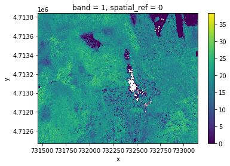
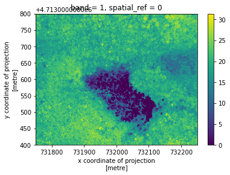
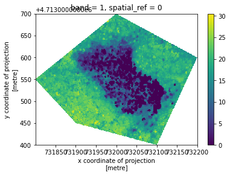
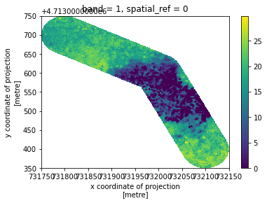
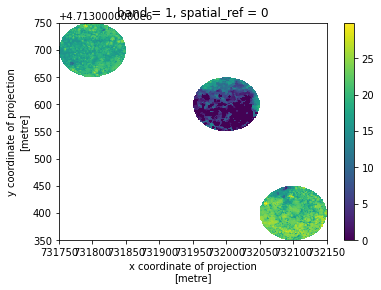

## Load the Canopy Height Model (CHM) data

```python
import rioxarray

# Load data
chm_HARV = rioxarray.open_rasterio("../data/data/NEON-DS-Airborne-Remote-Sensing/HARV/CHM/HARV_chmCrop.tif", masked=True)

# Visualize
chm_HARV.plot()
```



## Crop with a bounding box
```python
# Define the bounding box
bounding_box = dict(minx=731750,
                 maxx=732250,
                 miny=4.7134e6,
                 maxy=4.7138e6,)

# Crop 
chm_HARV_crop = chm_HARV.rio.clip_box(**bounding_box)

# Visualize
chm_HARV_crop.plot()
```



## Crop with a given polygon
```python
# Make a polygon 
import geopandas as gpd
from shapely.geometry import Polygon

# Make a polygon 
xlist= [731800, 732000, 732200, 732100, 731900, 731800]
ylist = [4.71355e6, 4.7137e6, 4.7136e6, 4.7134e6, 4.71345e6, 4.71355e6]
polygon_geom = Polygon(zip(xlist, ylist))
polygon = gpd.GeoDataFrame(index=[0], crs=chm_HARV.rio.crs, geometry=[polygon_geom])       

# Crop
chm_HARV_crop_poly = chm_HARV.rio.clip(polygon['geometry'], polygon.crs)

# Visualize
chm_HARV_crop_poly.plot()
```




## Crop to the buffer of a polyline
```python
from shapely.geometry import LineString

# Make a polyline
xlist= [731800, 732000, 732100]
ylist = [4.7137e6, 4.7136e6, 4.7134e6]
line_geom = LineString(zip(xlist, ylist))
line = gpd.GeoDataFrame(index=[0], crs=chm_HARV.rio.crs, geometry=[line_geom])

# Grow a 50m buffer around the line
polygon_line = line.buffer(50)    

# Crop
chm_HARV_crop_linebuffer = chm_HARV.rio.clip(polygon_line, polygon_line.crs)

# Visualize
chm_HARV_crop_linebuffer.plot()
```




## Crop to the buffer of multiple points
```python
from shapely.geometry import MultiPoint

# Make points
xlist= [731800, 732000, 732100]
ylist = [4.7137e6, 4.7136e6, 4.7134e6]

points_geom = MultiPoint(list(zip(xlist, ylist)))
points = gpd.GeoDataFrame(index=[0], crs=chm_HARV.rio.crs, geometry=[points_geom])

# Grow a 50m buffer around each point
polygon_points = points.buffer(50)

# Crop
chm_HARV_crop_pointsbuffer = chm_HARV.rio.clip(polygon_points, polygon_points.crs)

# Visualize
chm_HARV_crop_pointsbuffer.plot()
```




