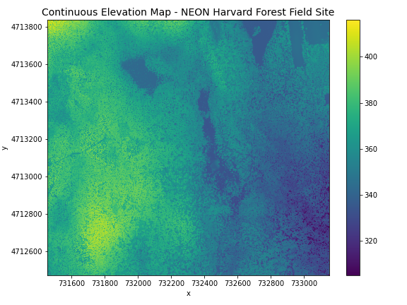

:::questions
- What format should I use to represent my data?
- What are the main data types used for representing geospatial data?
- What are the main attributes of raster data?
:::

:::objectives
- Describe the difference between raster and vector data.
- Describe the strengths and weaknesses of storing data in raster format.
- Distinguish between continuous and categorical raster data and identify types of datasets that would be stored in each format.
:::

## Introduction

This episode introduces the two primary types of data models that are used to digitally represent the Earth surface: raster and vector. After briefly introducing these data models, this episode focuses on the raster representation, describing some major features and types of raster data. This workshop will focus on how to work with both raster and vector data sets, therefore it is essential that we understand the basic structures of these types of data and the types of phenomena that they can represent.

## Data Structures: Raster and Vector

The two primary data models that are used to represent the Earth surface digitally are the raster and vector. **Raster data** is stored as a grid of values which are rendered on a map as pixels (also known as cells) where each pixel (or cell) represents a value of the Earth surface. Examples of raster data are satellite images or aerial photographs. Data stored according to the **vector data** model are represented by points, lines, or polygons. Examples of vector representation are points of interest, buildings (often represented as building footprints) or roads.

Representing phenomena as vector data allows you to add attribute information to them. For instance, a polygon of a house can contain multiple attributes containing information about the address like the street name, zip code, city, and number. More explanations about vector data will be discussed in the [next episode](02-intro-vector-data.md).

When working with spatial information, you will experience that many phenomena can be represented as vector data and raster data. A house, for instance, can be represented by a set of cells in a raster having all the same value or by a polygon as vector containing attribute information (figure 1). It depends on the purpose for which the data is collected and intended to be used which data model it is stored in. But as a rule of thumb, you can apply that discrete phenomena like buildings, roads, trees, signs are represented as vector data, whereas continuous phenomena like temperature, wind speed, elevation are represented as raster data. Yet, one of the things a spatial data analyst often has to do is to transform data from vector to raster or the other way around. Keep in mind that this can cause problems in the data quality.

### Raster Data

Raster data is any pixelated (or gridded) data where each pixel has a value and is associated with a specific geographic location. The value of a pixel can be continuous (e.g., elevation, temperature) or categorical (e.g., land-use type). If this sounds familiar, it is because this data structure is very common: it's how we represent any digital image. A geospatial raster is only different from a digital photo in that it is accompanied by spatial information that connects the data to a particular location. This includes the raster's extent and cell size, the number of rows and columns, and its Coordinate Reference System (CRS), which will be explained in [episode 3](03-crs.md) of this workshop.

{alt="raster concept"}

Some examples of continuous rasters include:

1. Precipitation maps.
2. Elevation maps.

A map of elevation for *Harvard Forest* derived from the [NEON AOP LiDAR sensor](https://www.neonscience.org/data-collection/airborne-remote-sensing)
is below. Elevation is represented as a continuous numeric variable in this map. The legend
shows the continuous range of values in the data from around 300 to 420 meters.

{alt="elevation Harvard forest"}

Some rasters contain categorical data where each pixel represents a discrete
class such as a landcover type (e.g., "forest" or "grassland") rather than a
continuous value such as elevation or temperature. Some examples of classified
maps include:

1. Landcover / land-use maps.
2. Elevation maps classified as low, medium, and high elevation.

{alt="USA landcover classification"}

The map above shows the contiguous United States with landcover as categorical
data. Each color is a different landcover category. (Source: Homer, C.G., et
al., 2015, Completion of the 2011 National Land Cover Database for the
conterminous United States-Representing a decade of land cover change
information. Photogrammetric Engineering and Remote Sensing, v. 81, no. 5, p.
345-354)

:::challenge
## Advantages and Disadvantages

With your neighbor, brainstorm potential advantages and
disadvantages of storing data in raster format. Add your
ideas to the Etherpad. The Instructor will discuss and
add any points that weren't brought up in the small group
discussions.

::::solution
## Solution

Raster data has some important advantages:

* representation of continuous surfaces
* potentially very high levels of detail
* data is 'unweighted' across its extent - the geometry doesn't
implicitly highlight features
* cell-by-cell calculations can be very fast and efficient

The downsides of raster data are:

* very large file sizes as cell size gets smaller
* currently popular formats don't embed metadata well (more on this later!)
* can be difficult to represent complex information
::::
:::

### Important Attributes of Raster Data

#### Extent

The spatial extent is the geographic area that the raster data covers.
The spatial extent of an object represents the geographic edge or
location that is the furthest north, south, east and west. In other words, extent
represents the overall geographic coverage of the spatial object.

{alt="spatial extent objects"}

:::challenge
## Extent Challenge

In the image above, the dashed boxes around each set of objects
seems to imply that the three objects have the same extent. Is this
accurate? If not, which object(s) have a different extent?

::::solution
## Solution

The lines and polygon objects have the same extent. The extent for
the points object is smaller in the vertical direction than the
other two because there are no points on the line at y = 8.
::::
:::

#### Resolution

A resolution of a raster represents the area on the ground that each
pixel of the raster covers. The image below illustrates the effect
of changes in resolution.

{alt="resolution image"}

### Raster Data Format for this Workshop

Raster data can come in many different formats. For this workshop, we will use
one of the most common formats for raster data, i.e. the GeoTIFF format, which has the extension `.tif`.
A `.tif` file stores metadata or attributes about the file as embedded `tif tags`. For instance, your camera
might store a tag that describes the make and model of the camera or the date
the photo was taken when it saves a `.tif`. A GeoTIFF is a standard `.tif` image
format with additional spatial (georeferencing) information embedded in the file
as tags. These tags include the following raster metadata:

1. Extent
2. Resolution
3. Coordinate Reference System (CRS) - we will introduce this concept in [a later episode](03-crs.md)
4. Values that represent missing data (`NoDataValue`) - we will introduce this
   concept in [a later episode](06-raster-intro.md).

We will discuss these attributes in more detail in [a later episode](06-raster-intro.md).
In that episode, we will also learn how to use Python to extract raster attributes
from a GeoTIFF file.

:::callout
## More Resources on the  `.tif` format

* [GeoTIFF on Wikipedia](https://en.wikipedia.org/wiki/GeoTIFF)
* [Open Geospatial Consortium (OGC) GeoTIFF standard](https://www.ogc.org/standards/geotiff/)
:::

### Multi-band Raster Data

A raster can contain one or more bands. One type of multi-band raster
dataset that is familiar to many of us is a color image. A basic color
image often consists of three bands: red, green, and blue (RGB). Each
band represents light reflected from the red, green or blue portions of
the electromagnetic spectrum. The pixel brightness for each band, when
composited creates the colors that we see in an image.

{alt="multi-band raster"}

We can plot each band of a multi-band image individually.

Or we can composite all three bands together to make a color image.

In a multi-band dataset, the rasters will always have the same extent,
resolution, and CRS.

:::callout
## Other Types of Multi-band Raster Data

Multi-band raster data might also contain:
1. **Time series:** the same variable, over the same area, over time.
2. **Multi or hyperspectral imagery:** image rasters that have 4 or
more (multi-spectral) or more than 10-15 (hyperspectral) bands. We
won't be working with this type of data in this workshop, but you can
check out the NEON Data Skills [Imaging Spectroscopy HDF5 in R](https://www.neonscience.org/hsi-hdf5-r)
tutorial if you're interested in working with hyperspectral data cubes.
:::

:::keypoints
- Raster data is pixelated data where each pixel is associated with a specific location.
- Raster data always has an extent and a resolution.
- The extent is the geographical area covered by a raster.
- The resolution is the area covered by each pixel of a raster.
:::
