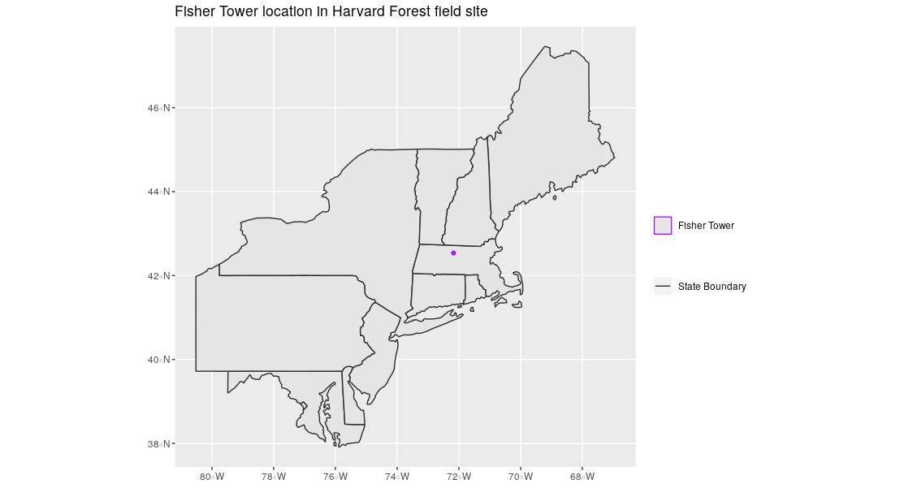

:::questions
- What are the main attributes of vector data?
:::

:::objectives
- Describe the strengths and weaknesses of storing data in vector format.
- Describe the three types of vectors and identify types of data that would be stored in each.
:::

## About Vector Data

Vector data structures represent specific features on the Earth's surface, and
assign attributes to those features. Vectors are composed of discrete geometric
locations (x, y values) known as vertices that define the shape of the spatial
object. The organization of the vertices determines the type of vector that we
are working with: point, line or polygon.

{alt="vector data types"}

* **Points:** Each point is defined by a single x, y coordinate. There can be
many points in a vector point file. Examples of point data include: sampling
locations, the location of individual trees, or the location of survey plots.

* **Lines:** Lines are composed of many (at least 2) points that are connected.
For instance, a road or a stream may be represented by a line. This line is
composed of a series of segments, each "bend" in the road or stream represents a
vertex that has a defined x, y location.

* **Polygons:** A polygon consists of 3 or more vertices that are connected and
closed. The outlines of survey plot boundaries, lakes, oceans, and states or
countries are often represented by polygons. Note, that polygons can also contain one 
or multiple holes, for instance a plot boundary with a lake in it. These polygons are 
considered *complex* or *donut* polygons. 

:::callout
## Data Tip

Sometimes, boundary layers such as states and countries, are stored as lines
rather than polygons. However, these boundaries, when represented as a line,
will not create a closed object with a defined area that can be filled.
:::

:::challenge
## Identify Vector Types

The plot below includes examples of two of the three types of vector
objects. Use the definitions above to identify which features
are represented by which vector type.

{alt="vector type examples"}

::::solution
## Solution

State boundaries are shown as polygons. The Fisher Tower location is
represented by a purple point. There are no line features shown. 
Note, that at a different scale the Fischer Tower coudl also have been represented as a polygon. 
Keep in mind that the purpose for which the dataset is created and aimed to be used for determines 
which vector type it uses. 
::::
:::

Vector data has some important advantages:

* The geometry itself contains information about what the dataset creator thought was important
* The geometry structures hold information in themselves - why choose point over polygon, for instance?
* Each geometry feature can carry multiple attributes instead of just one, e.g. a database of cities can have attributes for name, country, population, etc
* Data storage can, depending on the scale, be very efficient compared to rasters
* When working with network analysis, for instance to calculate the shortest route between A and B, topologically correct lines are essential. This is not possible through raster data. 

The downsides of vector data include:

* Potential bias in datasets - what didn't get recorded? Often vector data are interpreted datasets like topographical maps and have been collected by someone else, for another purpose.
* Calculations involving multiple vector layers need to do math on the
  geometry as well as the attributes, which potentially can be slow compared to raster calculations.

Vector datasets are in use in many industries besides geospatial fields. For
instance, computer graphics are largely vector-based, although the data
structures in use tend to join points using arcs and complex curves rather than
straight lines. Computer-aided design (CAD) is also vector- based. The
difference is that geospatial datasets are accompanied by information tying
their features to real-world locations.

## Vector Data Format for this Workshop

Like raster data, vector data can also come in many different formats. For this
workshop, we will use the GeoPackage format. GeoPackage is developed by the [Open Geospatial Consortium](https://www.ogc.org/) and is *is an open, standards-based, platform-independent, portable, self-describing, compact format for transferring geospatial information.* (source: [https://www.geopackage.org/](https://www.geopackage.org/) ) A GeoPackage file, **.gpkg**, is a single file that contains the geometries of features, their attributes and information about the CRS used.  

Another vector format that you will probably come accross quite often is a Shapefile. Although we will not be using that format in this workshop we do believe it is useful to understand how that format works. A Shapefile format consists of multiple files in the same directory, of which `.shp`, `.shx`, and `.dbf` files are mandatory. Other non-mandatory but very important files are `.prj` and `shp.xml` files.

- The `.shp` file stores the feature geometry itself
- `.shx` is a positional index of the feature geometry to allow quickly searching forwards and backwards the geographic coordinates of each vertex in the vector
- `.dbf` contains the tabular attributes for each shape.
- `.prj` file indicates the Coordinate reference system (CRS)
- `.shp.xml` contains the Shapefile metadata.

Together, the Shapefile includes the following information:

* **Extent** - the spatial extent of the shapefile (i.e. geographic area that
the shapefile covers). The spatial extent for a shapefile represents the
combined extent for all spatial objects in the shapefile.
* **Object type** - whether the shapefile includes points, lines, or polygons.
* **Coordinate reference system (CRS)**
* **Other attributes** - for example, a line shapefile that contains the
locations of streams, might contain the name of each stream.

Because the structure of points, lines, and polygons are different, each
individual shapefile can only contain one vector type (all points, all lines
or all polygons). You will not find a mixture of point, line and polygon
objects in a single shapefile.

:::callout
## More Resources on Shapefiles

More about shapefiles can be found on
[Wikipedia.](https://en.wikipedia.org/wiki/Shapefile) Shapefiles are often publicly
available from government services, such as [this page containing all administrative boundaries for countries in the world](https://gadm.org/download_country.html) or
[topographical vector data from Open Street Maps](https://download.geofabrik.de/).
:::

:::callout
## Why not both?

Very few formats can contain both raster and vector data - in fact, most are
even more restrictive than that. Vector datasets are usually locked to one
geometry type, e.g. points only. Raster datasets can usually only encode one
data type, for example you can't have a multiband GeoTIFF where one layer is
integer data and another is floating-point. There are sound reasons for this -
format standards are easier to define and maintain, and so is metadata. The
effects of particular data manipulations are more predictable if you are
confident that all of your input data has the same characteristics.
:::

:::keypoints
- Vector data structures represent specific features on the Earth's surface along with attributes of those features.
- Vector data is often interpreted data and collected for a different purpose than you would want to use it for.
- Vector objects are either points, lines, or polygons.
:::
