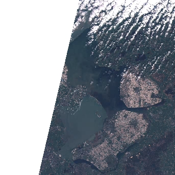

:::questions
- Where can I find open-access satellite data?
- How do I search for satellite imagery with the STAC API?
- How do I fetch remote raster datasets using Python?
:::

:::objectives
- Search public STAC repositories of satellite imagery using Python.
- Inspect search result's metadata.
- Download (a subset of) the assets available for a satellite scene.
- Open satellite imagery as raster data and save it to disk.
:::


## Introduction

A number of satellites take snapshots of the Earth's surface from space. The images recorded by these remote sensors
represent a very precious data source for any activity that involves monitoring changes on Earth. Satellite imagery is
typically provided in the form of geospatial raster data, with the measurements in each grid cell ("pixel") being
associated to accurate geographic coordinate information.

In this episode we will explore how to access open satellite data using Python. In particular,  we will
consider [the Sentinel-2 data collection that is hosted on AWS](https://registry.opendata.aws/sentinel-2-l2a-cogs).
This dataset consists of multi-band optical images acquired by the two satellites of
[the Sentinel-2 mission](https://sentinel.esa.int/web/sentinel/missions/sentinel-2) and it is continuously updated with
new images.

## Search for satellite imagery

### The SpatioTemporal Asset Catalog (STAC) specification

Current sensor resolutions and satellite revisit periods are such that terabytes of data products are added daily to the
corresponding collections. Such datasets cannot be made accessible to users via full-catalog download. Space agencies
and other data providers often offer access to their data catalogs through interactive Graphical User Interfaces (GUIs),
see for instance the [Copernicus Open Access Hub portal](https://scihub.copernicus.eu/dhus/#/home) for the Sentinel
missions. Accessing data via a GUI is a nice way to explore a catalog and get familiar with its content, but it
represents a heavy and error-prone task that should be avoided if carried out systematically to retrieve data.

A service that offers programmatic access to the data enables users to reach the desired data in a more reliable,
scalable and reproducible manner. An important element in the software interface exposed to the users, which is generally called
the Application Programming Interface (API), is the use of standards. Standards, in fact, can significantly facilitate
the reusability of tools and scripts across datasets and applications.

The SpatioTemporal Asset Catalog (STAC) specification is an emerging standard for describing geospatial data. By
organizing metadata in a form that adheres to the STAC specifications, data providers make it possible for users to
access data from different missions, instruments and collections using the same set of tools.

{alt="STAC browser screenshots"}

:::callout
## More Resources on STAC
- [STAC specification](https://github.com/radiantearth/stac-spec#readme)
- [Tools based on STAC](https://stacindex.org/ecosystem)
- [STAC catalogs](https://stacindex.org/catalogs)
:::

## Search a STAC catalog

The [STAC browser](https://radiantearth.github.io/stac-browser/#/) is a good starting point to discover available
datasets, as it provides an up-to-date list of existing STAC catalogs. From the list, let's click on the
"Earth Search" catalog, i.e. the access point to search the archive of Sentinel-2 images hosted on AWS.

:::challenge
## Exercise: Discover a STAC catalog
Let's take a moment to explore the Earth Search STAC catalog, which is the catalog indexing the Sentinel-2 collection
that is hosted on AWS. We can interactively browse this catalog using the STAC browser at [this link](https://radiantearth.github.io/stac-browser/#/external/earth-search.aws.element84.com/v1).

1. Open the link in your web browser. Which (sub-)catalogs are available?
2. Open the Sentinel-2 Level 2A collection, and select one item from the list. Each item corresponds to a satellite
"scene", i.e. a portion of the footage recorded by the satellite at a given time. Have a look at the metadata fields
and the list of assets. What kind of data do the assets represent?

::::solution


1. 7 subcatalogs are available, including a catalog for Landsat Collection 2, Level-2 and Sentinel-2 Level 2A (see left screenshot in the figure above).
2. When you select the Sentinel-2 Level 2A collection, and randomly choose one of the items from the list, you
should find yourself on a page similar to the right screenshot in the figure above. On the left side you will find
a list of the available assets: overview images (thumbnail and true color images), metadata files and the "real"
satellite images, one for each band captured by the Multispectral Instrument on board Sentinel-2.
::::
:::

When opening a catalog with the STAC browser, you can access the API URL by clicking on the "Source" button on the top
right of the page. By using this URL, we have access to the catalog content and, if supported by the catalog, to the
functionality of searching its items. For the Earth Search STAC catalog the API URL is:

```python
api_url = "https://earth-search.aws.element84.com/v1"
```

You can query a STAC API endpoint from Python using the `pystac_client` library:

```python
from pystac_client import Client

client = Client.open(api_url)
```

In the following, we ask for scenes belonging to the `sentinel-2-l2a` collection. This dataset includes Sentinel-2
data products pre-processed at level 2A (bottom-of-atmosphere reflectance) and saved in Cloud Optimized GeoTIFF (COG)
format:

```python
collection = "sentinel-2-l2a"  # Sentinel-2, Level 2A, Cloud Optimized GeoTiffs (COGs)
```

:::callout
## Cloud Optimized GeoTIFFs

Cloud Optimized GeoTIFFs (COGs) are regular GeoTIFF files with some additional features that make them ideal to be
employed in the context of cloud computing and other web-based services. This format builds on the widely-employed
GeoTIFF format, already introduced in [Episode 1: Introduction to Raster Data]({{site.baseurl}}/01-intro-raster-data/).
In essence, COGs are regular GeoTIFF files with a special internal structure. One of the features of COGs is that data
is organized in "blocks" that can be accessed remotely via independent HTTP requests. Data users can thus access the
only blocks of a GeoTIFF that are relevant for their analysis, without having to download the full file. In addition,
COGs typically include multiple lower-resolution versions of the original image, called "overviews", which can also be
accessed independently. By providing this "pyramidal" structure, users that are not interested in the details provided
by a high-resolution raster can directly access the lower-resolution versions of the same image, significantly saving
on the downloading time. More information on the COG format can be found [here](https://www.cogeo.org).
:::

We also ask for scenes intersecting a geometry defined using the `shapely` library (in this case, a point):

```python
from shapely.geometry import Point
point = Point(4.89, 52.37)  # AMS coordinates
```

Note: at this stage, we are only dealing with metadata, so no image is going to be downloaded yet. But even metadata can
be quite bulky if a large number of scenes match our search! For this reason, we limit the search result to 10 items:

```python
search = client.search(
    collections=[collection],
    intersects=point,
    max_items=10,
)
```

We submit the query and find out how many scenes match our search criteria (please note that this output can be different as more data is added to the catalog):

```python
print(search.matched())
```

```output
840
```

Finally, we retrieve the metadata of the search results:

```python
items = search.item_collection()
```

The variable `items` is an `ItemCollection` object. We can check its size by:

```python
print(len(items))
```

```output
10
```

which is consistent with the maximum number of items that we have set in the search criteria. We can iterate over
the returned items and print these to show their IDs:

```python
for item in items:
    print(item)
```

```output
<Item id=S2A_31UFU_20230701_0_L2A>
<Item id=S2B_31UFU_20230629_0_L2A>
<Item id=S2B_31UFU_20230626_0_L2A>
<Item id=S2A_31UFU_20230624_0_L2A>
<Item id=S2A_31UFU_20230621_0_L2A>
<Item id=S2B_31UFU_20230616_0_L2A>
<Item id=S2A_31UFU_20230614_0_L2A>
<Item id=S2A_31UFU_20230611_0_L2A>
<Item id=S2B_31UFU_20230609_0_L2A>
<Item id=S2B_31UFU_20230606_0_L2A>
```

Each of the items contains information about the scene geometry, its acquisition time, and other metadata that can be
accessed as a dictionary from the `properties` attribute.

Let's inspect the metadata associated with the first item of the search results:
```python
item = items[0]
print(item.datetime)
print(item.geometry)
print(item.properties)
```

```output
2023-07-01 10:46:30.262000+00:00
{'type': 'Polygon', 'coordinates': [[[5.233744523520149, 53.228684673408296], [6.141754296879459, 53.20819279121764], [6.071664488869862, 52.22257539160585], [4.80943323800081, 52.2486879358387], [5.233744523520149, 53.228684673408296]]]}
{'created': '2023-07-02T01:49:17.191Z', 'platform': 'sentinel-2a', 'constellation': 'sentinel-2', 'instruments': ['msi'], 'eo:cloud_cover': 99.952936, 'proj:epsg': 32631, 'mgrs:utm_zone': 31, 'mgrs:latitude_band': 'U', 'mgrs:grid_square': 'FU', 'grid:code': 'MGRS-31UFU', 'view:sun_azimuth': 154.716674921261, 'view:sun_elevation': 58.4960054056685, 's2:degraded_msi_data_percentage': 0.0346, 's2:nodata_pixel_percentage': 33.00232, 's2:saturated_defective_pixel_percentage': 0, 's2:dark_features_percentage': 0, 's2:cloud_shadow_percentage': 0.030847, 's2:vegetation_percentage': 0, 's2:not_vegetated_percentage': 0.004947, 's2:water_percentage': 0.011271, 's2:unclassified_percentage': 0, 's2:medium_proba_clouds_percentage': 5.838514, 's2:high_proba_clouds_percentage': 94.035202, 's2:thin_cirrus_percentage': 0.07922, 's2:snow_ice_percentage': 0, 's2:product_type': 'S2MSI2A', 's2:processing_baseline': '05.09', 's2:product_uri': 'S2A_MSIL2A_20230701T103631_N0509_R008_T31UFU_20230701T200058.SAFE', 's2:generation_time': '2023-07-01T20:00:58.000000Z', 's2:datatake_id': 'GS2A_20230701T103631_041904_N05.09', 's2:datatake_type': 'INS-NOBS', 's2:datastrip_id': 'S2A_OPER_MSI_L2A_DS_2APS_20230701T200058_S20230701T104159_N05.09', 's2:granule_id': 'S2A_OPER_MSI_L2A_TL_2APS_20230701T200058_A041904_T31UFU_N05.09', 's2:reflectance_conversion_factor': 0.967641353116838, 'datetime': '2023-07-01T10:46:30.262000Z', 's2:sequence': '0', 'earthsearch:s3_path': 's3://sentinel-cogs/sentinel-s2-l2a-cogs/31/U/FU/2023/7/S2A_31UFU_20230701_0_L2A', 'earthsearch:payload_id': 'roda-sentinel2/workflow-sentinel2-to-stac/7b1a81ed3fb8d763a0cecf8d9edd4d4a', 'earthsearch:boa_offset_applied': True, 'processing:software': {'sentinel2-to-stac': '0.1.0'}, 'updated': '2023-07-02T01:49:17.191Z'}
```

:::challenge
## Exercise: Search satellite scenes using metadata filters
Search for all the available Sentinel-2 scenes in the `sentinel-2-l2a` collection that satisfy the following
criteria:
- intersect a provided bounding box (use ±0.01 deg in lat/lon from the previously defined point);
- have been recorded between 20 March 2020 and 30 March 2020;
- have a cloud coverage smaller than 10% (hint: use the `query` input argument of `client.search`).

How many scenes are available? Save the search results in GeoJSON format.

::::solution
```python
bbox = point.buffer(0.01).bounds
```

```python
search = client.search(
    collections=[collection],
    bbox=bbox,
    datetime="2020-03-20/2020-03-30",
    query=["eo:cloud_cover<15"]
)
print(search.matched())
```

```output
4
```

```python
items = search.item_collection()
items.save_object("search.json")
```
::::
:::

## Access the assets

So far we have only discussed metadata - but how can one get to the actual images of a satellite scene (the "assets" in
the STAC nomenclature)? These can be reached via links that are made available through the item's attribute `assets`.

```python
assets = items[0].assets  # first item's asset dictionary
print(assets.keys())
```

```output
dict_keys(['aot', 'blue', 'coastal', 'granule_metadata', 'green', 'nir', 'nir08', 'nir09', 'red', 'rededge1', 'rededge2', 'rededge3', 'scl', 'swir16', 'swir22', 'thumbnail', 'tileinfo_metadata', 'visual', 'wvp', 'aot-jp2', 'blue-jp2', 'coastal-jp2', 'green-jp2', 'nir-jp2', 'nir08-jp2', 'nir09-jp2', 'red-jp2', 'rededge1-jp2', 'rededge2-jp2', 'rededge3-jp2', 'scl-jp2', 'swir16-jp2', 'swir22-jp2', 'visual-jp2', 'wvp-jp2'])
```

We can print a minimal description of the available assets:

```python
for key, asset in assets.items():
    print(f"{key}: {asset.title}")
```

```output
aot: Aerosol optical thickness (AOT)
blue: Blue (band 2) - 10m
coastal: Coastal aerosol (band 1) - 60m
granule_metadata: None
green: Green (band 3) - 10m
nir: NIR 1 (band 8) - 10m
nir08: NIR 2 (band 8A) - 20m
nir09: NIR 3 (band 9) - 60m
red: Red (band 4) - 10m
rededge1: Red edge 1 (band 5) - 20m
rededge2: Red edge 2 (band 6) - 20m
rededge3: Red edge 3 (band 7) - 20m
scl: Scene classification map (SCL)
swir16: SWIR 1 (band 11) - 20m
swir22: SWIR 2 (band 12) - 20m
thumbnail: Thumbnail image
tileinfo_metadata: None
visual: True color image
wvp: Water vapour (WVP)
aot-jp2: Aerosol optical thickness (AOT)
blue-jp2: Blue (band 2) - 10m
coastal-jp2: Coastal aerosol (band 1) - 60m
green-jp2: Green (band 3) - 10m
nir-jp2: NIR 1 (band 8) - 10m
nir08-jp2: NIR 2 (band 8A) - 20m
nir09-jp2: NIR 3 (band 9) - 60m
red-jp2: Red (band 4) - 10m
rededge1-jp2: Red edge 1 (band 5) - 20m
rededge2-jp2: Red edge 2 (band 6) - 20m
rededge3-jp2: Red edge 3 (band 7) - 20m
scl-jp2: Scene classification map (SCL)
swir16-jp2: SWIR 1 (band 11) - 20m
swir22-jp2: SWIR 2 (band 12) - 20m
visual-jp2: True color image
wvp-jp2: Water vapour (WVP)
```

Among the others, assets include multiple raster data files (one per optical band, as acquired by the multi-spectral
instrument), a thumbnail, a true-color image ("visual"), instrument metadata and scene-classification information
("SCL"). Let's get the URL links to the actual asset:

```python
print(assets["thumbnail"].href)
```

```output
https://sentinel-cogs.s3.us-west-2.amazonaws.com/sentinel-s2-l2a-cogs/31/U/FU/2020/3/S2A_31UFU_20200328_0_L2A/thumbnail.jpg
```

This can be used to download the corresponding file:

{alt="thumbnail of the sentinel-2 scene"}

Remote raster data can be directly opened via the `rioxarray` library. We will
learn more about this library in the next episodes.
```python
import rioxarray
nir_href = assets["nir"].href
nir = rioxarray.open_rasterio(nir_href)
print(nir)
```

```output
<xarray.DataArray (band: 1, y: 10980, x: 10980)>
[120560400 values with dtype=uint16]
Coordinates:
  * band         (band) int64 1
  * x            (x) float64 6e+05 6e+05 6e+05 ... 7.098e+05 7.098e+05 7.098e+05
  * y            (y) float64 5.9e+06 5.9e+06 5.9e+06 ... 5.79e+06 5.79e+06
    spatial_ref  int64 0
Attributes:
    AREA_OR_POINT:       Area
    OVR_RESAMPLING_ALG:  AVERAGE
    _FillValue:          0
    scale_factor:        1.0
    add_offset:          0.0
```

We can then save the data to disk:

```python
# save whole image to disk
nir.rio.to_raster("nir.tif")
```

Since that might take a while, given there are over 10000 x 10000 = a hundred million pixels in the 10 meter NIR band, you can take a smaller subset before downloading it. Becuase the raster is a COG, we can download just what we need!

Here, we specify that we want to download the first (and only) band in the tif file, and a slice of the width and height dimensions.

```python
# save portion of an image to disk
nir[0,1500:2200,1500:2200].rio.to_raster("nir_subset.tif")
```

The difference is 155 Megabytes for the large image vs about 1 Megabyte for the subset.

:::challenge
## Exercise: Downloading Landsat 8 Assets
In this exercise we put in practice all the skills we have learned in this episode to retrieve images from a different
mission: [Landsat 8](https://www.usgs.gov/landsat-missions/landsat-8). In particular, we browse images from the
[Harmonized Landsat Sentinel-2 (HLS) project](https://lpdaac.usgs.gov/products/hlsl30v002/), which provides images
from NASA's Landsat 8 and ESA's Sentinel-2 that have been made consistent with each other. The HLS catalog is indexed
in the NASA Common Metadata Repository (CMR) and it can be accessed from the STAC API endpoint at the following URL:
`https://cmr.earthdata.nasa.gov/stac/LPCLOUD`.

- Using `pystac_client`, search for all assets of the Landsat 8 collection (`HLSL30.v2.0`) from February to March
  2021, intersecting the point with longitude/latitute coordinates (-73.97, 40.78) deg.
- Visualize an item's thumbnail (asset key `browse`).

::::solution
```python
# connect to the STAC endpoint
cmr_api_url = "https://cmr.earthdata.nasa.gov/stac/LPCLOUD"
client = Client.open(cmr_api_url)

# setup search
search = client.search(
    collections=["HLSL30.v2.0"],
    intersects=Point(-73.97, 40.78),
    datetime="2021-02-01/2021-03-30",
) # nasa cmr cloud cover filtering is currently broken: https://github.com/nasa/cmr-stac/issues/239

# retrieve search results
items = search.item_collection()
print(len(items))
```

```output
5
```

```python
items_sorted = sorted(items, key=lambda x: x.properties["eo:cloud_cover"]) # sorting and then selecting by cloud cover
item = items_sorted[0]
print(item)
```

```output
<Item id=HLS.L30.T18TWL.2021039T153324.v2.0>
```

```python
print(item.assets["browse"].href)
```


```output
'https://data.lpdaac.earthdatacloud.nasa.gov/lp-prod-public/HLSL30.020/HLS.L30.T18TWL.2021039T153324.v2.0/HLS.L30.T18TWL.039T153324.v2.0.jpg'
```

{alt="thumbnail of the landsat-8 scene"}
::::
:::

:::callout
## Public catalogs, protected data

Publicly accessible catalogs and STAC endpoints do not necessarily imply publicly accessible data. Data providers, in
fact, may limit data access to specific infrastructures and/or require authentication. For instance, the NASA CMR STAC
endpoint considered in the last exercise offers publicly accessible metadata for the HLS collection, but most of the
linked assets are available only for registered users (the thumbnail is publicly accessible).

The authentication procedure for dataset with restricted access might differ depending on the data provider. For the
NASA CMR, follow these steps in order to access data using Python:
* Create a NASA Earthdata login account [here](https://urs.earthdata.nasa.gov);
* Set up a netrc file with your credentials, e.g. by using [this script](https://git.earthdata.nasa.gov/projects/LPDUR/repos/daac_data_download_python/browse/EarthdataLoginSetup.py);
* Define the following environment variables:

```python
import os
os.environ["GDAL_HTTP_COOKIEFILE"] = "./cookies.txt"
os.environ["GDAL_HTTP_COOKIEJAR"] = "./cookies.txt"
```
:::

:::keypoints
 - Accessing satellite images via the providers' API enables a more reliable and scalable data retrieval.
 - STAC catalogs can be browsed and searched using the same tools and scripts.
 - `rioxarray` allows you to open and download remote raster files.
 :::
