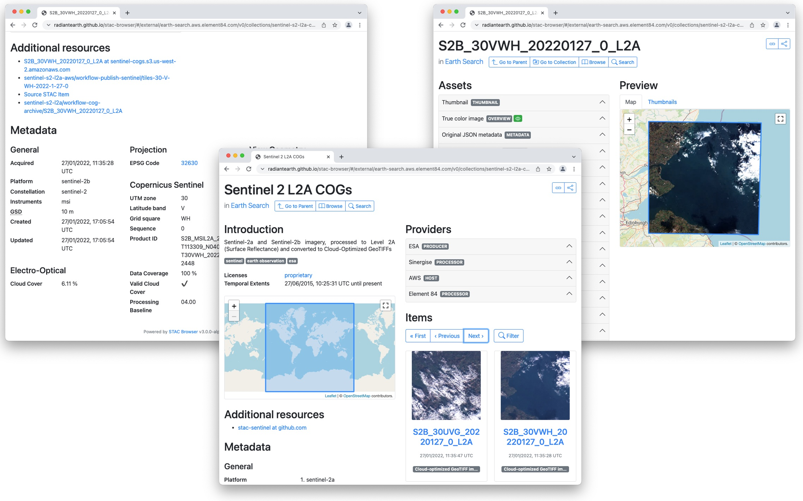
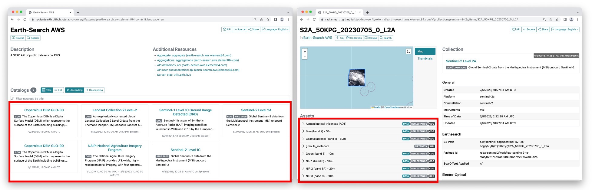
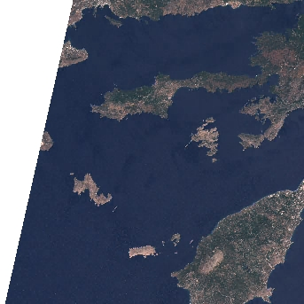
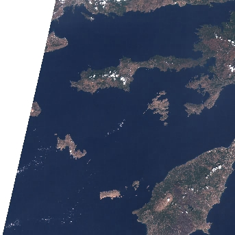
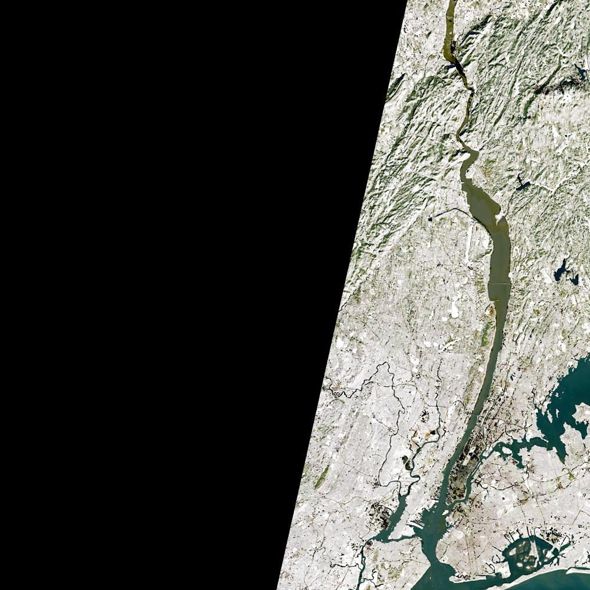

:::questions
- Where can I find open-access satellite data?
- How do I search for satellite imagery with the STAC API?
- How do I fetch remote raster datasets using Python?
:::

:::objectives
- Search public STAC repositories of satellite imagery using Python.
- Inspect search result's metadata.
- Download (a subset of) the assets available for a satellite scene.
- Open satellite imagery as raster data and save it to disk.
:::

## Introduction

A number of satellites take snapshots of the Earth's surface from space. The images recorded by these remote sensors
represent a very precious data source for any activity that involves monitoring changes on Earth. Satellite imagery is
typically provided in the form of geospatial raster data, with the measurements in each grid cell ("pixel") being
associated to accurate geographic coordinate information.

In this episode we will explore how to access open satellite data using Python. In particular,  we will
consider [the Sentinel-2 data collection that is hosted on Amazon Web Services (AWS)](https://registry.opendata.aws/sentinel-2-l2a-cogs).
This dataset consists of multi-band optical images acquired by the two satellite constellations of
[the Sentinel-2 mission](https://sentinel.esa.int/web/sentinel/missions/sentinel-2) and it is continuously updated with
new images.

## Search for satellite imagery

### The SpatioTemporal Asset Catalog (STAC) specification

Current sensor resolutions and satellite revisit periods are such that terabytes of data products are added daily to the
corresponding collections. Such datasets cannot be made accessible to users via full-catalog download. Therefore, space agencies and other data providers often offer access to their data catalogs through interactive Graphical User Interfaces (GUIs), see for instance the [Copernicus Browser](https://browser.dataspace.copernicus.eu) for the Sentinel
missions. Accessing data via a GUI is a nice way to explore a catalog and get familiar with its content, but it
represents a heavy and error-prone task that should be avoided if carried out systematically to retrieve data.

A service that offers programmatic access to the data enables users to reach the desired data in a more reliable,
scalable and reproducible manner. An important element in the software interface exposed to the users, which is generally called
the Application Programming Interface (API), is the use of standards. Standards, in fact, can significantly facilitate
the reusability of tools and scripts across datasets and applications.

The SpatioTemporal Asset Catalog (STAC) specification is an emerging standard for describing geospatial data. By
organizing metadata in a form that adheres to the STAC specifications, data providers make it possible for users to
access data from different missions, instruments and collections using the same set of tools.

{alt="STAC browser screenshots"}

:::callout
## More Resources on STAC
- [STAC specification](https://github.com/radiantearth/stac-spec#readme)
- [Tools based on STAC](https://stacindex.org/ecosystem)
- [STAC catalogs](https://stacindex.org/catalogs)
:::

## Search a STAC catalog

The [STAC browser](https://radiantearth.github.io/stac-browser/#/) is a good starting point to discover available
datasets, as it provides an up-to-date list of existing STAC catalogs. From the list, let's click on the
"Earth Search" catalog, i.e. the access point to search the archive of Sentinel-2 images hosted on AWS.

:::challenge
## Exercise: Discover a STAC catalog
Let's take a moment to explore the Earth Search STAC catalog, which is the catalog indexing the Sentinel-2 collection
that is hosted on AWS. We can interactively browse this catalog using the STAC browser at [this link](https://radiantearth.github.io/stac-browser/#/external/earth-search.aws.element84.com/v1).

1. Open the link in your web browser. Which (sub-)catalogs are available?
2. Open the Sentinel-2 Level 2A collection, and select one item from the list. Each item corresponds to a satellite
"scene", i.e. a portion of the footage recorded by the satellite at a given time. Have a look at the metadata fields
and the list of assets. What kind of data do the assets represent?

::::solution

{alt="earth-search stac catalog views"}

1. 8 sub-catalogs are available. In the STAC nomenclature, these are actually "collections", i.e. catalogs with
additional information about the elements they list: spatial and temporal extents, license, providers, etc.
Among the available collections, we have Landsat Collection 2, Level-2 and Sentinel-2 Level 2A (see left screenshot in
the figure above).
2. When you select the Sentinel-2 Level 2A collection, and randomly choose one of the items from the list, you
should find yourself on a page similar to the right screenshot in the figure above. On the left side you will find
a list of the available assets: overview images (thumbnail and true color images), metadata files and the "real"
satellite images, one for each band captured by the Multispectral Instrument on board Sentinel-2.
::::
:::

When opening a catalog with the STAC browser, you can access the API URL by clicking on the "Source" button on the top
right of the page. By using this URL, we have access to the catalog content and, if supported by the catalog, to the
functionality of searching its items. For the Earth Search STAC catalog the API URL is:

```python
api_url = "https://earth-search.aws.element84.com/v1"
```

You can query a STAC API endpoint from Python using the [`pystac_client` library](https://pystac-client.readthedocs.io/en/stable/api.html#pystac_client). To do so we will first import `Client` from `pystac_client` and use the [method open from the Client class](https://pystac-client.readthedocs.io/en/stable/quickstart.html):

```python
from pystac_client import Client

client = Client.open(api_url)
```

For this episode we will focus at scenes belonging to the `sentinel-2-l2a` collection. This dataset is useful for our case and includes Sentinel-2 data products pre-processed at level 2A (bottom-of-atmosphere reflectance). 

In order to see which collections are available in the provided `api_url` the [`get_collections`](https://pystac-client.readthedocs.io/en/stable/api.html#pystac_client.Client.get_collections) method can be used on the Client class. 

```python
collections = client.get_collections()
```
To print the collections we can make a for loop doing:

```python
for collection in collections:
    print(collection)
```
```output
<CollectionClient id=cop-dem-glo-30>
<CollectionClient id=naip>
<CollectionClient id=sentinel-2-l2a>
<CollectionClient id=sentinel-2-l1c>
<CollectionClient id=cop-dem-glo-90>
<CollectionClient id=landsat-c2-l2>
<CollectionClient id=sentinel-1-grd>
<CollectionClient id=sentinel-2-c1-l2a>
```

As said, we want to focus to the `sentinel-2-l2a` collection. To do so, we set this collection into a variable:

```python
collection_sentinel_2_l2a = "sentinel-2-l2a"  
```

The data in this collection is stored in the Cloud Optimized GeoTIFF (COG) format and as JPEG2000 images. In this episode we will focus at COGs, as these offer useful functionalities for our purpose. 


:::callout
## Cloud Optimized GeoTIFFs

Cloud Optimized GeoTIFFs (COGs) are regular GeoTIFF files with some additional features that make them ideal to be
employed in the context of cloud computing and other web-based services. This format builds on the widely-employed
GeoTIFF format, already introduced in [Episode 1: Introduction to Raster Data](01-intro-raster-data.md).
In essence, COGs are regular GeoTIFF files with a special internal structure. One of the features of COGs is that data
is organized in "blocks" that can be accessed remotely via independent HTTP requests. Data users can thus access the
only blocks of a GeoTIFF that are relevant for their analysis, without having to download the full file. In addition,
COGs typically include multiple lower-resolution versions of the original image, called "overviews", which can also be
accessed independently. By providing this "pyramidal" structure, users that are not interested in the details provided
by a high-resolution raster can directly access the lower-resolution versions of the same image, significantly saving
on the downloading time. More information on the COG format can be found [here](https://www.cogeo.org).
:::

In order to get data for a specific location you can add longitude latitude coordinates (World Geodetic System 1984 EPSG:4326) in your request. In order to do so we are using the `shapely` library to define a geometrical point.
Below we have included a center point for the island of Rhodes, which is the location of interest for our case study (i.e. Longitude: 27.95 | Latitude 36.20).

```python
from shapely.geometry import Point
point = Point(27.95, 36.20)  # Coordinates of a point on Rhodes
```

Note: at this stage, we are only dealing with metadata, so no image is going to be downloaded yet. But even metadata can
be quite bulky if a large number of scenes match our search! For this reason, we limit the search by the intersection of the point (by setting the parameter `intersects`) and assign the collection (by setting the parameter `collections`).  More information about the possible parameters to be set can be found in the `pystac_client` documentation for the [Client's search method](https://pystac-client.readthedocs.io/en/stable/api.html#pystac_client.Client.search).

We now set up our search of satellite images in the following way:

```python
search = client.search(
    collections=[collection_sentinel_2_l2a],
    intersects=point,
)
```

Now we submit the query in order te find out how many scenes match our search criteria with the parameters assigned above (please note that this output can be different as more data is added to the catalog to when this episode was created):

```python
print(search.matched())
```

```output
611
```

You will notice that more than 500 scenes match our search criteria. We are however interested in the period right before and after the wildfire of Rhodes. In the following exercise you will therefore have to add a time filter to
our search criteria to narrow down our search for images of that period.

:::challenge
## Exercise: Search satellite scenes with a time filter

Search for all the available Sentinel-2 scenes in the `sentinel-2-c1-l2a` collection that have been recorded between
1st of July 2023 and 31st of August 2023 (few weeks before and after the time in which the wildfire took place).

Hint: You can find the input argument and the required syntax in the documentation of `client.search` (which you can access from
 Python or [online](https://pystac-client.readthedocs.io/en/stable/api.html#pystac_client.Client.search))

How many scenes are available?

```python
search = client.search(
    collections=[collection_sentinel_2_l2a],
    intersects=point,
    datetime='2023-07-01/2023-08-31'
)
print(search.matched())
```

```output
12
```

This means that 12 scenes satisfy the search criteria.
::::
:::

Now that we have added a time filter, we retrieve the metadata of the search results:

```python
items = search.item_collection()
```

The variable `items` is an `ItemCollection` object. We can check its size by:

```python
print(len(items))
```

```output
12
```

which is consistent with the number of scenes matching our search results as found with `search.matched()`. We can
iterate over the returned items and print these to show their IDs:

```python
for item in items:
    print(item)
```

```output
<Item id=S2A_35SNA_20230827_0_L2A>
<Item id=S2B_35SNA_20230822_0_L2A>
<Item id=S2A_35SNA_20230817_0_L2A>
<Item id=S2B_35SNA_20230812_0_L2A>
<Item id=S2A_35SNA_20230807_0_L2A>
<Item id=S2B_35SNA_20230802_0_L2A>
<Item id=S2A_35SNA_20230728_0_L2A>
<Item id=S2B_35SNA_20230723_0_L2A>
<Item id=S2A_35SNA_20230718_0_L2A>
<Item id=S2B_35SNA_20230713_0_L2A>
<Item id=S2A_35SNA_20230708_0_L2A>
<Item id=S2B_35SNA_20230703_0_L2A>
```

Each of the items contains information about the scene geometry, its acquisition time, and other metadata that can be
accessed as a dictionary from the `properties` attribute. To see which information each item contains you can have a look at the [item documentation of pystac](https://pystac.readthedocs.io/en/latest/api/item.html).

Let us inspect the metadata associated with the first item of the search results. Let us first look at collection date of the first item::
```python
item = items[0]
print(item.datetime)
```

```output
2023-08-27 09:00:21.327000+00:00
```

Let us now look at the geometry and other properties as well.

```python
print(item.geometry)
print(item.properties)
```

```output
{'type': 'Polygon', 'coordinates': [[[27.290401625602243, 37.04621863329741], [27.23303872472207, 36.83882218126937], [27.011145718480538, 36.05673246264742], [28.21878905911668, 36.05053734221328], [28.234426643135546, 37.04015200857309], [27.290401625602243, 37.04621863329741]]]}
{'created': '2023-08-27T18:15:43.106Z', 'platform': 'sentinel-2a', 'constellation': 'sentinel-2', 'instruments': ['msi'], 'eo:cloud_cover': 0.955362, 'proj:epsg': 32635, 'mgrs:utm_zone': 35, 'mgrs:latitude_band': 'S', 'mgrs:grid_square': 'NA', 'grid:code': 'MGRS-35SNA', 'view:sun_azimuth': 144.36354987218, 'view:sun_elevation': 59.06665363921, 's2:degraded_msi_data_percentage': 0.0126, 's2:nodata_pixel_percentage': 12.146327, 's2:saturated_defective_pixel_percentage': 0, 's2:dark_features_percentage': 0.249403, 's2:cloud_shadow_percentage': 0.237454, 's2:vegetation_percentage': 6.073786, 's2:not_vegetated_percentage': 18.026696, 's2:water_percentage': 74.259061, 's2:unclassified_percentage': 0.198216, 's2:medium_proba_clouds_percentage': 0.613614, 's2:high_proba_clouds_percentage': 0.341423, 's2:thin_cirrus_percentage': 0.000325, 's2:snow_ice_percentage': 2.3e-05, 's2:product_type': 'S2MSI2A', 's2:processing_baseline': '05.09', 's2:product_uri': 'S2A_MSIL2A_20230827T084601_N0509_R107_T35SNA_20230827T115803.SAFE', 's2:generation_time': '2023-08-27T11:58:03.000000Z', 's2:datatake_id': 'GS2A_20230827T084601_042718_N05.09', 's2:datatake_type': 'INS-NOBS', 's2:datastrip_id': 'S2A_OPER_MSI_L2A_DS_2APS_20230827T115803_S20230827T085947_N05.09', 's2:granule_id': 'S2A_OPER_MSI_L2A_TL_2APS_20230827T115803_A042718_T35SNA_N05.09', 's2:reflectance_conversion_factor': 0.978189079756816, 'datetime': '2023-08-27T09:00:21.327000Z', 's2:sequence': '0', 'earthsearch:s3_path': 's3://sentinel-cogs/sentinel-s2-l2a-cogs/35/S/NA/2023/8/S2A_35SNA_20230827_0_L2A', 'earthsearch:payload_id': 'roda-sentinel2/workflow-sentinel2-to-stac/af0287974aaa3fbb037c6a7632f72742', 'earthsearch:boa_offset_applied': True, 'processing:software': {'sentinel2-to-stac': '0.1.1'}, 'updated': '2023-08-27T18:15:43.106Z'}
```

If we want to access one item in the dictionary, for instance the EPSG code of the projected coordinate system, you need to access the item in the dictionary as usual. For instance:

```python
print(item.properties['proj:epsg'])
```

:::challenge
## Exercise: Search satellite scenes using metadata filters

Let's add a filter on the cloud cover to select the only scenes with less than 1% cloud coverage. How many scenes do now
match our search?

Hint: generic metadata filters can be implemented via the `query` input argument of `client.search`, which requires the
following syntax (see [docs](https://pystac-client.readthedocs.io/en/stable/usage.html#query-extension)):
`query=['<property><operator><value>']`.

::::solution

```python
search = client.search(
    collections=[collection],
    intersects=point,
    datetime='2023-07-01/2023-08-31',
    query=['eo:cloud_cover<1']
)
print(search.matched())
```

```output
11
```

::::
:::

Once we are happy with our search, we save the search results in a file:

```python
items = search.item_collection()
items.save_object("rhodes_sentinel-2.json")
```

This creates a file in GeoJSON format, which we will reuse here and in the next episodes. Note that this file contains the metadata of the files that meet out criteria. It does not include the data itself, only their metadata.

## Access the assets

So far we have only discussed metadata - but how can one get to the actual images of a satellite scene (the "assets" in
the STAC nomenclature)? These can be reached via links that are made available through the item's attribute `assets`.
Let's focus on the last item in the collection: this is the oldest in time, and it thus corresponds to an image taken
before the wildfires.

```python
assets = items[-1].assets  # last item's asset dictionary
print(assets.keys())
```

```output
dict_keys(['aot', 'blue', 'coastal', 'granule_metadata', 'green', 'nir', 'nir08', 'nir09', 'red', 'rededge1', 'rededge2', 'rededge3', 'scl', 'swir16', 'swir22', 'thumbnail', 'tileinfo_metadata', 'visual', 'wvp', 'aot-jp2', 'blue-jp2', 'coastal-jp2', 'green-jp2', 'nir-jp2', 'nir08-jp2', 'nir09-jp2', 'red-jp2', 'rededge1-jp2', 'rededge2-jp2', 'rededge3-jp2', 'scl-jp2', 'swir16-jp2', 'swir22-jp2', 'visual-jp2', 'wvp-jp2'])
```

We can print a minimal description of the available assets:

```python
for key, asset in assets.items():
    print(f"{key}: {asset.title}")
```

```output
aot: Aerosol optical thickness (AOT)
blue: Blue (band 2) - 10m
coastal: Coastal aerosol (band 1) - 60m
granule_metadata: None
green: Green (band 3) - 10m
nir: NIR 1 (band 8) - 10m
nir08: NIR 2 (band 8A) - 20m
nir09: NIR 3 (band 9) - 60m
red: Red (band 4) - 10m
rededge1: Red edge 1 (band 5) - 20m
rededge2: Red edge 2 (band 6) - 20m
rededge3: Red edge 3 (band 7) - 20m
scl: Scene classification map (SCL)
swir16: SWIR 1 (band 11) - 20m
swir22: SWIR 2 (band 12) - 20m
thumbnail: Thumbnail image
tileinfo_metadata: None
visual: True color image
wvp: Water vapour (WVP)
aot-jp2: Aerosol optical thickness (AOT)
blue-jp2: Blue (band 2) - 10m
coastal-jp2: Coastal aerosol (band 1) - 60m
green-jp2: Green (band 3) - 10m
nir-jp2: NIR 1 (band 8) - 10m
nir08-jp2: NIR 2 (band 8A) - 20m
nir09-jp2: NIR 3 (band 9) - 60m
red-jp2: Red (band 4) - 10m
rededge1-jp2: Red edge 1 (band 5) - 20m
rededge2-jp2: Red edge 2 (band 6) - 20m
rededge3-jp2: Red edge 3 (band 7) - 20m
scl-jp2: Scene classification map (SCL)
swir16-jp2: SWIR 1 (band 11) - 20m
swir22-jp2: SWIR 2 (band 12) - 20m
visual-jp2: True color image
wvp-jp2: Water vapour (WVP)
```

Among the others, assets include multiple raster data files (one per optical band, as acquired by the multi-spectral
instrument), a thumbnail, a true-color image ("visual"), instrument metadata and scene-classification information
("SCL"). Let's get the URL link to the thumbnail, which gives us a glimpse of the Sentinel-2 scene:

```python
print(assets["thumbnail"].href)
```

```output
https://sentinel-cogs.s3.us-west-2.amazonaws.com/sentinel-s2-l2a-cogs/35/S/NA/2023/7/S2A_35SNA_20230708_0_L2A/thumbnail.jpg
```

This can be used to download the corresponding file:

{alt="thumbnail of the sentinel-2 scene before the wildfires"}

For comparison, we can check out the thumbnail of the most recent scene of the sequence considered (i.e. the first item
in the item collection), which has been taken after the wildfires:

```python
print(items[0].assets["thumbnail"].href)
```

```output
https://sentinel-cogs.s3.us-west-2.amazonaws.com/sentinel-s2-l2a-cogs/35/S/NA/2023/8/S2A_35SNA_20230827_0_L2A/thumbnail.jpg
```

{alt="thumbnail of the sentinel-2 scene after the wildfires"}

From the thumbnails alone we can already observe some dark spots on the island of Rhodes at the bottom right of the image!

In order to open the high-resolution satellite images and investigate the scenes in more detail, we will be using the `rioxarray` library. Note that this library can both work with local and remote raster data. At this moment we will only take a sneak peek at the [to_raster function](https://corteva.github.io/rioxarray/stable/rioxarray.html#rioxarray.raster_array.RasterArray.to_raster) of this library. We will learn more about it in the next episode.

Now let us focus on the near ´red´ band by accessing the item `red` from the assets dictionary and get the Hypertext Reference (also known as URL) attribute using `.href` after the item selection.

```python
import rioxarray
nir_href = assets["red"].href
nir = rioxarray.open_rasterio(nir_href)
print(nir)
```

```output
<xarray.DataArray (band: 1, y: 10980, x: 10980)> Size: 241MB
[120560400 values with dtype=uint16]
Coordinates:
  * band         (band) int32 4B 1
  * x            (x) float64 88kB 5e+05 5e+05 5e+05 ... 6.098e+05 6.098e+05
  * y            (y) float64 88kB 4.1e+06 4.1e+06 4.1e+06 ... 3.99e+06 3.99e+06
    spatial_ref  int32 4B 0
Attributes:
    AREA_OR_POINT:       Area
    OVR_RESAMPLING_ALG:  AVERAGE
    _FillValue:          0
    scale_factor:        1.0
    add_offset:          0.0
```

Now we want to save the data to our local machine using the [to_raster](https://corteva.github.io/rioxarray/stable/rioxarray.html#rioxarray.raster_array.RasterArray.to_raster) function:

```python
# save whole image to disk
nir.rio.to_raster("red.tif")
```

That might take a while, given there are over 10000 x 10000 = a hundred million pixels in the 10-meter NIR band.
But we can take a smaller subset before downloading it. Because the raster is a COG, we can download just what we need!

In order to do that, we are using rioxarray´s [clip_box](https://corteva.github.io/rioxarray/stable/examples/clip_box.html) with which you can set a bounding box defining the area you want.

```python
nir_subset = nir.rio.clip_box(
    minx=560900,
    miny=3995000,
    maxx=570900,
    maxy=4015000
)
```
Next, we save the subset using `to_raster` again.

```python
nir_subset.rio.to_raster("red_subset.tif")
```

The difference is 241 Megabytes for the full image vs less than 10 Megabytes for the subset.


:::challenge
## Exercise: Downloading Landsat 8 Assets
In this exercise we put in practice all the skills we have learned in this episode to retrieve images from a different
mission: [Landsat 8](https://www.usgs.gov/landsat-missions/landsat-8). In particular, we browse images from the
[Harmonized Landsat Sentinel-2 (HLS) project](https://lpdaac.usgs.gov/products/hlsl30v002/), which provides images
from NASA's Landsat 8 and ESA's Sentinel-2 that have been made consistent with each other. The HLS catalog is indexed
in the NASA Common Metadata Repository (CMR) and it can be accessed from the STAC API endpoint at the following URL:
`https://cmr.earthdata.nasa.gov/stac/LPCLOUD`.

- Using `pystac_client`, search for all assets of the Landsat 8 collection (`HLSL30.v2.0`) from February to March
  2021, intersecting the point with longitude/latitute coordinates (-73.97, 40.78) deg.
- Visualize an item's thumbnail (asset key `browse`).

::::solution
```python
# connect to the STAC endpoint
cmr_api_url = "https://cmr.earthdata.nasa.gov/stac/LPCLOUD"
client = Client.open(cmr_api_url)

# setup search
search = client.search(
    collections=["HLSL30.v2.0"],
    intersects=Point(-73.97, 40.78),
    datetime="2021-02-01/2021-03-30",
) # nasa cmr cloud cover filtering is currently broken: https://github.com/nasa/cmr-stac/issues/239

# retrieve search results
items = search.item_collection()
print(len(items))
```

```output
5
```

```python
items_sorted = sorted(items, key=lambda x: x.properties["eo:cloud_cover"]) # sorting and then selecting by cloud cover
item = items_sorted[0]
print(item)
```

```output
<Item id=HLS.L30.T18TWL.2021039T153324.v2.0>
```

```python
print(item.assets["browse"].href)
```


```output
'https://data.lpdaac.earthdatacloud.nasa.gov/lp-prod-public/HLSL30.020/HLS.L30.T18TWL.2021039T153324.v2.0/HLS.L30.T18TWL.039T153324.v2.0.jpg'
```

{alt="thumbnail of the landsat-8 scene"}
::::
:::

:::callout
## Public catalogs, protected data

Publicly accessible catalogs and STAC endpoints do not necessarily imply publicly accessible data. Data providers, in
fact, may limit data access to specific infrastructures and/or require authentication. For instance, the NASA CMR STAC
endpoint considered in the last exercise offers publicly accessible metadata for the HLS collection, but most of the
linked assets are available only for registered users (the thumbnail is publicly accessible).

The authentication procedure for dataset with restricted access might differ depending on the data provider. For the
NASA CMR, follow these steps in order to access data using Python:

* Create a NASA Earthdata login account [here](https://urs.earthdata.nasa.gov);
* Set up a netrc file with your credentials, e.g. by using [this script](https://git.earthdata.nasa.gov/projects/LPDUR/repos/daac_data_download_python/browse/EarthdataLoginSetup.py);
* Define the following environment variables:

```python
import os
os.environ["GDAL_HTTP_COOKIEFILE"] = "./cookies.txt"
os.environ["GDAL_HTTP_COOKIEJAR"] = "./cookies.txt"
```
:::

:::keypoints
 - Accessing satellite images via the providers' API enables a more reliable and scalable data retrieval.
 - STAC catalogs can be browsed and searched using the same tools and scripts.
 - `rioxarray` allows you to open and download remote raster files.
:::
