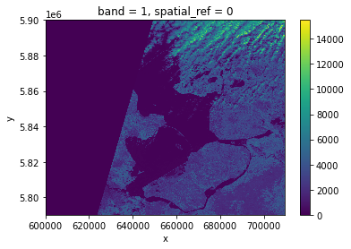
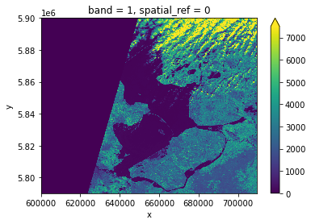
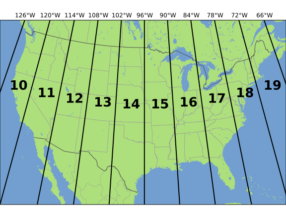
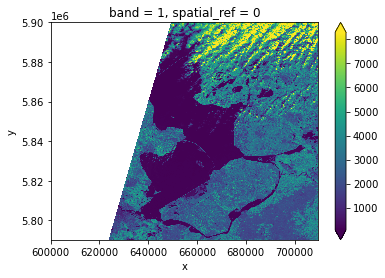
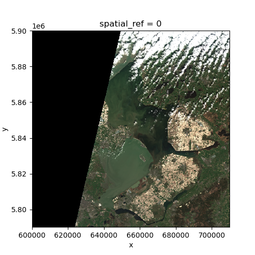

:::questions
-  How is a raster represented by rioxarray?
-  How do I read and plot raster data in Python?
-  How can I handle missing data?
:::

:::objectives
-  Describe the fundamental attributes of a raster dataset.
-  Explore raster attributes and metadata using Python.
-  Read rasters into Python using the `rioxarray` package.
-  Visualize single/multi-band raster data.
:::

Raster datasets have been introduced in [Episode 1: Introduction to Raster Data]({{site.baseurl}}/01-intro-raster-data). Here, we introduce the fundamental principles, packages and metadata/raster attributes for working with raster data in Python. We will also explore how Python handles missing and bad data values.

[`rioxarray`](https://corteva.github.io/rioxarray/stable/) is the Python package we will use throughout this lesson to work with raster data. It is based on the popular [`rasterio`](https://rasterio.readthedocs.io/en/latest/) package for working with rasters and [`xarray`](https://xarray.pydata.org/en/stable/) for working with multi-dimensional arrays.
`rioxarray` extends `xarray` by providing top-level functions (e.g. the `open_rasterio` function to open raster datasets) and by adding a set of methods to the main objects of the `xarray` package (the `Dataset` and the `DataArray`). These additional methods are made available via the `rio` accessor and become available from `xarray` objects after importing `rioxarray`.

We will also use the [`pystac`](https://github.com/stac-utils/pystac) package to load rasters from the search results we created in the previous episode.

:::callout
## Introduce the Raster Data
We'll continue from the results of the satellite image search that we have carried out in an exercise from
[a previous episode]({{site.baseurl}}/05-access-data). We will load data starting from the `search.json` file,
using one scene from the search results as an example to demonstrate data loading and visualization.

If you would like to work with the data for this lesson without downloading data on-the-fly, you can download the
raster data ahead of time using this [link](https://figshare.com/ndownloader/files/36028100). Save the `geospatial-python-raster-dataset.tar.gz`
file in your current working directory, and extract the archive file by double-clicking on it or by running the
following command in your terminal `tar -zxvf geospatial-python-raster-dataset.tar.gz`. Use the file `geospatial-python-raster-dataset/search.json`
(instead of `search.json`) to get started with this lesson.

This can be useful if you need to download the data ahead of time to work through the lesson offline, or if you want
to work with the data in a different GIS.
:::

## Load a Raster and View Attributes
In the previous episode, we searched for Sentinel-2 images, and then saved the search results to a file:`search.json`. This contains the information on where and how to access the target images from a remote repository. We can use the function `pystac.ItemCollection.from_file()` to load the search results as an `Item` list.


```python
import pystac
items = pystac.ItemCollection.from_file("search.json")
```


In the search results, we have 2 `Item` type objects, corresponding to 4 Sentinel-2 scenes from March 26th and 28th in 2020. We will focus on the first scene `S2A_31UFU_20200328_0_L2A`, and load band `nir09` (central wavelength 945 nm). We can load this band using the function `rioxarray.open_rasterio()`, via the Hypertext Reference `href` (commonly referred to as a URL):
```python
import rioxarray
raster_ams_b9 = rioxarray.open_rasterio(items[0].assets["nir09"].href)
```

By calling the variable name in the jupyter notebook we can get a quick look at the shape and attributes of the data.
```python
raster_ams_b9
```

```output
<xarray.DataArray (band: 1, y: 1830, x: 1830)>
[3348900 values with dtype=uint16]
Coordinates:
  * band         (band) int64 1
  * x            (x) float64 6e+05 6.001e+05 6.002e+05 ... 7.097e+05 7.098e+05
  * y            (y) float64 5.9e+06 5.9e+06 5.9e+06 ... 5.79e+06 5.79e+06
    spatial_ref  int64 0
Attributes:
    _FillValue:    0.0
    scale_factor:  1.0
    add_offset:    0.0
```

The first call to `rioxarray.open_rasterio()` opens the file from remote or local storage, and then returns a `xarray.DataArray` object. The object is stored in a variable, i.e. `raster_ams_b9`. Reading in the data with `xarray` instead of `rioxarray` also returns a `xarray.DataArray`, but the output will not contain the geospatial metadata (such as projection information). You can use numpy functions or built-in Python math operators on a `xarray.DataArray` just like a numpy array. Calling the variable name of the `DataArray` also prints out all of its metadata information.

The output tells us that we are looking at an `xarray.DataArray`, with `1` band, `1830` rows, and `1830` columns. We can also see the number of pixel values in the `DataArray`, and the type of those pixel values, which is unsigned integer (or `uint16`). The `DataArray` also stores different values for the coordinates of the `DataArray`. When using `rioxarray`, the term coordinates refers to spatial coordinates like `x` and `y` but also the `band` coordinate. Each of these sequences of values has its own data type, like `float64` for the spatial coordinates and `int64` for the `band` coordinate.

This `DataArray` object also has a couple of attributes that are accessed like `.rio.crs`, `.rio.nodata`, and `.rio.bounds()`, which contain the metadata for the file we opened. Note that many of the metadata are accessed as attributes without `()`, but `bounds()` is a method (i.e. a function in an object) and needs parentheses.

```python
print(raster_ams_b9.rio.crs)
print(raster_ams_b9.rio.nodata)
print(raster_ams_b9.rio.bounds())
print(raster_ams_b9.rio.width)
print(raster_ams_b9.rio.height)
```

```output
EPSG:32631
0
(600000.0, 5790240.0, 709800.0, 5900040.0)
1830
1830
```

The Coordinate Reference System, or `raster_ams_b9.rio.crs`, is reported as the string `EPSG:32631`. The `nodata` value is encoded as 0 and the bounding box corners of our raster are represented by the output of `.bounds()` as a `tuple` (like a list but you can't edit it). The height and width match what we saw when we printed the `DataArray`, but by using `.rio.width` and `.rio.height` we can access these values if we need them in calculations.

We will be exploring this data throughout this episode. By the end of this episode, you will be able to understand and explain the metadata output.

:::callout
## Tip - Variable names
To improve code readability, file and object names should be used that make it clear what is in the file. The data for this episode covers Amsterdam, and is from Band 9, so we'll use a naming convention of `raster_ams_b9`.
:::

## Visualize a Raster

After viewing the attributes of our raster, we can examine the raw values of the array with `.values`:

```python
raster_ams_b9.values
```

```output
array([[[    0,     0,     0, ...,  8888,  9075,  8139],
        [    0,     0,     0, ..., 10444, 10358,  8669],
        [    0,     0,     0, ..., 10346, 10659,  9168],
        ...,
        [    0,     0,     0, ...,  4295,  4289,  4320],
        [    0,     0,     0, ...,  4291,  4269,  4179],
        [    0,     0,     0, ...,  3944,  3503,  3862]]], dtype=uint16)
```

This can give us a quick view of the values of our array, but only at the corners. Since our raster is loaded in python as a `DataArray` type, we can plot this in one line similar to a pandas `DataFrame` with `DataArray.plot()`.

```python
raster_ams_b9.plot()
```

{alt="raster plot with defualt setting"}

Nice plot! Notice that `rioxarray` helpfully allows us to plot this raster with spatial coordinates on the x and y axis (this is not the default in many cases with other functions or libraries).

This plot shows the satellite measurement of the spectral band `nir09` for an area that covers part of the Netherlands. According to the [Sentinel-2 documentaion](https://sentinels.copernicus.eu/web/sentinel/technical-guides/sentinel-2-msi/msi-instrument), this is a band with the central wavelength of 945nm, which is sensitive to water vapor. It has a spatial resolution of 60m. Note that the `band=1` in the image title refers to the ordering of all the bands in the  `DataArray`, not the Sentinel-2 band number `09` that we saw in the pystac search results.

With a quick view of the image, we notice that half of the image is blank, no data is captured. We also see that the cloudy pixels at the top have high reflectance values, while the contrast of everything else is quite low. This is expected because this band is sensitive to the water vapor. However if one would like to have a better color contrast, one can add the option `robust=True`, which displays values between the 2nd and 98th percentile:

```python
raster_ams_b9.plot(robust=True)
```

{alt="raster plot with robust setting"}

Now the color limit is set in a way fitting most of the values in the image. We have a better view of the ground pixels.

:::callout
## Tool Tip
The option `robust=True` always forces displaying values between the 2nd and 98th percentile. Of course, this will not work for every case. For a customized displaying range, you can also manually specifying the keywords `vmin` and `vmax`. For example ploting between `100` and `7000`:

```python
raster_ams_b9.plot(vmin=100, vmax=7000)
```
:::

## View Raster Coordinate Reference System (CRS) in Python
Another information that we're interested in is the CRS, and it can be accessed with `.rio.crs`. We introduced the concept of a CRS in [an earlier
episode]({{ page.root }}).
Now we will see how features of the CRS appear in our data file and what
meanings they have. We can view the CRS string associated with our DataArray's `rio` object using the `crs`
attribute.

```python
print(raster_ams_b9.rio.crs)
```

```output
EPSG:32631
```

To print the EPSG code number as an `int`, we use the `.to_epsg()` method:

```python
raster_ams_b9.rio.crs.to_epsg()
```

```output
32631
```


EPSG codes are great for succinctly representing a particular coordinate reference system. But what if we want to see more details about the CRS, like the units? For that, we can use `pyproj`, a library for representing and working with coordinate reference systems.

```python
from pyproj import CRS
epsg = raster_ams_b9.rio.crs.to_epsg()
crs = CRS(epsg)
crs
```

```output
<Derived Projected CRS: EPSG:32631>
Name: WGS 84 / UTM zone 31N
Axis Info [cartesian]:
- E[east]: Easting (metre)
- N[north]: Northing (metre)
Area of Use:
- name: Between 0°E and 6°E, northern hemisphere between equator and 84°N, onshore and offshore. Algeria. Andorra. Belgium. Benin. Burkina Faso. Denmark - North Sea. France. Germany - North Sea. Ghana. Luxembourg. Mali. Netherlands. Niger. Nigeria. Norway. Spain. Togo. United Kingdom (UK) - North Sea.
- bounds: (0.0, 0.0, 6.0, 84.0)
Coordinate Operation:
- name: UTM zone 31N
- method: Transverse Mercator
Datum: World Geodetic System 1984 ensemble
- Ellipsoid: WGS 84
- Prime Meridian: Greenwich
```

The `CRS` class from the `pyproj` library allows us to create a `CRS` object with methods and attributes for accessing specific information about a CRS, or the detailed summary shown above.

A particularly useful attribute is `area_of_use`, which shows the geographic bounds that the CRS is intended to be used.

```python
crs.area_of_use
```

```output
AreaOfUse(west=0.0, south=0.0, east=6.0, north=84.0, name='Between 0°E and 6°E, northern hemisphere between equator and 84°N, onshore and offshore. Algeria. Andorra. Belgium. Benin. Burkina Faso. Denmark - North Sea. France. Germany - North Sea. Ghana. Luxembourg. Mali. Netherlands. Niger. Nigeria. Norway. Spain. Togo. United Kingdom (UK) - North Sea.')
```

:::challenge
## Exercise: find the axes units of the CRS
What units are our data in? See if you can find a method to examine this information using `help(crs)` or `dir(crs)`

::::solution
`crs.axis_info` tells us that the CRS for our raster has two axis and both are in meters.
We could also get this information from the attribute `raster_ams_b9.rio.crs.linear_units`.
::::
:::

### Understanding pyproj CRS Summary
Let's break down the pieces of the `pyproj` CRS summary. The string contains all of the individual CRS elements that Python or another GIS might need, separated into distinct sections, and datum.

```output
<Derived Projected CRS: EPSG:32631>
Name: WGS 84 / UTM zone 31N
Axis Info [cartesian]:
- E[east]: Easting (metre)
- N[north]: Northing (metre)
Area of Use:
- name: Between 0°E and 6°E, northern hemisphere between equator and 84°N, onshore and offshore. Algeria. Andorra. Belgium. Benin. Burkina Faso. Denmark - North Sea. France. Germany - North Sea. Ghana. Luxembourg. Mali. Netherlands. Niger. Nigeria. Norway. Spain. Togo. United Kingdom (UK) - North Sea.
- bounds: (0.0, 0.0, 6.0, 84.0)
Coordinate Operation:
- name: UTM zone 31N
- method: Transverse Mercator
Datum: World Geodetic System 1984 ensemble
- Ellipsoid: WGS 84
- Prime Meridian: Greenwich
```

* **Name** of the projection is UTM zone 31N (UTM has 60 zones, each 6-degrees of longitude in width). The underlying datum is WGS84.
* **Axis Info**: the CRS shows a Cartesian system with two axes, easting and northing, in meter units.
* **Area of Use**: the projection is used for a particular range of longitudes `0°E to 6°E` in the northern hemisphere (`0.0°N to 84.0°N`)
* **Coordinate Operation**: the operation to project the coordinates (if it is projected) onto a cartesian (x, y) plane. Transverse Mercator is accurate for areas with longitudinal widths of a few degrees, hence the distinct UTM zones.
* **Datum**: Details about the datum, or the reference point for coordinates. `WGS 84` and `NAD 1983` are common datums. `NAD 1983` is [set to be replaced in 2022](https://en.wikipedia.org/wiki/Datum_of_2022).

Note that the zone is unique to the UTM projection. Not all CRSs will have a
zone. Below is a simplified view of US UTM zones. Image source: Chrismurf at English Wikipedia, via [Wikimedia Commons](https://en.wikipedia.org/wiki/Universal_Transverse_Mercator_coordinate_system#/media/File:Utm-zones-USA.svg) (CC-BY).

{alt="UTM zones across the CONUS"}

## Calculate Raster Statistics

It is useful to know the minimum or maximum values of a raster dataset. We can compute these and other descriptive statistics with `min`, `max`, `mean`, and `std`.

```python
print(raster_ams_b9.min())
print(raster_ams_b9.max())
print(raster_ams_b9.mean())
print(raster_ams_b9.std())
```

```output
<xarray.DataArray ()>
array(0, dtype=uint16)
Coordinates:
    spatial_ref  int64 0
<xarray.DataArray ()>
array(15497, dtype=uint16)
Coordinates:
    spatial_ref  int64 0
<xarray.DataArray ()>
array(1652.44009944)
Coordinates:
    spatial_ref  int64 0
<xarray.DataArray ()>
array(2049.16447495)
Coordinates:
    spatial_ref  int64 0
```


The information above includes a report of the min, max, mean, and standard deviation values, along with the data type. If we want to see specific quantiles, we can use xarray's `.quantile()` method. For example for the 25% and 75% quantiles:

```python
print(raster_ams_b9.quantile([0.25, 0.75]))
```

```output
<xarray.DataArray (quantile: 2)>
array([   0., 2911.])
Coordinates:
  * quantile  (quantile) float64 0.25 0.75
```

:::callout
## Data Tip - NumPy methods
You could also get each of these values one by one using `numpy`.

```python
import numpy
print(numpy.percentile(raster_ams_b9, 25))
print(numpy.percentile(raster_ams_b9, 75))
```

```output
0.0
2911.0
```

You may notice that `raster_ams_b9.quantile` and `numpy.percentile` didn't require an argument specifying the axis or dimension along which to compute the quantile. This is because `axis=None` is the default for most numpy functions, and therefore `dim=None` is the default for most xarray methods. It's always good to check out the docs on a function to see what the default arguments are, particularly when working with multi-dimensional image data. To do so, we can use`help(raster_ams_b9.quantile)` or `?raster_ams_b9.percentile` if you are using jupyter notebook or jupyter lab.
:::

## Dealing with Missing Data
So far, we have visualized a band of a Sentinel-2 scene and calculated its statistics. However, we need to take missing data into account. Raster data often has a "no data value" associated with it and for raster datasets read in by `rioxarray`. This value is referred to as `nodata`. This is a value assigned to pixels where data is missing or no data were collected. There can be different cases that cause missing data, and it's common for other values in a raster to represent different cases. The most common example is missing data at the edges of rasters.

By default the shape of a raster is always rectangular. So if we have a dataset that has a shape that isn't rectangular, some pixels at the edge of the raster will have no data values. This often happens when the data were collected by a sensor which only flew over some part of a defined region.

As we have seen above, the `nodata` value of this dataset (`raster_ams_b9.rio.nodata`) is 0. When we have plotted the band data, or calculated statistics, the missing value was not distinguished from other values. Missing data may cause some unexpected results. For example, the 25th percentile we just calculated was 0, probably reflecting the presence of a lot of missing data in the raster.

To distinguish missing data from real data, one possible way is to use `nan` to represent them. This can be done by specifying `masked=True` when loading the raster:
```python
raster_ams_b9 = rioxarray.open_rasterio(items[0].assets["nir09"].href, masked=True)
```


One can also use the `where` function to select all the pixels which are different from the `nodata` value of the raster:
```python
raster_ams_b9.where(raster_ams_b9!=raster_ams_b9.rio.nodata)
```


Either way will change the `nodata` value from 0 to `nan`. Now if we compute the statistics again, the missing data will not be considered:
```
print(raster_ams_b9.min())
print(raster_ams_b9.max())
print(raster_ams_b9.mean())
print(raster_ams_b9.std())
```python

```output
<xarray.DataArray ()>
array(8., dtype=float32)
Coordinates:
    spatial_ref  int64 0
<xarray.DataArray ()>
array(15497., dtype=float32)
Coordinates:
    spatial_ref  int64 0
<xarray.DataArray ()>
array(2477.405, dtype=float32)
Coordinates:
    spatial_ref  int64 0
<xarray.DataArray ()>
array(2061.9539, dtype=float32)
Coordinates:
    spatial_ref  int64 0
```


And if we plot the image, the `nodata` pixels are not shown because they are not 0 anymore:

{alt="raster plot masking missing values"}

One should notice that there is a side effect of using `nan` instead of `0` to represent the missing data: the data type of the `DataArray` was changed from integers to float. This need to be taken into consideration when the data type matters in your application.

## Raster Bands
So far we looked into a single band raster, i.e. the `nir09` band of a Sentinel-2 scene. However, to get a smaller, non georeferenced version of the scene, one may also want to visualize the true-color overview of the region. This is provided as a multi-band raster -- a raster dataset that contains more than one band.

{alt="multi-band raster"}

The `overview` asset in the Sentinel-2 scene is a multiband asset. Similar to `nir09`, we can load it by:
```python
raster_ams_overview = rioxarray.open_rasterio(items[0].assets['visual'].href, overview_level=3)
raster_ams_overview
```

```output
<xarray.DataArray (band: 3, y: 687, x: 687)>
[1415907 values with dtype=uint8]
Coordinates:
  * band         (band) int64 1 2 3
  * x            (x) float64 6.001e+05 6.002e+05 ... 7.096e+05 7.097e+05
  * y            (y) float64 5.9e+06 5.9e+06 5.9e+06 ... 5.79e+06 5.79e+06
    spatial_ref  int64 0
Attributes:
    AREA_OR_POINT:       Area
    OVR_RESAMPLING_ALG:  AVERAGE
    _FillValue:          0
    scale_factor:        1.0
    add_offset:          0.0
```


The band number comes first when GeoTiffs are read with the `.open_rasterio()` function. As we can see in the `xarray.DataArray` object, the shape is now `(band: 3, y: 687, x: 687)`, with three bands in the `band` dimension. It's always a good idea to examine the shape of the raster array you are working with and make sure it's what you expect. Many functions, especially the ones that plot images, expect a raster array to have a particular shape. One can also check the shape using the `.shape` attribute:
```python
raster_ams_overview.shape
```

```output
(3, 687, 687)
```

One can visualize the multi-band data with the `DataArray.plot.imshow()` function:
```python
raster_ams_overview.plot.imshow()
```

{alt="true-color image overview"}

Note that the `DataArray.plot.imshow()` function makes assumptions about the shape of the input DataArray, that since it has three channels, the correct colormap for these channels is RGB. It does not work directly on image arrays with more than 3 channels. One can replace one of the RGB channels with another band, to make a false-color image.

:::challenge
## Exercise: set the plotting aspect ratio
As seen in the figure above, the true-color image is stretched. Let's visualize it with the right aspect ratio. You can use the [documentation](https://xarray.pydata.org/en/stable/generated/xarray.DataArray.plot.imshow.html) of `DataArray.plot.imshow()`.

::::solution
Since we know the height/width ratio is 1:1 (check the `rio.height` and `rio.width` attributes), we can set the aspect ratio to be 1. For example, we can choose the size to be 5 inches, and set `aspect=1`. Note that according to the [documentation](https://xarray.pydata.org/en/stable/generated/xarray.DataArray.plot.imshow.html) of `DataArray.plot.imshow()`, when specifying the `aspect` argument, `size` also needs to be provided.

```python
raster_ams_overview.plot.imshow(size=5, aspect=1)
```

{alt="raster plot with correct aspect ratio"}

::::
:::

:::keypoints
- `rioxarray` and `xarray` are for working with multidimensional arrays like pandas is for working with tabular data.
- `rioxarray` stores CRS information as a CRS object that can be converted to an EPSG code or PROJ4 string.
- Missing raster data are filled with nodata values, which should be handled with care for statistics and visualization.
:::
