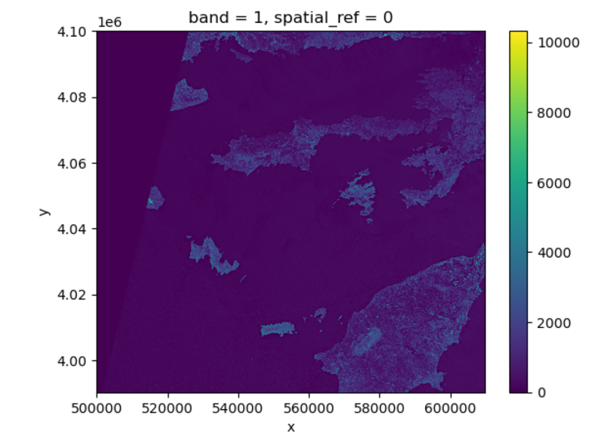
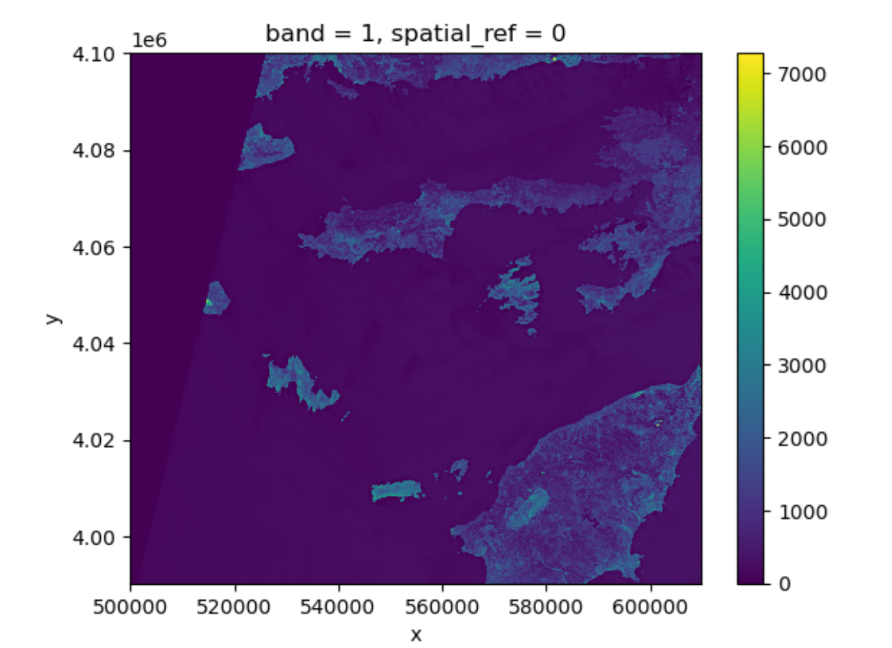
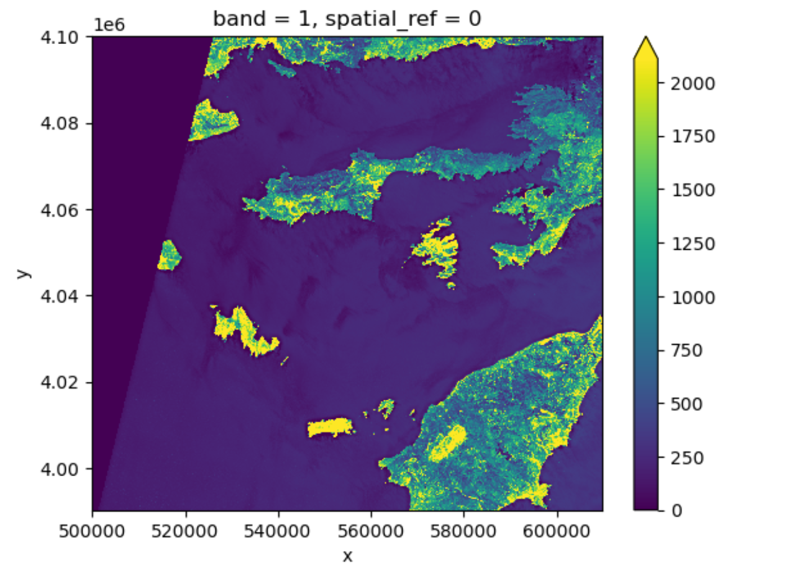
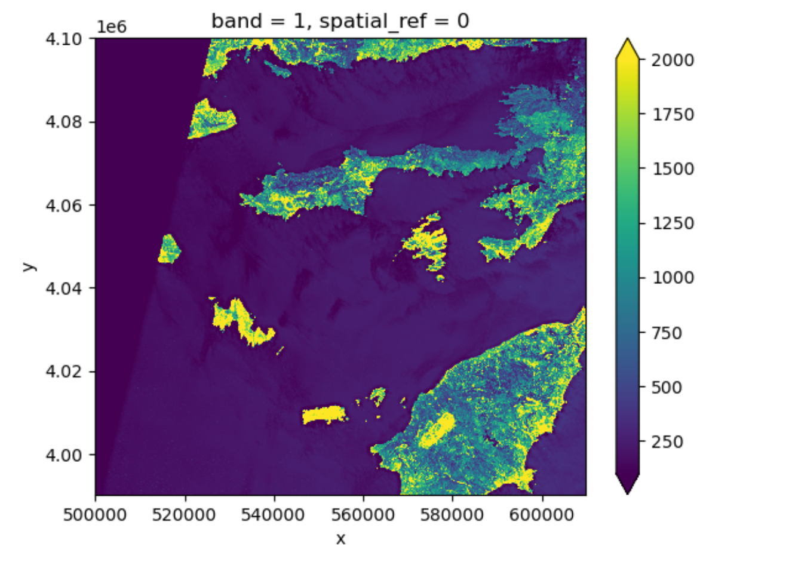
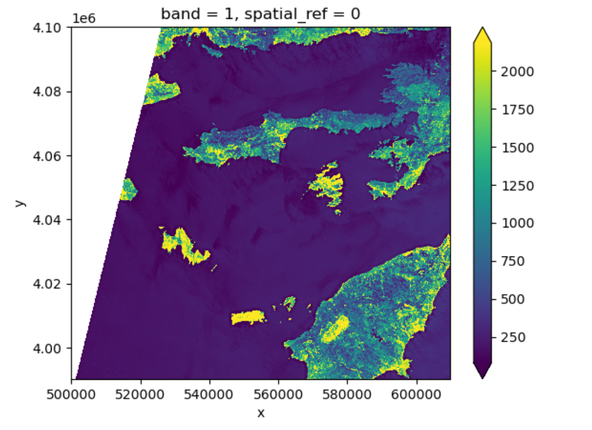
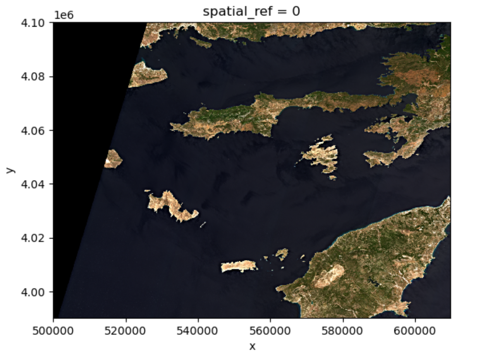
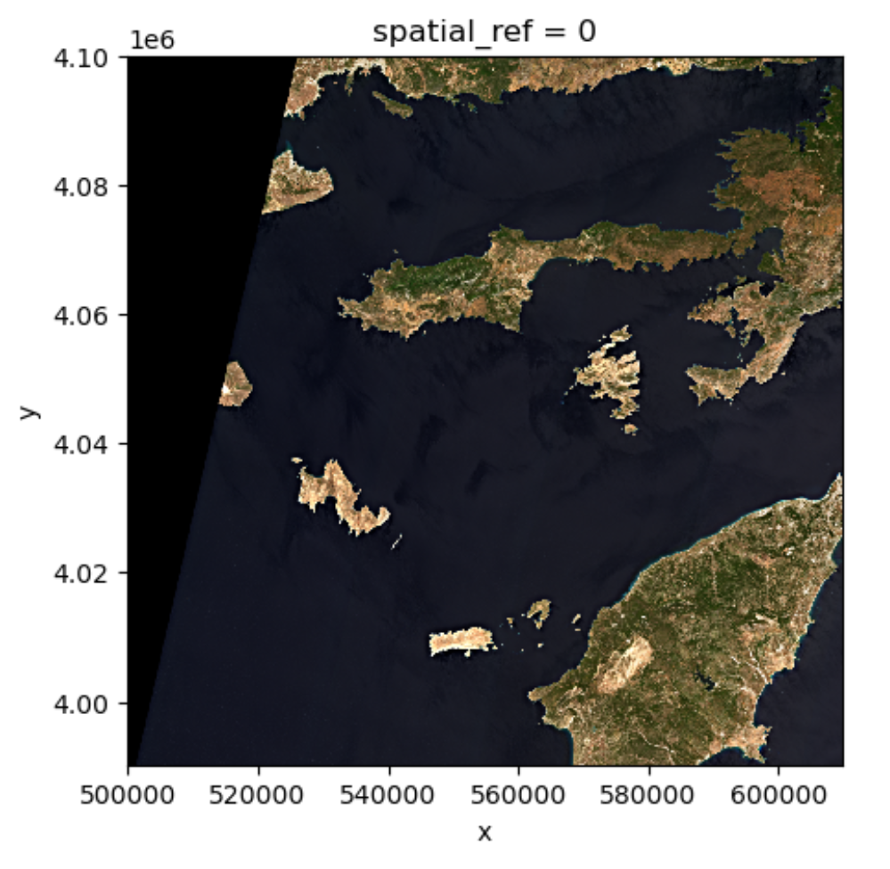

:::questions
-  How is a raster represented by rioxarray?
-  How do I read and plot raster data in Python?
-  How can I handle missing data?
:::

:::objectives
-  Describe the fundamental attributes of a raster dataset.
-  Explore raster attributes and metadata using Python.
-  Read rasters into Python using the `rioxarray` package.
-  Visualize single/multi-band raster data.
:::

## Raster Data

In the [first episode](01-intro-raster-data.md) of this course we provided an introduction on what Raster datasets are and how these divert from vector data. In this episode we will dive more into raster data and focus on how to work with them. We introduce fundamental principles, python packages, metadata and raster attributes for working with this type of data. In addition, we will explore how Python handles missing and bad data values.

The Python package we will use throughout this episode to handle raster data is [`rioxarray`](https://corteva.github.io/rioxarray/stable/). This package is based on the popular [`rasterio`](https://rasterio.readthedocs.io/en/latest/) (which is build upon the GDAL library) for working with raster data and [`xarray`](https://xarray.pydata.org/en/stable/) for working with multi-dimensional arrays.


`rioxarray` extends `xarray` by providing top-level functions like the [`open_rasterio`](https://corteva.github.io/rioxarray/html/rioxarray.html#rioxarray-open-rasterio) function to open raster datasets. Furthermore, it adds a set of methods to the main objects of the `xarray` package like the [`Dataset`](https://docs.xarray.dev/en/stable/generated/xarray.Dataset.html) and the [`DataArray`](https://docs.xarray.dev/en/stable/generated/xarray.DataArray.html#xarray.DataArray). These methods are made available via the `rio` accessor and become available from `xarray` objects after importing `rioxarray`.

:::callout

## Exploring `rioxarray` and getting help

Since a lot of the functions, methods and attributes from `rioxarray` originate from other packages (mostly `rasterio`), the documentation is in some cases limited and requires a little puzzling. It is therefore recommended to foremost focus at the notebook´s functionality to use tab completion and go through the various functionalities. In addition, adding a question mark `?` after every function or method offers the opportunity to see the available options.

For instance if you want to understand the options for rioxarray´s `open_rasterio` function:

```python
rioxarray.open_rasterio?
```

:::

:::

:::callout

## Introduce the data

In this episode, we will use satellite images from the search that we have carried out in [the episode: "Access satellite imagery using Python"](05-access-data.md). Briefly, we have searched for Sentinel-2 scenes of Rhodes from July 1st to August 31st 2023 that have less than 1% cloud coverage. The search resulted in 11 scenes. We focus here on the most recent scene (August 27th), since that would show the situation after the wildfire, and use this as an example to demonstrate raster data loading and visualization.

For your convenience, we included the scene of interest among the datasets that you have already downloaded when following [the setup instructions](../learners/setup.md) (the raster data files should be in the `data/sentinel2` directory). You should, however, be able to download the same datasets "on-the-fly" using the JSON metadata file that was created in [the previous episode](05-access-data.md) (the file `rhodes_sentinel-2.json`).


If you choose to work with the provided data (which is advised in case you are working offline or have a slow/unstable network connection) you can skip the remaining part of the block and continue with the following section: [Load a Raster and View Attributes](#Load-a-Raster-and-View-Attributes).

If you want instead to experiment with downloading the data on-the-fly, you need to load the file `rhodes_sentinel-2.json`, which contains information on where and how to access the target images from the remote repository:

```python
import pystac
items = pystac.ItemCollection.from_file("rhodes_sentinel-2.json")
```

The loaded item collection is equivalent to the one returned by `pystac_client` when querying the API in the [the episode: "Access satellite imagery using Python"](05-access-data.md). You can thus perform the same actions on it, like accessing the individual items using their index. Here we select the first item in the collection, which is the most recent:

```python
item = items[0]
print(item)
```

```output
<Item id=S2A_35SNA_20230827_0_L2A>
```

In this episode we will consider the red band and the true color image associated with this scene. They are labelled with the `red` and `visual` keys, respectively, in the asset dictionary. For each asset, we extract the URL / `href` (Hypertext Reference) that point to the file, and store it in a variable that we can use later on to access the data instead of the raster data paths:

```python
rhodes_red_href = item.assets["red"].href  # red band
rhodes_visual_href = item.assets["visual"].href  # true color image
```

:::

## Load a Raster and View Attributes

To analyse the burned areas, we are interested in the red band of the satellite scene. In [episode 9](/episodes/09-raster-calculations.md) we will further explain why the characteristics of that band are interesting in relation to wildfires. 
For now, we can load `red` band using the function [`rioxarray.open_rasterio()`](https://corteva.github.io/rioxarray/html/rioxarray.html#rioxarray-open-rasterio), using the variable we created.

```python
import rioxarray
rhodes_red = rioxarray.open_rasterio(rhodes_red_href)
```

In case you used the downloaded data locally you can do.

```python
import rioxarray
rhodes_red = rioxarray.open_rasterio("data/sentinel2/red.tif")
```

The first call to `rioxarray.open_rasterio()` opens the file from remote or local storage, and then returns a `xarray.DataArray` object. The object is stored in a variable, i.e. `rhodes_red`. Reading in the data with `xarray` instead of `rioxarray` also returns a `xarray.DataArray`, but the output will not contain the geospatial metadata (such as projection information). You can use numpy functions or built-in Python math operators on a `xarray.DataArray` just like a numpy array. Calling the variable name of the `DataArray` also prints out all of its metadata information.

By printing the variable we can get a quick look at the shape and attributes of the data.
```python
print(rhodes_red)
```

```output
<xarray.DataArray (band: 1, y: 10980, x: 10980)> Size: 241MB
[120560400 values with dtype=uint16]
Coordinates:
  * band         (band) int32 4B 1
  * x            (x) float64 88kB 5e+05 5e+05 5e+05 ... 6.098e+05 6.098e+05
  * y            (y) float64 88kB 4.1e+06 4.1e+06 4.1e+06 ... 3.99e+06 3.99e+06
    spatial_ref  int32 4B 0
Attributes:
    AREA_OR_POINT:       Area
    OVR_RESAMPLING_ALG:  AVERAGE
    _FillValue:          0
    scale_factor:        1.0
    add_offset:          0.0
```

The output tells us that we are looking at an `xarray.DataArray`, with `1` band, `10980` rows, and `10980` columns. We can also see the number of pixel values in the `DataArray`, and the type of those pixel values, which is unsigned integer (or `uint16`). The `DataArray` also stores different values for the coordinates of the `DataArray`. When using `rioxarray`, the term coordinates refers to spatial coordinates like `x` and `y` but also the `band` coordinate. Each of these sequences of values has its own data type, like `float64` for the spatial coordinates and `int64` for the `band` coordinate.

This `DataArray` object also has a couple of attributes that are accessed like `.rio.crs`, `.rio.nodata`, and `.rio.bounds()` (in jupyter you can browse through these attributes by using `tab` for auto completion or have a look at the documentation [here](https://corteva.github.io/rioxarray/stable/rioxarray.html#rioxarray-rio-accessors)), which contains the metadata for the file we opened. Note that many of the metadata are accessed as attributes without `()`, however since `bounds()` is a method (i.e. a function in an object) it requires these parentheses this is also the case for `.rio.resolution()`.

```python
print(rhodes_red.rio.crs)
print(rhodes_red.rio.nodata)
print(rhodes_red.rio.bounds())
print(rhodes_red.rio.width)
print(rhodes_red.rio.height)
print(rhodes_red.rio.resolution())
```

```output
EPSG:32635
0
(499980.0, 3990240.0, 609780.0, 4100040.0)
10980
10980
(10.0, -10.0)
```

The Coordinate Reference System, or `rhodes_red.rio.crs`, is reported as the string `EPSG:32635`. The `nodata` value is encoded as 0 and the bounding box corners of our raster are represented by the output of `.bounds()` as a `tuple` (like a list but you can't edit it). The height and width match what we saw when we printed the `DataArray`, but by using `.rio.width` and `.rio.height` we can access these values if we need them in calculations.

## Visualize a Raster

After viewing the attributes of our raster, we can examine the raw values of the array with `.values`:

```python
rhodes_red.values
```

```output
array([[[    0,     0,     0, ...,  8888,  9075,  8139],
        [    0,     0,     0, ..., 10444, 10358,  8669],
        [    0,     0,     0, ..., 10346, 10659,  9168],
        ...,
        [    0,     0,     0, ...,  4295,  4289,  4320],
        [    0,     0,     0, ...,  4291,  4269,  4179],
        [    0,     0,     0, ...,  3944,  3503,  3862]]], dtype=uint16)
```

This can give us a quick view of the values of our array, but only at the corners. Since our raster is loaded in python as a `DataArray` type, we can plot this in one line similar to a pandas `DataFrame` with `DataArray.plot()`.

```python
rhodes_red.plot()
```

{alt="raster plot with defualt setting"}

Notice that `rioxarray` helpfully allows us to plot this raster with spatial coordinates on the x and y axis (this is not the default in many cases with other functions or libraries). Nice plot! However, it probably took a while for it to load therefore it would make sense to resample it.

# Resampling the raster image

The red band image is available as a raster file with 10 m resolution, which makes it a relatively large file (few hundreds MBs).
In order to keep calculations "manageable" (reasonable execution time and memory usage) we select here a lower resolution version of the image, taking
advantage of the so-called "pyramidal" structure of cloud-optimized GeoTIFFs (COGs). COGs, in fact, typically include
multiple lower-resolution versions of the original image, called "overviews", in the same file. This allows us to avoid
downloading high-resolution images when only quick previews are required.

Overviews are often computed using powers of 2 as down-sampling (or zoom) factors. So, typically, the first level
overview (index 0) corresponds to a zoom factor of 2, the second level overview (index 1) corresponds to a zoom factor
of 4, and so on. Here, we open the third level overview (index 2, zoom factor 8) and check that the resolution is about 80 m:

```python
import rioxarray
rhodes_red_80 = rioxarray.open_rasterio("data/sentinel2/red.tif", overview_level=2)
print(rhodes_red_80.rio.resolution())
```

```output
(79.97086671522214, -79.97086671522214)
```
Lets plot this one.

```python
rhodes_red_80.plot()
```
{alt="raster plot with defualt setting"}

This plot shows the satellite measurement of the band `red` for Rhodes before the wildfire. According to the [Sentinel-2 documentaion](https://sentinels.copernicus.eu/web/sentinel/technical-guides/sentinel-2-msi/msi-instrument), this is a band with the central wavelength of 665nm. It has a spatial resolution of 10m. Note that the `band=1` in the image title refers to the ordering of all the bands in the  `DataArray`, not the Sentinel-2 band number `04` that we saw in the pystac search results.


:::callout
## Tool Tip
The option `robust=True` always forces displaying values between the 2nd and 98th percentile. Of course, this will not work for every case.

```python
rhodes_red_80.plot(robust=True)
```
{alt="raster plot with robust setting"}

Now the color limit is set in a way fitting most of the values in the image. We have a better view of the ground pixels.

For a customized displaying range, you can also manually specifying the keywords `vmin` and `vmax`. For example ploting between `100` and `2000`:

```python
rhodes_red_80.plot(vmin=100, vmax=2000)
```

{alt="raster plot with robust setting"}

More options can be consulted [here](https://docs.xarray.dev/en/v2024.02.0/generated/xarray.plot.imshow.html). You will notice that these parameters are part of the `imshow` method from the plot function. Since plot originates from matplotlib and is so widely used, your python environment helps you to interpret the parameters without having to specify the method. It is a service to help you, but can be confusing when teaching it. We will explain more about this below.

:::

## View Raster Coordinate Reference System (CRS) in Python
Another information that we're interested in is the CRS, and it can be accessed with `.rio.crs`. We introduced the concept of a CRS in [an earlier
episode](03-crs.md). Now we will see how features of the CRS appear in our data file and what
meanings they have. We can view the CRS string associated with our DataArray's `rio` object using the `crs` attribute.

```python
print(rhodes_red_80.rio.crs)
```

```output
EPSG:32635
```

To print the EPSG code number as an `int`, we use the `.to_epsg()` method (which originally is part of rasterio [`to_epsg`](https://rasterio.readthedocs.io/en/stable/api/rasterio.crs.html#rasterio.crs.CRS.to_epsg)):

```python
rhodes_red_80.rio.crs.to_epsg()
```

```output
32635
```

EPSG codes are great for succinctly representing a particular coordinate reference system. But what if we want to see more details about the CRS, like the units? For that, we can use [`pyproj`](https://pyproj4.github.io/pyproj/stable/api/index.html) , a library for representing and working with coordinate reference systems.

```python
from pyproj import CRS
epsg = rhodes_red_80.rio.crs.to_epsg()
crs = CRS(epsg)
crs
```

```output
<Projected CRS: EPSG:32635>
Name: WGS 84 / UTM zone 35N
Axis Info [cartesian]:
- E[east]: Easting (metre)
- N[north]: Northing (metre)
Area of Use:
- name: Between 24°E and 30°E, northern hemisphere between equator and 84°N, onshore and offshore. Belarus. Bulgaria. Central African Republic. Democratic Republic of the Congo (Zaire). Egypt. Estonia. Finland. Greece. Latvia. Lesotho. Libya. Lithuania. Moldova. Norway. Poland. Romania. Russian Federation. Sudan. Svalbard. Türkiye (Turkey). Uganda. Ukraine.
- bounds: (24.0, 0.0, 30.0, 84.0)
Coordinate Operation:
- name: UTM zone 35N
- method: Transverse Mercator
Datum: World Geodetic System 1984 ensemble
- Ellipsoid: WGS 84
- Prime Meridian: Greenwich
```

The `CRS` class from the `pyproj` library allows us to create a `CRS` object with methods and attributes for accessing specific information about a CRS, or the detailed summary shown above.

A particularly useful attribute is [`area_of_use`](https://pyproj4.github.io/pyproj/stable/api/crs/crs.html#pyproj.crs.CRS.area_of_use), which shows the geographic bounds that the CRS is intended to be used.

```python
crs.area_of_use
```

```output
AreaOfUse(west=24.0, south=0.0, east=30.0, north=84.0, name='Between 24°E and 30°E, northern hemisphere between equator and 84°N, onshore and offshore. Belarus. Bulgaria. Central African Republic. Democratic Republic of the Congo (Zaire). Egypt. Estonia. Finland. Greece. Latvia. Lesotho. Libya. Lithuania. Moldova. Norway. Poland. Romania. Russian Federation. Sudan. Svalbard. Türkiye (Turkey). Uganda. Ukraine.')
```

:::challenge
## Exercise: find the axes units of the CRS
What units are our data in? See if you can find a method to examine this information using `help(crs)` or `dir(crs)`

::::solution
`crs.axis_info` tells us that the CRS for our raster has two axis and both are in meters.
We could also get this information from the attribute `rhodes_red_80.rio.crs.linear_units`.
::::
:::

### Understanding pyproj CRS Summary
Let's break down the pieces of the `pyproj` CRS summary. The string contains all of the individual CRS elements that Python or another GIS might need, separated into distinct sections, and datum.

```output
<Projected CRS: EPSG:32635>
Name: WGS 84 / UTM zone 35N
Axis Info [cartesian]:
- E[east]: Easting (metre)
- N[north]: Northing (metre)
Area of Use:
- name: Between 24°E and 30°E, northern hemisphere between equator and 84°N, onshore and offshore. Belarus. Bulgaria. Central African Republic. Democratic Republic of the Congo (Zaire). Egypt. Estonia. Finland. Greece. Latvia. Lesotho. Libya. Lithuania. Moldova. Norway. Poland. Romania. Russian Federation. Sudan. Svalbard. Türkiye (Turkey). Uganda. Ukraine.
- bounds: (24.0, 0.0, 30.0, 84.0)
Coordinate Operation:
- name: UTM zone 35N
- method: Transverse Mercator
Datum: World Geodetic System 1984 ensemble
- Ellipsoid: WGS 84
- Prime Meridian: Greenwich
```

* **Name** of the projection is UTM zone 35N (UTM has 60 zones, each 6-degrees of longitude in width). The underlying datum is WGS84.
* **Axis Info**: the CRS shows a Cartesian system with two axes, easting and northing, in meter units.
* **Area of Use**: the projection is used for a particular range of longitudes `24°E to 30°E` in the northern hemisphere (`0.0°N to 84.0°N`)
* **Coordinate Operation**: the operation to project the coordinates (if it is projected) onto a cartesian (x, y) plane. Transverse Mercator is accurate for areas with longitudinal widths of a few degrees, hence the distinct UTM zones.
* **Datum**: Details about the datum, or the reference point for coordinates. `WGS 84` and `NAD 1983` are common datums. `NAD 1983` is [set to be replaced in 2022](https://en.wikipedia.org/wiki/Datum_of_2022).

Note that the zone is unique to the UTM projection. Not all CRSs will have a
zone. Below is a simplified view of US UTM zones.

 (CC-BY))](fig/E03/Utm-zones-USA.svg){alt="UTM zones across the CONUS"}

## Calculate Raster Statistics

It is useful to know the minimum or maximum values of a raster dataset. We can compute these and other descriptive statistics with `min`, `max`, `mean`, and `std`.

```python
print(rhodes_red_80.min())
print(rhodes_red_80.max())
print(rhodes_red_80.mean())
print(rhodes_red_80.std())
```

```output
<xarray.DataArray ()> Size: 2B
array(0, dtype=uint16)
Coordinates:
    spatial_ref  int32 4B 0
<xarray.DataArray ()> Size: 2B
array(7277, dtype=uint16)
Coordinates:
    spatial_ref  int32 4B 0
<xarray.DataArray ()> Size: 8B
array(404.07532588)
Coordinates:
    spatial_ref  int32 4B 0
<xarray.DataArray ()> Size: 8B
array(527.5557502)
Coordinates:
    spatial_ref  int32 4B 0
```


The information above includes a report of the min, max, mean, and standard deviation values, along with the data type. If we want to see specific quantiles, we can use xarray's `.quantile()` method. For example for the 25% and 75% quantiles:

```python
print(rhodes_red_80.quantile([0.25, 0.75]))
```

```output
<xarray.DataArray (quantile: 2)> Size: 16B
array([165., 315.])
Coordinates:
  * quantile  (quantile) float64 16B 0.25 0.75
```

:::callout
## Data Tip - NumPy methods
You could also get each of these values one by one using `numpy`.

```python
import numpy
print(numpy.percentile(rhodes_red_80, 25))
print(numpy.percentile(rhodes_red_80, 75))
```

```output
165.0
315.0
```

You may notice that `rhodes_red_80.quantile` and `numpy.percentile` didn't require an argument specifying the axis or dimension along which to compute the quantile. This is because `axis=None` is the default for most numpy functions, and therefore `dim=None` is the default for most xarray methods. It's always good to check out the docs on a function to see what the default arguments are, particularly when working with multi-dimensional image data. To do so, we can use`help(rhodes_red_80.quantile)` or `?rhodes_red_80.percentile` if you are using jupyter notebook or jupyter lab.
:::

## Dealing with Missing Data
So far, we have visualized a band of a Sentinel-2 scene and calculated its statistics. However, as you can see on the image it also contains an artificial band to the top left where data is missing. In order to calculate meaningfull statistics, we need to take missing data into account. Raster data often has a "no data value" associated with it and for raster datasets read in by `rioxarray`. This value is referred to as `nodata`. This is a value assigned to pixels where data is missing or no data were collected. There can be different cases that cause missing data, and it's common for other values in a raster to represent different cases. The most common example is missing data at the edges of rasters.

By default the shape of a raster is always rectangular. So if we have a dataset that has a shape that isn't rectangular, like most satellite images, some pixels at the edge of the raster will have no data values. This often happens when the data were collected by a sensor which only flew over some part of a defined region and is also almost by default because of the fact that the earth is not flat and that we work with geographic and projected coordinate system.

To check the value of [`nodata`](https://corteva.github.io/rioxarray/html/rioxarray.html#rioxarray.raster_array.RasterArray.nodata) of this dataset you can use:

```python
rhodes_red_80.rio.nodata
```


```output
0
```

You will find out that this is 0. When we have plotted the band data, or calculated statistics, the missing value was not distinguished from other values. Missing data may cause some unexpected results.

To distinguish missing data from real data, one possible way is to use `nan`(which stands for Not a Number) to represent them. This can be done by specifying `masked=True` when loading the raster. Let us reload our data and put it into a different variable with the mask:

```python
rhodes_red_mask_80 = rioxarray.open_rasterio("data/sentinel2/red.tif", masked=True, overview_level=2)
```

Let us have a look at the data.

```python
print(rhodes_red_mask_80)
```

One can also use the `where` function, which is standard python functionality, to select all the pixels which are different from the `nodata` value of the raster:

```python
rhodes_red_altmask_80 = rhodes_red_80.where(rhodes_red_80!=rhodes_red_80.rio.nodata)
```
*[comment mdk]: Do I get it right, that this is actually the same as we have sone above with the masking?

Either way will change the `nodata` value from 0 to `nan`. Now if we compute the statistics again, the missing data will not be considered. Let´s compare them:
```
print(rhodes_red_80.min())
print(rhodes_red_mask_80.min())
print(rhodes_red_80.max())
print(rhodes_red_mask_80.max())
print(rhodes_red_80.mean())
print(rhodes_red_mask_80.mean()
print(rhodes_red_80.std())
print(rhodes_red_mask_80.std())
```python

```output
<xarray.DataArray ()> Size: 2B
array(0, dtype=uint16)
Coordinates:
    spatial_ref  int32 4B 0
<xarray.DataArray ()> Size: 4B
array(1., dtype=float32)
Coordinates:
    spatial_ref  int32 4B 0
<xarray.DataArray ()> Size: 2B
array(7277, dtype=uint16)
Coordinates:
    spatial_ref  int32 4B 0
<xarray.DataArray ()> Size: 4B
array(7277., dtype=float32)
Coordinates:
    spatial_ref  int32 4B 0
<xarray.DataArray ()> Size: 8B
array(404.07532588)
Coordinates:
    spatial_ref  int32 4B 0
<xarray.DataArray ()> Size: 4B
array(461.78833, dtype=float32)
Coordinates:
    spatial_ref  int32 4B 0
<xarray.DataArray ()> Size: 8B
array(527.5557502)
Coordinates:
    spatial_ref  int32 4B 0
<xarray.DataArray ()> Size: 4B
array(539.82855, dtype=float32)
Coordinates:
    spatial_ref  int32 4B 0
```

And if we plot the image, the `nodata` pixels are not shown because they are not 0 anymore:

{alt="raster plot masking missing values"}

One should notice that there is a side effect of using `nan` instead of `0` to represent the missing data: the data type of the `DataArray` was changed from integers to float (as can be seen when we printed the statistics). This needs to be taken into consideration when the data type matters in your application.

## Raster Bands

So far we looked into a single band raster, i.e. the `red` band of a Sentinel-2 scene. However, for certain applications it is helpful to visualize the true-color image of the region. This is provided as a multi-band raster -- a raster dataset that contains more than one band.

{alt="multi-band raster"}

The `visual` asset in the Sentinel-2 scene is a multiband asset. Similar to the red band, we can load it by:

```python
rhodes_visual = rioxarray.open_rasterio('data/sentinel2/visual.tif', overview_level=2)
rhodes_visual
```

```output
<xarray.DataArray (band: 3, y: 1373, x: 1373)> Size: 6MB
[5655387 values with dtype=uint8]
Coordinates:
  * band         (band) int32 12B 1 2 3
  * x            (x) float64 11kB 5e+05 5.001e+05 ... 6.097e+05 6.097e+05
  * y            (y) float64 11kB 4.1e+06 4.1e+06 4.1e+06 ... 3.99e+06 3.99e+06
    spatial_ref  int32 4B 0
Attributes:
    AREA_OR_POINT:       Area
    OVR_RESAMPLING_ALG:  AVERAGE
    _FillValue:          0
    scale_factor:        1.0
    add_offset:          0.0
```

The band number comes first when GeoTiffs are read with the `.open_rasterio()` function. As we can see in the `xarray.DataArray` object, the shape is now `(band: 3, y: 1373, x: 1373)`, with three bands in the `band` dimension. It's always a good idea to examine the shape of the raster array you are working with and make sure it's what you expect. Many functions, especially the ones that plot images, expect a raster array to have a particular shape. One can also check the shape using the [`.shape`](https://docs.xarray.dev/en/latest/generated/xarray.DataArray.shape.html) attribute:

```python
rhodes_visual.shape
```

```output
(3, 1373, 1373)
```

One can visualize the multi-band data with the `DataArray.plot.imshow()` function:
```python
rhodes_visual.plot.imshow()
```

{alt="true-color image overview"}

Note that the `DataArray.plot.imshow()` function makes assumptions about the shape of the input DataArray, that since it has three channels, the correct colormap for these channels is RGB. It does not work directly on image arrays with more than 3 channels. One can replace one of the RGB channels with another band, to make a false-color image.

:::challenge
## Exercise: set the plotting aspect ratio
As seen in the figure above, the true-color image is stretched. Let's visualize it with the right aspect ratio. You can use the [documentation](https://xarray.pydata.org/en/stable/generated/xarray.DataArray.plot.imshow.html) of `DataArray.plot.imshow()`.

::::solution
Since we know the height/width ratio is 1:1 (check the `rio.height` and `rio.width` attributes), we can set the aspect ratio to be 1. For example, we can choose the size to be 5 inches, and set `aspect=1`. Note that according to the [documentation](https://xarray.pydata.org/en/stable/generated/xarray.DataArray.plot.imshow.html) of `DataArray.plot.imshow()`, when specifying the `aspect` argument, `size` also needs to be provided.

```python
rhodes_visual.plot.imshow(size=5, aspect=1)
```

{alt="raster plot with correct aspect ratio"}

::::
:::

:::keypoints
- `rioxarray` and `xarray` are for working with multidimensional arrays like pandas is for working with tabular data.
- `rioxarray` stores CRS information as a CRS object that can be converted to an EPSG code or PROJ4 string.
- Missing raster data are filled with nodata values, which should be handled with care for statistics and visualization.
:::
