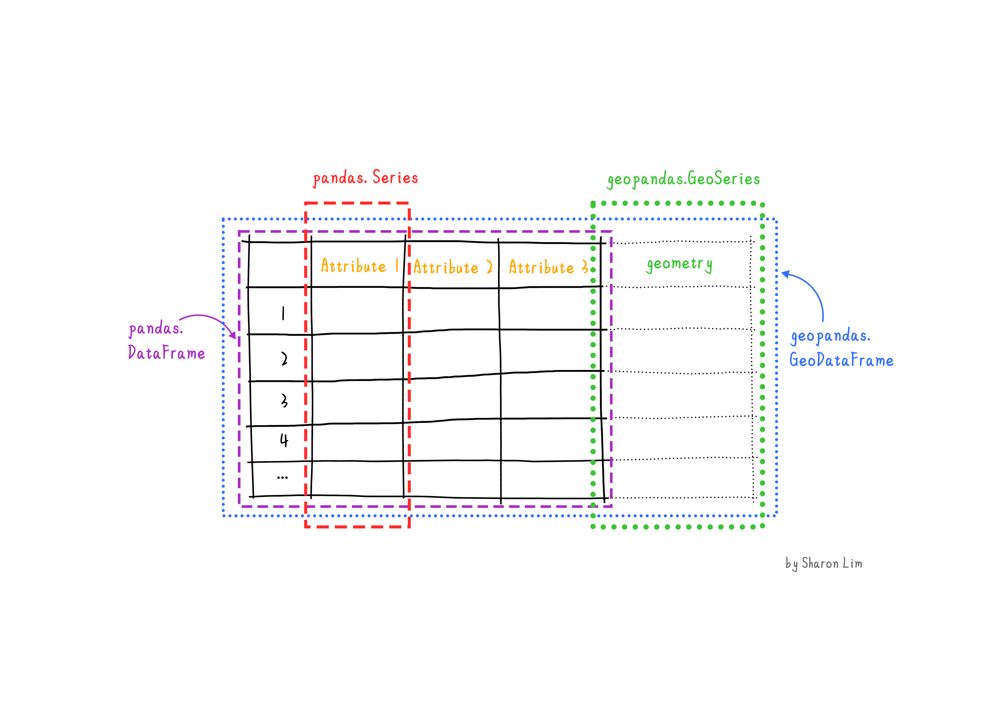
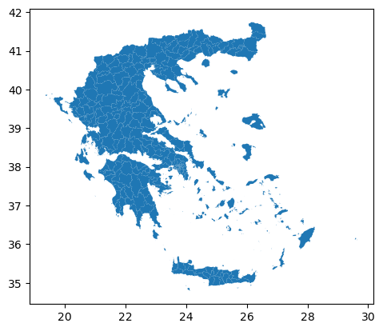
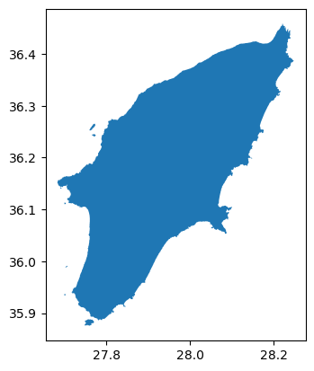
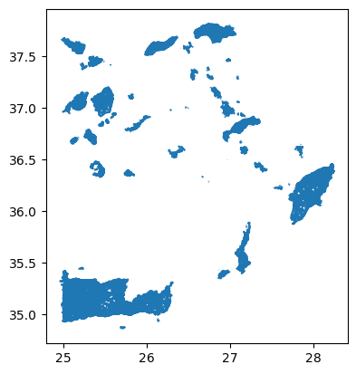
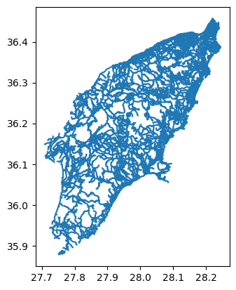
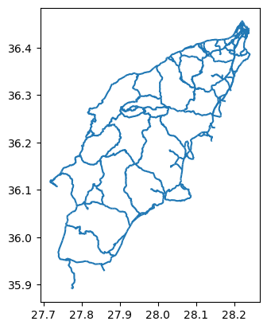
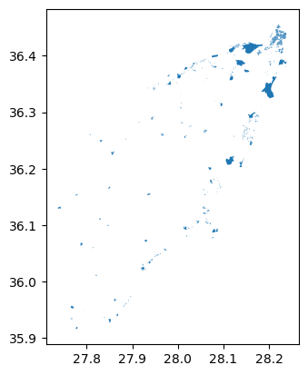
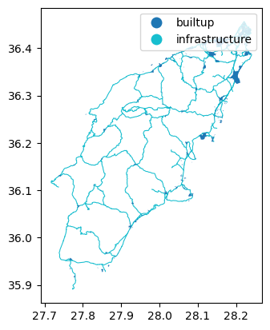

:::questions
- How can I read, inspect, and process spatial objects, such as points, lines, and polygons?
:::

:::objectives
- Load spatial objects.
- Select the spatial objects within a bounding box.
- Perform a CRS conversion of spatial objects.
- Select features of spatial objects.
- Match objects in two datasets based on their spatial relationships.
:::

## Introduction

In the preceding episodes, we have prepared, selected and downloaded raster data from before and after the wildfire event in the summer of 2023 on the Greek island of Rhodes. To evaluate the impact of this wildfire on the vital infrastructure and built-up areas we are going to create a subset of vector data representing these assets. In this episode you will learn how to extract vector data with specific characteristics like the type of attributes or their locations. The dataset that we will generate in this episode can lateron be confronted with scorched areas which we determine by analyzing the satellite images [Episode 9: Raster Calculations in Python](09-raster-calculations.md).

We'll be examining vector datasets that represent the valuable assests of Rhodes. As mentioned in [Episode 2: Introduction to Vector Data](02-intro-vector-data.md), vector data uses points, lines, and polygons to depict specific features on the Earth's surface. These geographic elements can have one or more attributes, like 'name' and 'population' for a city. In this epidoe we'll be using two open data sources: the Database of Global Administrative Areas (GADM) dataset to generate a polygon for the island of Rhodes and and Open Street Map data for the vital infrastructure and valuable assets.

To handle the vector data in python we use the package [`geopandas`](https://geopandas.org/en/stable/). This package allows us to open, manipulate, and write vector dataset through python.

{alt="Pandas and Geopandas"}

`geopandas` enhances the widely-used `pandas` library for data analysis by extending its functionality to geospatial applications. The primary `pandas` objects (`Series` and `DataFrame`) are extended to `geopandas` objects (`GeoSeries` and `GeoDataFrame`). This extension is achieved by incorporating geometric types, represented in Python using the `shapely` library, and by offering dedicated methods for spatial operations like `union`, `spatial joins` and `intersect`. In order to understand how geopandas works, it is good to provide a brief explanation of the relationship between `Series`, a `DataFrame`, `GeoSeries`, and a `GeoDataFrame`:

- A `Series` is a one-dimensional array with an axis that can hold any data type (integers, strings, floating-point numbers, Python objects, etc.)
- A `DataFrame` is a two-dimensional labeled data structure with columns that can potentially hold different types of data.
- A `GeoSeries` is a `Series` object designed to store shapely geometry objects.
- A `GeoDataFrame` is an extended `pandas.DataFrame` that includes a column with geometry objects, which is a `GeoSeries`.


:::callout
## Introduce the Vector Data

In this episode, we will use the downloaded vector data from the `data` directory. Please refer to the [setup page](../learners/setup.md) on where to download the data. Note that we manipulated that data a little for the purposes of
this workshop. The link to the original source can be found on the [setup page](../learners/setup.md).

## Get the administration boundary of study area

The first thing we want to do is to extract a polygon containing the boundary of the island of Rhodes from Greece. For this we will use the [GADM dataset](https://gadm.org/download_country.html) layer `ADM_ADM_3.gpkg` for Greece. For your convenience we saved a copy at: `data/data/gadm/ADM_ADM_3.gpkg`
We will use the `geopandas` package to load the file and use the `read_file` function [see](https://geopandas.org/en/stable/docs/user_guide/io.html). Note that geopandas is often abbreviated as gpd.


```python
import geopandas as gpd
gdf_greece = gpd.read_file('./data/gadm/greece.gpkg')
```

We can print out the `gdf_greece`variable:

```python
gdf_greece
```

```output
GID_3 GID_0 COUNTRY    GID_1                       NAME_1  \
0     GRC.1.1.1_1   GRC  Greece  GRC.1_1                       Aegean
1     GRC.1.1.2_1   GRC  Greece  GRC.1_1                       Aegean
2     GRC.1.1.3_1   GRC  Greece  GRC.1_1                       Aegean
..            ...   ...     ...      ...                          ...
324  GRC.8.2.24_1   GRC  Greece  GRC.8_1  Thessaly and Central Greece
325  GRC.8.2.25_1   GRC  Greece  GRC.8_1  Thessaly and Central Greece

                      NL_NAME_1      GID_2        NAME_2      NL_NAME_2  \
0                        Αιγαίο  GRC.1.1_1  North Aegean  Βόρειο Αιγαίο
1                        Αιγαίο  GRC.1.1_1  North Aegean  Βόρειο Αιγαίο
2                        Αιγαίο  GRC.1.1_1  North Aegean  Βόρειο Αιγαίο
..                          ...        ...           ...            ...
324  Θεσσαλία και Στερεά Ελλάδα  GRC.8.2_1      Thessaly       Θεσσαλία
325  Θεσσαλία και Στερεά Ελλάδα  GRC.8.2_1      Thessaly       Θεσσαλία
...
324  POLYGON ((22.81903 39.27344, 22.81884 39.27332...
325  POLYGON ((23.21375 39.36514, 23.21272 39.36469...

[326 rows x 17 columns]
```

The data are read into the variable fields as a `GeoDataFrame`. This is an extened data format of `pandas.DataFrame`, with an extra column `geometry`. To visualize the polygons we can use the [`plot()`](https://geopandas.org/en/stable/docs/user_guide/mapping.html) function to the `GeoDataFrame` we have loaded `gdf_greece`:

```python
gdf_greece.plot()
```

{alt="greece_administrations"}


Next, we'll focus on isolating the administrative area of Rhodes Island. This information is located in the `NAME_3` column of `gdf_greece`, where Rhodes Island is listed as "Rhodos". For the sake of this course, let's say this information was shared with us. In a real-world scenario, you would typically discover this by examining the metadata, if available, or by manually exploring the columns. We'll now create a new variable that exclusively represents Rhodes Island.

```python
gdf_rhodes = gdf_greece.loc[gdf_greece['NAME_3']=='Rhodos']
```

And we can plot the overview by:
```python
gdf_rhodes.plot()
```

{alt="rhodes_administrations"}

Now, we have the administrative area of Rhodes Island. We can use the `to_file()` function save this to a file for future use.

```python
# Save the rhodes_boundary to gpkg
gdf_rhodes.to_file('rhodes.gpkg')
```

## Get the vital infrastructure and built-up areas

### Highway data from Open Street Map (OSM)

Now that we have the boundary of our study area, we will make use this to select the main highways in our study area. We will make the following processing steps:

1. Select highways of study area
2. Select key infrastruture highways: 'primary', 'secondary', 'tertiary'
3. Create a 100m buffer around the rounds. This buffer will be regarded as the infrastructure region. (note that this buffer is arbitrary and can be changed afterwards if you want!)

#### Step 1: Select highways of study area

For this course, we have created a subset of the OSM data for Greece in the file `highways.gpkg`. However we have not made a subselection of our study area yet! We will do this in the next steps.

Let's load `highways.gpkg` and plot it:

```python
gdf_highways = gpd.read_file('./data/osm/highways.gpkg')
```

We can explore it using the same commands as above:

```python
gdf_highways.plot()
```

{alt="greece_highways"}

As you may have noticed, loading and plotting `highways.gpkg` takes a bit long. This is because the file contains all the highways in Greece, and we are only interested in the highways in Rhodes Island. We can use the `mask` parameter of the `read_file()` function to load only the highways in Rhodes Island.

```python
# Read data with a mask of Rhodes
gdf_highways = gpd.read_file('./data/osm/highways.gpkg', mask=gdf_rhodes)
```

Now we can plot the highways in Rhodes Island:

```python
gdf_highways.plot()
```

{alt="rhodes_highways"}

#### Step 2: Select key infrastruture highways

The classes of the highways are stored in the `fclass` column. To get an overview of the different classes, we can use the `unique()` function:

```python
gdf_highways['fclass'].unique()
```

```output
array(['path', 'residential', 'secondary', 'tertiary', 'secondary_link',
       'motorway_link', 'footway', 'pedestrian', 'living_street',
       'service', 'unclassified', 'primary', 'trunk', 'track',
       'track_grade2', 'track_grade3', 'motorway', 'primary_link',
       'steps', 'tertiary_link', 'track_grade1', 'track_grade4',
       'trunk_link', 'track_grade5', 'cycleway', 'bridleway'],
      dtype=object)
```

It seems the variable `gdf_highways` contains all kind of hiking paths and footpaths as well. Since we are only interested in vital infrastructure, classified as "primary", "secondary" and "tertiary" highways, we are going to make a subselection of these highways by the column `fclass`:

```python
# Extract infrastratcure highways
infra_labels = ['primary', 'secondary', 'tertiary']
infra_highways = gdf_highways.loc[gdf_highways['fclass'].isin(infra_labels)]
```

We can plot the infrastructure highways:

```python
infra_highways.plot()
```

{alt="rhodes_infra_highways"}

#### Step 3: Create a 100m buffer around the highways

After selecting the key infrastructure highways, we will create a 100m buffer around them. This buffer will be regarded as the infrastructure region.

In order to create a 100m buffer, we need to first transform the data into a CRS with length unit. The current data has a geographic coordinate system with easures in degrees but not meter. It is therefore not possible to put a buffer around. In our case we decided to project the data as GGRS87, with EPSG code 2100.

```python
# Covert to a crs with meters unit
infra_highways_meters = infra_highways.to_crs(2100)
```

After the CRS conversion, we can create a buffer around the highways:

```python
# Create buffer, note that the gdf changed to a GeoSeries
infra_highways_meters_buffer = infra_highways_meters.buffer(100)
infra_highways_meters_buffer
```

```output
45       POLYGON ((835416.042 4003863.922, 835427.364 4...
58       POLYGON ((834402.929 4003012.515, 834401.865 4...
                               ...
18879    POLYGON ((879188.948 4038486.610, 879196.752 4...
18880    POLYGON ((879190.669 4038322.167, 879181.177 4...
Length: 1369, dtype: geometry
```

Note that the type of the `infra_highways_meters_buffer` is a `GeoSeries` and not a `GeoDataFrame`. This is because the `buffer()` function returns a `GeoSeries` object.

```python
type(infra_highways_meters_buffer)
```

```output
geopandas.geoseries.GeoSeries
```

Now that we have a buffer, we can convert it back to the geographic coordinate system to keep the data consistent:

```python
# Convert back to the original crs
infra_highways_buffer = infra_highways_meters_buffer.to_crs(infra_highways.crs)
infra_highways_buffer
```

```output
45       POLYGON ((835416.042 4003863.922, 835427.364 4...
58       POLYGON ((834402.929 4003012.515, 834401.865 4...
                               ...
18879    POLYGON ((879188.948 4038486.610, 879196.752 4...
18880    POLYGON ((879190.669 4038322.167, 879181.177 4...
Length: 1369, dtype: geometry
```

We can confirm that the buffer is created by the `Polygon` geometry type in `infra_highways_buffer`.

Reprojecting and buffering our data is something that we are going to do multiple times during this episode. To avoid have to call the same functions multiple times it would make sense to create a function. Let us create a function in which we can add the buffer as a variable.

```python
def buffer_crs(gdf, size, meter_crs=2100, target_crs=4326):
    return gdf.to_crs(meter_crs).buffer(size).to_crs(target_crs)
```

For example, we can use this function to create a 200m buffer around the infrastructure highways:

```python
infra_highways_buffer_200 = buffer_crs(infra_highways, 200)
```

### Get built-up regions from Open Street Map (OSM)

Now that we have our highways, we are also interested in the built-up areas. To get this part, we will use the land use data from OSM, which is stored in the file `data/landuse.gpkg`. This file includes the land use data for the entire Greece. We assume the built-up regions to be the union of three types of land use: "commercial", "industrial", and "residential".

Note that for the simplicity of this course, we limit the built-up regions to these three types of land use. In reality, the built-up regions can be more complex. More information from OSM, such as buildings and transportation areas, can be used to define the built-up regions.

You should be able to complete this task by yourself with the knowledge you have gained from the previous steps.

:::challenge
## Exercise: Get the built-up regions

Create a `builtup_buffer` from the file `data/landuse.gpkg` by the following steps:

1. Load the land use data from `data/landuse.gpkg` and mask it with the administrative boundary of Rhodes Island (`gdf_rhodes`).
2. Select the land use data for "commercial", "industrial", and "residential".
3. Create a 10m buffer around the land use data.
4. Visualize the results.

After completing the exercise, answer the following questions:

1. How many unique land use types are there in `landuse.gpkg`?
2. After selecting the three types of land use, how many entries (rows) are there in the results?

Hints:

- `data/landuse.gpkg` contains the land use data for the entire Greece. Use the administrative boundary of Rhodes Island (`gdf_rhodes`) to select the land use data for Rhodes Island.
- The land use attribute is stored in the `fclass` column.
- Reuse `buffer_crs` function to create the buffer.

::::solution
```python
# Read data with a mask of Rhodes
gdf_landuse = gpd.read_file('./data/osm/landuse.gpkg', mask=gdf_rhodes)

# Find number of unique landuse types
print(len(gdf_landuse['fclass'].unique()))

# Extract built-up regions
builtup_labels = ['commercial', 'industrial', 'residential']
builtup = gdf_landuse.loc[gdf_landuse['fclass'].isin(builtup_labels)]

# Create 10m buffer around the built-up regions
builtup_buffer = buffer_crs(builtup, 10)

# Get the number of entries
print(len(builtup_buffer))

# Visualize the buffer
builtup_buffer.plot()
```

```output
19
1336
```

{alt="rhodes_builtup_buffer"}

::::
:::

## Merge the infrastructure regions and built-up regions

Now that we have the infrastructure regions and built-up regions, we can merge them into a single region. We would like to keep track of the type after merging, so we will add two new columns: `type` and `code` by converting the `GeoSeries` to `GeoDataFrame`.

First we convert the highways buffer:

```python
data = {'geometry': infra_highways_buffer, 'type': 'infrastructure', 'code': 1}
gdf_infra = gpd.GeoDataFrame(data)
```

Then we convert the built-up buffer:

```python
data = {'geometry': builtup_buffer, 'type': 'builtup', 'code': 2}
gdf_builtup = gpd.GeoDataFrame(data)
```

After that, we can merge the two `GeoDataFrame` into one:

```python
import pandas as pd
gdf_assets = pd.concat([gdf_infra, gdf_builtup]).reset_index(drop=True)
```

In `gdf_assets`, we can distinguish the infrastructure regions and built-up regions by the `type` and `code` columns. We can plot the `gdf_assets` to visualize the merged regions:

```python
gdf_assets.plot(column='type', legend=True)
```

{alt="rhodes_assets"}

Finally, we can save the `gdf_assets` to a file for future use:

```python
gdf_assets.to_file('assets.gpkg')
```

:::keypoints
- Load spatial objects into Python with `geopandas.read_file()` function.
- Spatial objects can be plotted directly with `GeoDataFrame`'s `.plot()` method.
- Convert CRS of spatial objects with `.to_crs()`. Note that this generates a `GeoSeries` object.
- Create a buffer of spatial objects with `.buffer()`.
- Merge spatial objects with `pd.concat()`.
:::
