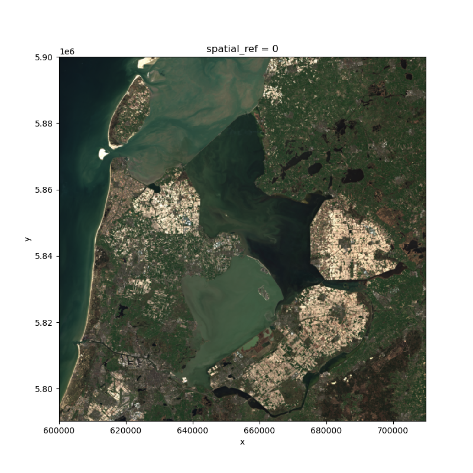
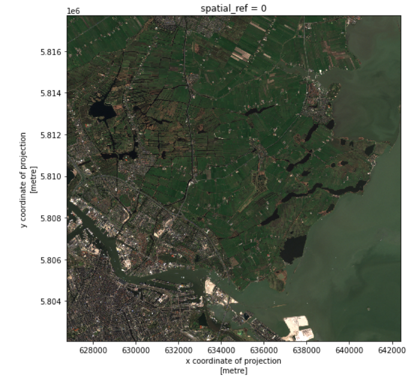
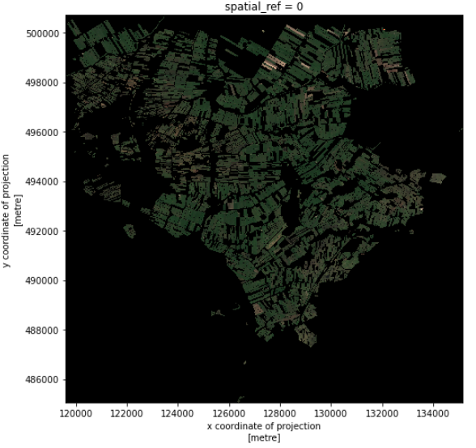
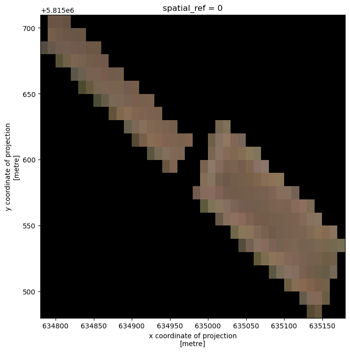
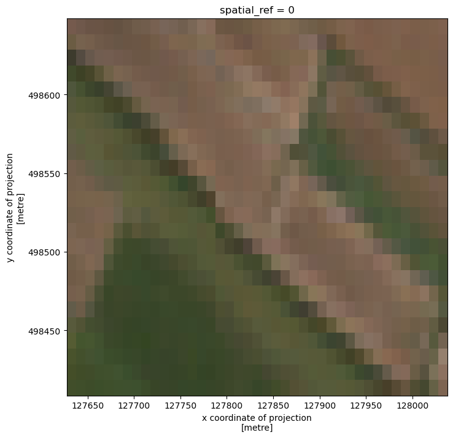
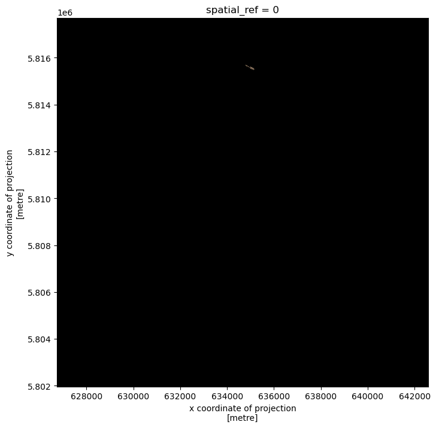

:::questions
- How can I crop my raster data to the area of interest?
:::

:::objectives
- Crop raster data with a bounding box.
- Crop raster data with a polygon.
- Match two raster datasets in different CRS.
:::


It is quite common that the raster data you have in hand is too large to process, or not all the pixels are relevant to your area of interest (AoI). In both situations, you should consider cropping your raster data before performing data analysis.

In this episode, we will introduce how to crop raster data into the desired area. We will use one Sentinel-2 image over Amsterdam as the example raster data, and introduce how to crop your data to different types of AoIs.

:::callout
## Introduce the Data

We will use the results of the satellite image search: `search.json`, which is generated in an exercise from
[Episode 5: Access satellite imagery using Python](05-access-data.md).

If you would like to work with the data for this lesson without downloading data on-the-fly, you can download the
raster data using this [link](https://figshare.com/ndownloader/files/36028100). Save the `geospatial-python-raster-dataset.tar.gz`
file in your current working directory, and extract the archive file by double-clicking on it or by running the
following command in your terminal `tar -zxvf geospatial-python-raster-dataset.tar.gz`. Use the file `geospatial-python-raster-dataset/search.json`
(instead of `search.json`) to get started with this lesson.

We also use the cropped fields polygons `fields_cropped.shp`, which was generated in an exercise from [Episode 7: Vector data in python](07-vector-data-in-python.md).
:::

## Align the CRS of the raster and the vector data

We load a true color image using `pystac` and `rioxarray` and check the shape of the raster:

```python
import pystac
import rioxarray

# Load image and inspect the shape
items = pystac.ItemCollection.from_file("search.json")
raster = rioxarray.open_rasterio(items[1].assets["visual"].href) # Select a true color image
print(raster.shape)
```


```output
(3, 10980, 10980)
```


This will perform a "lazy" loading of the image, i.e. the image will not be loaded into the memory until necessary, but we can still access some attributes, e.g. the shape of the image.

The large size of the raster data makes it time and memory consuming to visualize in its entirety. Instead, we can fetch and plot the overviews of the raster. "Overviews" are precomputed lower resolution representations of a raster, stored in the same COG that contains the original raster.

```python
# Get the overview asset
raster_overview = rioxarray.open_rasterio(items[1].assets["visual"].href, overview_level=3)
print(raster_overview.shape)

# Visualize it
raster_overview.plot.imshow(figsize=(8,8))
```

{alt="Overview of the raster"}

As we can see, the overview image is much smaller compared to the original true color image. 

To align the raster and vector data, we first check each coordinate system. For raster data, we use `pyproj.CRS`:

```python
from pyproj import CRS

# Check the coordinate system
CRS(raster.rio.crs)
```


```output
<Derived Projected CRS: EPSG:32631>
Name: WGS 84 / UTM zone 31N
Axis Info [cartesian]:
- [east]: Easting (metre)
- [north]: Northing (metre)
Area of Use:
- undefined
Coordinate Operation:
- name: UTM zone 31N
- method: Transverse Mercator
Datum: World Geodetic System 1984
- Ellipsoid: WGS 84
- Prime Meridian: Greenwich
```


To open and check the coordinate system of vector data, we use `geopandas`:

```python
import geopandas as gpd

# Load the polygons of the crop fields
fields = gpd.read_file("fields_cropped.shp")

# Check the coordinate system
fields.crs
```


```output
<Derived Projected CRS: EPSG:28992>
Name: Amersfoort / RD New
Axis Info [cartesian]:
- X[east]: Easting (metre)
- Y[north]: Northing (metre)
Area of Use:
- name: Netherlands - onshore, including Waddenzee, Dutch Wadden Islands and 12-mile offshore coastal zone.
- bounds: (3.2, 50.75, 7.22, 53.7)
Coordinate Operation:
- name: RD New
- method: Oblique Stereographic
Datum: Amersfoort
- Ellipsoid: Bessel 1841
- Prime Meridian: Greenwich
```


As seen, the coordinate systems differ. To crop the raster using the shapefile, we first need to reproject one dataset to the other's CRS. Since `raster` is large, we will convert the CRS of `fields` to the CRS of `raster` to avoid loading the entire image:

```python
fields = fields.to_crs(raster.rio.crs)
```


## Crop raster data with a bounding box

The `clip_box` function allows one to crop a raster by the
min/max of the x and y coordinates. Note that we are cropping the original image `raster` now, and not the overview image `raster_overview`.

```python
# Crop the raster with the bounding box
raster_clip_box = raster.rio.clip_box(*fields.total_bounds)
print(raster_clip_box.shape)
```

```output
(3, 1565, 1565)
```


We successfully cropped the raster to a much smaller piece. We can visualize it now:

```python
raster_clip_box.plot.imshow(figsize=(8,8))
```
{alt="Raster cropped by a bounding box"}

This cropped image can be saved for later usage:
```python
raster_clip_box.rio.to_raster("raster_clip.tif")
```


## Crop raster data with polygons

We have a cropped image around the fields. To further analyze the fields, one may want to crop the image to the exact field boundaries.
This can be done with the `clip` function:

```python
raster_clip_fields = raster_clip_box.rio.clip(fields['geometry'])
```


And we can visualize the results:
```python
raster_clip_fields.plot.imshow(figsize=(8,8))
```
{alt="Ratser cropped by field polygons"}

:::challenge
## Exercise: crop raster data with a specific code
In the column "gewascode" (translated as "crop code") of `fields`, you can find the code representing the types of plants grown in each field. Can you:

1. Select the fields with "gewascode" equal to `257`;
2. Crop the raster `raster_clip_box` with the selected fields;
3. Visualize the cropped image.

::::solution
```python
mask = fields['gewascode']==257
fields_gwascode = fields.where(mask)
fields_gwascode = fields_gwascode.dropna()
raster_clip_fields_gwascode = raster_clip_box.rio.clip(fields_gwascode['geometry'])
raster_clip_fields_gwascode.plot.imshow(figsize=(8,8))
```

{alt="Raster croped by fields with gewascode 257"}

::::
:::


## Crop raster data using `reproject_match()` function

So far we have learned how to crop raster images with vector data. We can also crop a raster with another raster data. In this section, we will demonstrate how to crop the `raster_clip_box` image using the `raster_clip_fields_gwascode` image. We will use the `reproject_match` function. As indicated by its name, it performs reprojection and clipping in one go.


To demonstrate the reprojection, we will first reproject `raster_clip_fields_gwascode` to the RD CRS system, so it will be in a different CRS from `raster_clip_box`:
```python
# Reproject to RD to make the CRS different from the "raster"
raster_clip_fields_gwascode = raster_clip_fields_gwascode.rio.reproject("EPSG:28992")
CRS(raster_clip_fields_gwascode.rio.crs)
```


```output
<Derived Projected CRS: EPSG:28992>
Name: Amersfoort / RD New
Axis Info [cartesian]:
- [east]: Easting (metre)
- [north]: Northing (metre)
Area of Use:
- undefined
Coordinate Operation:
- name: unnamed
- method: Oblique Stereographic
Datum: Amersfoort
- Ellipsoid: Bessel 1841
- Prime Meridian: Greenwich
```


And let's check again the CRS of `raster_clip_box`:

```python
CRS(raster_clip_box.rio.crs)
```


```output
<Derived Projected CRS: EPSG:32631>
Name: WGS 84 / UTM zone 31N
Axis Info [cartesian]:
- [east]: Easting (metre)
- [north]: Northing (metre)
Area of Use:
- undefined
Coordinate Operation:
- name: UTM zone 31N
- method: Transverse Mercator
Datum: World Geodetic System 1984
- Ellipsoid: WGS 84
- Prime Meridian: Greenwich
```


Now the two images are in different coordinate systems. We can use `rioxarray.reproject_match()` function to crop `raster_clip_box` image.

```python
raster_reproject_match = raster_clip_box.rio.reproject_match(raster_clip_fields_gwascode)
raster_reproject_match.plot.imshow(figsize=(8,8))
```


{alt="Reproject match big to small"}

We can also use it to expand `raster_clip_fields_gwascode` to the extent of `raster_clip_box`:

```python
raster_reproject_match = raster_clip_fields_gwascode.rio.reproject_match(raster_clip_box)
raster_reproject_match.plot.imshow(figsize=(8,8))
```

{alt="Reproject match small to big"}

In one line `reproject_match` does a lot of helpful things:

1. It reprojects.
2. It matches the extent using `nodata` values or by clipping the data.
3. It sets `nodata` values. This means we can run calculations on those two images.

:::callout

## Code Tip

As we saw before, there also exists a method called `reproject()`, which only reprojects one raster to another projection. If you want more control over how rasters are resampled, clipped, and/or reprojected, you can use the `reproject()` method and other `rioxarray` methods individually.
:::

:::keypoints
- Use `clip_box` to crop a raster with a bounding box.
- Use `clip` to crop a raster with a given polygon.
- Use `reproject_match` to match two raster datasets.
:::
