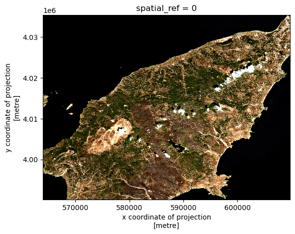

:::questions
- How can I crop my raster data to the area of interest?
:::

:::objectives
- Align the CRS of geopatial data.
- Crop raster data with a bounding box.
- Crop raster data with a polygon.
:::


It is quite common that the raster data you have in hand is too large to process, or not all the pixels are relevant to your area of interest (AoI). In both situations, you should consider cropping your raster data before performing data analysis.

In this episode, we will introduce how to crop raster data into the desired area. We will use one Sentinel-2 image over Rhodes Island as the example raster data, and introduce how to crop your data to different types of AoIs.

:::callout
## Introduce the Data

In this episode, we will work with both raster and vector data.

As *raster data*, we will use satellite images from the search that we have carried out in [the episode: "Access satellite imagery using Python"](05-access-data.md) as well as Digital Elevation Model (DEM) data from the [Copernicus DEM GLO-30 dataset](https://dataspace.copernicus.eu/explore-data/data-collections/copernicus-contributing-missions/collections-description/COP-DEM).

For the satellite images, we have searched for Sentinel-2 scenes of Rhodes from July 1st to August 31st 2023 that have less than 1% cloud coverage. The search resulted in 11 scenes. We focus here on the most recent scene (August 27th), since that would show the situation after the wildfire, and use this as an example to demonstrate raster data cropping.

For your convenience, we have included the scene of interest among the datasets that you have already downloaded when following [the setup instructions](../learners/setup.md). You should, however, be able to download the satellite images "on-the-fly" using the JSON metadata file that was created in [the previous episode](05-access-data.md) (the file `rhodes_sentinel-2.json`).

If you choose to work with the provided data (which is advised in case you are working offline or have a slow/unstable network connection) you can skip the remaining part of the block and continue with the following section: [Align the CRS of the raster and the vector data](#Align-the-CRS-of-the-raster-and-the-vector-data).

If you want instead to experiment with downloading the data on-the-fly, you need to load the file `rhodes_sentinel-2.json`, which contains information on where and how to access the target satellite images from the remote repository:

```python
import pystac
items = pystac.ItemCollection.from_file("rhodes_sentinel-2.json")
```

You can then select the first item in the collection, which is the most recent in the sequence:

```python
item = items[0]
print(item)
```

```output
<Item id=S2A_35SNA_20230827_0_L2A>
```

In this episode we will consider the true color image associated with this scene, which is labelled with the `visual` key in the asset dictionary. We extract the URL / `href` (Hypertext Reference) that point to the file, and store it in a variable that we can use later on instead of the raster data path to access the data:

```python
rhodes_visual_href = item.assets["visual"].href  # true color image
```

As **vector data**, we will use the `assets.gpkg`, which was generated in an exercise from [Episode 7: Vector data in python](07-vector-data-in-python.md).
:::

## Align the CRS of the raster and the vector data

### Data loading

First, we will load the visual image of Sentinel-2 over Rhodes Island, which we downloaded and stored in `data/sentinel2/visual.tif`.

We can open this asset with `rioxarray`, and specify the overview level, since this is a Cloud-Optimized GeoTIFF (COG) file. As explained in episode 6 raster images can be quite big, therefore we decided to resample the data using ´rioxarray's´ overview parameter and set it to `overview_level=1`.

```python
import rioxarray
path_visual = 'data/sentinel2/visual.tif'
visual = rioxarray.open_rasterio(path_visual, overview_level=1)
visual
```

```output
<xarray.DataArray (band: 3, y: 2745, x: 2745)>
[22605075 values with dtype=uint8]
Coordinates:
  * band         (band) int64 1 2 3
  * x            (x) float64 5e+05 5e+05 5.001e+05 ... 6.097e+05 6.098e+05
  * y            (y) float64 4.1e+06 4.1e+06 4.1e+06 ... 3.99e+06 3.99e+06
    spatial_ref  int64 0
Attributes:
    AREA_OR_POINT:       Area
    OVR_RESAMPLING_ALG:  AVERAGE
    _FillValue:          0
    scale_factor:        1.0
    add_offset:          0.0
```

As we introduced in the raster data introduction episode, this will perform a "lazy" loading of the image meaning that the image will not be loaded into the memory until necessary.

Let's also load the assets file generated in the vector data episode:

```python
import geopandas as gpd
assets = gpd.read_file('assets.gpkg')
```
### Crop the raster with a bounding box

The assets file contains the information of the vital infrastructure and built-up areas on the island Rhodes. The visual image, on the other hand, has a larger extent. Let us check this by visualizing the raster image:

```python
visual.plot.imshow()
```

{alt="Large visual raster"}

Let's check the extent of the assets to find out its rough location in the raster image.
We can use the [`total_bounds`](https://geopandas.org/en/stable/docs/reference/api/geopandas.GeoSeries.total_bounds.html) attribute from `GeoSeries` of `geopandas` to get the bounding box:

```python
assets.total_bounds
```

```output
array([27.7121001 , 35.87837949, 28.24591124, 36.45725024])
```

The bounding box is composed of the `[minx, miny, maxx, maxy]` values of the raster. Comparing these values with the raster image, we can identify that the magnitude of the bounding box coordinates does not match the coordinates of the raster image. This is because the two datasets have different coordinate reference systems (CRS). This will cause problems when cropping the raster image, therefore we first need to align the CRS-s of the two datasets

Considering the raster image has larger data volume than the vector data, we will reproject the vector data to the CRS of the raster data. We can use the `to_crs` method:

```python
# Reproject
assets = assets.to_crs(visual.rio.crs)

# Check the new bounding box
assets.total_bounds
```

```output
array([ 564058.0257114, 3970719.4080227,  611743.71498815, 4035358.56340039])
```

Now the bounding box coordinates are updated. We can use the `clip_box` function, through the `rioaxarray` accessor, to crop the raster image to the bounding box of the vector data. `clip_box` takes four positional input arguments in the order of `xmin`, `ymin`, `xmax`, `ymax`, which is exactly the same order in the `assets.total_bounds`. Since `assets.total_bounds` is an `numpy.array`, we can use the symbol `*` to unpack it to the relevant positions in `clip_box`.

```python
# Crop the raster with the bounding box
visual_clipbox = visual.rio.clip_box(*assets.total_bounds)

# Visualize the cropped image
visual_clipbox.plot.imshow()
```

{alt="Clip box results"}

:::callout
## Code Tip
Cropping a raster with a bounding box is a quick way to reduce the size of the raster data. Since this operation is based on min/max coordinates, it is not as computational extensive as cropping with polygons, which requires more accurate overlay operations.
:::

### Crop the raster with a polygon

We can also crop the raster with a polygon. In this case, we will use the raster `clip` function through the `rio` accessor. For this we will use the `geometry` column of the `assets` GeoDataFrame to specify the polygon:

```python
# Crop the raster with the polygon
visual_clip = visual_clipbox.rio.clip(assets["geometry"])

# Visualize the cropped image
visual_clip.plot.imshow()
```

{alt="Clip results"}

:::challenge
## Exercise: Clip the red band for Rhodes

Now that you have seen how clip a raster using a polygon, we want you to do this for the red band of the satellite image. Use the shape of Rhodes from GADM and clip the red band with it. Furthermore, make sure to transform the no data values to not-a-number (NaN) values.

::::solution
```python
# Solution

# Step 1 - Load the datasets - Vector data

import geopandas as gpd
gdf_greece = gpd.read_file('./data/gadm/ADM_ADM_3.gpkg')
gdf_rhodes = gdf_greece[gdf_greece['NAME_3']=='Rhodos']

# Step 2 - Load the raster red band
import rioxarray
path_red = './data/sentinel2/red.tif'
red = rioxarray.open_rasterio(path_red, overview_level=1)

# Step 3 - It will not work, since it is not projected yet

gdf_rhodes = gdf_rhodes.to_crs(red.rio.crs)

# Step 4 - Clip the two

red_clip = red.rio.clip(gdf_rhodes["geometry"])

# Step 5 - assing nan values to no data

red_clip_nan = red_clip.where(red_clip!=red_clip.rio.nodata)

# Step 6 - Visualize the result

red_clip_nan.plot()

```

{alt="rhodes_builtup_buffer"}

::::
:::


### Match two rasters

Sometimes you need to match two rasters with different extents, resolutions, or CRS. For this you can use the  [`reproject_match`](https://corteva.github.io/rioxarray/stable/examples/reproject_match.html#Reproject-Match) function . We will demonstrate this by matching the cropped raster `visual_clip` with the Digital Elevation Model (DEM),`rhodes_dem.tif` of Rhodes.

First, let's load the DEM:

```python
dem = rioxarray.open_rasterio('./data/dem/rhodes_dem.tif')
```

And visualize it:

```python
dem.plot()
```

{alt="DEM"}

From the visualization, we can see that the DEM has a different extent, resolution and CRS compared to the cropped visual image. We can also confirm this by checking the CRS of the two images:

```python
print(dem.rio.crs)
print(visual_clip.rio.crs)
```

```output
EPSG:4326
EPSG:32635
```

We can use the `reproject_match` function to match the two rasters. One can choose to match the dem to the visual image or vice versa. Here we will match the DEM to the visual image:

```python
dem_matched = dem.rio.reproject_match(visual_clip)
```

And then visualize the matched DEM:

```python
dem_matched.plot()
```

{alt="Matched DEM"}

As we can see, `reproject_match` does a lot of helpful things in one line of code:

1. It reprojects.
2. It matches the extent.
3. It matches the resolution.

Finally, we can save the matched DEM for later use. We save it as a Cloud-Optimized GeoTIFF (COG) file:

```python
dem_matched.rio.to_raster('dem_rhodes_match.tif', driver='COG')
```

:::callout
## Code Tip

There is also a method in rioxarray: [`reproject()`](https://corteva.github.io/rioxarray/stable/rioxarray.html#rioxarray.raster_array.RasterArray.reproject), which only reprojects one raster to another projection. If you want more control over how rasters are resampled, clipped, and/or reprojected, you can use the `reproject()` method individually.
:::

:::keypoints
- Use `clip_box` to crop a raster with a bounding box.
- Use `clip` to crop a raster with a given polygon.
- Use `reproject_match` to match two raster datasets.
:::
