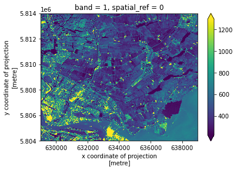
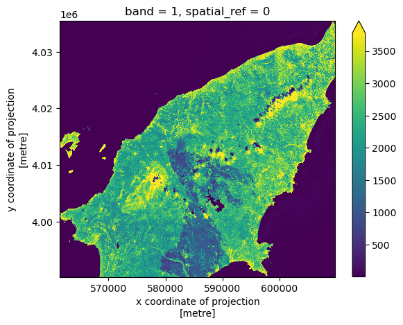
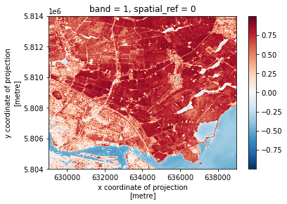
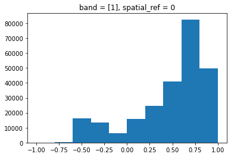
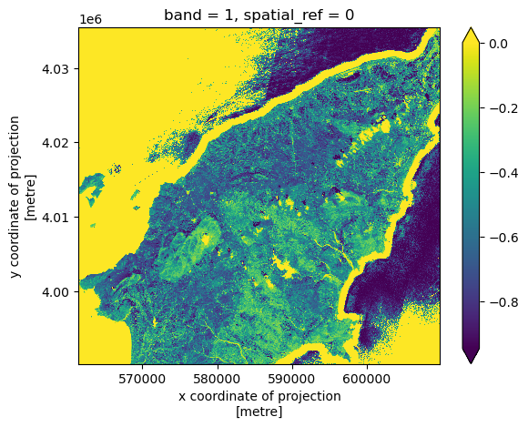
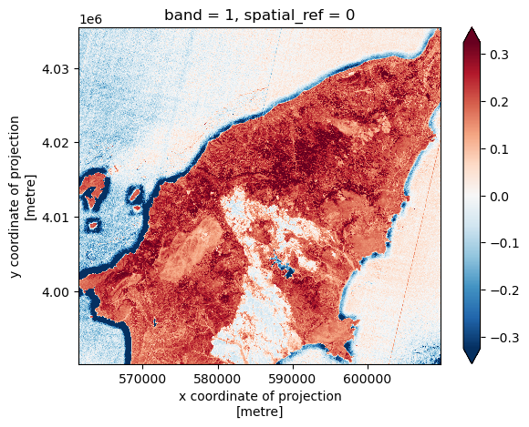
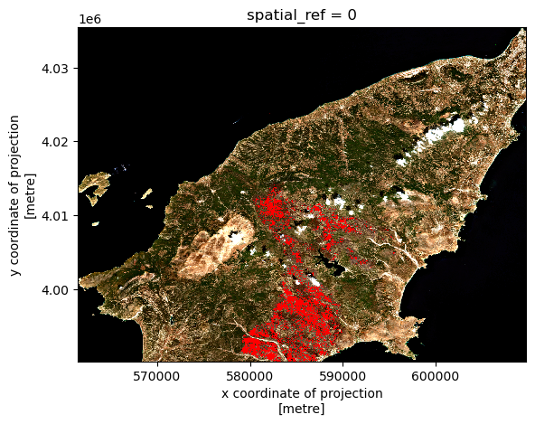

:::questions
- How do I perform calculations on rasters and extract pixel values for defined locations?
:::

:::objectives
- Carry out operations with two rasters using Python's built-in math operators.
:::

## Introduction

We often want to combine values of and perform calculations on rasters to create a new output raster. This episode
covers how to perform basic math operations using raster datasets. It also illustrates how to match rasters with
different resolutions so that they can be used in the same calculation. As an example, we will calculate
[a binary classification mask](https://custom-scripts.sentinel-hub.com/sentinel-2/burned_area_ms/) to identify burned
area over a satellite scene.

The classification mask requires the following of [the Sentinel-2 bands](https://gisgeography.com/sentinel-2-bands-combinations/)
(and derived indices):

* [Normalized difference vegetation index (NDVI)](https://en.wikipedia.org/wiki/Normalized_difference_vegetation_index),
  derived from the **near-infrared (NIR)** and **red** bands:

$$ NDVI = \frac{NIR - red}{NIR + red} $$

* [Normalized difference water index (NDWI)](https://en.wikipedia.org/wiki/Normalized_difference_water_index), derived
  from the **green** and **NIR** bands:

$$ NDWI = \frac{green - NIR}{green + NIR} $$

* A custom index derived from two of the **short-wave infrared (SWIR)** bands (with wavelenght ~1600 nm and ~2200 nm,
  respectively):

$$ INDEX = \frac{SWIR_{16} - SWIR_{22}}{SWIR_{16} + SWIR_{22}}$$

* The **blue**, **NIR**, and **SWIR** (1600 nm) bands.

In the following, we start by computing the NDVI.

### Load and crop the Data
For this episode, we will use one of the Sentinel-2 scenes that we have already employed in the previous episodes.

:::callout

## Introduce the Data

We will use satellite images from the search that we have carried out in [the episode: "Access satellite imagery using Python"](05-access-data.md). Briefly, we have searched for Sentinel-2 scenes of Rhodes from July 1st to August 31st 2023 that have less than 1% cloud coverage. The search resulted in 11 scenes. We focus here on the most recent scene (August 27th), since that would show the situation after the wildfire, and use this as an example to demonstrate raster calculations.

For your convenience, we have included the scene of interest among the datasets that you have already downloaded when following [the setup instructions](../learners/setup.md). You should, however, be able to download the satellite images "on-the-fly" using the JSON metadata file that was created in [the previous episode](05-access-data.md) (the file `rhodes_sentinel-2.json`).

If you choose to work with the provided data (which is advised in case you are working offline or have a slow/unstable network connection) you can skip the remaining part of the block.

If you want instead to experiment with downloading the data on-the-fly, you need to load the file `rhodes_sentinel-2.json`, which contains information on where and how to access the target satellite images from the remote repository:

```python
import pystac
items = pystac.ItemCollection.from_file("rhodes_sentinel-2.json")
```

You can then select the first item in the collection, which is the most recent in the sequence:

```python
item = items[0]
print(item)
```

```output
<Item id=S2A_35SNA_20230827_0_L2A>
```

In this episode we will consider a number of bands associated with this scene. We extract the URL / `href` (Hypertext Reference) that point to each of the raster files, and store these in variables that we can use later on instead of the raster data paths to access the data:

```python
rhodes_red_href = item.assets["red"].href  # red band
rhodes_green_href = item.assets["green"].href  # green band
rhodes_blue_href = item.assets["blue"].href  # blue band
rhodes_nir_href = item.assets["nir"].href  # near-infrared band
rhodes_swir16_href = item.assets["swir16"].href  # short-wave infrared (1600 nm) band
rhodes_swir22_href = item.assets["swir22"].href  # short-wave infrared (2200 nm) band
rhodes_visual_href = item.assets["visual"].href  # true-color image
```

:::

Let's load the red and NIR band rasters with `open_rasterio` using the argument `masked=True`:

```python
import rioxarray
red = rioxarray.open_rasterio("data/sentinel2/red.tif", masked=True)
nir = rioxarray.open_rasterio("data/sentinel2/nir.tif", masked=True)
```

Let’s restrict our analysis to the island of Rhodes - we can extract the bounding box from the vector file written
in an earlier episode (note that we need to match the CRS to the one of the raster files):

```python
# determine bounding box of Rhodes, in the projected CRS
import geopandas
rhodes = geopandas.read_file('rhodes.gpkg')
rhodes_reprojected = rhodes.to_crs(red.rio.crs)
bbox = rhodes_reprojected.total_bounds

# crop the rasters
red_clip = red.rio.clip_box(*bbox)
nir_clip = nir.rio.clip_box(*bbox)
```

We can now plot the two rasters. Using `robust=True` color values are stretched between the 2nd and 98th percentiles of
the data, which results in clearer distinctions between high and low reflectances:

```python
red_clip.plot(robust=True)
```

{alt="red band image"}

```python
nir_clip.plot(robust=True)
```

{alt="near infra-red band image"}

The burned area is immediately evident as a dark spot in the NIR wavelength, due to the lack of reflection from the
vegetation in the scorched area.

## Raster Math

We can perform raster calculations by subtracting (or adding,
multiplying, etc.) two rasters. In the geospatial world, we call this
"raster math", and typically it refers to operations on rasters that
have the same width and height (including `nodata` pixels).
We can check the shapes of the two rasters in the following way:

```python
print(red_clip.shape, nir_clip.shape)
```

```output
(1, 4523, 4828) (1, 4523, 4828)
```

The shapes of the two rasters match (and, not shown, the coordinates and the CRSs match too).

Let's now compute the NDVI as a new raster using the formula presented above.
We'll use `DataArray` objects so that we can easily plot our result and keep
track of the metadata.

```python
ndvi = (nir_clip - red_clip)/ (nir_clip + red_clip)
print(ndvi)
```

```output
<xarray.DataArray (band: 1, y: 1131, x: 1207)>
array([[[0., 0., 0., ..., 0., 0., 0.],
        [0., 0., 0., ..., 0., 0., 0.],
        [0., 0., 0., ..., 0., 0., 0.],
        ...,
        [0., 0., 0., ..., 0., 0., 0.],
        [0., 0., 0., ..., 0., 0., 0.],
        [0., 0., 0., ..., 0., 0., 0.]]], dtype=float32)
Coordinates:
  * band         (band) int64 1
  * x            (x) float64 5.615e+05 5.616e+05 ... 6.097e+05 6.098e+05
  * y            (y) float64 4.035e+06 4.035e+06 4.035e+06 ... 3.99e+06 3.99e+06
    spatial_ref  int64 0
```

We can now plot the output NDVI:

```python
ndvi.plot()
```

{alt="NDVI map"}

Notice that the range of values for the output NDVI is between -1 and 1.
Does this make sense for the selected region?

Maps are great, but it can also be informative to plot histograms of values to better understand the distribution. We can accomplish this using a built-in xarray method we have already been using: `plot.hist()`

```python
ndvi.plot.hist()
```

{alt="NDVI histogram"}

:::challenge

### Exercise: NDWI and custom index to detect burned areas

Calculate the other two indices required to compute the burned area classification mask, specifically:

* The [normalized difference water index (NDWI)](https://en.wikipedia.org/wiki/Normalized_difference_water_index), derived from the **green** and **NIR** bands (file "green.tif" and "nir.tif", respectively):

$$ NDWI = \frac{green - NIR}{green + NIR} $$

* A custom index derived from the  1600 nm and the 2200 nm **short-wave infrared (SWIR)** bands ( "swir16.tif" and "swir22.tif", respectively):

$$ INDEX = \frac{SWIR_{16} - SWIR_{22}}{SWIR_{16} + SWIR_{22}}$$

What challenge do you foresee in combining the data from the two indices?

::::solution

```python
def get_band_and_clip(band_path, bbox):
    band = rioxarray.open_rasterio(band_path, masked=True)
    return band.rio.clip_box(*bbox)
```


```python
data_path = 'data/sentinel2'
green_clip = get_band_and_clip(f'{data_path}/green.tif', bbox)
swir16_clip = get_band_and_clip(f'{data_path}/swir16.tif', bbox)
swir22_clip = get_band_and_clip(f'{data_path}/swir22.tif', bbox)
```


```python
ndwi = (green_clip - nir_clip)/(green_clip + nir_clip)
index = (swir16_clip - swir22_clip)/(swir16_clip + swir22_clip)
```

```python
ndwi.plot(robust=True)
```

{alt="NDWI index"}

```python
index.plot(robust=True)
```

{alt="custom index"}

The challenge in combining the different indices is that the SWIR bands (and thus the derived custom index) have lower resolution:

```python
ndvi.rio.resolution(), ndwi.rio.resolution(), index.rio.resolution()
```

```output
((10.0, -10.0), (10.0, -10.0), (20.0, -20.0))
```

::::

:::

In order to combine data from the computed indices, we use the `reproject_match` method, which reprojects, clips and
match the resolution of a raster using another raster as a template. We use the `ndvi` raster as a template, and match `index` and `swir16_clip` to its resolution and extent:


```python
index_match = index.rio.reproject_match(ndvi)
swir16_match = swir16_clip.rio.reproject_match(ndvi)
```

Finally, we also load the blue band data and clip it to the area of interest:

```python
blue_clip = get_band_and_clip(f'{data_path}/blue.tif', bbox)
```

We can now go ahead and compute the binary classification mask for burned areas. Note that we need to convert the unit
of the Sentinel-2 bands [from digital numbers to reflectance](https://docs.sentinel-hub.com/api/latest/data/sentinel-2-l2a/#units)
(this is achieved by dividing by 10,000):

```python
burned = (
    (ndvi <= 0.3) &
    (ndwi <= 0.1) &
    ((index_match + nir_clip/10_000) <= 0.1) &
    ((blue_clip/10_000) <= 0.1) &
    ((swir16_match/10_000) >= 0.1)
)
```

The classification mask has a single element along the "band" axis, we can drop this dimension in the following way:

```python
burned = burned.squeeze()
```

Let's now fetch and visualize the true color image of Rhodes, after coloring the pixels identified as burned area in red:

```python
visual = rioxarray.open_rasterio(f'{data_path}/visual.tif')
visual_clip = visual.rio.clip_box(*bbox)
```


```python
# set red channel to max (255), green and blue channels to min (0).
visual_clip[0] = visual_clip[0].where(~burned, 255)
visual_clip[1:3] = visual_clip[1:3].where(~burned, 0)
```

```python
visual_clip.plot.imshow()
```

{alt="RGB image with burned area in red"}


We can save the burned classification mask to disk after converting booleans to integers:

```python
burned.rio.to_raster('burned.tif', dtype='int8')
```

:::keypoints
- Python's built-in math operators are fast and simple options for raster math.
:::
