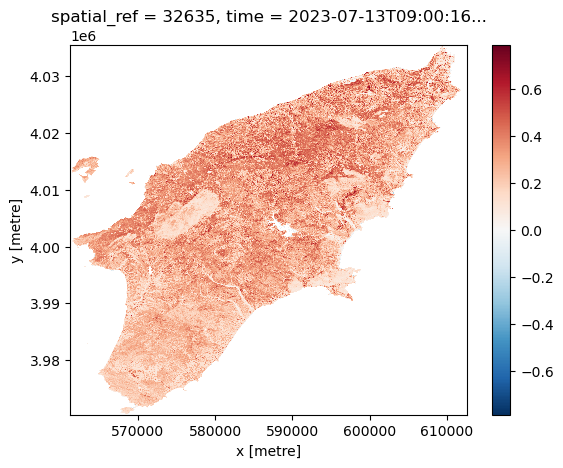
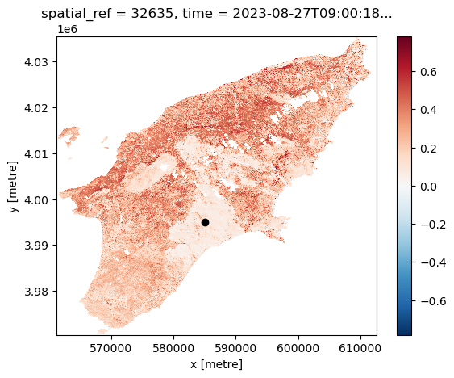
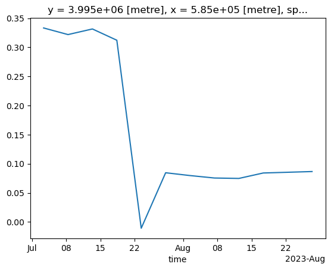

:::questions
- a
:::

:::objectives
- a
:::

## Introduction

In the previous episodes we worked with satellite images with a fixed boundary on how they have been collected, however in many cases you would want to have an image that covers your area of interest which often does not align with boundaries of the collected images. If the phenomena you are interested in covers two images you could manually mosaic them, but sometimes you are interested in multiple images that overlapping.  

ODC-STAC offers functionality that allows you to get a mosaic-ed image based on the a bounding box or a polygon containing the area of interest. In this lesson we show how [odc-stac](https://odc-stac.readthedocs.io/en/latest/?badge=latest) can be employed to re-tile and stack satellite images in what are sometimes referred to as "data cubes". 

## Create a data cube with ODC-STAC

As you might have noticed in the previous episodes, the satellite images we have used until now do actually not cover the whole island of Rhodes. They miss the southern part of the island. Using ODC-STAC we can obtain an image for the whole island. We use the administrative boundary of Rhodes to define our area of interest (AoI). This way we are sure to have the whole island.

More important, using ODC-STAC you can also load multiple images (lazy) into one datacube allowing you to perform all kind of interesting analyses as will be demonstrated below.

But first we need to upload the geometry of Rhodes. To do so we use geopandas and load the geometry we previously stored in a geopackage.

```python
import geopandas
rhodes = geopandas.read_file('rhodes.gpkg')
bbox = rhodes.total_bounds
```

Next, we search for satellite images that cover our AoI (i.e. Rhodes) in the [Sentinel-2 L2A](https://radiantearth.github.io/stac-browser/#/external/earth-search.aws.element84.com/v1/collections/sentinel-2-l2a) collection that is indexed in the [Earth Search STAC API](https://radiantearth.github.io/stac-browser/#/external/earth-search.aws.element84.com/v1/). Since we are interested the period right before and after the wild fire we include as dates the 1st of July until the 31st of August 2023 :

```python
import pystac_client

api_url = "https://earth-search.aws.element84.com/v1"
collection_id = "sentinel-2-c1-l2a"

client = pystac_client.Client.open(api_url)
search = client.search(
    collections=[collection_id],
    datetime="2023-07-01/2023-08-31",
    bbox=bbox
)

item_collection = search.item_collection()
```

[odc-stac](https://odc-stac.readthedocs.io/en/latest/?badge=latest) can ingest directly our search results and create a Xarray DataSet object from the STAC metadata that are present in the `item_collection`. By specifying `groupby='solar_day'`, odc-stac automatically groups and merges images corresponding to the same date of acquisition. `chunks={...}` sets up the resulting data cube using Dask arrays, thus enabling lazy loading (and further operations). `use_overviews=True` tells odc-stac to direcly load lower-resolution versions of the images from the overviews, if these are available in Cloud Optimized Geotiffs (COGs). We set the resolution of the data cube using the `resolution` argument, and define the AoI using the bounding box (`bbox`).

```python
import odc.stac
ds = odc.stac.load(
    item_collection,
    groupby='solar_day',
    chunks={'x': 2048, 'y': 2048},
    use_overviews=True,
    resolution=20,
    bbox=rhodes.total_bounds,
)
```

odc-stac builds a data cube representation from all the relevant files linked in `item_collection` as a Xarray DataSet:

```python
print(ds)
```

```output
<xarray.Dataset> Size: 7GB
Dimensions:      (y: 3255, x: 2567, time: 25)
Coordinates:
  * y            (y) float64 26kB 4.035e+06 4.035e+06 ... 3.97e+06 3.97e+06
  * x            (x) float64 21kB 5.613e+05 5.613e+05 ... 6.126e+05 6.126e+05
    spatial_ref  int32 4B 32635
  * time         (time) datetime64[ns] 200B 2023-07-01T09:10:15.805000 ... 20...
Data variables: (12/18)
    red          (time, y, x) uint16 418MB dask.array<chunksize=(1, 2048, 2048), meta=np.ndarray>
    green        (time, y, x) uint16 418MB dask.array<chunksize=(1, 2048, 2048), meta=np.ndarray>
    blue         (time, y, x) uint16 418MB dask.array<chunksize=(1, 2048, 2048), meta=np.ndarray>
    visual       (time, y, x) float32 836MB dask.array<chunksize=(1, 2048, 2048), meta=np.ndarray>
    nir          (time, y, x) uint16 418MB dask.array<chunksize=(1, 2048, 2048), meta=np.ndarray>
    swir22       (time, y, x) uint16 418MB dask.array<chunksize=(1, 2048, 2048), meta=np.ndarray>
    ...           ...
    scl          (time, y, x) uint8 209MB dask.array<chunksize=(1, 2048, 2048), meta=np.ndarray>
    aot          (time, y, x) uint16 418MB dask.array<chunksize=(1, 2048, 2048), meta=np.ndarray>
    coastal      (time, y, x) uint16 418MB dask.array<chunksize=(1, 2048, 2048), meta=np.ndarray>
    nir09        (time, y, x) uint16 418MB dask.array<chunksize=(1, 2048, 2048), meta=np.ndarray>
    cloud        (time, y, x) uint8 209MB dask.array<chunksize=(1, 2048, 2048), meta=np.ndarray>
    snow         (time, y, x) uint8 209MB dask.array<chunksize=(1, 2048, 2048), meta=np.ndarray>
```

## Working with the data cube

Let us focus on a set of variables: the red band (`red`), the near infrared band (`nir`) and the scene classification map (`scl`). We will use the former two to calculated the NDVI for the AoI. The latter, is [a classification mask](https://sentinels.copernicus.eu/web/sentinel/technical-guides/sentinel-2-msi/level-2a/algorithm-overview) provided together with Sentinel-2 L2A products. In this mask, each pixel is classified according to a set of labels (see Figure 3 in the previous link). We will use it to drop pixels that are labeled as clouds and water:

```python
red = ds['red']
nir = ds['nir']
scl = ds['scl']
```

We first use the classification map to mask out pixels recognized by the Sentinel-2 processing algorithm as cloud or water:

```python
# generate mask ("True" for pixel being cloud or water)
mask = scl.isin([
    3,  # CLOUD_SHADOWS
    6,  # WATER
    8,  # CLOUD_MEDIUM_PROBABILITY
    9,  # CLOUD_HIGH_PROBABILITY
    10  # THIN_CIRRUS
])
red_masked = red.where(~mask)
nir_masked = nir.where(~mask)
```

Then, we calculate the NDVI:

```python
ndvi = (nir_masked - red_masked) / (nir_masked + red_masked)
```

We can visualize the NDVI calculated for the AoI at two given dates (before and after the wildfires):

```python
ndvi_before = ndvi.sel(time="2023-07-13")
ndvi_before.plot()
```

{alt="NDVI before the wildfire"}

```python
ndvi_after = ndvi.sel(time="2023-08-27")
ndvi_after.plot()
```

{alt="NDVI after the wildfire"}

Let's now select a point in the region scorched by wildfires:

```python
x = 585_000
y = 3_995_000

import matplotlib.pyplot as plt
fig, ax = plt.subplots()
ndvi_after.plot(ax=ax)
ax.scatter(x, y, marker="o", c="k")
```

{alt="NDVI plot with selected point"}

Let us extract the NDVI value computed at that point for the full time series:

```python
ndvi_xy = ndvi.sel(x=x, y=y, method="nearest")
print(ndvi_xy)
```

```output
<xarray.DataArray (time: 25)> Size: 100B
dask.array<getitem, shape=(25,), dtype=float32, chunksize=(1,), chunktype=numpy.ndarray>
Coordinates:
    y            float64 8B 3.995e+06
    x            float64 8B 5.85e+05
    spatial_ref  int32 4B 32635
  * time         (time) datetime64[ns] 200B 2023-07-01T09:10:15.805000 ... 20...
```

We now trigger computation. Note that we run this in parallel (probably not much of an effect here, but definitely helpful for larger calculations):

```python
%%time
ndvi_xy = ndvi_xy.compute(scheduler="threads", num_workers=4)
```

```output
CPU times: user 15.6 s, sys: 4.9 s, total: 20.5 s
Wall time: 1min 8s
```

The result is a time series representing the NDVI value computed for the selected point for all the available scenes in the time range. We drop the NaN values, and plot the final result:

```python
ndvi_xy.dropna(dim="time").plot()
```

{alt="NDVI time series"}
